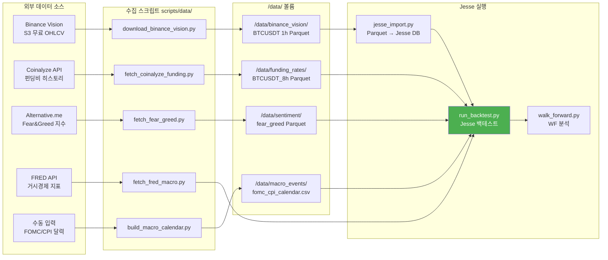

# Jesse Engine 가이드

Jesse 프레임워크 기반 백테스트 환경 설정 및 사용.

## 개요

Jesse Engine은 Phase 7-10 백테스트 환경으로, 자체 엔진(V1-V4)을 보증 검증하는 독립적 프레임워크입니다.

**Jesse 프레임워크**: Python 기반 암호화폐 백테스트 라이브러리 (Jesse 1.x Research API 사용)

**평가 기간**: 2023-04-01 ~ 2026-04-01 (3년 신뢰할 수 있는 실데이터)

**주요 전략**:
- FundingArbitrage (v1) — 펀딩비 기본 차익거래
- FundingArbitrageWithMacroFilter (v2) — + FOMC/CPI 필터
- FundingArbitrageWithFGSizer (v3) — + Fear&Greed 동적 사이징
- BtcBuyAndHold — 검증 도구

---

## Jesse 데이터 파이프라인



---

## Jesse 백테스트 실행 흐름

```mermaid
flowchart LR
    START([백테스트 시작]) --> CHECK{["데이터 준비 OK?"]}
    
    CHECK -->|No| PREP["Step 1~5: 데이터 수집<br>& Jesse DB 임포트"]
    PREP --> CHECK
    
    CHECK -->|Yes| CHOOSE{["무엇을 실행 할까?"]}
    
    CHOOSE -->|Sanity Check| SC["run_backtest.py<br>BtcBuyAndHold<br>2024년만"]
    SC --> SCR["기대: CAGR ~120%<br>MDD ~-25%<br>Sharpe 1.5~2.0"]
    SCR --> NEXT{["Jesse 정상?"]}
    NEXT -->|No| FIX["설정 수정\n← Step 1~5 재실행"]
    FIX --> CHOOSE
    NEXT -->|Yes| CHOOSE
    
    CHOOSE -->|단일 전략| RUN1["run_backtest.py<br>FundingArbitrage<br>2023-04 ~ 2026-04"]
    RUN1 --> R1R["결과 JSON<br>CAGR, Sharpe, MDD"]
    R1R --> ANALYZE1{["V5 기준 통과?"]}
    
    CHOOSE -->|시간 분석| RUN2["walk_forward.py<br>365d train<br>180d test"]
    RUN2 --> R2R["WF 리포트<br>OOS/IS 비율 ≥ 0.6?"]
    R2R --> ANALYZE2{["OOS 신뢰도 OK?"]}
    
    CHOOSE -->|환경별 분석| RUN3["regime_split_analysis.py<br>bull/transition/compressed"]
    RUN3 --> R3R["환경별 수익률<br>레짐 강건성 검증"]
    
    CHOOSE -->|전체 자동| RUN4["run_full_validation.sh<br>(5단계 자동)"]
    RUN4 --> R4R["최종 V5 리포트<br>합격/불합격"]
    
    ANALYZE1 -->|Yes| PASS["✅ PASS\n메인넷 진입 가능"]
    ANALYZE1 -->|No| TUNE["파라미터 재조정\n← run_backtest.py 재실행"]
    TUNE --> RUN1
    
    ANALYZE2 -->|Yes| PASS
    ANALYZE2 -->|No| TUNE
    
    R4R --> FINAL{["최종 판정"]}
    FINAL -->|Pass| PASS
    FINAL -->|Fail| TUNE
    
    PASS --> END(["메인넷 준비 완료 🚀"])
    
    style PASS fill:#4caf50,color:#fff
    style END fill:#4caf50,color:#fff
    style FIX fill:#ff9800,color:#fff
    style TUNE fill:#ff9800,color:#fff
```

---

## 빠른 시작

### 1. Jesse 컨테이너 기동

```bash
cd /home/justant/Data/Bit-Mania
docker compose --profile backtest up -d jesse_engine
```

### 2. 컨테이너 상태 확인

```bash
docker compose logs -f jesse_engine
```

### 3. Sanity Check 실행 (Jesse 정확성 검증)

```bash
# BTC 매수&홀드 (2024년 = 약 120% 수익)
# 만약 이 결과가 기대값과 다르면 Jesse 설정 오류
docker compose --profile backtest run --rm jesse_engine \
  python scripts/run_backtest.py \
    --strategy BtcBuyAndHold \
    --start 2024-01-01 --end 2024-12-31 \
    --output storage/results/sanity_check.json

# 결과 확인
cat storage/results/sanity_check.json | jq '.cagr, .sharpe, .mdd'
```

**예상 결과 (2024)**:
- CAGR: ~120%
- MDD: ~-25%
- Sharpe: 1.5-2.0

### 4. FA 백테스트 실행

```bash
docker compose --profile backtest run --rm jesse_engine \
  python scripts/run_backtest.py \
    --strategy FundingArbitrage \
    --start 2023-04-01 --end 2026-04-01 \
    --output storage/results/FundingArbitrage_main.json
```

---

## 데이터 파이프라인

모든 백테스트 전 필수: **데이터 준비 단계** (1~2시간)

### Pipeline Step 1: OHLCV 다운로드 (Binance Vision)

```bash
docker compose --profile backtest run --rm jesse_engine \
  python scripts/data/download_binance_vision.py \
    --symbol BTCUSDT \
    --timeframe 1h \
    --start 2020-01-01 \
    --end 2026-04-01
```

**파일 위치**: `/data/binance_vision/klines/BTCUSDT/1h/YYYY/MM.parquet`

**확인사항**:
- 총 캔들 수 (예: ~50,000 ~ 60,000개 for 6년)
- 데이터 갭 > 10일 없음
- 가격 범위 (BTC 2020년: ~$5k, 2026년: ~$60k+)

**갱신 빈도**: 월 1회 (또는 분석 전)

### Pipeline Step 2: 펀딩비 데이터 수집 (Coinalyze)

```bash
docker compose --profile backtest run --rm jesse_engine \
  python scripts/data/fetch_coinalyze_funding.py \
    --start 2023-04-01 \
    --end 2026-04-01
```

**파일 위치**: `/data/funding_rates/BTCUSDT_8h.parquet`

**데이터 형식**:
- 컬럼: `timestamp_ms` (int, 8h settlement 시점), `rate` (float, -0.001 ~ +0.001)
- 8h settlement: UTC 0:00, 8:00, 16:00

**확인사항**:
- 2023-04-01 이후 **실제 Bybit 데이터만** 포함
- 2020-2023년 데이터는 미제공 (이 구간 백테스트 신뢰도 낮음)
- 양수 vs 음수 펀딩비 비율 (정상: 60% 양수, 40% 음수)

**갱신 빈도**: **주 1회** (필수 — 항상 최신)

### Pipeline Step 3: Fear&Greed 지수 수집

```bash
docker compose --profile backtest run --rm jesse_engine \
  python scripts/data/fetch_fear_greed.py \
    --start 2020-01-01 \
    --end 2026-04-01
```

**파일 위치**: `/data/sentiment/fear_greed.parquet`

**데이터 형식**:
- 컬럼: `timestamp_ms` (int, 일일), `value` (int, 0-100)
- 0 = 극단적 공포, 100 = 극단적 탐욕

**갱신 빈도**: 월 1회

### Pipeline Step 4: 매크로 이벤트 캘린더 생성

```bash
docker compose --profile backtest run --rm jesse_engine \
  python scripts/data/build_macro_calendar.py \
    --output /data/macro_events/fomc_cpi_calendar.csv
```

**파일 위치**: `/data/macro_events/fomc_cpi_calendar.csv`

**데이터 형식**:
```csv
event_type,timestamp_utc,description
FOMC,2024-01-31 19:00:00,Federal Reserve Interest Rate Decision
CPI,2024-02-13 13:30:00,Consumer Price Index Release
...
```

**갱신 빈도**: 분기 1회 (또는 새 일정 공지 시)

### Pipeline Step 5: Jesse DB 캔들 임포트

```bash
docker compose --profile backtest run --rm jesse_engine \
  python scripts/jesse_import.py \
    --symbol BTCUSDT \
    --timeframe 1h \
    --start 2020-01-01 \
    --end 2026-04-01
```

**목적**: Parquet 파일 → Jesse PostgreSQL `candles` 테이블에 벌크 로드

**Jesse 캔들 스키마**:
```sql
CREATE TABLE candles (
    timestamp BIGINT,         -- milliseconds since epoch
    open DECIMAL(32, 16),
    close DECIMAL(32, 16),
    high DECIMAL(32, 16),
    low DECIMAL(32, 16),
    volume DECIMAL(32, 16),
    exchange VARCHAR(50),     -- "Bybit Perpetual"
    symbol VARCHAR(50),       -- "BTCUSDT"
    timeframe VARCHAR(10)     -- "1h", "4h", "1d"
);
```

**갱신 빈도**: 월 1회

---

## 백테스트 실행

### 단일 회차 백테스트

```bash
docker compose --profile backtest run --rm jesse_engine \
  python scripts/run_backtest.py \
    --strategy FundingArbitrage \
    --start 2023-04-01 --end 2026-04-01 \
    --balance 10000 \
    --fee 0.00055 \
    --leverage 5 \
    --output storage/results/FundingArbitrage_main.json
```

**출력 형식** (JSON):
```json
{
  "strategy": "FundingArbitrage",
  "start": "2023-04-01",
  "end": "2026-04-01",
  "cagr": 0.1311,
  "sharpe": 1.523,
  "mdd": -0.0523,
  "num_trades": 85,
  "win_rate": 0.75,
  "gross_pnl": 5432.10,
  "total_fees": 145.67,
  "net_profit_percentage": 54.32
}
```

### Walk-Forward 분석

```bash
docker compose --profile backtest run --rm jesse_engine \
  python scripts/walk_forward.py \
    --strategy FundingArbitrage \
    --start 2023-04-01 --end 2026-04-01 \
    --train-days 365 \
    --test-days 180 \
    --slide-days 90
```

**출력**:
- `storage/walk_forward/FundingArbitrage_wf_summary.json`
- `storage/walk_forward/FundingArbitrage_wf_summary.md`

**윈도우 구조**:
- IS (In-Sample): 365일 훈련
- OOS (Out-of-Sample): 180일 테스트
- Slide: 90일씩 이동
- 총 ~ 4-5개 윈도우 생성

**V5 판정**: OOS Sharpe / IS Sharpe ≥ 0.6

### 레짐 분석

```bash
docker compose --profile backtest run --rm jesse_engine \
  python scripts/regime_split_analysis.py \
    --strategy FundingArbitrage \
    --regimes "2023-04-01:2023-12-31:bull,2024-01-01:2024-12-31:transition,2025-01-01:2026-04-01:compressed"
```

**목적**: 시장 환경(bull/transition/compressed)별로 전략이 어떻게 작동하는지 분석

### 전체 검증 파이프라인 (한 번에)

```bash
# 이 명령이 모든 5단계를 자동 실행 (30분 ~ 2시간 소요)
./backtest/jesse_engine/scripts/run_full_validation.sh FundingArbitrage
```

**실행 순서**:
1. Full-period backtest (2023-04-01 ~ 2026-04-01)
2. Walk-Forward analysis
3. Regime split analysis
4. Sanity check (CRITICAL 경고 검사)
5. V5 report generation

**출력**: `.result/backtest/v5/FundingArbitrage_v5_report.md`

---

## 자체 엔진 vs Jesse 시뮬레이션

### 중요한 차이점

#### 1. 데이터 신뢰도

| 기간 | 자체 엔진 | Jesse | 신뢰성 |
|------|---------|-------|--------|
| 2020-2023년 | 합성 폴백 (0.0001 고정) | 미제공 | ❌ 자체 엔진 위험 |
| 2023-2026년 | 실제 Bybit | 실제 Bybit | ✅ 동등 신뢰 |

**해석**:
- 자체 엔진 6년 CAGR (+34.87%)는 과장되었을 가능성
- Jesse는 **3년 실데이터만** 검증 → 더 보수적

#### 2. 펀딩 P&L 모델링 차이

**자체 엔진**:
```
실제 포지션: 현물 롱 + 선물 숏 = 델타 중립
P&L = 펀딩비만 수익
```

**Jesse**:
```
모델링: 선물 롱 (짧은 쪽)
가격 P&L: ~0 (delta-neutral 가정)
펀딩 P&L: 명시적 크레딧 (각 settlement)
```

**결과**: 논리적으로 동등하나, 구현 세부사항 차이 있을 수 있음

#### 3. 재투자 모델링

**자체 엔진**:
```
수익 의 30%를 현물 BTC 매수
현물 잔고 증가 → 최종 자산 가치 포함
```

**Jesse**:
```
equity만 추적 (현물 별도 추적 안 함)
공유_vars에 기록 가능
```

### 기대 결과 시나리오

#### 시나리오 A: Jesse ≈ 자체 엔진 (3년 기준)

```
Jesse 3yr CAGR ≈ +13%

→ 해석:
  1. 자체 엔진 로직 정확함
  2. 3년 연율화된 성과 약 13% (2020-2023년 과장된 부분 제외)
  3. 보수적 기대값: 10-15% 연율

→ 결론: 기존 fa80_lev5_r30 파라미터 유효, 준비 완료
```

#### 시나리오 B: Jesse < 자체 엔진 (데이터 차이)

```
Jesse 3yr CAGR ≈ +8~10%

→ 해석:
  1. 2020-2022년 합성 폴백이 상당히 낙관적임
  2. 실제 암호 시장의 펀딩비 환경 더 어려움
  3. 메인넷 기대값 조정 필요

→ 결론: 보수 설정 (fa80_lev4_r30) 권장, 모니터링 강화
```

#### 시나리오 C: Jesse > 자체 엔진

```
Jesse 3yr CAGR > +15%

→ 해석:
  1. Jesse 로직이 더 최적화됨
  2. 자체 엔진에 버그 있을 가능성
  3. 자체 엔진 재감사 필요

→ 결론: Jesse 결과 신뢰, 자체 엔진 로직 검증
```

---

## Jesse 아키텍처 이해

### 1. 베이스 타임프레임

Jesse는 **내부적으로 1분(1m)을 베이스 타임프레임**으로 사용합니다.

- OHLCV 입력: 1h 캔들
- Jesse 변환: 1h → 60× 1m 캔들 (각 1m은 동일한 O, H, L, C)
- 전략 실행: 1h 요청 시, Jesse가 60개 1m 캔들을 모아 1h 캔들 생성

### 2. 선물 SHORT 모델링

**문제**: Jesse는 선물 거래소의 SHORT 포지션을 직접 모델링하지 않음

**해결방법**: FA를 "롱"으로 모델링
```python
# 실제: 현물 롱 + 선물 숏 = 델타 중립
# Jesse: 선물 "롱" 항목으로 모델링
#   → 가격 P&L ≈ 0 (delta-neutral 가정)
#   → 펀딩비 P&L만 명시적 크레딧
```

### 3. 펀딩 크레딧 (8h settlement)

```python
# 각 settlement 캔들 (UTC 0, 8, 16시)에서:
if is_settlement_candle:
    funding_income = position_notional * funding_rate * direction
    equity += funding_income
    shared_vars['cumulative_funding'] += funding_income
```

### 4. 데이터 라우팅

```python
# run_backtest.py에서:
routes = [{
    "exchange": "Bybit Perpetual",
    "strategy": FundingArbitrage,
    "symbol": "BTC-USDT",
    "timeframe": "1h"  # 전략이 요청한 타임프레임
}]

candles = {
    "Bybit Perpetual|BTC-USDT": {
        "candles": candles_1m_array  # 1m으로 업샘플링된 1h 데이터
    }
}

result = research.backtest(routes=routes, candles=candles, ...)
```

---

## 디버깅 팁

### Tip 1: shared_vars로 전략 상태 추적

```python
# 전략 코드에서:
self.shared_vars['debug_funding'] = rate
self.shared_vars['debug_position_count'] = len(self.candles)

# 백테스트 결과에서:
result['shared_vars']  # 최종 상태 확인
```

### Tip 2: settlement candle 감지

```python
import jesse.helpers as jh

def _is_settlement_candle(self) -> bool:
    arrow = jh.timestamp_to_arrow(self.current_candle[0])
    return arrow.hour in (0, 8, 16)  # UTC hours
```

### Tip 3: 펀딩비 로더 문제

```python
# _FundingRateLoader가 로드 실패 시:
# 1. 파켓 경로 확인
# 2. CSV 폴백 시도 (자동)
# 3. 없으면 FileNotFoundError 발생

# 수동 확인:
import polars as pl
df = pl.read_parquet("/data/funding_rates/BTCUSDT_8h.parquet")
print(df.shape, df.columns)
```

### Tip 4: 캔들 포맷 (Jesse)

```python
# Jesse 캔들 구조: [timestamp_ms, open, close, high, low, volume]
#                    0             1      2      3     4    5
# 주의: close는 index 2! (일부 라이브러리는 index 4)

candle = current_candle
ts = candle[0]
open_p = candle[1]
close_p = candle[2]  # ← 여기!
high_p = candle[3]
low_p = candle[4]
volume = candle[5]
```

### Tip 5: 로그 레벨 조정

```bash
# Jesse 상세 로그
docker compose --profile backtest run --rm jesse_engine \
  python scripts/run_backtest.py --strategy FundingArbitrage 2>&1 | head -100
```

---

## Jesse 프로젝트 디렉토리 구조

```
backtest/jesse_engine/
├── Dockerfile                    # Jesse 환경 구성
├── requirements.txt              # 의존성 (polars, pandas, asyncpg, jesse 등)
├── config.py                     # Jesse 설정 (exchange, symbol 등)
├── README.md                     # Jesse 프로젝트 문서
├── strategies/                   # Jesse 전략
│   ├── __init__.py
│   ├── sanity_check.py          # BtcBuyAndHold
│   ├── funding_arbitrage.py     # v1
│   ├── funding_arbitrage_v2.py  # v2 + 매크로 필터
│   └── funding_arbitrage_v3.py  # v3 + Fear&Greed 사이징
├── scripts/                      # 백테스트 스크립트
│   ├── README.md
│   ├── run_backtest.py          # Jesse 연구 API 백테스트
│   ├── run_fa_backtest.py       # FA 순수 시뮬레이션
│   ├── walk_forward.py          # Walk-Forward 분석
│   ├── generate_v5_report.py    # V5 최종 리포트
│   ├── regime_split_analysis.py # 레짐 분석
│   ├── sanity_check.py          # 검증 도구
│   ├── test_funding_pnl.py      # 단위 테스트
│   ├── jesse_import.py          # Parquet → DB 임포트
│   ├── run_full_validation.sh   # 전체 파이프라인
│   └── data/                    # 데이터 수집
│       ├── download_binance_vision.py
│       ├── fetch_coinalyze_funding.py
│       ├── fetch_fear_greed.py
│       ├── build_macro_calendar.py
│       ├── export_funding_rates.py
│       └── fetch_fred_macro.py
└── data/                        # 외부 데이터 (마운트 포인트)
    ├── binance_vision/
    ├── funding_rates/
    ├── sentiment/
    └── macro_events/
```

---

## 선행 조건 체크

Jesse 실행 전 확인사항:

```bash
# 1. Docker 및 compose
docker --version
docker compose --version

# 2. 데이터 디렉토리 확인
ls -la /data/binance_vision/klines/BTCUSDT/1h/
ls -la /data/funding_rates/BTCUSDT_8h.parquet

# 3. 컨테이너 이미지
docker compose --profile backtest build jesse_engine

# 4. 테스트 실행
docker compose --profile backtest run --rm jesse_engine \
  python scripts/run_backtest.py \
    --strategy BtcBuyAndHold \
    --start 2024-01-01 --end 2024-12-31

# 5. 결과 확인
cat storage/results/BtcBuyAndHold_main.json | jq '.'
```

---

## 성능 최적화

### 대량 백테스트 병렬화

```bash
# 여러 전략 동시 실행 (컨테이너 리소스 허용 시)
docker compose --profile backtest run --rm jesse_engine \
  python scripts/run_backtest.py --strategy FundingArbitrage &
docker compose --profile backtest run --rm jesse_engine \
  python scripts/run_backtest.py --strategy FundingArbitrageWithMacroFilter &
wait
```

### 메모리 제한

```yaml
# docker-compose.yml에서:
services:
  jesse_engine:
    deploy:
      resources:
        limits:
          memory: 8G  # 최대 8GB 사용
```

---

## 다음 단계

1. **Phase 10 완료**: 모든 전략 V5 PASS 달성
2. **메인넷 전환**: `scripts/switch_to_mainnet.py` 실행
3. **라이브 모니터링**: Telegram 알림 + 대시보드
4. **지속적 개선**: 월간 Walk-Forward 파이프라인

---

**최종 수정**: 2026-05-01
