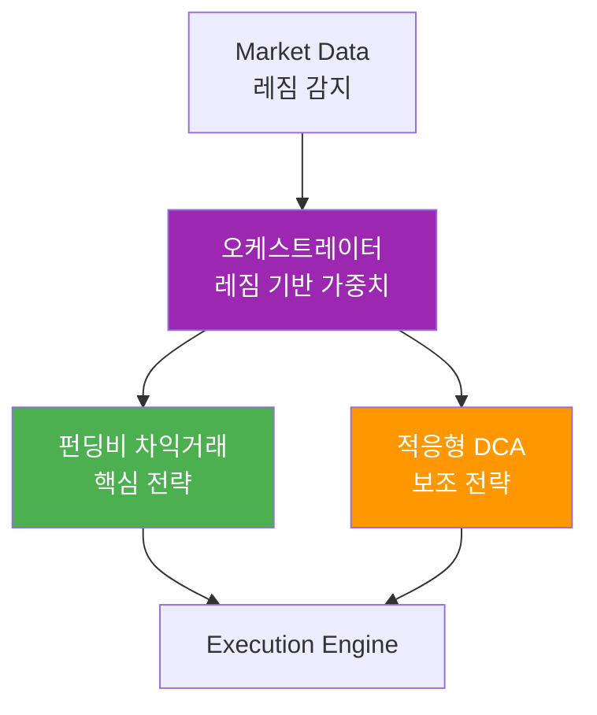

# CryptoEngine 문서 홈

> [!abstract] 프로젝트 개요
> Bybit 테스트넷 기반 비트코인 선물 자동매매 시스템.
> **펀딩비 차익거래**를 핵심 전략으로, DCA를 보조 전략으로 운영.

---

## 시스템

| 문서 | 설명 |
|------|------|
| [[architecture\|시스템 아키텍처]] | 마이크로서비스 구조, Kill Switch, 데이터 레이어 |
| [[api\|내부 API]] | Redis Pub/Sub 채널, REST 엔드포인트, 도메인 모델 |
| [[runbook\|운영 매뉴얼]] | 시작/중지, 인시던트 대응, 모니터링, 문제 해결 |
| [[changelog\|변경 이력]] | 버전별 변경사항 |

---

## 전략

### 핵심 전략
| 전략 | 최적 환경 | 목표 수익 | 현재 설정 |
|------|-----------|-----------|-----------|
| [[strategies/funding_arb\|펀딩비 차익거래]] | 모든 환경 (델타 중립) | 연 **30-35%** | fa80_lev5_r30 |

### 보조 전략
| 전략 | 최적 환경 | 특징 |
|------|-----------|------|
| [[strategies/adaptive_dca\|적응형 DCA]] | 장기 상승 추세 | Fear & Greed 기반 매수량 조절 |

---

## 전략 간 관계

| 시장 레짐 | 펀딩비 | DCA | 현금 |
|-----------|--------|-----|------|
| Ranging | **주력** | 일반 | 낮음 |
| Trending Up | 유지 | 축소 | 낮음 |
| Trending Down | 유지 | **공격적** | 중간 |
| Volatile | 축소 | 축소 | **높음** |

---

## 핵심 개념 빠른 참조

- **Kill Switch**: [[architecture#Kill Switch 4단계|4단계 보호 체계]] / [[runbook#Kill Switch 대응|대응 절차]]
- **시장 레짐**: [[architecture#1. Market Data Collector|레짐 감지]] → [[api#`market:regime`|regime 채널]]
- **주문 흐름**: 전략 → [[api#`order:request`|order:request]] → [[architecture#3. Execution Engine|실행 엔진]] → [[api#`order:result`|order:result]]
- **자본 배분**: [[architecture#2. Strategy Orchestrator|오케스트레이터]] → [[api#`strategy:{strategy_id}:command`|strategy:command]]

---

---

## 백테스트 v2 (2026-04-11)

| 구분 | 내용 |
|------|------|
| 진단 | 10전 10패 근본 원인 — 확정 버그 3개, 합성 데이터 오염 4전략 |
| 엔진 | Jesse (`jesse_project/`) + FAEngine (기존) 이중 구조 |
| 데이터 | Binance Vision · Coinalyze · Alternative.me · FRED (전부 무료) |
| 상태 | 재건 완료 — 실데이터 수집 후 재실행 필요 |

상세: `services/backtester/jesse_project/README.md`

---

## 운영 체크리스트

- [ ] 매일: [[runbook#매일 확인 사항|일일 점검]]
- [ ] 매주: [[runbook#주간 확인 사항|주간 점검]]
- [ ] 매월: [[runbook#월간 확인 사항|월간 점검]]
