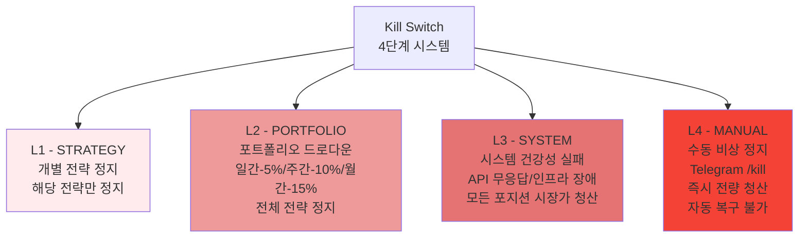
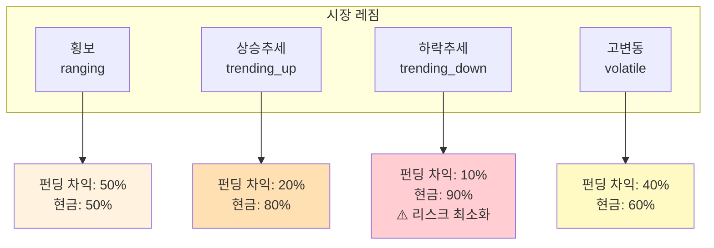
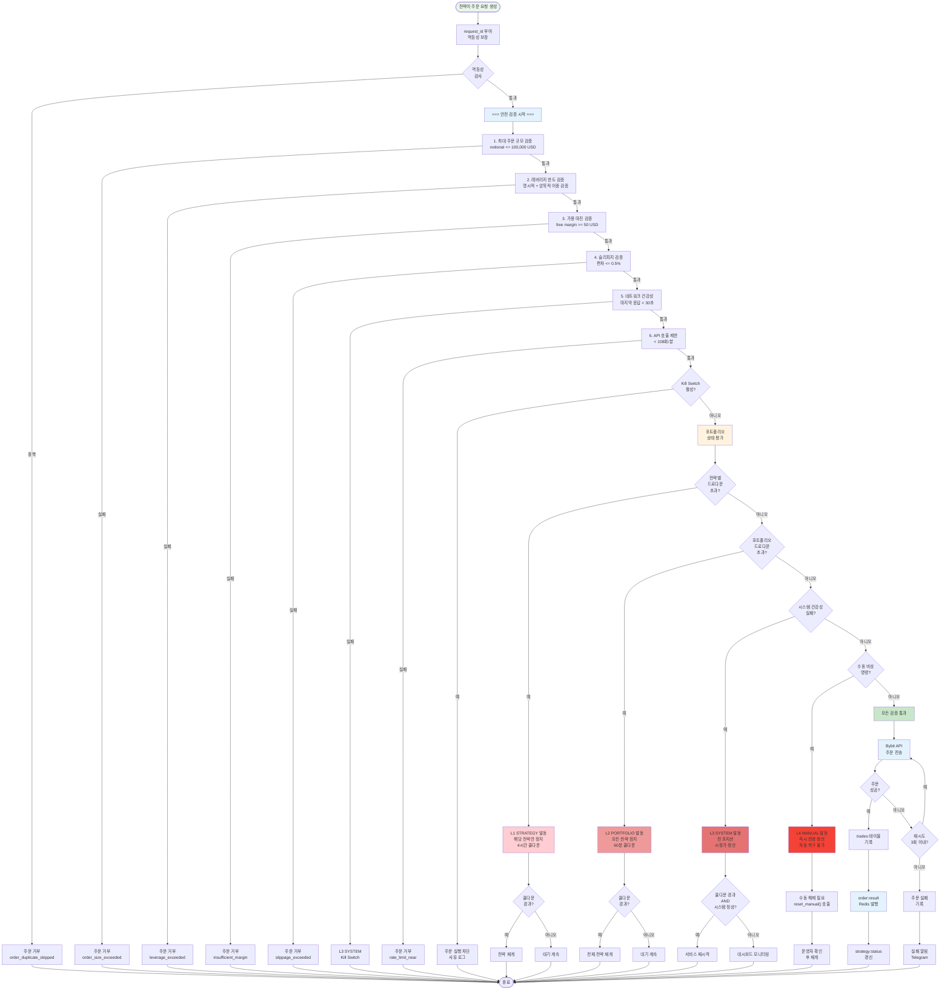

# CryptoEngine 리스크 관리 아키텍처

> 비트코인 선물 자동매매 시스템의 다계층 리스크 관리 체계를 기술한다.
> 핵심 원칙: **수익보다 생존**. 모든 의사결정에서 포지션 보호가 최우선이다.

---

## 1. Kill Switch 4단계 시스템

Kill Switch는 `shared/kill_switch.py`에 구현된 상태 기반(stateful) 비상 정지 메커니즘이다.
레벨이 높을수록 영향 범위가 넓고, 상위 레벨은 하위 레벨을 포함한다.

### 1.1 레벨 정의



| 레벨 | 이름 | 트리거 조건 | 영향 범위 |
|------|------|-------------|-----------|
| **L1 — STRATEGY** | 개별 전략 정지 | 전략별 손실 한도 초과 (`check_strategy()`) | 해당 전략만 정지 |
| **L2 — PORTFOLIO** | 포트폴리오 드로다운 | 일간 -5%, 주간 -10%, 월간 -15% 초과 (`orchestrator.yaml` 기준). Phase 5 모드: 퍼센트 AND 절대값 USD 둘 다 초과해야 발동 ($10/$20/$30) | 전체 전략 정지 |
| **L3 — SYSTEM** | 시스템 건강성 실패 | 거래소 API 무응답, 인프라 장애 | 모든 포지션 시장가 청산 |
| **L4 — MANUAL** | 수동 비상 정지 | Telegram `/kill` 또는 `make emergency` | 즉시 전량 청산, 자동 복구 불가. ACK 확인: 오케스트레이터 처리 후 5초 내 `ce:kill_switch:ack` 수신 확인, 미수신 시 최대 3회 재전송 |

> **참고**: `orchestrator.yaml`의 Kill Switch 설정에는 별도의 임계값이 정의되어 있다:
> 일간 -5%, 주간 -10%, 월간 -15%. 코드의 기본값(`daily_limit=-0.01` 등)과 설정 파일의 값 중
> 실제 적용되는 값은 오케스트레이터가 초기화 시 YAML에서 로드하는 값이다.

### 1.2 주요 속성 (Properties)

```python
class KillSwitch:
    @property
    def is_triggered(self) -> bool      # 현재 발동 여부
    @property
    def level(self) -> KillLevel         # 현재 활성 레벨 (NONE=0, STRATEGY=1, ..., MANUAL=4)
    @property
    def reason(self) -> str              # 발동 사유 문자열
    @property
    def triggered_at(self) -> datetime   # 발동 시각 (UTC)
```

### 1.3 쿨다운 메커니즘

- 기본 쿨다운 시간: **4시간** (`cooldown_hours=4.0`)
- `orchestrator.yaml`에서는 **60분**으로 설정 가능
- 쿨다운 경과 후 `auto_resume()`이 호출되면 자동 복구
- **L4 (MANUAL)는 자동 복구 불가** -- 반드시 `reset_manual()`을 통한 수동 해제 필요

### 1.4 복구 흐름

1. Kill Switch 발동 --> `on_trigger` 콜백 실행 (포지션 청산, 텔레그램 알림 등)
2. 쿨다운 타이머 시작 (`triggered_at` 기록)
3. 주기적 `auto_resume()` 호출로 쿨다운 경과 확인
4. L1~L3: 쿨다운 경과 시 `_reset()` 호출 --> `_active_level = NONE`
5. L4: `reset_manual()` 호출 시에만 해제
6. `_affected_strategies` 집합 초기화, 전략 재개 허용

### 1.5 Kill Switch 추가 조건 (orchestrator.yaml)

- **BTC 급락 서킷 브레이커**: 24시간 내 BTC -15% 하락 시 발동
- **API 오류 과다**: 10분 내 50건 이상 API 오류 시 발동
- **실행 지연**: 주문 실행 레이턴시 5,000ms 초과 시 발동
- **일간 손실 한도**: 1,000 USD

---

## 2. 실행 엔진 안전 가드 (Execution Safety Guards)

`services/execution/safety.py`의 `SafetyGuard` 클래스가 모든 주문을 실행 전에 검증한다.
6단계 순차 검증을 통과해야만 주문이 거래소로 전송된다.

### 2.1 검증 항목

| 순서 | 검증 | 기본값 | 설명 |
|------|------|--------|------|
| 0 | **Redis 연결 상태** | fail-closed | Redis 3회 연속 연결 실패 시 모든 주문 차단 |
| 1 | **최대 주문 규모** | 100,000 USD | 단일 주문의 명목가치(notional) 상한 |
| 2 | **레버리지 한도** | **2x** (bybit.py MAX_LEVERAGE 상수 + SafetyGuard 이중 강제) | 명시적 레버리지 + 암묵적 레버리지(기존 포지션 합산) 이중 검증 |
| 3 | **가용 마진** | 최소 50 USD | Redis 캐시에서 free margin 조회, 부족 시 차단 |
| 4 | **슬리피지 검증** | spot 0.1%, perp 0.1%, 최대 0.5% | 주문 가격과 시장 가격 편차 검증 (post_only limit 제외) |
| 5 | **네트워크 건강성** | 30초 타임아웃 | 마지막 API 응답 이후 경과 시간 확인 |
| 6 | **API 호출 제한** | 120회/분, 90% 도달 시 차단 | 롤링 윈도우 기반 호출 횟수 추적 |

### 2.2 레버리지 이중 검증

1. **명시적 검증**: 주문 페이로드의 `leverage` 필드 직접 확인
2. **암묵적 검증**: `(기존 포지션 명목가치 합 + 신규 주문 명목가치) / 총 자본`을 계산하여 한도 초과 확인

### 2.3 주문 멱등성 (Idempotency)

- 모든 주문 요청에 `request_id` 포함
- `trades` 테이블에 기록하여 중복 실행 방지
- 안전 검증 로그에 `request_id` 포함으로 추적성 확보

### 2.4 데이터 조회 경로

- 시장 가격: `Redis cache:ticker:{exchange}:{symbol}`
- 자본 잔고: `Redis cache:balance:{exchange}`
- 포지션 현황: `Redis cache:position:{exchange}:*` (SCAN 기반 합산)
- 로컬 메모리 캐시 폴백 (TTL 60초): Redis ConnectionError 시 마지막 성공 값 사용
- Redis 연결 실패 임계값: 3회 연속 → `_redis_healthy=False` → 주문 차단

---

## 3. 전략별 리스크 통제

### 3.1 펀딩비 차익거래 (funding-arb)

| 항목 | 값 | 설명 |
|------|-----|------|
| 최대 드로다운 | **5%** | 7일(168시간) 윈도우 기준 |
| 서킷 브레이커 | 연속 **3회** 손실 | 360분(6시간) 쿨다운 |
| 손절 | **2%** | 포지션 대비 미실현 손실 |
| 최대 레버리지 | **5x** (fa80_lev5_r30 채택) | |
| 최대 동시 포지션 | **5개** (Phase 5: 1개) | |
| 최대 포트폴리오 배분 | **80%** (`fa_capital_ratio: 0.80`) | Phase 5: 75% |
| 헤지 드리프트 허용 | **2%** | 초과 시 리밸런싱 |
| 최대 보유 기간 | **168시간** (7일, 6년 백테스트 최적값) | 초과 시 강제 청산 |
| 분할 청산 | 50%/75%/100% 보유시간 → 50/30/20% 포지션 순차 청산 | 리스크 점진적 감소 |

### 3.2 그리드 트레이딩 (grid — 현재 가중치 0, 비활성)

| 항목 | 값 | 설명 |
|------|-----|------|
| 최대 미체결 주문 | **40개** | 전체 그리드 인스턴스 합산 |
| 비상 취소 | **-500 USD** | 미실현 PnL 기준 |
| 일간 손실 한도 | **300 USD** | |
| 최대 드로다운 | **4%** | 7일 윈도우 |
| 최대 레버리지 | **2x** | |
| 최대 동시 그리드 | **2개** | |
| 서킷 브레이커 | 연속 **5회** 실패 | 240분(4시간) 쿨다운 |
| 브레이크아웃 자동 비활성화 | 그리드 범위 +**1%** 이탈 시 | |

### 3.3 적응형 DCA (adaptive-dca)

| 항목 | 값 | 설명 |
|------|-----|------|
| 드로다운 일시정지 | **25%** | 미실현 손실 기준, 15% 회복 시 재개 |
| 일간 지출 한도 | **500 USD** | |
| 주간 지출 한도 | **2,000 USD** | |
| 단일 매수 상한 | **1,000 USD** | 모든 멀티플라이어 적용 후 |
| 총 투입 한도 | **50,000 USD** | |
| 서킷 브레이커 | 연속 **3회** 매수 실패 | 120분(2시간) 쿨다운 |
| 결합 멀티플라이어 범위 | **0.1 ~ 5.0** | 극단값 클램핑 |

---

## 4. 포트폴리오 수준 리스크

### 4.1 레짐 적응형 가중치 배분

오케스트레이터가 시장 레짐을 감지하고, 레짐에 따라 자본 배분을 조절한다.



| 레짐 | 펀딩 차익 | 그리드 | DCA | 현금 |
|------|----------|--------|-----|------|
| 횡보 (ranging) | **50%** | 0% | 0% | **50%** |
| 상승 추세 (trending_up) | **20%** | 0% | 0% | **80%** |
| 하락 추세 (trending_down) | **10%** | 0% | 0% | **90%** |
| 고변동 (volatile) | **40%** | 0% | 0% | **60%** |

> **2026-04-05 기준**: 6년 백테스트 결과 Grid(-) / DCA(MDD 42%) 모두 가중치 0으로 조정. FA 단독 운영, 현금 50% 최소 버퍼 유지.

핵심: **하락 추세 시 90%를 현금으로 보유**하여 급격한 손실을 방지한다.

### 4.2 가중치 전환 메커니즘

- 급격한 리밸런싱 방지를 위해 **5단계에 걸쳐 점진적 전환**
- 단계당 최대 변화폭: **10%p**
- EMA 스무딩 팩터: **0.3**
- 최소 리밸런싱 간격: **15분**

### 4.3 포트폴리오 제약 조건

| 항목 | 값 |
|------|-----|
| 최대 총 레버리지 | 5.0x |
| 단일 전략 최대 배분 | 50% |
| 최소 현금 보유 | 5% |
| Sharpe 비율 계산 윈도우 | 30일 |
| 포트폴리오 스냅샷 간격 | 15분 |

### 4.4 모니터링 데이터

- `portfolio_snapshots` 테이블: 15분 간격 자본 스냅샷
- `strategy_states` 테이블: 전략 상태 스냅샷
- Redis `cache:balance:{exchange}`: 실시간 잔고 캐시

### 4.5 낙폭 기반 주문 사이징 (Graduated Drawdown Multiplier)

`orchestrator/core.py`의 `_get_drawdown_size_multiplier()`가 포트폴리오 낙폭에 따라 주문 크기를 자동 축소한다.

| 포트폴리오 낙폭 | 주문 크기 승수 | 설명 |
|----------------|---------------|------|
| 20% 미만 | 1.0x | 정상 운영 |
| 20% 이상 | **0.5x** | 주문 크기 절반 축소 |
| 30% 이상 | **0.1x** | 주문 크기 90% 축소 |
| 50% 이상 | **0.0x** | 신규 주문 전면 차단 |

이 승수는 SafetyGuard 검증 이전에 전략 레이어에서 적용되며, Kill Switch와 독립적으로 동작한다.

---

## 5. 리스크 관리 흐름 (활동도)



---

## 6. 운영 리스크

### 6.1 테스트넷 강제

- `BYBIT_TESTNET=true` -- Phase 5 완료 전까지 절대 변경 금지
- 초기 자본: 10,000 USDT (테스트넷)
- API 키에 출금(Withdraw) 권한 없음 (의도적 설계)

### 6.2 인프라 복원력

| 항목 | 설정 |
|------|------|
| Docker 재시작 정책 | `restart: always` |
| WSL/Windows 재시작 | Docker 서비스 자동 복구 |
| 서비스 간 통신 | Redis Pub/Sub (비동기, 느슨한 결합) |
| DB 연결 | asyncpg 커넥션 풀 |

### 6.3 편측 체결 복구 (One-Side Fill Recovery)

펀딩비 차익거래에서 한쪽 레그만 체결된 경우:
- **1분 타임아웃** 후 미체결 레그 시장가 강제 체결 또는 체결된 레그 청산 (변경: 3분 → 1분, delta-neutral gap 최소화)
- 델타 뉴트럴 상태 유지가 최우선

### 6.4 Phase 5 소액 실전 추가 안전장치

| 안전장치 | 파일 | 동작 |
|----------|------|------|
| **잔고 검증** | `execution/main.py` | 시작 시 `EXPECTED_INITIAL_BALANCE_USD` 대비 5% 초과 차이 → 시작 거부 + Telegram 알림 |
| **STRICT_MONITORING** | `telegram-bot/main.py` | 첫 24시간 모든 알림 즉시 전송, 1시간 강제 상태 리포트, 마진비율 경고 |
| **메인넷 전환 이중 확인** | `scripts/switch_to_mainnet.py` | `yes I am sure` + `MAINNET` 두 단계 타이핑 확인, 오픈 포지션 0개 강제 |
| **NetProfitabilityCheck** | `funding_tracker.py` | 수수료/슬리피지 왕복 0.17% 기준 BEP 2회 이내 충족 여부 진입 전 검증 |

### 6.5 거래소 스탑로스 주문 관리 (stoploss_on_exchange)

`services/execution/stoploss_manager.py`가 포지션 단위로 거래소 스탑로스 주문을 관리한다.

| 동작 | 설명 |
|------|------|
| **자동 배치** | 포지션 진입 시 진입가 ±2% 수준의 Bybit StopMarket 주문 즉시 배치 |
| **자동 취소** | 포지션 청산 시 연관 스탑로스 주문 자동 취소 |
| **재시작 복구** | 봇 재시작 시 열린 포지션의 스탑로스 주문 자동 복구 (Redis 캐시 기반) |
| **캐시** | `cache:stoploss:{exchange}:{symbol}` (TTL 24h) |

이 메커니즘은 Kill Switch와 독립적으로 동작하며, 네트워크 장애 등으로 봇이 응답하지 않는 상황에서도 거래소 측에서 직접 손실을 방어한다.

### 6.6 네트워크 장애 대응

- API 응답 없음 30초 초과 시 신규 주문 차단 (`SafetyGuard._check_network_health`)
- API 오류 10분 내 50건 초과 시 Kill Switch L3 발동

---

## 7. 모니터링 및 알림

### 7.1 Grafana 대시보드

- 실시간 포지션, PnL, 드로다운 시각화 (포트 3002)
- Kill Switch 이벤트 타임라인
- 전략별 성과 지표

### 7.2 Prometheus 메트릭

- 서비스별 헬스체크 메트릭 수집
- 주문 실행 레이턴시 히스토그램
- API 호출 빈도 카운터

### 7.3 텔레그램 알림

모든 리스크 이벤트에 대해 텔레그램 봇이 즉시 알림을 전송한다:
- Kill Switch 발동/해제
- 레짐 변경
- 리밸런싱 실행
- 서킷 브레이커 작동
- 정기 상태 보고 (6시간 간격)

### 7.4 감사 추적 (Audit Trail)

| 테이블 | 용도 |
|--------|------|
| `kill_switch_events` | Kill Switch 발동/해제 이력 |
| `trades` | 모든 체결 기록 (request_id로 멱등성 보장) |
| `daily_reports` | 일별 수익/지표 집계 |
| `portfolio_snapshots` | 시간별 포트폴리오 상태 |

---

## 8. 개선 제안

### 8.1 주문 제출 속도 제한 (Rate Limiting)

`base_strategy.py`의 `submit_order()`에 슬라이딩 윈도우 rate limiter 구현.

- config에서 `max_orders_per_second` (기본 2), `max_orders_per_minute` (기본 30) 설정
- 한도 초과 시 `OrderSubmitRateLimitError` 발생 → 주문 거부 (warning 로그)
- 타임스탬프 슬라이딩 윈도우: 1분 초과 항목 자동 제거

### 8.2 서비스 간 네트워크 파티션 처리

`redis_client.py`에 자동 재연결, `base_strategy.py`에 상태 재동기화 구현.

- `ensure_connected()`: 최대 3회 재연결, 지수 백오프 (1s/2s/4s)
- `get()`, `set()`, `publish()`: ConnectionError 시 1회 자동 재연결 후 재시도
- 재연결 후 `strategy:command_last:{id}` 키에서 마지막 orchestrator 명령 재적용

### 8.3 Redis 연결 실패 시 우아한 퇴화 (Fail-Closed)

`safety.py`에 fail-closed 정책 및 로컬 캐시 폴백 구현.

- Redis 3회 연속 ConnectionError → `_redis_healthy=False` → 모든 주문 차단
- `_LocalCache` (TTL 60초): 마지막 성공한 가격/잔고 값을 메모리에 보관
- Redis 장애 시 로컬 캐시 폴백 사용 → 일시적 연결 단절에 유연하게 대응
- 캐시 미스(key 없음)는 기존 동작 유지 (서비스 초기화 단계 허용)

### 8.4 Dead Man's Switch

각 서비스의 하트비트 발행 + 오케스트레이터 워치독 구현.

| 구성요소 | 구현 위치 | 동작 |
|----------|----------|------|
| 하트비트 발행 | execution/main.py, market-data/main.py | 30초마다 `heartbeat:{service}` 키를 TTL=5분으로 발행 |
| Telegram 하트비트 | telegram-bot | **30분** 간격으로 자본 + 포지션 수 요약 전송 |
| 전략 하트비트 | base_strategy.py (`_publish_status`) | `strategy:status:{id}` 키 TTL 90초 (워치독 60초 주기와 호환) |
| 워치독 루프 | orchestrator/core.py | 60초마다 모든 서비스 하트비트 체크 |
| Kill Switch 연동 | orchestrator/core.py | `execution-engine` 하트비트 부재 시 kill switch 발동 + Telegram 알림 |
| Docker healthcheck | docker-compose.yml | `/tmp/heartbeat_ok` 파일 존재 여부 확인 (60초 간격) |

**모니터링 대상 서비스:**
- 핵심: `execution-engine` (부재 시 kill switch 발동)

### 8.5 설정 핫 리로드

`orchestrator/core.py`에 YAML 파일 감시 루프 구현.

- 30초마다 `orchestrator.yaml` 수정 시각(`mtime`) 폴링
- `kill_switch` 섹션 변경 감지 시 즉시 리로드 (재시작 불필요, 최대 30초 반영 지연)
- `loop_interval_seconds` 변경도 실시간 반영
- 변경 이력을 `system:config_reload` Redis 채널에 발행 (감사 로그)
