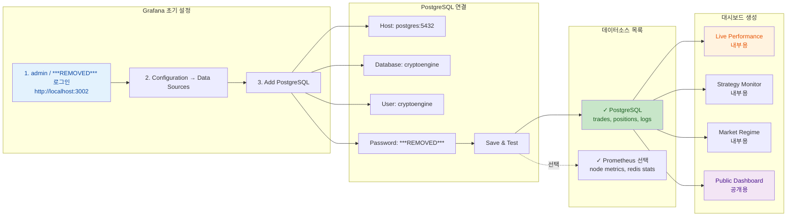
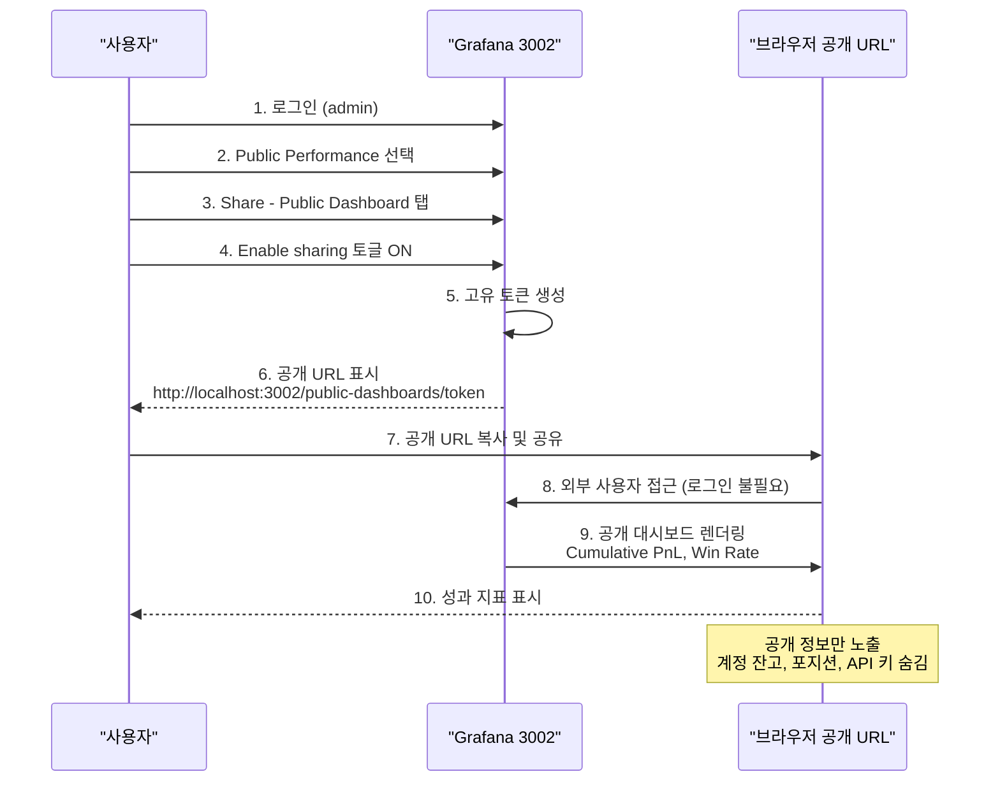

# Grafana 설정 및 대시보드

CryptoEngine 모니터링 대시보드 초기화 및 공개 설정 가이드.

---

## 초기 설정

### 1. Grafana 접속

**URL**: http://localhost:3002

**기본 자격증명**:
- 사용자명: `admin`
- 암호: `***REMOVED***`

### 2. 초기 로그인

1. 브라우저에서 http://localhost:3002 접속
2. "Sign in" 클릭
3. 위의 자격증명 입력
4. "Sign in" 버튼 클릭

**첫 로그인 시 암호 변경 권고** (프로덕션 환경에서 필수)

### 3. 데이터소스 설정

#### PostgreSQL 데이터소스 추가
1. 좌측 메뉴 → "Configuration" → "Data Sources"
2. "Add data source" 클릭
3. "PostgreSQL" 선택
4. 설정:
   - **Name**: PostgreSQL (cryptoengine)
   - **Host**: postgres:5432
   - **Database**: cryptoengine
   - **User**: cryptoengine
   - **Password**: ***REMOVED***
   - **SSL Mode**: disable
5. "Save & test" 클릭

예상 메시지: **"Database Connection OK"`**

#### Prometheus 데이터소스 추가 (선택)
1. "Add data source" → "Prometheus"
2. **URL**: http://prometheus:9090
3. "Save & test"

#### 데이터소스 설정 흐름



---

## 대시보드 목록

### 1. Live Performance (내부용)
- **설명**: 실시간 거래 성과, 포지션, 마진
- **권한**: 개발자/운영자만 접근
- **패널**:
  - 현재 잔고 (USD)
  - 오늘 PnL (%)
  - 활성 포지션 수
  - 마진 비율
  - 최근 거래 목록

### 2. Strategy Monitor (내부용)
- **설명**: 각 전략 상태, 자본 배분, 성과
- **패널**:
  - funding-arb 상태 (Running/Stopped)
  - adaptive-dca 상태
  - 자본 배분 (%)
  - 전략별 PnL
  - 거래 횟수

### 3. Market Regime (내부용)
- **설명**: 시장 레짐 (Trending/Ranging/Volatile), 신호
- **패널**:
  - 현재 레짐
  - 레짐 확신도 (%)
  - BTC 가격
  - ATR
  - VIX 등가 지수

### 4. Public Performance Dashboard (공개)
- **설명**: 공개 가능한 성과 지표만
- **권한**: 공개 링크 (공개 대시보드)
- **패널**:
  - 누적 수익률 (%)
  - 승률 (%)
  - 총 거래 수
  - 평균 거래 지속시간
  - Sharpe 비율
  - 전략별 PnL
  - 일일 PnL 차트
  - 펀딩비 수익

### 5. LLM Advisor / Reports (내부용)
- **설명**: Claude Code 분석 결과
- **패널**:
  - 시장 전망 (긍정/중립/부정)
  - 리스크 수준
  - 권장사항

### 6. Backtest Results (개발용)
- **설명**: Jesse 백테스트 결과
- **패널**:
  - CAGR, Sharpe, MDD
  - Walk-Forward OOS/IS 결과
  - Monte Carlo 분석
  - 월별 수익률

---

## 공개 대시보드 설정

### 1. Public Performance Dashboard 활성화

**전제 조건**: docker-compose.yml에 다음 설정 확인:
```yaml
grafana:
  environment:
    GF_FEATURE_TOGGLES_ENABLE: "publicDashboards"
```

### 2. 공개 링크 생성

1. **Grafana 접속**: http://localhost:3002 (admin으로 로그인)

2. **대시보드 선택**: "Public Performance Dashboard"

3. **Share 버튼 클릭**
   - 상단 우측의 체인/공유 아이콘
   - 또는 Dashboard menu (...) → Share

4. **Public Dashboard 탭 클릭**

5. **"Enable sharing" 토글 ON**
   - Grafana가 고유 토큰 생성
   - 공개 URL 표시:
     ```
     http://localhost:3002/public-dashboards/<random-token>
     ```

6. **URL 복사 및 저장**
   - 이 URL로 누구나 대시보드 접근 가능 (로그인 불필요)

#### 공개 대시보드 공유 흐름



### 3. 공개 링크 테스트

```bash
# 다른 브라우저 또는 시크릿 모드에서 테스트
curl -I http://localhost:3002/public-dashboards/<token>
# 예상: HTTP 200 OK
```

### 4. 공개 링크 비활성화

1. Public Performance Dashboard 열기
2. Share → Public Dashboard 탭
3. "Enable sharing" 토글 OFF

토큰이 즉시 무효화됨.

---

## 공개 대시보드 보안

### 노출되는 정보 (안전)

공개 대시보드에는 다음 정보만 표시:

| 패널 | 내용 | 이유 |
|-----|------|------|
| Cumulative PnL % | 수익률 추이 | 절대 잔고 없음 |
| Win Rate % | 승률 | 집계 통계만 |
| Total Trades | 거래 수 | 개별 거래 상세 없음 |
| Avg Trade Duration | 평균 보유시간 | 집계 통계 |
| Sharpe Ratio | 위험조정 수익률 | 파생 지표 |
| Strategy Breakdown | 전략별 PnL | 전략명 + 수익만 |
| Daily PnL | 일별 수익 | 총액만 (개별 거래 아님) |
| Funding Payments | 펀딩비 총액 | 집계 수익 |

### 보호되는 정보 (비공개)

다음은 절대 공개하지 않음:

- **계정 잔고**: 현재 에쿠이티
- **포지션**: 활성 포지션 및 크기
- **API 키**: 자격증명
- **거래 상세**: 진입/청산 가격, 개별 거래 내역
- **내부 신호**: Redis 채널, DB 스키마, 시스템 상태

### 공개하면 안 되는 대시보드

다음 대시보드는 **절대 공개하지 않음**:

- `Live Performance` — 실시간 잔고, 포지션 노출
- `Strategy Monitor` — 자본 배분, 전략 상태
- `Market Regime` — 내부 신호 (레짐 감지 알고리즘)
- `LLM Advisor / Reports` — AI 판단 정보
- `Backtest Results` — 전략 파라미터 노출

---

## 외부 네트워크 공개 (선택)

테스트넷 성과를 외부(인터넷)에 공유하려면:

### 1. Reverse Proxy 설정 (nginx 예)

```nginx
upstream grafana {
    server localhost:3002;
}

server {
    listen 443 ssl http2;
    server_name trading.example.com;

    ssl_certificate /path/to/cert.pem;
    ssl_certificate_key /path/to/key.pem;

    location / {
        proxy_pass http://grafana;
        proxy_set_header Host $host;
        proxy_set_header X-Real-IP $remote_addr;
    }

    # 공개 대시보드는 rate limiting
    location /public-dashboards/ {
        limit_req zone=api burst=10 nodelay;
        proxy_pass http://grafana;
    }
}

# Rate limiting 설정
limit_req_zone $binary_remote_addr zone=api:10m rate=10r/m;
```

### 2. Rate Limiting 적용

공개 대시보드에만 rate limit 적용:
```nginx
location /public-dashboards/ {
    limit_req zone=api burst=10 nodelay;
    proxy_pass http://grafana;
}
```

### 3. HTTPS 강제

```nginx
# HTTP → HTTPS 리다이렉트
server {
    listen 80;
    server_name trading.example.com;
    return 301 https://$server_name$request_uri;
}
```

---

## Grafana 고급 설정

### 1. 사용자 권한 관리

#### 관리자 사용자 추가
```bash
# CLI를 통해 관리자 사용자 생성
docker compose exec grafana grafana-cli admin create-user \
  --username operator \
  --password OperatorPass2026! \
  --admin
```

#### 뷰어 사용자 추가 (읽기 전용)
```bash
docker compose exec grafana grafana-cli admin create-user \
  --username viewer \
  --password ViewerPass2026!
```

### 2. 조직 및 팀 관리

1. Configuration → Orgs & Teams
2. 새 조직 생성: "Monitoring Team"
3. 팀원 추가

### 3. 알림 설정 (선택)

#### Slack 알림
1. Configuration → Notification Channels
2. "New notification channel" → Slack
3. Slack Webhook URL 입력
4. 대시보드에 Alert 규칙 설정

---

## 성능 최적화

### 1. 데이터소스 성능

#### 쿼리 타임아웃 증가
```yaml
# docker-compose.yml (grafana 서비스)
environment:
  GF_DATAPROXY_TIMEOUT: 60
```

#### 백그라운드 데이터 새로고침
- Dashboard settings → Refresh interval
- 자동 새로고침: 30초 또는 1분

### 2. 대시보드 최적화

- **패널 수 제한**: 한 대시보드 최대 20패널
- **쿼리 최소화**: GROUP BY 사용 (세분화 피함)
- **변수 활용**: 자동 필터링 (수동 선택 최소화)

### 3. 데이터베이스 인덱싱

```sql
-- PostgreSQL 인덱스 추가
CREATE INDEX idx_trades_entry_ts ON trades(entry_ts DESC);
CREATE INDEX idx_positions_strategy_id ON positions(strategy_id);
CREATE INDEX idx_service_logs_timestamp ON service_logs(timestamp DESC);
```

---

## 문제 해결

### Grafana 접속 불가
```bash
# 1. 컨테이너 상태 확인
docker compose ps grafana

# 2. Grafana 로그 확인
docker compose logs grafana | tail -20

# 3. 포트 확인
docker port grafana
# Expected: 3002/tcp -> 0.0.0.0:3002

# 4. 컨테이너 재시작
docker compose restart grafana
```

### 데이터소스 연결 실패
```bash
# 1. PostgreSQL 상태 확인
docker compose ps postgres

# 2. 연결 테스트
docker compose exec postgres psql -U cryptoengine -d cryptoengine -c "SELECT 1"

# 3. Grafana에서 데이터소스 재설정
#    Configuration → Data Sources → PostgreSQL → Test
```

### 대시보드 쿼리 느림
```bash
# 1. 쿼리 실행 시간 확인 (Grafana UI)
#    Dashboard → Panel edit → Query inspector

# 2. DB 인덱스 확인
docker compose exec postgres psql -U cryptoengine -d cryptoengine \
  -c "\d+ trades"

# 3. 느린 쿼리 로그
docker compose exec postgres psql -U cryptoengine -d cryptoengine \
  -c "SET log_min_duration_statement = 1000;" # 1초 이상 쿼리 기록
```

### 공개 링크 작동 안 함
```bash
# 1. 공개 대시보드 기능 활성화 확인
docker compose exec grafana grafana-cli admin data-source list

# 2. Grafana 재시작
docker compose restart grafana

# 3. 토큰 재생성 (Share → Public Dashboard 다시 활성화)
```

---

## 대시보드 예시 쿼리

### 누적 PnL (%)
```sql
SELECT
  DATE(entry_time) as date,
  SUM(pnl_usd) as daily_pnl,
  SUM(SUM(pnl_usd)) OVER (ORDER BY DATE(entry_time)) as cumulative_pnl,
  SUM(SUM(pnl_usd)) OVER (ORDER BY DATE(entry_time)) / 1000 * 100 as cumulative_pnl_pct
FROM trades
WHERE entry_time >= NOW() - INTERVAL '6 months'
GROUP BY DATE(entry_time)
ORDER BY date;
```

### 전략별 승률
```sql
SELECT
  strategy_id,
  COUNT(*) as total_trades,
  SUM(CASE WHEN pnl_usd > 0 THEN 1 ELSE 0 END) as winning_trades,
  ROUND(100.0 * SUM(CASE WHEN pnl_usd > 0 THEN 1 ELSE 0 END) / COUNT(*), 2) as win_rate_pct
FROM trades
WHERE entry_time >= NOW() - INTERVAL '30 days'
GROUP BY strategy_id;
```

### 펀딩비 수익
```sql
SELECT
  DATE(timestamp) as date,
  SUM(amount_usd) as daily_funding_income
FROM funding_payments
WHERE timestamp >= NOW() - INTERVAL '6 months'
GROUP BY DATE(timestamp)
ORDER BY date;
```

---

**최종 수정**: 2026-05-01
