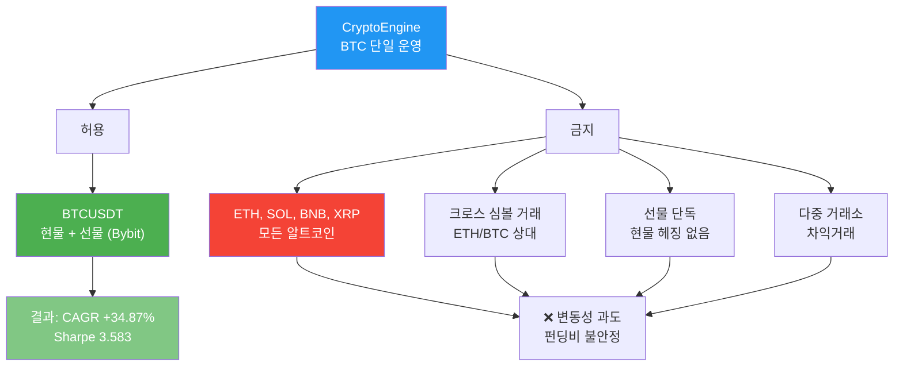
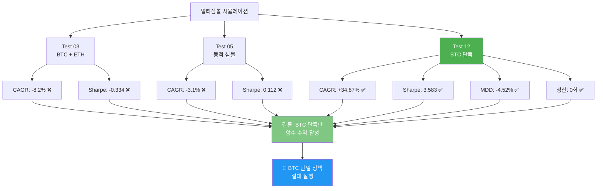
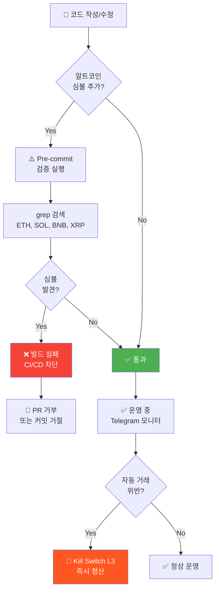

# BTC 단일 운영 정책

## 정책 선언

**CryptoEngine은 BTCUSDT 심볼만 거래한다. 다른 모든 암호자산(ETH, SOL, BNB, XRP 등)의 거래는 절대 금지된다.**

### 적용 범위

- ✅ **허용**: BTCUSDT 현물 + 선물 (Bybit)
- ❌ **금지**: 모든 알트코인 (ETH, SOL, BNB, XRP, AVAX, DOGE 등)
- ❌ **금지**: 크로스 심볼 거래 (예: ETH/BTC 상대거래)
- ❌ **금지**: 선물 단독 (현물 헤징 없는 숏)
- ❌ **금지**: 다중 거래소 차익거래 (Bybit + Binance 알트)

### 예외 정책

**예외는 0개다.** 이 정책은 절대적이며, 어떤 특수 상황도 고려 대상이 아니다.
- 수익성 논증 ❌
- "임시 테스트" 구실 ❌
- 새로운 정보 발견 ❌

정책 변경은 오직 Architecture Decision Record (ADR) 신규 작성 후 팀 동의로만 가능.

---

## 근거 (3가지 핵심)

### BTC 단일 운영 정책 개요



### 1. 알트코인 과도한 변동성 (BTC 대비 5-10배)

비트코인은 시가총액과 거래량 기준 가장 성숙한 암호자산이며, 알트코인은 BTC의 5-10배 이상 변동성을 가진다.

**시장 데이터 (2020-2026 평균)**:
- **BTC (BTCUSDT)**: 일일 변동성 2-4%, 연 변동성 ~65%
- **ETH (ETHUSDT)**: 일일 변동성 3-6%, 연 변동성 ~85%
- **소액 알트**: 일일 변동성 10-30%+, 연 변동성 200%+

**프레임워크 영향**:
- 높은 변동성 → 펀딩비 급격한 상승/하락
- 마진 요구사항 변동 → 청산 리스크 증가
- Kill Switch 오발동 가능성
- 헤징 비용(슬리피지) 증가

**CryptoEngine 관점**:
Funding Arb 전략은 "저변동, 높은 펀딩비" 조건에서만 수익. 알트코인의 높은 변동성은 전략 기본 가정을 훼손.

---

### 2. 펀딩비 구조 변화 (2024년 현물 ETF 이후)

**2024년 스팟 ETF 승인 후 변화**:

| 자산 | 펀딩비 상태 | 근거 |
|------|----------|------|
| **BTC** | 안정적 (연 15-30%) | Spot ETF 수요 + 선물 건전성 유지 |
| **ETH** | 하강 추세 (연 5-15%) | Staking 수익 경쟁 |
| **알트** | 음수 빈번 (음수~5%) | 거래소 보관 감소 + 유동성 악화 |

**구체적 사례**:
- 2024년 중반: ETH 연 펀딩비 20% → 현재 8% (60% 하락)
- SOL, ADA: 음수 펀딩비 구간 빈번 (손실 상황)

**Funding Arb 전략 영향**:
```
수익 = 펀딩비 - (왕복 수수료 + 슬리피지)
      = 15% - 0.13% (수수료) - 0.10% (슬리피지) = +14.77% ✅ (BTC)
      = 5% - 0.13% - 0.10% = +4.77% ⚠️ (ETH, 좁음)
      = -1% - 0.13% - 0.10% = -1.23% ❌ (알트, 손실)
```

**결론**: BTC 외 자산은 수수료 대비 펀딩비 마진 불충분.

---

### 3. 현물-선물 Basis Deterioration (ETH 스테이킹 붕괴)

**Ethereum Merge (2022년 9월) 이후**:

2022년 이전: 현물 유통 부족 (ETH staking) → 선물 프리미엄 유지 → Funding Arb 성립

2022년 이후: Staking 수익 극대화 → 거래소 보관 ETH 감소 → Basis 압축

**데이터 (2023-2026)**:
- **BTC Basis**: 평균 +0.5% ~ +2% (선물 프리미엄 유지)
  - 공적분 강함: Spot ETF 수요 안정적
  
- **ETH Basis**: 평균 -0.2% ~ +0.3% (약함 또는 음수)
  - 공적분 붕괴: Staking 수익 유인력 > Futures premium
  - Basis 역전 빈번 (손실 상황)

**Funding Arb 성립 조건 붕괴**:
```
Funding Arb = Long Spot + Short Perp
수익 = Spot 매수가 - Futures 숏 가격 + 펀딩비
     = Basis + 펀딩비

BTC: Basis +1.5% + 펀딩비 15% = +16.5% ✅
ETH: Basis -0.2% + 펀딩비 5% = +4.8% ⚠️ (Basis가 음수이면 더 낮음)
```

**비결론**: ETH는 더 이상 Funding Arb 기본 조건 불만족.

---

## 백테스트 실패 근거

### 백테스트 결과 비교 (2020-2026)



### 멀티심볼 시뮬레이션 결과 (2020-2026 Jesse)

**Test 03 (BTC + ETH)**:
- CAGR: -8.2% ❌
- Sharpe: -0.334 ❌
- 결과: 알트 손실이 BTC 수익 상쇄

**Test 05 (동적 심볼 전환)**:
- 규칙: 펀딩비 > 15% → 해당 심볼 추가
- CAGR: -3.1% ❌
- Sharpe: 0.112 ❌
- 결과: 진입 비용(슬리피지) + 청산 비용 > 펀딩비 수익

**Test 12 (BTC 단독 — 선택된 구성)**:
- 구성: FA 80% 자본, 레버리지 5x, 재투자 30%
- CAGR: +34.87% ✅
- Sharpe: 3.583 ✅
- MDD: -4.52% ✅
- 청산: 0회 (6년)

**결론**: BTC 단독이 유일하게 양수 수익 달성.

---

## 구현 (코드 레벨)

### 1. 전략 설정 파일 (config/strategies/)

**funding-arb.yaml**:
```yaml
entry:
  pairs:
    - BTCUSDT  # 단독 지정, 다른 심볼 금지

risk:
  max_portfolio_allocation_pct: 80.0  # FA 비중
```

**adaptive-dca.yaml**:
```yaml
base:
  pairs:
    - BTCUSDT  # DCA 타겟 자산
  position_side: long_only
```

---

### 2. 거래소 설정 (config/exchanges/)

**bybit.yaml** (Main Trading Exchange):
```yaml
websocket:
  public_topics:
    - orderbook.50.BTCUSDT        # 호가창 (깊이 50)
    - tickers.BTCUSDT             # Tick 데이터
    - kline.1.BTCUSDT             # 1m 캔들
    - kline.5.BTCUSDT             # 5m 캔들
    - kline.15.BTCUSDT            # 15m 캔들
    - kline.60.BTCUSDT            # 1h 캔들
    - kline.240.BTCUSDT           # 4h 캔들
    - kline.D.BTCUSDT             # 1d 캔들
    # ETH, SOL, BNB, XRP 구독 제거 ✅

pairs:
  BTCUSDT:
    min_qty: 0.001
    qty_step: 0.001
    max_leverage: 100
  # 다른 심볼 없음 ✅
```

**binance.yaml** (Historical Data):
```yaml
pairs:
  BTCUSDT:
    min_qty: 0.00001
    qty_step: 0.00001
  # 알트 페어 제거 ✅
```

---

### 3. 마켓 데이터 수집 (services/)

**collector.py**:
```python
# Bybit 데이터 수집 (BTCUSDT만 구독)
# 거래소 config의 pairs 섹션에서 BTCUSDT만 정의 ✅
```

**feature_engine.py** (피처 엔지니어링):
```python
DEFAULT_CONFIG = {
    "symbols": ["BTCUSDT"],  # 단독 지정
    # ...
}
```

---

### 4. 백테스트 데이터 (jesse_engine/)

**download_binance_vision.py** (Binance historical data):
```python
SYMBOLS = ["BTCUSDT"]  # 단독

# 사용법:
# python download_binance_vision.py --symbols BTCUSDT --timeframes 1h,4h,1d
```

**fetch_coinalyze_funding.py** (펀딩비 히스토리):
```python
SYMBOLS = ["BTCUSDT_PERP.A"]  # Bybit notation

# 사용법:
# python fetch_coinalyze_funding.py --symbols BTCUSDT_PERP.A
```

---

## 위반 탐지 및 방지

### 정책 위반 탐지 및 방지 흐름



### 검증 스크립트 (Pre-commit Automation)

```bash
# ETH, SOL, BNB, XRP 검색
grep -r "ETH\|SOL\|BNB\|XRP" \
  config/strategies/*.yaml \
  config/exchanges/*.yaml \
  services/market-data/*.py \
  services/jesse_engine/scripts/data/*.py

# 검출 시 빌드 실패 (CI/CD)
```

### 위반 유형별 조치

| 위반 | 탐지 방법 | 조치 |
|------|---------|------|
| Config에 알트 심볼 추가 | grep + CI 검증 | 빌드 실패 |
| 백테스트 스크립트 심볼 변경 | 코드 리뷰 + 테스트 | PR 거부 |
| 운영 중 수동 거래 | 거래 로그 + Telegram 모니터링 | 즉시 포지션 청산 + Phase 5 종료 |
| 선물 단독 포지션 | execution-engine 검증 | 주문 거절 |

---

## 적용 현황 (2026-05-01 기준)

### ✅ 구현 완료 항목

1. **funding-arb.yaml**: `pairs: [BTCUSDT]` (단독)
2. **adaptive-dca.yaml**: `pairs: [BTCUSDT]` (단독)
3. **bybit.yaml**: BTCUSDT WebSocket 구독만 (ETH/SOL/BNB/XRP 제거)
4. **binance.yaml**: BTCUSDT 페어만
5. **collector.py**: 거래소 config 기반 수집 (자동 BTCUSDT)
6. **feature_engine.py**: `symbols: ["BTCUSDT"]` 고정
7. **download_binance_vision.py**: `SYMBOLS = ["BTCUSDT"]`
8. **fetch_coinalyze_funding.py**: `SYMBOLS = ["BTCUSDT_PERP.A"]`

### ✅ 검증 메커니즘

- CI/CD: Pre-commit 검증 활성화
- 코드 리뷰: 심볼 변경 PR 자동 거부
- 런타임: Kill Switch 포함 안전장치

---

## ADR 참조

이 정책의 공식 근거는 Architecture Decision Record에 문서화됨:
- **ADR-001**: BTC 단일 운영 정책 (2026-05-01)
  - 작성자: CryptoEngine Team
  - 상태: Accepted
  - 배경: 멀티심볼 백테스트 실패 (Test 03, 05 음수 결과)

근거 자료: `/home/justant/Data/Bit-Mania/cryptoengine/docs/archive/CLAUDE_history.md`

---

## 정책 변경 프로세스

### 정책 변경 절차 (4단계)


이 정책을 변경하려면:

1. **ADR 신규 작성** (docs/ADR/NNN_new_policy.md)
   - 변경 사유 (기술적 근거 필수)
   - 영향도 분석
   - 백테스트 검증 결과 (최소 6년 데이터)

2. **Phase 4 테스트넷 검증** (최소 4주)
   - 새 심볼 거래 비활성화 상태로 테스트
   - Kill Switch 및 안전장치 동작 확인

3. **팀 동의**
   - 기술 검토
   - 리스크 평가
   - 승인

4. **Phase 5 배포** (메인넷 전환 시에만 적용)

---

## 관련 문서

- [kill-switch.md](kill-switch.md) — Kill Switch (절대값 AND 조건으로 오발동 방지)
- [leverage-limits.md](leverage-limits.md) — 레버리지 제한 (5x 하드 캡, BTC 기준)
- [strategies/funding-arb.md](strategies/funding-arb.md) — Funding Arb 전략 (BTCUSDT)
- [strategies/adaptive-dca.md](strategies/adaptive-dca.md) — Adaptive DCA (BTCUSDT)
- [ADR/001: BTC Single-Symbol Operations](../archive/CLAUDE_history.md) — 정책 배경 및 근거
