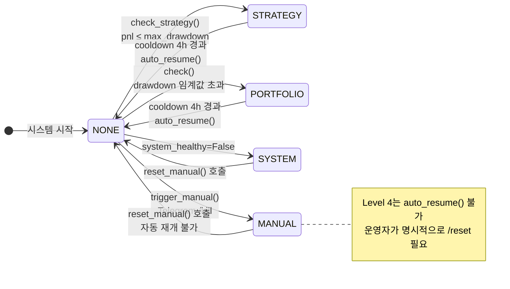
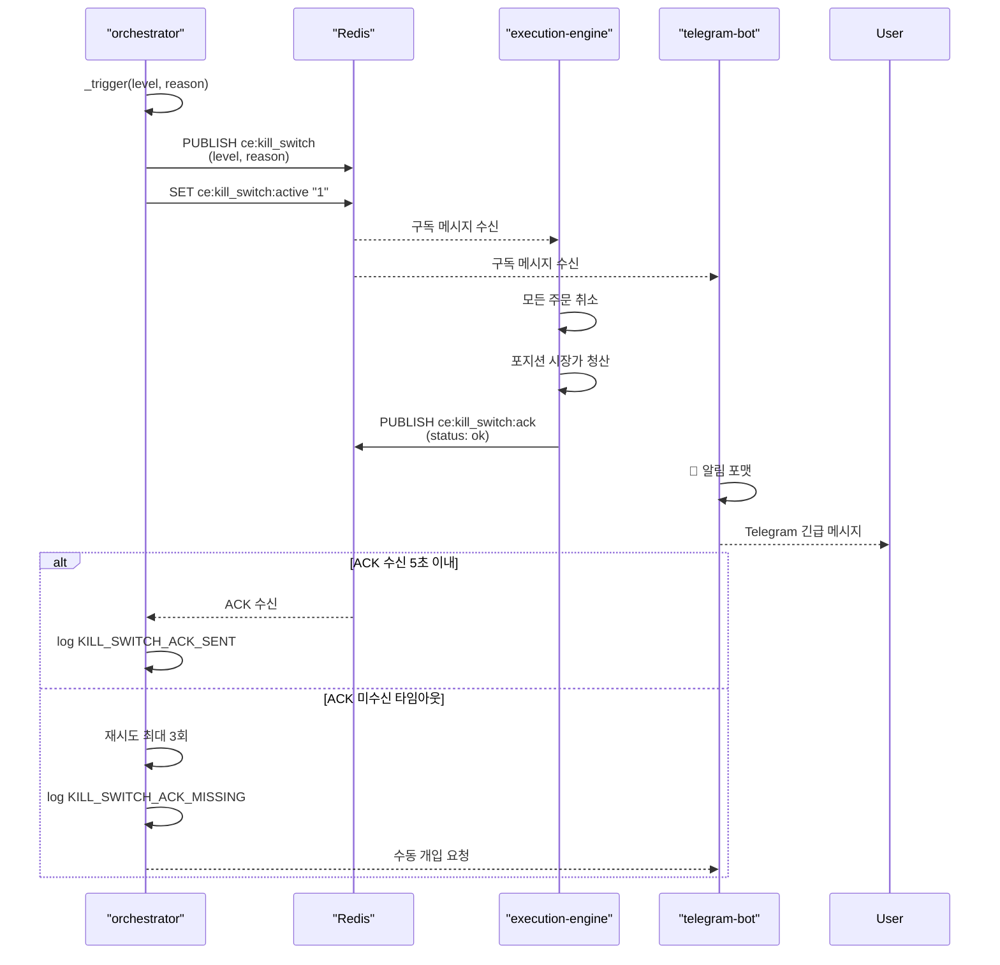
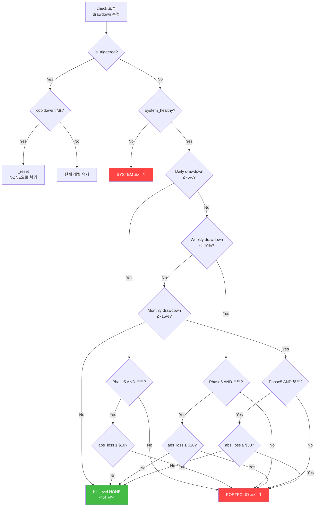
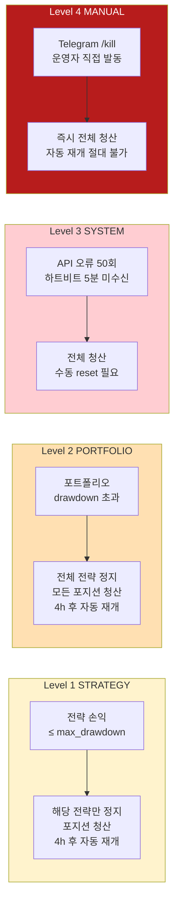

# Kill Switch 정책

## 개요

Kill Switch는 CryptoEngine의 **자금 보호 최후 방어선**이다. 포트폴리오 손실이 임계값을 초과하거나 시스템이 이상 상태가 되면 자동으로 모든 포지션을 청산하여 추가 손실을 방지한다.

**원칙**: 수익 추구보다 자본 보호. 수익 기회를 놓치더라도 자본을 지킨다.

**기술**: Stateful, cooldown 기반, auto-resume 지원. Redis Pub/Sub + ACK 프로토콜로 분산 시스템 간 동기화.

**상수 정의** (shared/kill_switch.py):
```python
KILL_SWITCH_CHANNEL = "ce:kill_switch"
KILL_SWITCH_ACTIVE_KEY = "ce:kill_switch:active"
KILL_SWITCH_ACK_CHANNEL = "ce:kill_switch:ack"
KILL_SWITCH_ACK_TIMEOUT_SECONDS = 5
KILL_SWITCH_ACK_MAX_RETRIES = 3
```

---

## KillLevel 계층 (IntEnum)

Kill Switch는 4개의 우선순위 계층을 정의한다. 숫자가 높을수록 심각함.

```python
class KillLevel(IntEnum):
    NONE = 0        # 정상 상태
    STRATEGY = 1    # 개별 전략 정지
    PORTFOLIO = 2   # 전체 포트폴리오 정지
    SYSTEM = 3      # 시스템 장애 감지
    MANUAL = 4      # 운영자 수동 발동
```



---

## Level 1: STRATEGY (전략 레벨)

**목적**: 개별 전략의 손실이 임계값을 초과할 때 해당 전략만 정지

### 발동 조건

```python
# shared/kill_switch.py check_strategy() 메서드
async def check_strategy(
    strategy_id: str,
    current_pnl: float,      # 전략 현재 손익
    max_drawdown: float,     # 전략 낙폭 임계값
) -> bool:
    """Return True if current_pnl <= max_drawdown (양수/음수 모두)"""
    if current_pnl <= max_drawdown:
        # Level STRATEGY 트리거
        return True
    return False
```

### 기본 설정 (orchestrator.yaml)

```yaml
kill_switch:
  # 포트폴리오 수준에서는 정의 안 함.
  # 각 전략이 자신의 config에서 max_drawdown_pct 정의
```

전략별 설정 (config/strategies/funding-arb.yaml):
```yaml
risk:
  max_drawdown_pct: 5.0        # 5% 이상 손실 시 전략 정지
  drawdown_window_hours: 168   # 7일 룩백 윈도우
```

### 동작

1. 해당 전략의 `_affected_strategies` 세트에 strategy_id 추가
2. Level이 STRATEGY보다 낮으면 `_trigger(KillLevel.STRATEGY, reason)` 호출
3. on_trigger 콜백 실행 (orchestrator 주입):
   - 해당 전략 신호 중지
   - 포지션 청산
   - Telegram 알림
   - 로그 기록

### Cooldown & Auto-Resume

- **쿨다운**: 4시간 (`cooldown_hours=4.0`)
- **자동 재개**: 가능 (MANUAL 제외)
- `_try_auto_resume()` 호출 시 `_triggered_at + cooldown` 만료 확인 후 `_reset()`

---

## Level 2: PORTFOLIO (포트폴리오 레벨)

**목적**: 포트폴리오 전체 손실이 임계값을 초과할 때 모든 전략 정지

### 발동 조건

```python
# shared/kill_switch.py check() 메서드
async def check(
    self,
    portfolio: PortfolioState,     # 포트폴리오 상태 객체
    monthly_drawdown: float = 0.0,  # 월간 낙폭 (별도 전달)
    system_healthy: bool = True,    # 시스템 정상 여부
    equity_at_open: float = 0.0,   # Phase 5: 당일 시작 자본
) -> KillLevel:
```

### 임계값 (orchestrator.yaml)

**Phase 4 (테스트넷) — 퍼센트만**:
```yaml
kill_switch:
  max_daily_drawdown_pct: 5.0      # 일일: -5%
  max_weekly_drawdown_pct: 10.0    # 주간: -10%
  max_monthly_drawdown_pct: 15.0   # 월간: -15%
```

**Phase 5 (메인넷) — 퍼센트 AND 절대값**:
```yaml
kill_switch:
  phase5:
    max_daily_drawdown_pct: 5.0
    max_daily_loss_abs_usd: 10         # AND 조건
    max_weekly_drawdown_pct: 10.0
    max_weekly_loss_abs_usd: 20        # AND 조건
    max_monthly_drawdown_pct: 15.0
    max_monthly_loss_abs_usd: 30       # AND 조건
    trigger_mode: "and"                # AND (기본값)
```

### 동작 로직

Phase 5 AND 조건 예시:
```python
# Daily 체크
pct_breach_daily = portfolio.daily_drawdown <= self.daily_limit  # -5% 이상
if self.daily_loss_abs_usd is not None:
    daily_loss_usd = abs(portfolio.daily_drawdown) * equity_at_open
    abs_breach_daily = daily_loss_usd >= self.daily_loss_abs_usd  # $10 이상
    should_trigger_daily = pct_breach_daily and abs_breach_daily  # AND
else:
    should_trigger_daily = pct_breach_daily  # 퍼센트만

if should_trigger_daily:
    await self._trigger(KillLevel.PORTFOLIO, reason)
```

**핵심**: 소액 계정($200)에서 노이즈 발동을 방지한다.
- 예 1: -3% 상대 손실이지만 $4 절대 손실 → 발동 안 함 (절대값 미달)
- 예 2: -5.5% 상대 + $15 절대 손실 → 발동 (둘 다 만족)

### Cooldown & Auto-Resume

- **쿨다운**: 4시간 (PORTFOLIO도 동일)
- **자동 재개**: 가능
- 쿨다운 만료 후 `_try_auto_resume()` 재확인

---

## Level 3: SYSTEM (시스템 레벨)

**목적**: 거래소 API 오류, 인프라 장애 등 시스템 이상 상태 감지

### 발동 조건

```python
# shared/kill_switch.py check() 메서드
if not system_healthy:
    await self._trigger(
        KillLevel.SYSTEM,
        "System healthcheck failure — closing all positions"
    )
```

### 시스템 정상 여부 판단 기준 (orchestrator에서 전달)

orchestrator.yaml 설정:
```yaml
kill_switch:
  # Halt if exchange API errors exceed threshold in window
  max_api_errors: 50
  api_error_window_minutes: 10
  
  # Halt if execution latency exceeds threshold (milliseconds)
  max_execution_latency_ms: 5_000
```

시나리오:
- Bybit API 연속 실패 (50회/10분)
- execution-engine 하트비트 5분 미수신
- PostgreSQL 연결 실패
- Redis 연결 실패
- 네트워크 타임아웃 다발

### 동작

1. 모든 포지션 즉시 시장가 청산
2. 모든 주문 취소
3. Telegram 긴급 알림 (🚨🚨 마크)
4. 자동 복구 **불가** (MANUAL과 동일)
5. 운영자 수동 개입 필요

### Cooldown & Auto-Resume

- **쿨다운**: 없음
- **자동 재개**: 불가 (`return False` 항상)
- 시스템 정상 복구 후 운영자가 `/reset` 명령 필요

---

## Level 4: MANUAL (수동 긴급)

**목적**: 운영자가 즉시 시스템을 정지해야 할 때

### 발동 조건

```python
# shared/kill_switch.py
async def trigger_manual(self, reason: str = "Manual emergency via Telegram") -> None:
    async with self._lock:
        await self._trigger(KillLevel.MANUAL, reason)
```

**발동 방법**:
1. Telegram: `/kill` 명령
2. API: POST /api/kill-switch
3. 코드: `kill_switch.trigger_manual(reason)`

### 동작

1. 즉시 모든 포지션 청산
2. 모든 주문 취소
3. 시스템 완전 정지
4. Redis: `ce:kill_switch:active = "1"` 설정
5. Telegram: 수동 reset 필요 안내

### Cooldown & Auto-Resume

- **쿨다운**: 없음
- **자동 재개**: 절대 불가
- 명시적 `reset_manual()` 호출 필수:
```python
async def reset_manual(self) -> None:
    """Operator-initiated reset (clears even L4)."""
    async with self._lock:
        self._reset()
        log.info(KILL_SWITCH_MANUAL_RESET, message="Kill Switch 수동 리셋")
```

---

## 상태 전환 및 Auto-Resume

### 상태 정의

```python
@property
def is_triggered(self) -> bool:
    return self._active_level > KillLevel.NONE

@property
def level(self) -> KillLevel:
    return self._active_level
```

### Auto-Resume 로직

```python
async def _try_auto_resume(self) -> bool:
    """
    쿨다운 만료 여부 확인.
    Level 4 (MANUAL)는 항상 False (자동 재개 금지).
    """
    if self._active_level == KillLevel.MANUAL:
        return False
    if self._triggered_at is None:
        return False
    
    now = datetime.now(tz=timezone.utc)
    if now - self._triggered_at >= self.cooldown:
        log.info(KILL_SWITCH_COOLDOWN, message="Kill Switch 쿨다운 시작")
        self._reset()
        return True
    return False
```

### Reset 메서드

```python
def _reset(self) -> None:
    """내부 상태 초기화"""
    self._active_level = KillLevel.NONE
    self._reason = ""
    self._triggered_at = None
    self._affected_strategies.clear()
```

---

## 동시성 안전성

### asyncio.Lock 기반 직렬화

```python
def __init__(self, ...):
    self._lock = asyncio.Lock()

async def check(self, portfolio, ...):
    async with self._lock:  # 직렬 실행
        if self.is_triggered:
            if await self._try_auto_resume():
                # 재개 로직
                ...
        # 나머지 체크
```

**보장**: 동시에 여러 서비스에서 `check()` 호출해도 race condition 없음.

---

## on_trigger 콜백

### 설정

KillSwitch 생성 시 콜백 함수 주입:
```python
async def on_kill_switch_trigger(level: KillLevel, reason: str) -> None:
    """Kill Switch 발동 시 호출될 콜백"""
    log.critical("Kill Switch 발동", level=int(level), reason=reason)
    # 포지션 청산, Telegram 알림, etc.

kill_switch = KillSwitch(
    daily_limit=-0.05,
    on_trigger=on_kill_switch_trigger
)
```

### 실행

```python
async def _trigger(self, level: KillLevel, reason: str) -> None:
    self._active_level = level
    self._reason = reason
    self._triggered_at = datetime.now(tz=timezone.utc)
    log.critical(KILL_SWITCH_TRIGGERED, message="Kill Switch 발동", ...)
    
    if self._on_trigger is not None:
        try:
            await self._on_trigger(level, reason)
        except Exception:
            log.exception("on_trigger callback failed")
```

---

## ACK 프로토콜

### 목적

Kill Switch 발동 → execution-engine이 포지션 청산 확인 → orchestrator 수신 확인

### 흐름

1. **orchestrator**: Kill Switch 발동
2. **on_trigger 콜백**: Redis `ce:kill_switch` 채널에 메시지 발행
3. **execution-engine**: 구독 → 포지션 청산 실행
4. **execution-engine**: Redis `ce:kill_switch:ack` 채널에 ACK 발행
5. **orchestrator**: ACK 수신 (5초 타임아웃, 최대 3회 재시도)



### 상수

```python
KILL_SWITCH_ACK_TIMEOUT_SECONDS = 5      # ACK 대기 시간
KILL_SWITCH_ACK_MAX_RETRIES = 3          # 재시도 횟수
```

### 실패 처리

- 5초 이내 ACK 미수신 → KILL_SWITCH_ACK_MISSING 로그
- 3회 재시도 후에도 미수신 → 수동 개입 알림

---

## 로그 이벤트 (shared/log_events.py)

```python
KILL_SWITCH_TRIGGERED = "kill_switch_triggered"     # 발동
KILL_SWITCH_RESUMED = "kill_switch_resumed"         # 재개 (auto-resume)
KILL_SWITCH_COOLDOWN = "kill_switch_cooldown"       # 쿨다운 시작
KILL_SWITCH_MANUAL_RESET = "kill_switch_manual_reset"  # 수동 리셋
KILL_SWITCH_ACK_SENT = "kill_switch_ack_sent"       # ACK 발행
KILL_SWITCH_ACK_MISSING = "kill_switch_ack_missing" # ACK 미수신
```

모든 서비스 로그는 structlog + KST 타임스탬프로 저장됨.

---

## Phase 5 절대값 AND 조건 (소액 운영 모드)

### 배경

메인넷 실전 시작 시 초기 자본 $200 USD로 운영. 낮은 금액에서는 노이즈(시장 진동, 수수료)로 인한 오발동 가능.

### 해결책

**퍼센트 + 절대값 동시 만족 조건 (AND)**:

```python
KillSwitch(
    daily_limit=-0.05,              # 퍼센트 임계값: -5%
    daily_loss_abs_usd=10.0,        # 절대값 임계값: $10
    weekly_limit=-0.10,
    weekly_loss_abs_usd=20.0,
    monthly_limit=-0.15,
    monthly_loss_abs_usd=30.0,
)
```

### 예시



| 손실 | 퍼센트 | 절대값 | 발동? |
|------|--------|--------|-------|
| 시나리오 A | -3% | $4 | ❌ (절대값 미달: $4 < $10) |
| 시나리오 B | -5.5% | $12 | ✅ (둘 다 만족) |
| 시나리오 C | -6% | $9 | ❌ (절대값 미달: $9 < $10) |

### orchestrator.yaml에서의 설정

```yaml
kill_switch:
  enabled: true
  max_daily_drawdown_pct: 5.0
  max_weekly_drawdown_pct: 10.0
  max_monthly_drawdown_pct: 15.0
  
  # Phase 5 소액 운영
  phase5:
    max_daily_drawdown_pct: 5.0
    max_daily_loss_abs_usd: 10
    max_weekly_drawdown_pct: 10.0
    max_weekly_loss_abs_usd: 20
    max_monthly_drawdown_pct: 15.0
    max_monthly_loss_abs_usd: 30
    trigger_mode: "and"  # AND (기본값)
```

---

## 운영 시나리오



### 시나리오 1: 정상 손실 (Kill Switch 미발동)

```
시각: 2026-05-15 10:00 UTC
포트폴리오: $1,000 → $980
손실: -$20 (-2%)

체크:
- Daily: -2% > -5% (임계값 미달) ✅
- Weekly: -2% > -10% ✅
- Monthly: -2% > -15% ✅

결과: Kill Switch 미발동, 계속 운영
```

### 시나리오 2: Level 2 발동 (포트폴리오 일일 손실 -5%)

```
시각: 2026-05-15 14:30 UTC
포트폴리오: $1,000 → $949
손실: -$51 (-5.1%)

체크:
- Daily: -5.1% <= -5.0% ✅
- (Phase 4는 이것으로 발동, Phase 5는 절대값도 확인)

동작:
1. _trigger(KillLevel.PORTFOLIO, "Daily drawdown -5.1% breached -5.0%")
2. on_trigger 콜백: 모든 전략 정지, 포지션 청산
3. Redis ce:kill_switch 채널 메시지 발행
4. Telegram: 🚨 포트폴리오 Level 2 Kill Switch 발동
5. 쿨다운 시작: 4시간 후 auto_resume 가능
```

### 시나리오 3: Level 3 발동 (시스템 장애)

```
상황: Bybit API 50회 에러/10분 초과

체크:
- system_healthy=False 전달됨

동작:
1. _trigger(KillLevel.SYSTEM, "System healthcheck failure")
2. on_trigger 콜백 실행
3. 모든 포지션 시장가 청산
4. Telegram: 🚨🚨 [긴급] 시스템 장애 — 수동 개입 필요
5. auto_resume 불가 (MANUAL과 동일)
6. 운영자가 상황 파악 후 /reset 명령 필요
```

### 시나리오 4: Level 4 발동 (수동 명령)

```
운영자: /kill "이상 거래 패턴 감지"

동작:
1. trigger_manual(reason="이상 거래 패턴 감지")
2. _trigger(KillLevel.MANUAL, reason)
3. 즉시 모든 포지션 청산
4. Telegram: "[긴급] 수동 Kill Switch 발동. /reset로 해제."
5. auto_resume 절대 불가
6. 운영자가 명시적으로 reset_manual() 호출하거나 /reset 명령 필요
```

---

## 모니터링 및 확인

### Redis 상태 확인

```bash
# Kill Switch 활성 여부
redis-cli GET ce:kill_switch:active
# 결과: "1" (활성) 또는 없음 (비활성)

# Kill Switch 채널 구독 (디버그)
redis-cli SUBSCRIBE ce:kill_switch
```

### 데이터베이스 로그 확인

```bash
# Kill Switch 발동 이력
docker compose exec postgres psql -U cryptoengine -d cryptoengine -c \
  "SELECT timestamp, event_code, message FROM service_logs \
   WHERE event_code LIKE 'kill_switch%' \
   ORDER BY timestamp DESC LIMIT 20;"
```

### 로그 필터링

```bash
# Kill Switch 관련 로그만 추출
docker compose logs strategy-orchestrator | grep -i "kill_switch\|triggered\|resumed"
docker compose logs execution-engine | grep -i "kill_switch"
```

### Grafana 대시보드

http://localhost:3002 (기본 로그인: admin / ***REMOVED***)

대시보드 패널:
- **Kill Switch Status**: 현재 활성 레벨
- **Last Trigger Time**: 마지막 발동 시각
- **Trigger Reason**: 발동 사유
- **Portfolio Drawdown**: 일간/주간/월간 낙폭 추이
- **ACK Latency**: ACK 프로토콜 응답 시간

---

## 주의사항

⚠️ **Kill Switch 약화 금지**

Kill Switch는 자본 보호의 최후 방어선이다. 다음은 절대 금지:

- ❌ 임계값 상향 조정 (발동 어렵게 함)
- ❌ auto_resume 비활성화 (L1, L2에서)
- ❌ 콜백 함수 제거 또는 무시
- ❌ ACK 프로토콜 우회
- ❌ 절대값 AND 조건 제거 (Phase 5)

**변경 필요 시**:
1. ADR (Architecture Decision Record) 작성
2. 백테스트로 영향도 검증
3. Phase 4 테스트넷에서 충분히 검증
4. 팀 동의 후 Phase 5 적용

---

## 관련 문서

- [deployment-position.md](deployment-position.md) — 배포 시 포지션 보호
- [emergency-manual-close.md](emergency-manual-close.md) — 비상 수동 청산 SOP
- [operations/runbook.md](operations/runbook.md) — Kill Switch 대응 절차
- [orchestrator.yaml](../../config/orchestrator.yaml) — 설정 파일
