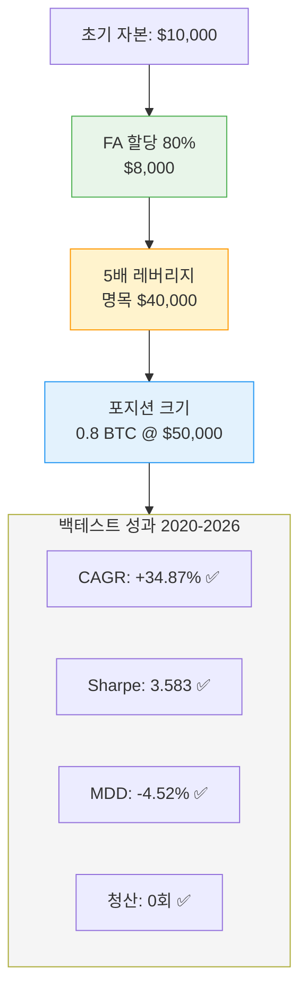
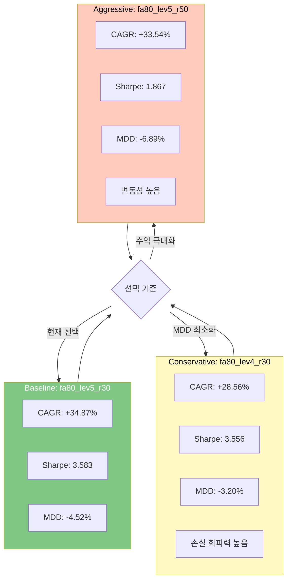
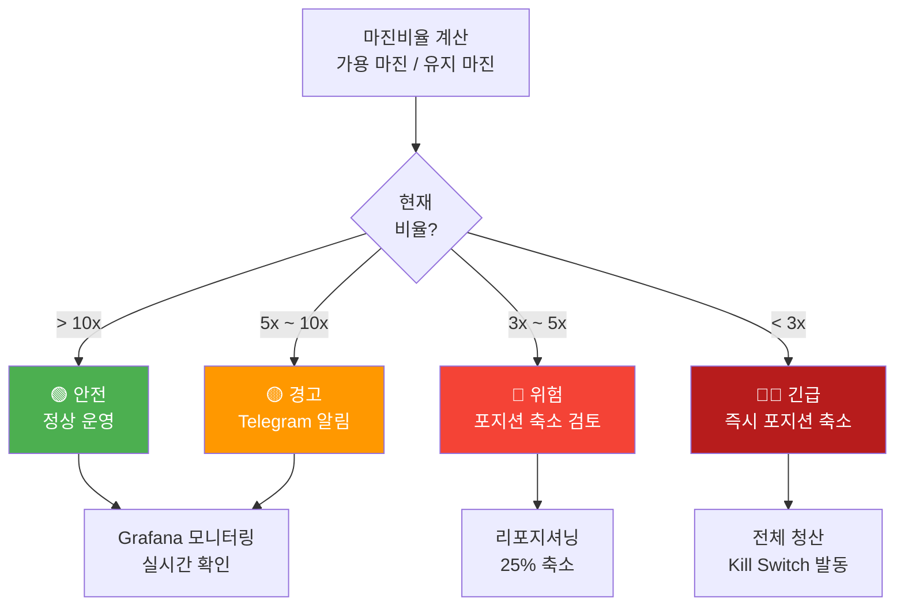

# 레버리지 제한 정책

## 원칙

**절대 5배 레버리지를 초과하지 않는다.**

```
하드 캡: 5x 레버리지 (변경 불가)
목표 설정: fa80_lev5_r30 (FA 80% + Lev 5x + 재투자 30%)
```

---

## 현재 설정: fa80_lev5_r30

### 레버리지 설정 시각화



### 파라미터

| 파라미터 | 값 | 설명 |
|---------|-----|------|
| **FA Capital Ratio** | 0.80 | 포트폴리오의 80%를 Funding Arb에 할당 |
| **Leverage** | 5.0 | 선물 포지션에 5배 레버리지 적용 |
| **Reinvest Ratio** | 0.30 | 펀딩비 수익의 30%를 BTC 현물 매수로 재투자 |

### 백테스트 성과 (6년: 2020-04 ~ 2026-03)

```
CAGR:           +34.87%     ✅ 목표: 30-35%
Sharpe 비율:    3.583       ✅ 우수 (> 2.0)
최대낙폭(MDD):  -4.52%      ✅ 양호 (< 5%)
청산 횟수:      0회         ✅ 마진 안전성 우수
최소마진비율:   36.5x       ✅ 안전 (> 10x 권장)
```

### 포지션 사이징 공식

```python
# 예시: 초기 자본 $10,000
equity = 10_000
fa_ratio = 0.80          # $8,000 FA에 할당
allocated = 8_000

leverage = 5.0
notional = allocated * leverage  # $40,000 명목

btc_price = 50_000
qty = notional / btc_price      # 0.8 BTC
```

---

## 후보 설정 (비교 분석)

### 3가지 설정 비교



### fa80_lev4_r30 (보수적 차선책)

| 지표 | fa80_lev5_r30 | fa80_lev4_r30 | 비고 |
|------|--------|--------|------|
| FA Capital Ratio | 80% | 80% | 동일 |
| Leverage | **5x** | **4x** | 4x 더 낮음 |
| Reinvest Ratio | 30% | 30% | 동일 |
| CAGR | **+34.87%** | **+28.56%** | -6.31% (감소) |
| Sharpe | **3.583** | **3.556** | 거의 동일 |
| MDD | **-4.52%** | **-3.20%** | -1.32% (개선) |
| 마진비율 | **36.5x** | **54.8x** | 더 안전 |

**선택 기준**: 손실 회피 성향 높음, MDD 최소화 원할 때

---

### fa80_lev5_r50 (공격적 설정)

| 지표 | fa80_lev5_r30 | fa80_lev5_r50 | 비고 |
|------|--------|--------|------|
| FA Capital Ratio | 80% | 80% | 동일 |
| Leverage | 5x | 5x | 동일 |
| Reinvest Ratio | **30%** | **50%** | 50% 더 공격적 |
| CAGR | **+34.87%** | **+33.54%** | -1.33% (감소) |
| Sharpe | **3.583** | **1.867** | -1.716 (악화) |
| MDD | **-4.52%** | **-6.89%** | +2.37% (악화) |
| 마진비율 | **36.5x** | **32.1x** | 덜 안전 |

**선택 기준**: 재투자 수익 최대화, 높은 샤프 비율 수락 가능할 때

---

## 마진 안전성 모니터링

### 마진 안전성 위험 레벨



### 최소 안전 기준

```
마진비율 = 가용 마진 / 유지 마진

fa80_lev5_r30 기준:
- 사이킹 최솟값: 36.5x (과거 6년 최악의 상황)
- 권장 모니터링 임계값: > 10x
```

### 경고 레벨

| 마진비율 | 상태 | 조치 |
|---------|------|------|
| > 10x | 🟢 안전 | 정상 운영 |
| 5x ~ 10x | 🟡 경고 | Telegram 경고 |
| 3x ~ 5x | 🔴 위험 | 포지션 축소 검토 |
| < 3x | 🔴🔴 긴급 | **즉시 포지션 축소** |

### Grafana 모니터링

http://localhost:3002 에서 다음을 실시간 확인:

```
[Funding Arb 상태]
- 현재 마진비율: __x
- 마진 위험 게이지
- 과거 7일 최소/평균/최대 마진비율
```

---

## 강화된 안전 검사

### 진입 전 검증

```python
# Funding Arb 진입 전 체크
def validate_entry(current_equity: float, position_size: float) -> bool:
    required_margin = position_size / leverage * maintenance_ratio
    available_margin = current_equity - required_margin
    margin_ratio = available_margin / required_margin
    
    # 다음 조건 모두 충족해야 진입
    checks = {
        "leverage_ok": leverage <= 5.0,           # 5x 초과 금지
        "margin_ok": margin_ratio >= 36.5,        # 최악 시나리오 대비
        "position_size_ok": position_size <= 0.95 * current_equity / btc_price  # 자본의 95% 제한
    }
    
    return all(checks.values())
```

### 리포지셔닝 체크 (매 5분)

```python
def check_reposition_needed(current_margin_ratio: float) -> Action:
    if current_margin_ratio < 3.0:
        # 즉시 25% 디레버리징
        return Action.REDUCE_POSITION_25PCT
    elif current_margin_ratio < 5.0:
        # 로그 경고만 (추후 확인)
        return Action.LOG_WARNING
    else:
        return Action.NO_ACTION
```

---

## 레버리지 변경 절차

### 변경 금지 (Phase 4 테스트넷)

Phase 4 기간 중 레버리지 설정 변경은 **금지**된다.

### 변경 필요 시 (Phase 5 이후)

변경 전 반드시:

1. **새 설정으로 백테스트 (최소 6개월 데이터)**
2. **Sharpe > 2.0, MDD < 5% 확인**
3. **마진비율 분석 (최악 시나리오 대비)**
4. **테스트넷 1주일 검증**
5. **심의 승인**
6. **CLAUDE.md 업데이트**

---

## 리스크 시나리오 분석

### 시나리오 1: BTC 급락 -20%

```
초기 자본: $10,000 (fa80_lev5_r30)
포지션: 0.8 BTC, 진입가 $50,000, 명목 $40,000
마진: $2,000 (0.8 BTC × $50,000 × 20% ÷ 5)

급락 후: BTC $40,000 (-20%)
청산가: 0.8 BTC × $40,000 = $32,000
손실: $40,000 - $32,000 = $8,000 (명목 -20%)

유지마진: $32,000 × 0.01 = $320
가용마진: $2,000 - $320 = $1,680 ✅ 안전

마진비율 = $1,680 / $320 = 5.25x (여전히 안전)
```

### 시나리오 2: BTC 급락 -30% (극단)

```
급락 후: BTC $35,000 (-30%)
청산가: 0.8 BTC × $35,000 = $28,000
손실: $40,000 - $28,000 = $12,000

유지마진: $28,000 × 0.01 = $280
가용마진: $2,000 - $280 = $1,720

마진비율 = $1,720 / $280 = 6.14x ✅ 여전히 안전
```

### 시나리오 3: BTC 급락 -40% (거의 불가능)

```
급락 후: BTC $30,000 (-40%)
청산가: 0.8 BTC × $30,000 = $24,000
손실: $40,000 - $24,000 = $16,000

유지마진: $24,000 × 0.01 = $240
가용마진: $2,000 - $240 = $1,760

마진비율 = $1,760 / $240 = 7.33x ✅ 안전
```

**결론**: 5배 레버리지는 매우 안전함. 6년 백테스트 최악 시나리오(MDD -4.52%)에서 최소 36.5x 마진비율 유지.

---

## 5배 레버리지 선택 근거

### 왜 5배인가?

1. **수익 극대화**: 
   - 펀딩비 수익이 5배 증폭
   - 연 30-35% CAGR 달성 가능

2. **마진 안전성**: 
   - 20%대 하락에도 안전
   - 최소마진비율 36.5x (매우 안전)

3. **현실적 한계**:
   - 5배 초과 시 위험 급증
   - 10배+ 레버리지는 강제청산 위험 높음

4. **펀딩비 자산 특성**:
   - 방향성 손실 없음 (델타 중립)
   - 극단 변동에만 노출
   - 극단 변동 확률 < 1% (역사적)

---

## 관련 문서

- [btc-only.md](btc-only.md) — BTC 단일 운영 정책
- [kill-switch.md](kill-switch.md) — Kill Switch (마진 안전성 마지막 방어)
- [operations/monitoring.md](operations/monitoring.md) — 마진 모니터링 상세
- [strategies/funding-arb.md](strategies/funding-arb.md) — Funding Arb 전략 (레버리지 적용)
