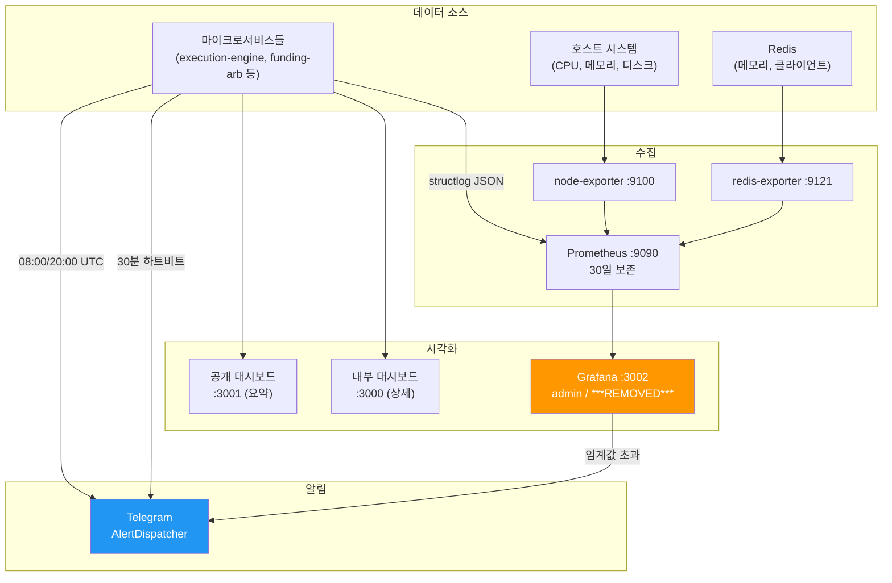
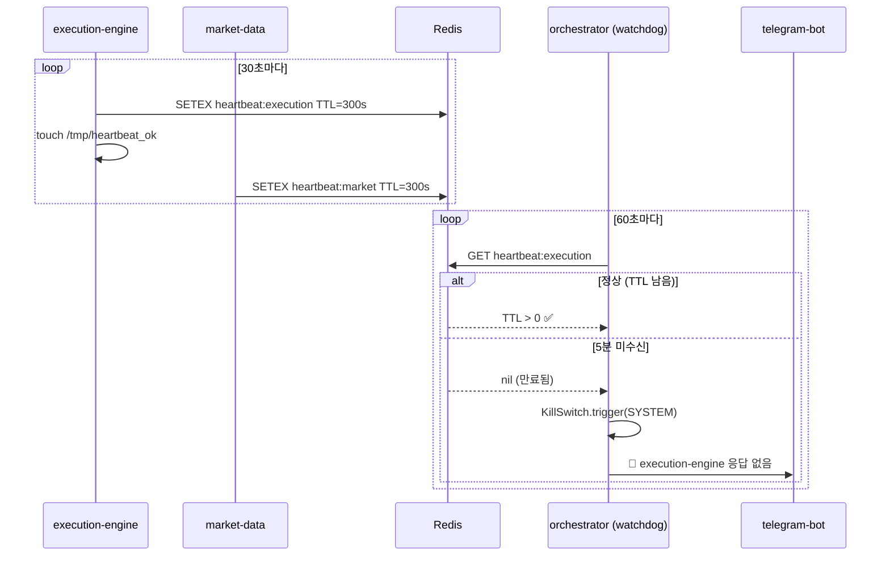

# 모니터링 및 알림 설정

세 가지 계층으로 구성된 통합 모니터링 시스템:
1. **Grafana**: 시계열 시각화 대시보드 (포트 3002)
2. **Telegram**: AlertDispatcher 기반 실시간 알림 + 상호작용
3. **Prometheus**: 인프라 메트릭 수집 (30일 보존)



---

## Grafana 대시보드

### 접속

```
URL: http://localhost:3002
사용자: admin
비밀번호: ***REMOVED***
```

### 주요 패널

#### 1. Portfolio P&L (누적 손익)

- **표시**: 시간별 누적 손익 그래프
- **목표**: +34.87% (연환산 기준 fa80_lev5_r30)
- **경고**: 음수 추세 → Kill Switch 감지

#### 2. Daily Drawdown % (일일 낙폭)

- **표시**: 일일 손실률 (%)
- **정상 범위**: -2% ~ +5%
- **경고 임계값**: -5% (Level 2 Kill Switch)
- **기준선**: 0% (손익분기점)

#### 3. Strategy Status (전략 상태)

- **funding-arb**: ON/OFF
- **adaptive-dca**: ON/OFF
- **Color**: 
  - 🟢 Green = 운영 중
  - 🔴 Red = 정지됨 (Kill Switch)

#### 4. Kill Switch Events (발동 이력)

- **표시**: Kill Switch 발동 타임라인
- **정보**: 발동 시간, 레벨, 사유
- **목표**: 7일 동안 0회

#### 5. Margin Ratio (마진 안전성)

- **표시**: 
  - Min 마진비율 (최저값)
  - Avg 마진비율
  - Current 마진비율
- **정상**: > 10x
- **경고**: 5x ~ 10x
- **위험**: < 5x
- **기준선**: 36.5x (fa80_lev5_r30 6년 최악 시나리오)

#### 6. API Response Time (거래소 API 레이턴시)

- **표시**: ms 단위 응답 시간
- **정상**: < 200ms
- **경고**: > 1000ms
- **위험**: API 타임아웃 (30초)

#### 7. Open Orders (미체결 주문)

- **표시**: 현재 미체결 주문 수
- **정상**: < 10개
- **경고**: > 30개

#### 8. Funding Rate History (펀딩레이트 추이)

- **표시**: 과거 펀딩레이트 (%)
- **진입 기준**: > 0.0001 (0.01% per 8h)
- **청산 기준**: < 0 (음수 반전)

### 대시보드 커스터마이징

자주 보는 패널을 상단에 배치:

1. **Best Practices**:
   - Portfolio P&L (맨 위)
   - Daily Drawdown % (2번째)
   - Margin Ratio (3번째)
   - Kill Switch Events (4번째)

2. **새 패널 추가**:
   - Grafana UI → [+] → New Panel
   - PromQL 쿼리 입력
   - 저장

---

## Telegram 알림 (AlertDispatcher)

**AlertDispatcher**: 배치, 레이트 리밋, 중복 제거 기능이 있는 고급 알림 시스템.

**특징**:
- 배치 처리: 동시 다중 알림을 하나로 묶기
- 레이트 리밋: 과도한 알림 방지 (분당 최대 10건)
- 중복 제거: 같은 알림 2회 이상 발송 금지
- TTL 임계값: 오래된 알림은 자동 삭제

**하트비트**: 30분 간격 정상 작동 신호 발송 (너무 많지 않게 조정)



**정기 리포트**:
- **08:00 UTC** (= 17:00 KST): 일일 리포트 (어제의 P&L, 펀딩비)
- **20:00 UTC** (= 05:00 KST 다음날): 야간 리포트 (밤새 변동사항)

### 알림 유형

#### 1. Kill Switch 알림 (자동)

```
🚨 [Kill Switch L2] 포트폴리오 일일 손실 -5.2% 달성
쿨다운: 60분 후 자동 재개
수동 조작: /resume (즉시 재개) | /kill (전체 정지)
```

**응답 필요**: `/acknowledge` 또는 `/ack`

#### 2. 마진 경고 (자동)

```
⚠️ [마진 경고] Margin Ratio: 8.5x (< 10x)
포지션: 0.15 BTC @ $65,000
조치: 모니터링 권장
```

**응답 필요**: 없음 (정보성)

#### 3. 포트폴리오 스냅샷 (정기)

```
📊 [12:00 KST] 포트폴리오 상태
Equity: $10,250 (+2.5%)
Daily P&L: +$250
Strategies:
  - Funding Arb: $80 PnL
  - Adaptive DCA: 포지션 없음
```

**주기**: 매 4시간

#### 4. 거래 진입/청산 (자동)

```
📈 [Funding Arb 진입]
BTC: 0.15 @ $65,000
Basis: +0.25%
목표 수익: +$50-100

---

📊 [Funding Arb 청산]
보유기간: 24시간
P&L: +$75 (0.75%)
펀딩비: +$50 | 기저: +$25
```

#### 5. API 장애 알림 (자동)

```
🔴 [API 오류] Bybit 연결 실패 (Retry 1/3)
상태: 재연결 중...
포지션: 안전함
```

#### 6. 시스템 오류 (긴급)

```
🚨🚨 [긴급] 거래소 API 연결 실패 (3회 초과)
자동 복구 불가능
필요한 조치: /kill (포지션 청산) 또는 SSH 접속
```

### 자주 쓰는 명령어

| 명령 | 설명 |
|------|------|
| `/status` | 현재 포트폴리오 상태 |
| `/positions` | 열린 포지션 목록 |
| `/balance` | 현재 잔고 |
| `/regime` | 현재 시장 레짐 |
| `/funding` | 현재 펀딩레이트 |
| `/kill` | Kill Switch 수동 발동 (모든 포지션 청산) |
| `/acknowledge` or `/ack` | Kill Switch 알림 확인 |
| `/resume` | Kill Switch 해제 (전략 재개) |
| `/stats` | 월간 통계 |

---

## Prometheus 메트릭 수집

### 데이터소스

| 소스 | 수집 항목 | 업데이트 | 보존 |
|------|---------|---------|------|
| **node_exporter** | CPU, 메모리, 디스크, 네트워크 | 15초마다 | 30일 |
| **redis_exporter** | Redis 메모리, 키 수, 명령 수 | 15초마다 | 30일 |
| **애플리케이션** | 주문 건수, 에러율, API 레이턴시 | 60초마다 | 30일 |

### 핵심 메트릭

| 메트릭 | 의미 | 경고 임계값 |
|--------|------|------------|
| `node_cpu_usage_percent` | 호스트 CPU 사용률 | > 80% |
| `node_memory_usage_percent` | 호스트 메모리 사용률 | > 85% |
| `node_disk_free_gb` | 여유 디스크 공간 | < 5 GB |
| `redis_memory_used_bytes` | Redis 메모리 사용량 | > 500 MB |
| `redis_connected_clients` | Redis 연결 클라이언트 | > 50 |
| `bybit_api_latency_ms` | Bybit API 응답 시간 | > 1000 ms |

### PromQL 쿼리 예시

```promql
# CPU 사용률 (1시간 평균)
avg(rate(node_cpu_seconds_total[5m])) by (instance) * 100

# Redis 메모리 (MB)
redis_memory_used_bytes / 1024 / 1024

# 미체결 주문 수
rate(orders_pending_total[5m])
```

---

## 핵심 모니터링 지표

### 일일 체크 지표

| 지표 | 정상 범위 | 경고 임계값 | 확인 방법 |
|------|-----------|------------|---------|
| Portfolio Equity | > 초기값 | < 95% 초기값 | `/status` |
| Daily P&L | -2% ~ +5% | < -3% | Grafana |
| Margin Ratio | > 10x | 5x ~ 10x | Grafana |
| API Latency | < 200ms | > 1000ms | Grafana |
| Kill Switch Events | 0회 | 1회 이상 | Grafana |
| Open Positions | ≤ 5개 | > 5개 | `/positions` |

### 주간 체크 지표

| 지표 | 정상 범위 | 확인 방법 |
|------|-----------|---------|
| Weekly P&L | +1% ~ +3% | Grafana |
| Sharpe (7일) | > 1.0 | Grafana |
| Trade Count | ≥ 3회 | Telegram 통계 |
| API Success Rate | > 99% | Grafana |

### 월간 체크 지표

| 지표 | 정상 범위 | 확인 방법 |
|------|-----------|---------|
| Monthly CAGR | +2.9% (annualized +34.87%) | Grafana |
| Sharpe (30일) | > 2.0 | 계산 필요 |
| Max Drawdown | < -5% | Grafana |
| Win Rate | > 60% | Telegram 통계 |

---

## 모니터링 자동화

### Cron 작업 (선택사항)

```bash
# 매일 09:00 KST에 일일 리포트 생성
0 9 * * * cd ~/Data/Bit-Mania/cryptoengine && \
  docker compose exec postgres psql -U cryptoengine -d cryptoengine \
  -c "SELECT DATE(created_at), SUM(pnl), COUNT(*) FROM trades GROUP BY DATE(created_at) ORDER BY DATE DESC LIMIT 7;" \
  >> /var/log/cryptoengine_daily.log
```

### 알림 커스터마이징

Telegram 봇 설정 파일에서:

```yaml
# services/telegram-bot/config.yaml
alerts:
  margin_ratio:
    warning_threshold: 10.0
    critical_threshold: 5.0
    enabled: true
  
  kill_switch:
    enabled: true
    require_ack: true
  
  trading:
    notify_entry: true
    notify_exit: true
    notify_pnl_snapshot: true
```

---

## 문제 상황별 모니터링

### 포지션이 없는데 수익이 없음

```bash
# 1. 펀딩레이트 확인
docker compose exec redis redis-cli GET market:funding:BTCUSDT | jq .

# 2. 진입 조건 확인
docker compose logs funding-arb --tail=100 | grep -E "entry|condition|funding"

# 3. 오케스트레이터 상태 확인
docker compose logs strategy-orchestrator --tail=50 | grep -E "funding|weight"
```

### 수익이 음수

```bash
# 1. 최근 거래 확인
docker compose exec postgres psql -U cryptoengine -d cryptoengine -c \
  "SELECT id, symbol, pnl, created_at FROM trades ORDER BY created_at DESC LIMIT 10;"

# 2. Kill Switch 이벤트 확인
docker compose exec postgres psql -U cryptoengine -d cryptoengine -c \
  "SELECT * FROM kill_switch_events ORDER BY triggered_at DESC LIMIT 5;"

# 3. 마진비율 추이 확인
# Grafana: Margin Ratio 그래프
```

### API 레이턴시 높음

```bash
# 1. 거래소 상태 확인
curl -I https://api.bybit.com/v5/market/time

# 2. 네트워크 확인
ping api.bybit.com
traceroute api.bybit.com

# 3. 로컬 네트워크 부하 확인
docker stats --no-stream
```

---

## 모니터링 체크리스트 (일일)

```markdown
매일 아침 확인:
- [ ] `/status` 실행 (Equity 확인)
- [ ] Grafana Portfolio P&L (음수 추세 있나?)
- [ ] Grafana Kill Switch Events (발동 있었나?)
- [ ] Grafana Margin Ratio (> 10x?)
- [ ] Telegram 알림 수신 (밤새 장애 없었나?)

필요 시 조치:
- [ ] Kill Switch 발동 → 원인 분석
- [ ] Margin < 10x → 포지션 축소 검토
- [ ] API 장애 → 거래소 상태 확인
```

---

## 긴급 상황 대응

### Margin Ratio < 5x (긴급)

```bash
# 1. 즉시 포지션 확인
docker compose exec postgres psql -U cryptoengine -d cryptoengine -c \
  "SELECT * FROM positions WHERE status='open';"

# 2. 수동 포지션 축소 또는 청산
# Bybit 웹 → [선물] → [포지션] → [조정]

# 3. 모니터링 강화
watch -n 30 'docker compose logs --tail=10 funding-arb'
```

### Kill Switch 연속 발동

```bash
# 1. 원인 분석
docker compose logs --since=2h funding-arb execution-engine | grep -E "ERROR|kill|switch"

# 2. 시스템 상태 확인
docker compose ps
docker compose exec postgres pg_isready
docker compose exec redis redis-cli ping

# 3. 시스템 재시작
docker compose restart strategy-orchestrator funding-arb
```

---

## 관련 문서

- [runbook.md](runbook.md) — 운영 매뉴얼 (일상 운영)
- [../kill-switch.md](../kill-switch.md) — Kill Switch 정책
- [mainnet-switch.md](mainnet-switch.md) — 메인넷 모니터링 (Phase 5)
