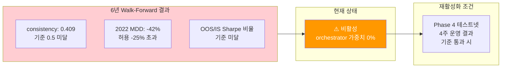
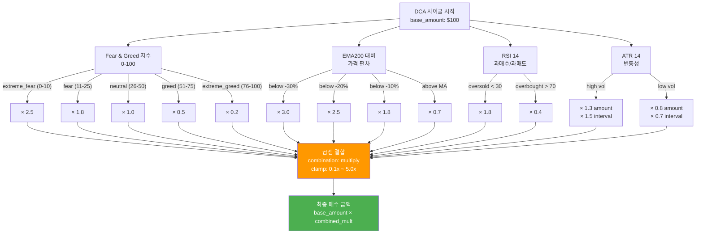
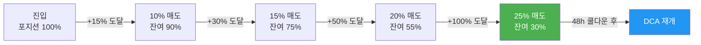

# Adaptive DCA (적응형 적립식) 전략 사양

## 전략 개요

**보조 전략** (현재 비활성화 중 — 다음 참조: "현재 비활성화 사유")

시장 심리와 기술적 지표에 따라 매수 금액과 간격을 동적으로 조절하는 DCA(Dollar-Cost Averaging) 전략입니다.

### 설계 목표

- **목적**: 장기 BTC 축적 및 평균 매입 단가 최적화
- **특징**: 공포 구간에서 공격적 매수, 탐욕 구간에서 보수적 매수
- **대상**: BTC (현물 Spot, 롱 포지션만)
- **레버리지**: 1배 (레버리지 없음)
- **자본 특성**: Funding Arb의 보조 전략 (핵심은 FA)

---

## 현재 비활성화 사유

**상태**: 비활성화 (orchestrator.yaml weights에서 adaptive_dca: 0.0)

DCA 전략은 6년(2020-2026) Walk-Forward 백테스트에서 다음 결과를 기록했습니다:

| 지표 | 값 | 평가 |
|------|-----|------|
| **Consistency (OOS)** | 0.409 | ❌ 기준 미달 (목표 > 0.5) |
| **2022년 MDD** | -42% | ❌ 심각한 약세 노출 |
| **2023-2026 수익** | 양호 | ⚠️ 최근 회복했으나 신뢰도 부족 |

**결론**: Walk-Forward consistency가 0.409로 낮아, In-Sample 수익이 Out-of-Sample에서 재현되지 않음. 현재는 리스크로 판단.

**다음 결정**: Phase 4 이후 4주 테스트넷 운영 결과에 따라 재활성화 여부 결정.



---

## 기본 파라미터 (설정 참조용)

현재는 비활성이지만, 구조 이해를 위해 설정을 기록합니다 (adaptive-dca.yaml):

```yaml
base:
  base_amount_usd: 100                      # 기본 매수 금액: $100 per cycle
  base_interval_hours: 24                   # 기본 간격: 24시간 (1일 1회)
  pairs: [BTCUSDT]                          # BTC 단일 (BTCOnly 정책)
  position_side: long_only                  # 매수만 (숏 금지)
  instrument_type: futures                  # 선물 (현물도 지원)
  leverage: 1                                # 레버리지 없음 (안전)
```

### 포트폴리오 내 역할 (비활성 중)

```
포트폴리오 구성 (현재):
├─ Funding Arb (핵심, 80%): 방향성 없는 펀딩비 수익, 5배 레버리지
├─ Adaptive DCA (비활성, 0%): 방향성 롱 수익, 1배
└─ 현금 보유 (20% 또는 레짐별): 리스크 버퍼 + 기회 자본

자본 배분: Strategy Orchestrator가 시장 레짐에 따라 조정
참조: orchestrator.yaml weights section (DCA = 0.0)
```

---

## 적응형 멀티플라이어 (4가지 지표)

설계상 매수 금액을 동적으로 조절하는 독립적 4가지 지표. 모두 곱셈 조합 (combination_method: multiply):

### 1. Fear & Greed Index (fear_greed)

```yaml
fear_greed:
  enabled: true
  extreme_fear_multiplier: 2.5      # FGI 0-10: 2.5배 매수
  fear_multiplier: 1.8              # FGI 11-25: 1.8배 매수
  neutral_multiplier: 1.0           # FGI 26-50: 기본값
  greed_multiplier: 0.5             # FGI 51-75: 0.5배 축소
  extreme_greed_multiplier: 0.2     # FGI 76-100: 0.2배 축소
```

**개념**: 시장 심리가 극단적 공포에 가까울수록 적극 매수, 탐욕에 가까울수록 보수적.

### 2. Price Deviation from EMA200 (price_deviation)

```yaml
price_deviation:
  enabled: true
  ma_period: 200
  ma_type: ema
  deviation_tiers:
    - below_pct: 5
      multiplier: 1.3
    - below_pct: 10
      multiplier: 1.8
    - below_pct: 20
      multiplier: 2.5
    - below_pct: 30
      multiplier: 3.0
  above_ma_multiplier: 0.7          # EMA 이상: 0.7배 축소
  far_above_ma_pct: 20
  far_above_ma_multiplier: 0.3      # EMA +20% 이상: 0.3배
```

**개념**: 가격이 장기 이동평균보다 저평가되면 적극 매수, 고평가되면 보수적.

### 3. RSI(14) (rsi)

```yaml
rsi:
  enabled: true
  period: 14
  oversold_threshold: 30
  oversold_multiplier: 1.8          # RSI < 30 과매도: 1.8배
  overbought_threshold: 70
  overbought_multiplier: 0.4        # RSI > 70 과매수: 0.4배
```

**개념**: 과매도(RSI < 30)는 저가 매수 기회, 과매수(RSI > 70)는 회피.

### 4. Volatility based on ATR(14) (volatility)

```yaml
volatility:
  enabled: true
  atr_period: 14
  high_vol_interval_multiplier: 1.5     # 높은 변동성 → 덜 자주
  low_vol_interval_multiplier: 0.7      # 낮은 변동성 → 더 자주
  high_vol_amount_multiplier: 1.3       # 높은 변동성 → 더 많이
  low_vol_amount_multiplier: 0.8        # 낮은 변동성 → 더 적게
```

**개념**: 변동성이 높으면 매수 간격을 길게 (리스크 분산), 금액은 크게 (저점 매수). 낮으면 반대.



### 멀티플라이어 결합 및 클램핑

```yaml
  combination_method: multiply              # 모두 곱함
  min_combined_multiplier: 0.1              # 최소: 0.1배
  max_combined_multiplier: 5.0              # 최대: 5.0배

# 계산식
final_multiplier = fgi_mult × ema_mult × rsi_mult × atr_mult
clamped = max(0.1, min(5.0, final_multiplier))
buy_amount = $100 × clamped
```

### 멀티플라이어 조합 예시

```
시나리오: BTC 급락 + 높은 공포 시점

Fear & Greed: 18 (공포) → 1.8배
EMA200 대비: -15% (중간 하락) → 1.8배
RSI: 28 (과매도) → 1.8배
ATR: 높은 변동성 → 1.3배 (금액), 1.5배 (간격)

최종 멀티플라이어 = 1.8 × 1.8 × 1.8 × 1.3 = 7.59
클램핑 적용 = min(5.0, 7.59) = 5.0배

최종 매수 금액 = $100 × 5.0 = $500
최종 매수 간격 = 24시간 × 1.5 = 36시간

결과: 극단 공포 시 최대한 공격적 매수 (클램핑으로 제어)
```

---

## 이익 실현 래더 (take_profit)

누적 포지션이 일정 수익률에 도달하면 부분 매도해 이익을 실현:

```yaml
take_profit:
  enabled: true
  tiers:
    - profit_pct: 15
      sell_pct: 10        # +15% 달성 시 10% 매도
    - profit_pct: 30
      sell_pct: 15        # +30% 달성 시 15% 추가 매도
    - profit_pct: 50
      sell_pct: 20        # +50% 달성 시 20% 추가 매도
    - profit_pct: 100
      sell_pct: 25        # +100% 달성 시 25% 추가 매도
  resume_dca_after_tp: true
  resume_cooldown_hours: 48  # 이익 실현 후 48시간 쿨다운
```



### 동작 순서

```
1. 누적 포지션의 수익률 계산:
   profit_pct = (current_value - total_cost) / total_cost × 100

2. 래더 임계값 확인:
   ├─ +15% 도달 → 전체의 10% 매도
   ├─ +30% 도달 → 전체의 15% 추가 매도
   ├─ +50% 도달 → 전체의 20% 추가 매도
   └─ +100% 도달 → 전체의 25% 추가 매도

3. 매도 후:
   - 이익 실현 기록 (DB)
   - 48시간 DCA 일시 중지 (수익 재투자 방지)
   - 48시간 후 자동 재개 (resume_dca_after_tp=true)
```

---

## 분할 진입 (Graduated Entry)

Test C 백테스트 결과: baseline 대비 **+34.3%p 수익률 개선**

```yaml
graduated_entry:
  enabled: true
  initial_size_ratio: 0.5           # 첫 진입: 계산된 금액의 50%
  add_on_dip_pct: 5.0               # 1차 진입가 대비 5% 하락 시
  followup_size_ratio: 0.5          # 2차 진입: 잔여 50%
  max_entries_per_cycle: 2          # 한 사이클에 최대 2회 진입
  add_on_window_hours: 24           # 2차 진입 기회: 24시간 내
```

### 분할 진입 로직

```
진입 신호 발생 (ex. Fear & Greed 극도 공포)

1차 진입:
  진입가: $30,000
  수량: $500 × 0.5 = $250어치 BTC

24시간 윈도우 모니터:
  ├─ BTC → $28,500 (-5%) 시 → 2차 진입 실행
  │   수량: 잔여 $500 × 0.5 = $250어치
  │   평균단가: ($250 + $250) / 전체수량 = 저점 매수
  │
  └─ 24시간 초과 하락 없음 → 1차 진입만으로 종료

결과:
  - 저점 매수 기회 2회 (1차 + 2차)
  - 분산된 리스크 (한 번에 모두 매수하지 않음)
  - Test C: +34.3%p 개선 → 채택
```

---

## 리스크 관리 및 안전장치 (risk)

DCA 포지션이 과도해지는 것을 방지:

```yaml
risk:
  max_total_deployed_usd: 50_000            # 누적 투입금 상한: $50K
  max_portfolio_allocation_pct: 40.0        # 포트폴리오 비중 최대: 40%
  
  pause_on_drawdown_pct: 25.0               # 손실 -25% 시 매수 중지
  resume_on_recovery_pct: 15.0              # 손실 -15% 회복 시 재개
  
  max_single_purchase_usd: 1_000            # 건당 최대: $1,000
  min_single_purchase_usd: 10               # 건당 최소: $10 (먼지 거래 방지)
  
  daily_cap_usd: 500                        # 일일 한도: $500
  weekly_cap_usd: 2_000                     # 주간 한도: $2,000
  
  circuit_breaker_failures: 3               # 연속 실패 3회 시 알림
  circuit_breaker_cooldown_minutes: 120     # Circuit Breaker: 2시간
```

### 한도 적용 순서

```
매수 신호 발생
    ↓
멀티플라이어 계산 → $500 산출
    ↓
건당 최대 제한 → min($1,000, $500) = $500
    ↓
일일 한도 확인 → 오늘 이미 $300 사용했으면?
    → 남은 한도 $200 < $500 → $200만 매수
    ↓
주간 한도 확인 → 이번주 이미 $1,500 사용했으면?
    → 남은 한도 $500 < 산출값 → $500만 매수
    ↓
총액 한도 확인 → 이미 $45,000 투입했으면?
    → 남은 한도 $5,000 → 산출값만큼 매수
    ↓
최종 매수 실행
```

### Drawdown Pause/Resume 로직

```python
# 포트폴리오 수익률 계산
portfolio_pnl_pct = (current_value - initial_capital) / initial_capital × 100

# Case 1: 큰 손실 발생 → 매수 중지
if portfolio_pnl_pct <= -25.0:
    pause_dca()  # 기존 포지션은 유지, 신규 매수만 중지

# Case 2: 손실 회복됨 → 매수 재개
if is_paused and portfolio_pnl_pct >= -15.0:
    resume_dca()  # 신규 매수 재개
```

---

## 설정 파일 전체 구조 (adaptive-dca.yaml)

현재 비활성 상태이므로 참조용만:

```yaml
strategy:
  name: adaptive_dca
  version: "1.0"
  enabled: true                           # 논리상 true지만 orchestrator에서 weight=0
  
base:
  base_amount_usd: 100                    # $100 기본값
  base_interval_hours: 24
  pairs: [BTCUSDT]
  position_side: long_only
  instrument_type: futures
  leverage: 1

adaptive:
  fear_greed:
    enabled: true
    extreme_fear_multiplier: 2.5
    fear_multiplier: 1.8
    neutral_multiplier: 1.0
    greed_multiplier: 0.5
    extreme_greed_multiplier: 0.2
  
  price_deviation:
    enabled: true
    ma_period: 200
    ma_type: ema
    deviation_tiers: [...]
    above_ma_multiplier: 0.7
    far_above_ma_pct: 20
    far_above_ma_multiplier: 0.3
  
  rsi:
    enabled: true
    period: 14
    oversold_threshold: 30
    oversold_multiplier: 1.8
    overbought_threshold: 70
    overbought_multiplier: 0.4
  
  volatility:
    enabled: true
    atr_period: 14
    high_vol_interval_multiplier: 1.5
    low_vol_interval_multiplier: 0.7
    high_vol_amount_multiplier: 1.3
    low_vol_amount_multiplier: 0.8
  
  combination_method: multiply
  min_combined_multiplier: 0.1
  max_combined_multiplier: 5.0

take_profit:
  enabled: true
  tiers:
    - profit_pct: 15
      sell_pct: 10
    - profit_pct: 30
      sell_pct: 15
    - profit_pct: 50
      sell_pct: 20
    - profit_pct: 100
      sell_pct: 25
  resume_dca_after_tp: true
  resume_cooldown_hours: 48

graduated_entry:
  enabled: true
  initial_size_ratio: 0.5
  add_on_dip_pct: 5.0
  followup_size_ratio: 0.5
  max_entries_per_cycle: 2
  add_on_window_hours: 24

risk:
  max_total_deployed_usd: 50_000
  max_portfolio_allocation_pct: 40.0
  pause_on_drawdown_pct: 25.0
  resume_on_recovery_pct: 15.0
  max_single_purchase_usd: 1_000
  min_single_purchase_usd: 10
  daily_cap_usd: 500
  weekly_cap_usd: 2_000
  circuit_breaker_failures: 3
  circuit_breaker_cooldown_minutes: 120
```

---

## 관련 정책 및 문서

- [../btc-only.md](../btc-only.md) — BTC 단일 운영 정책
- [../kill-switch.md](../kill-switch.md) — Kill Switch 정책 (DCA 청산 트리거)
- [funding-arb.md](funding-arb.md) — 핵심 전략 (Funding Arb, 현재 활성)
- [../operations/runbook.md](../operations/runbook.md) — 일상 운영 및 모니터링
