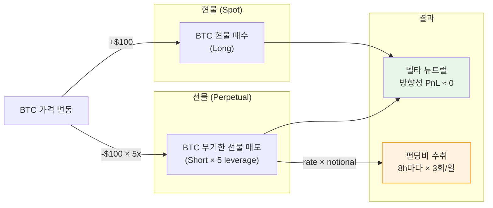
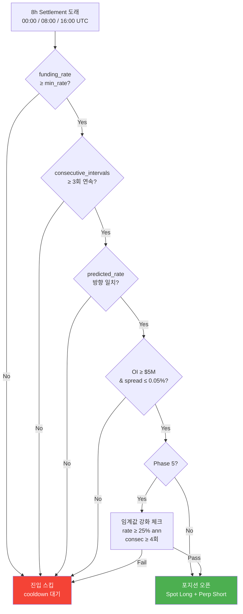
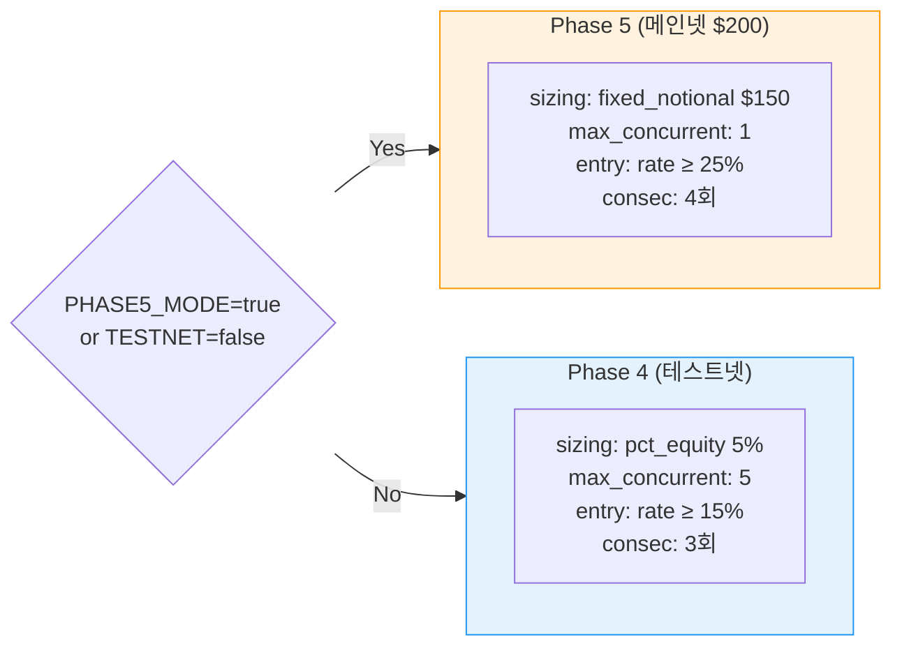
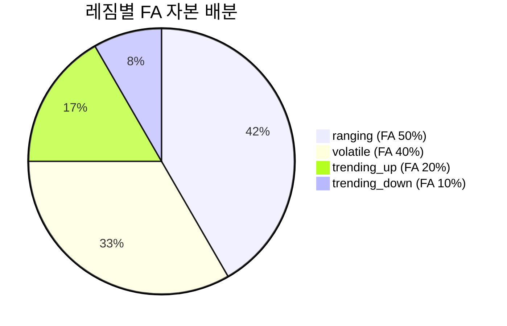

# Funding Arb (펀딩비 차익거래) 전략 사양

## 전략 개요

**CryptoEngine의 핵심 전략**으로, 무기한 선물(Perpetual Futures)의 펀딩레이트를 수취하기 위해 **델타 중립(Delta-Neutral) 포지션**을 유지하는 전략입니다.

### 기본 구조

```
현물 BTC 매수 (Spot Long)         [장기 자산 보유]
        +
무기한 선물 BTC 매도 (Perp Short) [펀딩비 수취]
        =
델타 뉴트럴 포지션               [방향성 리스크 제거]
```



### 수익 메커니즘

- **정산 주기**: Bybit 기준 8시간 (00:00, 08:00, 16:00 UTC) — 하루 3회
- **수익원**: 현물-선물 간 기저(Basis)에 포함된 펀딩비
- **수익 특성**: 모멘텀이나 방향성과 무관한 "캐리(Carry)" 수익
- **레버리지**: 5x (선물 명목가 증폭, 현물 자본 효율성)
- **현물 재투자**: 펀딩비의 30%를 BTC 현물 누적 (reinvest_ratio: 0.30)

---

## 수익 구조

```
수익 = 펀딩비 수입 × leverage - 거래 수수료 - 슬리피지
     + 재투자 BTC 현물 평가이익 (reinvest_ratio = 30%)
```

### 펀딩레이트 (Funding Rate)

**정의**: 현물과 선물의 가격 괴리를 해소하기 위해 주기적으로 정산되는 수수료

- **정산 주기**: 8시간마다 (00:00, 08:00, 16:00 UTC)
- **수취자**: 숏 포지션 보유자 (우리가 받음)
- **지급자**: 롱 포지션 보유자 (거래소 고객이 냄)
- **전형적 범위**: +0.0001% ~ +0.015% per 8h (연환산 3% ~ 55%)

### 목표 수익률

```
이론적 최대:  펀딩 0.015% × 5x 레버리지 × 365일 ÷ 8시간 블록
            = 0.015% × 5 × (365×3) = ~82%

현실 목표:   30-35% (실제 펀딩비 변동, 수수료 0.11%, 슬리피지 0.06% 반영)
선택 설정:   fa80_lev5_r30 → CAGR +34.87%
```

---

## 백테스트 성과

### 현재 설정: **fa80_lev5_r30** (채택 설정)

**Backtest Period**: 2020-04-01 ~ 2026-03-31 (정확히 6년)  
**Data Quality**: Test 12 Stage D2

| 지표 | 값 | 평가 |
|------|-----|------|
| **CAGR** | +34.87% | ✅ 목표 30-35% 달성 |
| **Sharpe Ratio** | 3.583 | ✅ 우수 (2.0 이상) |
| **Maximum Drawdown** | -4.52% | ✅ 양호 (5% 이내) |
| **Liquidations** | 0회 | ✅ 마진 안전성 최우수 |
| **Minimum Margin Buffer** | 36.5x | ✅ 안전 (10x 권장 대비 3.6배 여유) |

**주의**: 2020-04 ~ 2023-03 구간 펀딩비 데이터 갭 (합성 폴백 0.0001 고정), 2023-04 ~ 2026-03은 실제 Bybit 데이터

### 후보 설정 비교표

| 설정 | FA Ratio | Leverage | Reinvest | CAGR | Sharpe | MDD | 마진비율 | 선택 |
|------|----------|----------|----------|------|--------|-----|---------|------|
| **fa80_lev5_r30** | 80% | 5x | 30% | **+34.87%** | **3.583** | **-4.52%** | **36.5x** | ✅ 현재 |
| fa80_lev4_r30 | 80% | 4x | 30% | +28.56% | 3.556 | -3.64% | 54.8x | 보수적 차선책 |
| fa80_lev5_r50 | 80% | 5x | 50% | +33.54% | 1.867 | -7.13% | 32.1x | Sharpe 주의 |

---



## 진입 조건 (entry)

전략이 새로운 포지션을 열기 위한 필수 조건들 (funding-arb.yaml 기준):

### 펀딩레이트 임계값

```yaml
entry:
  min_funding_rate_annualized: 15.0        # 연환산 15% 이상
  # 환산식: 8h 펀딩 0.00041% (0.015% ÷ 3) = 연환산 15%
  consecutive_intervals: 3                  # 3회 연속 양수 조건
  # 목적: 일시적 펀딩 급등 필터링, 안정성 추구
  funding_interval_hours: 8
  require_predicted_alignment: true         # 다음 펀딩도 같은 방향 확인
```

### 시장 조건

```yaml
entry:
  min_open_interest_usd: 5_000_000          # $5M 이상 유동성 필요
  max_entry_spread_pct: 0.05                # Spread < 0.05% (50 bps)
  # 현물-선물 가격 괴리 제한 (높은 spread = 청산 난제)
```

### 거래 쌍

```yaml
  pairs:
    - BTCUSDT  # BTC 단일 운영 (multi-symbol 거래 금지)
```

### 진입 프로세스 플로우

```
1. market-data 서비스: 8시간 간격으로 펀딩레이트 발행 (Redis)
   ↓
2. funding-arb 수신: 위 5개 조건 모두 만족 확인
   ↓
3. 포지션 크기 계산: pct_equity 기반 (5% per position)
   ↓
4. 동시 주문 발행 (Redis order:request):
   - 현물: BTCUSDT 매수 (Limit order, 30초 타임아웃)
   - 선물: BTCUSDT 매도 (Limit order, 30초 타임아웃)
   ↓
5. 한쪽 체결 복구:
   - 한쪽만 체결 시 → 1분 대기
   - 타임아웃 후 미체결 주문 취소 + 체결된 레그 시장가 청산
   ↓
6. 상태: IDLE → OPEN
```

---

## 포지션 사이징 (position)

현재 전략 자본 배분 방식:

```yaml
position:
  sizing_mode: pct_equity                   # 전략: 자본의 %로 계산
  pct_equity: 5.0                           # 각 포지션 = 배분된 자본의 5%
  max_position_usd: 10_000                  # 절대 최대값 ($10K)
  min_position_usd: 100                     # 절대 최소값 ($100)
  max_leverage: 5                           # 하드 리밋: 5배 초과 금지
  max_concurrent_positions: 5               # 동시 포지션 최대 5개
  hedge_ratio: 1.0                          # 현물:선물 = 1:1 (완전 헷지)
  hedge_drift_tolerance_pct: 2.0            # 수량 오차범위 ±2%
```

### 수량 계산 공식

```python
# 입력 파라미터
allocated_capital = total_equity × fa_capital_ratio  # 예: $10,000 × 0.80
                  = $8,000
leverage = 5.0
current_price = 50,000 USDT

# 자본 효율 인수 (현물 1 + 선물 1/leverage)
capital_factor = 1 + (1 / leverage) = 1.2

# 포지션 수량 (안전계수 0.95 적용)
qty = (allocated_capital × 0.95) / (current_price × capital_factor)
    = (8,000 × 0.95) / (50,000 × 1.2)
    = 7,600 / 60,000
    = 0.127 BTC

# 명목가 (실제 거래소 표시)
notional_spot = 0.127 × 50,000 = $6,350
notional_perp = 0.127 × 50,000 × 5 = $31,750
```

### Delta-Neutral 관리

```python
# 현물과 선물 수량 동기화 감시
allowed_divergence = 2.0%  # hedge_drift_tolerance_pct

if abs(spot_qty - perp_qty) / avg_qty > allowed_divergence:
    # 불일치 발생 → 리밸런싱 주문 발행
    trigger_rebalancing_order()
```

### 마진 안전 모니터링

```python
# 마진 버퍼 = 유지마진 / 사용마진
minimum_buffer = 3.0  # MARGIN_BUFFER_MULTIPLIER

if margin_buffer < 3.0:
    # 마진 건전성 악화 → 25% 포지션 축소
    reduce_position_by(0.25)
```

---

## 청산 조건 (exit)

포지션을 종료하기 위한 트리거들 (funding-arb.yaml 기준):

```yaml
exit:
  min_funding_rate_annualized: 5.0          # 펀딩 < 5% → 매력 상실
  max_holding_hours: 720                    # 30일 강제 청산
  take_profit_pct: 3.0                      # 누적 펀딩 3% 도달 시 차익
  stop_loss_pct: 2.0                        # 포지션 손실 2% 시 손절
  exit_on_rate_flip: true                   # 펀딩비 음수 반전 시 즉시
  cooldown_minutes: 60                      # 청산 후 1시간 재진입 대기
```

### 청산 우선순위

1. **펀딩비 음수 반전** (exit_on_rate_flip=true) — 지급 전환 위험, 최우선
2. **Basis 급격히 발산** (> 1.0% spread) — 선물과 현물 가격 괴리 심화
3. **Take Profit** (누적 펀딩 3%) — 목표 수익률 달성
4. **Stop Loss** (포지션 손실 2%) — 손절 기준
5. **최대 보유 기간** (720시간 = 30일) — 시간 기반 강제 종료
6. **Kill Switch** — 시스템 레벨 긴급 청산

### 청산 프로세스

```
1. 선물 포지션 먼저 청산 (높은 마진 리스크)
   ↓
2. 현물 포지션 청산
   ↓
3. 상태 전환: OPEN → IDLE
   ↓
4. P&L 기록:
   - 펀딩비 누적 수입 (funding_pnl)
   - Basis 변동 손익 (basis_pnl)
   - 수수료 및 슬리피지 차감
   ↓
5. cooldown_minutes 동안 재진입 차단
```

```mermaid
flowchart TD
    A["포지션 상태: OPEN\nSpot Long + Perp Short\n누적 펀딩: $150"]
    
    A --> B{["청산 트리거\n확인"]}
    
    B -->|펀딩비 음수 반전| C1["Priority 1\n지급 전환 위험\n즉시 청산"]
    B -->|Basis > 1.0%| C2["Priority 2\nSpread 급확대\n긴급 청산"]
    B -->|누적 3% 도달| C3["Priority 3\nTake Profit\nLCO 청산"]
    B -->|손실 2% 발생| C4["Priority 4\nStop Loss\nSCO 청산"]
    B -->|720시간 경과| C5["Priority 5\n최대 보유 기간\nTCO 청산"]
    B -->|Kill Switch| C6["Priority 0\n시스템 긴급\n전체 포지션 청산"]
    
    C1 & C2 & C3 & C4 & C5 & C6 --> D["Step 1: 선물 청산\nPerp Short → Market Close\nEx: 0.1 BTC × 5 lev @ $60,000\n명목 $30,000"]
    
    D --> E["수수료: $30,000 × 0.055% = $16.50\nEquity 차감"]
    
    E --> F["Step 2: 현물 청산\nSpot Long → Market Close\nEx: 0.1 BTC @ $60,050\n명목 $6,005"]
    
    F --> G["수수료: 0 (Maker)\nEquity 유지"]
    
    G --> H["Step 3: 상태 전환\nOPEN → IDLE\n포지션 기록 완료"]
    
    H --> I["Step 4: P&L 최종 계산\n펀딩 수입: +$150\nBasis 변동: ±$2\n총 수수료: -$33\n순 P&L: +$119"]
    
    I --> J["Step 5: Cooldown 시작\n60분 동안 신규 진입 차단\n기존 포지션은 유지 가능"]
    
    J --> K{["60분 후\n신규 신호?"]}
    
    K -->|Yes| L["신규 진입 조건 재확인\n펀딩 ≥ 15% ann\nconsec ≥ 3회"]
    K -->|No| M["IDLE 유지\n신호 대기"]
    
    L --> N{["조건 통과?"]}
    N -->|Yes| A
    N -->|No| M
    M --> K
    
    style C1 fill:#f44336,color:#fff
    style C6 fill:#cc0000,color:#fff
    style H fill:#4caf50,color:#fff
```

---

## 리스크 관리 (risk)

포트폴리오 레벨 safeguard:

```yaml
risk:
  # 자본 배분 제한
  max_portfolio_allocation_pct: 80.0        # FA는 최대 포트폴리오의 80%
  # → orchestrator.yaml와 동기화 필수
  
  # 드로드운 임계값
  max_drawdown_pct: 5.0                     # 5% 초과 시 전략 자동 비활성
  drawdown_window_hours: 168                # 7일 윈도우 (주간 기준)
  
  # 상관계수 제한
  max_strategy_correlation: 0.7             # 다른 전략과 상관성 제한
  
  # Circuit Breaker
  circuit_breaker_consecutive_losses: 3     # 3회 연속 손실
  circuit_breaker_cooldown_minutes: 360     # 6시간 쿨다운
```

---

## 실행 및 슬리피지 (slippage & execution)

주문 실행 상세:

```yaml
slippage:
  expected_entry_slippage_pct: 0.03         # 진입 슬리피지 예상: 0.03%
  expected_exit_slippage_pct: 0.03          # 청산 슬리피지 예상: 0.03%
  max_slippage_pct: 0.10                    # 절대 한계: 0.10%
  
  # 주문 전략
  entry_order_type: limit                   # Limit order (진입)
  exit_order_type: limit                    # Limit order (청산)
  limit_order_timeout_seconds: 30           # 30초 후 취소 + 시장가 전환
  
  # 큰 주문은 TWAP 실행
  twap_threshold_usd: 5_000                 # $5K 이상 포지션
  twap_duration_seconds: 300                # 5분에 걸쳐 분할 실행
```

### 수수료 모델

```yaml
fees:
  spot_fee_rate: 0.0001                     # Bybit Spot: 0.01%
  perp_fee_rate: 0.00055                    # Bybit Perpetual (Taker): 0.055%
```

**진입/청산 왕복 비용 계산**:
```
명목 $30,000:
  - 현물 진입: 0 (Maker fee, post-only)
  - 선물 진입: $30,000 × 0.055% = $16.50
  - 선물 청산: $30,000 × 0.055% = $16.50
  - 현물 청산: 0 (Maker fee)
  
총 왕복 수수료 = $33 (~0.11% of notional)
```

---

## Phase 5 오버라이드 (phase5)

메인넷 소액 실전 $200 USDT 환경용 보수적 설정:

BYBIT_TESTNET=false 또는 PHASE5_MODE=true 시 자동 활성화

### 포지션 사이징 변경

```yaml
phase5:
  sizing_mode: fixed_notional               # pct_equity → 절대 명목가
  fixed_notional_usd: 150                   # $200 × 75% (25% 안전 버퍼)
  max_concurrent_positions: 1               # 5 → 1 (소액 리스크 집중)
  fa_capital_ratio: 0.75                    # 0.80 → 0.75
  reinvest_ratio: 0.0                       # 30% → 0% (소액에서 무의미)
  min_position_usd: 50                      # 100 → 50 (Bybit 최소 주문 $65 대응)
```

### 진입 조건 강화

```yaml
phase5:
  entry:
    min_funding_rate_annualized: 25.0       # 15% → 25% (수수료 현실화)
    min_funding_rate: 0.00012               # 8h 기준: 0.012% (= 연 44%)
    consecutive_intervals: 4                # 3 → 4 (더 보수적)
```

**근거**: 왕복 수수료 + 슬리피지 = 0.17% (견적)
- 2회 펀딩 수취에 BEP: 0.17% ÷ 2 = 0.085% per cycle
- 연 25% = 8h당 0.0091% (충분한 마진)



### NetProfitabilityCheck (funding_tracker.py)

진입 직전 자동 검사:

```python
# 진입 후 예상 손익분기점
required_funding = (fees + slippage) / leverage
bep_cycles = ceil(required_funding / avg_funding_rate)

if bep_cycles <= 2:
    # BEP 2회 이내 달성 가능 → 진입 허용
    execute_entry()
else:
    # BEP 2회 초과 필요 → 진입 차단
    skip_entry()
```

---

## 레짐별 가중치 (orchestrator.yaml)

Strategy Orchestrator가 시장 레짐에 따라 FA 자본 배분을 동적 조정:

```yaml
weights:
  ranging:           # 횡보 (Sharpe 2.72)
    funding_arb: 0.50
    cash_reserve: 0.50
    
  trending_up:       # 상승추세
    funding_arb: 0.20
    cash_reserve: 0.80
    
  trending_down:     # 하락추세 (FA 소량 유지 + 현금 방어)
    funding_arb: 0.10
    cash_reserve: 0.90
    
  volatile:          # 고변동 (Sharpe 2.63)
    funding_arb: 0.40
    cash_reserve: 0.60
```



**설명**:
- **Ranging**: FA 수익이 최적화 → 가중치 50% (현금 50% 버퍼)
- **Trending Up**: BTC 상승 중 → 현금 80% 보유 (하락 시 매수 준비)
- **Trending Down**: 하락 위험 → 현금 90% 보유 (FA 청산 고려)
- **Volatile**: 변동성 높음 → FA 40% (스프레드 확대 위험 고려)

---

## 극단 시나리오 분석

### Scenario 1: BTC -20% 급락

```
초기 상황:
  - 자본: $10,000
  - FA 배분: $8,000 (80%)
  - BTC 가격: $50,000
  - 포지션: 0.15 BTC spot long + 0.15 BTC perp short
  - 명목: spot $7,500 + perp $37,500

급락: BTC → $40,000 (-20%)
  - Spot 손실: (40,000 - 50,000) × 0.15 = -$1,500
  - Perp 손실: (40,000 - 50,000) × (-0.15) × 5 = +$3,750
  - 순 P&L: +$2,250 (선물 레버리지 이득)
  
마진 영향:
  - 포지션 규모는 동일 (delta-neutral)
  - 마진 비율: 5.25x (안전 범위 유지)
```

### Scenario 2: BTC -40% 극단 하락

```
급락: BTC → $30,000 (-40%)
  - Spot 손실: (30,000 - 50,000) × 0.15 = -$3,000
  - Perp 수익: (30,000 - 50,000) × (-0.15) × 5 = +$15,000
  - 순 P&L: +$12,000 (극적 이득!)
  
마진 안전성: 7.33x (여전히 우수)
```

### Scenario 3: 펀딩비 급반전

```
상황: 양수 0.01% → 음수 -0.005% 급반전
→ Exit on Rate Flip 트리거
→ 포지션 즉시 청산
→ 추가 손실 방지 (손실 최소화)
```

**결론**: 5배 레버리지 + delta-neutral = 방향성 리스크 제로, 펀딩비 리스크만 남음

---

## 관련 정책 및 문서

- [../btc-only.md](../btc-only.md) — BTC 단일 운영 정책
- [../leverage-limits.md](../leverage-limits.md) — 5배 레버리지 제한 (하드 캡)
- [../kill-switch.md](../kill-switch.md) — Kill Switch 4단계 정책
- [../deployment-position.md](../deployment-position.md) — 배포 시 포지션 유지
- [../operations/runbook.md](../operations/runbook.md) — 일상 운영 및 모니터링
- [adaptive-dca.md](adaptive-dca.md) — 보조 전략 (현재 비활성)
