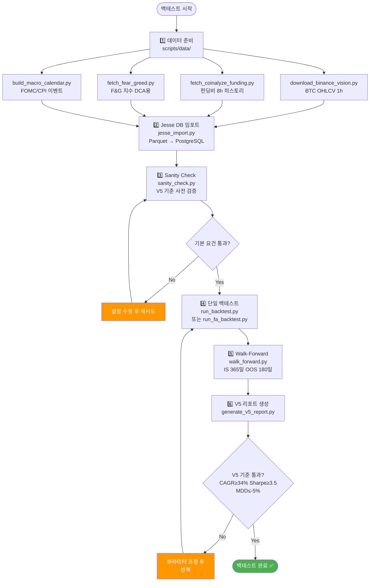

# 백테스트 스킬셋 규칙 및 스크립트 인덱스

## 스킬셋 관리 원칙

백테스트 스크립트는 **스킬셋**으로 관리된다. 새 스크립트 작성 전 반드시 아래 3가지 규칙을 따른다.

### 규칙 1: 기존 스킬 확인 (필수)

`cryptoengine/services/jesse_engine/scripts/` 디렉토리를 먼저 확인한다.  
새 스크립트를 작성하기 전에 **기존에 동일하거나 유사한 스크립트가 있는지 확인**한다.

```bash
ls -la cryptoengine/services/jesse_engine/scripts/
```

### 규칙 2: 새 스크립트 위치 (필수)

모든 백테스트 Python 및 Shell 파일은 **다음 위치**에 생성한다:

```
cryptoengine/services/jesse_engine/scripts/  ← 최상위 스크립트
cryptoengine/services/jesse_engine/scripts/data/  ← 데이터 수집 스크립트
```

**올바른 예**:
```
cryptoengine/services/jesse_engine/scripts/run_backtest.py  ✓
cryptoengine/services/jesse_engine/scripts/data/download_binance_vision.py  ✓
```

**잘못된 예**:
```
cryptoengine/scripts/my_backtest.py  ✗
cryptoengine/services/my_backtest.py  ✗
./my_backtest.py  ✗
```

### 규칙 3: README 업데이트 (필수)

`cryptoengine/services/jesse_engine/scripts/README.md`를 반드시 업데이트해야 하는 시점:

- 새 스크립트 **추가** → 해당 테이블에 행 추가
- 기존 스크립트 **수정** (파라미터·목적 변경) → 해당 행 업데이트
- 스크립트 **삭제** → 해당 행 제거

---

## 백테스트 파이프라인 흐름



---

## 완전한 스크립트 인덱스

### 최상위 스크립트 (scripts/)

| 파일 | 목적 | 입력 | 출력 | 권장 갱신 빈도 |
|-----|------|------|------|------------|
| `run_backtest.py` | Jesse 연구 API 백테스트 실행 | 전략명, 날짜범위 | JSON (CAGR, Sharpe, MDD) | 필요시 |
| `run_fa_backtest.py` | FA 순수 시뮬레이션 (자체 엔진) | 날짜범위, 파라미터 | JSON 리포트 | 월 1회 |
| `walk_forward.py` | Walk-Forward 분석 | 전략명, WF 파라미터 | JSON + Markdown WF 리포트 | 월 1회 |
| `generate_v5_report.py` | V5 최종 리포트 생성 | 전략명 | Markdown (.md) | 월 1회 |
| `regime_split_analysis.py` | 시장 레짐별 성능 분석 | 전략명, 레짐 정의 | JSON + Markdown | 월 1회 |
| `sanity_check.py` | V5 백테스트 검증 도구 | JSON 결과파일 | 경고 및 PASS/FAIL | 각 BT 후 |
| `test_funding_pnl.py` | 펀딩비 P&L 단위 테스트 | 없음 | 3가지 테스트 결과 | 분기 1회 |
| `jesse_import.py` | Parquet → Jesse DB 캔들 임포트 | symbol, timeframe, 날짜 | PostgreSQL 로드 | 월 1회 |

### 데이터 수집 스크립트 (scripts/data/)

| 파일 | 목적 | 입력 | 출력 | 데이터 신선도 |
|-----|------|------|------|------------|
| `download_binance_vision.py` | BTC OHLCV 다운로드 (Binance Vision) | symbol, timeframe, 날짜범위 | Parquet files in `/data/binance_vision/` | 월 1회 |
| `fetch_coinalyze_funding.py` | 펀딩비 (Bybit) 수집 | 날짜범위, 선택 타입 | `/data/funding_rates/BTCUSDT_8h.parquet` | **주 1회 (필수)** |
| `fetch_fear_greed.py` | Fear&Greed 지수 수집 | 날짜범위 | `/data/sentiment/fear_greed.parquet` | 월 1회 |
| `build_macro_calendar.py` | FOMC/CPI 매크로 이벤트 캘린더 | 없음 | `/data/macro_events/fomc_cpi_calendar.csv` | 분기 1회 |
| `export_funding_rates.py` | PostgreSQL 펀딩비 → Parquet 추출 | 날짜범위 | `/data/funding_rates/*.parquet` | 주 1회 |
| `fetch_fred_macro.py` | FRED 매크로 지표 (선택) | 날짜범위 | `/data/macro/fred_*.parquet` | 월 1회 |

### Shell 스크립트

| 파일 | 목적 | 입력 | 실행 시간 |
|-----|------|------|----------|
| `run_full_validation.sh` | 전체 V5 검증 파이프라인 (BT+WF+RS+SC+Report) | 전략명 | ~30분~2시간 |

---

## 스크립트 선택 의사결정 흐름

```mermaid
flowchart TD
    START{["백테스트 목표는?"]}
    
    START -->|데이터 신선도 관리| D1["데이터 수집<br>scripts/data/"]
    START -->|단순 성과 확인| D2["단일 백테스트<br>run_backtest.py"]
    START -->|시간대별 성능 분석| D3["Walk-Forward<br>walk_forward.py"]
    START -->|시장환경별 성능| D4["레짐 분석<br>regime_split_analysis.py"]
    START -->|전체 자동 검증| D5["통합 파이프라인<br>run_full_validation.sh"]
    START -->|자체엔진 재현| D6["FA 순수 시뮬레이션<br>run_fa_backtest.py"]
    START -->|Jesse 엔진 검증| D7["Sanity Check<br>sanity_check.py"]
    
    D1 --> D1A["1️⃣ download_binance_vision.py<br>2️⃣ fetch_coinalyze_funding.py<br>3️⃣ fetch_fear_greed.py<br>4️⃣ build_macro_calendar.py"]
    D2 --> D2A["지표 확인:<br>CAGR, Sharpe, MDD"]
    D3 --> D3A["OOS/IS 비율 확인:<br>≥ 0.6 합격"]
    D4 --> D4A["시장 환경별 수익성<br>bull/transition/compressed"]
    D5 --> D5A["30분~2시간\n1️⃣ BT → 2️⃣ WF → 3️⃣ RS\n4️⃣ SC → 5️⃣ Report"]
    D6 --> D6A["자체엔진 로직\nJesse와 비교"]
    D7 --> D7A["Jesse 정확성 검증\n2024년 BTC Hold\nExpected: CAGR ~120%"]
    
    style D5A fill:#4caf50,color:#fff
    style D1A fill:#2196f3,color:#fff
```

---

## 전형적인 워크플로우

### 1일차: 데이터 준비 (1~2시간)

```bash
# Step 1: OHLCV 다운로드 (30분, 월 1회)
docker compose --profile backtest run --rm jesse_engine \
  python scripts/data/download_binance_vision.py \
    --symbol BTCUSDT --timeframe 1h \
    --start 2020-01-01 --end 2026-04-01

# Step 2: 펀딩비 수집 (5분, 주 1회)
docker compose --profile backtest run --rm jesse_engine \
  python scripts/data/fetch_coinalyze_funding.py \
    --start 2023-04-01 --end 2026-04-01

# Step 3: Fear&Greed 수집 (5분, 월 1회)
docker compose --profile backtest run --rm jesse_engine \
  python scripts/data/fetch_fear_greed.py

# Step 4: 매크로 캘린더 생성 (2분, 분기 1회)
docker compose --profile backtest run --rm jesse_engine \
  python scripts/data/build_macro_calendar.py

# Step 5: Jesse DB 임포트 (15분, 월 1회)
docker compose --profile backtest run --rm jesse_engine \
  python scripts/jesse_import.py \
    --symbol BTCUSDT --timeframe 1h \
    --start 2020-01-01 --end 2026-04-01
```

### 2일차: 검증 실행 (2~3시간)

```bash
# Step 1: Sanity Check (BTC 매수&홀드로 Jesse 정확성 검증)
docker compose --profile backtest run --rm jesse_engine \
  python scripts/run_backtest.py \
    --strategy BtcBuyAndHold \
    --start 2024-01-01 --end 2024-12-31

# Step 2: FA 순수 시뮬레이션 (자체 엔진과 비교)
docker compose --profile backtest run --rm jesse_engine \
  python scripts/run_fa_backtest.py \
    --start 2023-04-01 --end 2026-04-01

# Step 3: Jesse FA 백테스트
docker compose --profile backtest run --rm jesse_engine \
  python scripts/run_backtest.py \
    --strategy FundingArbitrage \
    --start 2023-04-01 --end 2026-04-01

# Step 4: 전체 V5 검증 파이프라인
./cryptoengine/services/jesse_engine/scripts/run_full_validation.sh FundingArbitrage
```

---

## Docker 실행 명령

### Jesse 컨테이너 빌드 및 실행

```bash
# 1단계: 이미지 재빌드 (새 파일 추가 시, --no-cache로 캐시 무시)
docker compose --profile backtest build --no-cache jesse_engine

# 2단계: 스크립트 실행
docker compose --profile backtest run --rm jesse_engine \
  python scripts/<스크립트>.py [인자]
```

### 실행 예시

```bash
# 전체 검증 파이프라인
./cryptoengine/services/jesse_engine/scripts/run_full_validation.sh FundingArbitrage

# 백테스트 스크립트
docker compose --profile backtest run --rm jesse_engine \
  python scripts/run_backtest.py --strategy FundingArbitrage \
    --start 2023-04-01 --end 2026-04-01

# Walk-Forward
docker compose --profile backtest run --rm jesse_engine \
  python scripts/walk_forward.py --strategy FundingArbitrage

# 데이터 수집
docker compose --profile backtest run --rm jesse_engine \
  python scripts/data/download_binance_vision.py \
    --symbol BTCUSDT --timeframe 1h

docker compose --profile backtest run --rm jesse_engine \
  python scripts/data/fetch_coinalyze_funding.py

# 단위 테스트
docker compose --profile backtest run --rm jesse_engine \
  python scripts/test_funding_pnl.py
```

---

## 데이터 디렉토리 구조

```
/data/
├── binance_vision/                    # OHLCV 캔들 (Binance Vision)
│   └── klines/
│       └── BTCUSDT/
│           ├── 1h/
│           │   ├── 2020/
│           │   │   ├── 01.parquet
│           │   │   └── 02.parquet
│           │   └── ...
│           └── 1d/
│               └── ...
├── funding_rates/                     # 8h 펀딩비
│   ├── BTCUSDT_8h.parquet           # Coinalyze 펀딩비 (주로 사용)
│   └── BTCUSDT_8h.csv               # 대체 포맷 (CSV)
├── sentiment/                         # Fear&Greed 지수
│   └── fear_greed.parquet            # 일일 F&G 값 (0-100)
├── macro_events/                      # 매크로 이벤트 캘린더
│   └── fomc_cpi_calendar.csv         # FOMC/CPI 이벤트 타임스탬프
└── macro/                             # FRED 매크로 지표 (선택)
    ├── fred_dff.parquet              # Federal Funds Effective Rate
    ├── fred_vix.parquet              # VIX implied volatility
    └── ...
```

---

## 데이터 신선도 관리

### 실시간 업데이트 필수

| 데이터 | 현재 상태 | 권장 갱신 | 용도 |
|--------|---------|---------|------|
| **펀딩비** (BTCUSDT_8h) | ⚠️ 1시간 이하 | **주 1회** | 백테스트 정확성 핵심 |
| **OHLCV** (1h 캔들) | ⚠️ 1일 이하 | **월 1회** | 주기적 재생성 |
| **Fear&Greed** | ~ 1일 | **월 1회** | 정기 갱신 |
| **매크로 이벤트** | ~ 1월 | **분기 1회** | 미래 예정 이벤트 추가 |
| **FRED 지표** | ~ 1월 | **월 1회** | 자리매김 분석 (선택) |

### 갱신 자동화 제안

```bash
# Crontab 예 (매주 금요일 22:00 KST)
# crontab -e
# 0 13 * * FRI cd /home/justant/Data/Bit-Mania && \
#   docker compose --profile backtest run --rm jesse_engine \
#   python scripts/data/fetch_coinalyze_funding.py >> .logs/funding_update.log 2>&1
```

---

## 스크립트 작성 체크리스트

새로운 백테스트 스크립트 추가 시:

- [ ] `cryptoengine/services/jesse_engine/scripts/` 또는 `scripts/data/` 에 파일 생성
- [ ] 파일 docstring에 목적, 입력, 출력, 실행 명령 작성
- [ ] 필요한 라이브러리 import (polars, pandas, asyncpg, etc.)
- [ ] `scripts/README.md` 업데이트 (테이블에 행 추가)
- [ ] Docker 실행 명령 테스트:
  ```bash
  docker compose --profile backtest build --no-cache jesse_engine
  docker compose --profile backtest run --rm jesse_engine python scripts/my_script.py
  ```
- [ ] 결과 검증 (예상 결과와 비교)
- [ ] git 커밋

---

## 자주 하는 실수

### ❌ 실수 1: Docker 캐시로 인해 새 파일 미인식

```bash
# 잘못된 예
docker compose --profile backtest run --rm jesse_engine python scripts/new_script.py

# 올바른 예
docker compose --profile backtest build --no-cache jesse_engine
docker compose --profile backtest run --rm jesse_engine python scripts/new_script.py
```

### ❌ 실수 2: README.md 미업데이트

```bash
# 스크립트 추가 후 README.md를 업데이트하지 않음
# → 다음 개발자가 스크립트를 찾기 어려움
```

### ❌ 실수 3: 데이터 경로 오류

```python
# 잘못된 예
df = pl.read_parquet("data/funding_rates/BTCUSDT_8h.parquet")  # 상대 경로 실패

# 올바른 예
import os
from pathlib import Path
DATA_DIR = Path(os.environ.get("DATA_DIR", "/data"))
df = pl.read_parquet(DATA_DIR / "funding_rates" / "BTCUSDT_8h.parquet")
```

### ❌ 실수 4: 환경 변수 미설정

```bash
# Dockerfile에서 /data 마운트 경로 사용
# → docker-compose.yml에서 volume 정의 필요
#   volumes:
#     - /home/justant/Data/Bit-Mania/data:/data
```

---

## 성능 최적화 팁

### 1. Polars 병렬 처리
```python
import polars as pl
pl.Config.set_streaming_chunk_size(50_000)  # 메모리 최적화
```

### 2. 파켓 압축
```python
df.write_parquet("file.parquet", compression="zstd")  # Zstandard 압축
```

### 3. Docker 재사용
```bash
# 같은 컨테이너에서 연속 스크립트 실행 (이미지 빌드 1회)
docker compose --profile backtest build --no-cache jesse_engine
docker compose --profile backtest run --rm jesse_engine python scripts/a.py
docker compose --profile backtest run --rm jesse_engine python scripts/b.py  # 빌드 불필요
```

---

## 트러블슈팅

### 문제: "ImportError: No module named 'polars'"

**해결**:
```bash
# Dockerfile에 polars 포함 확인
# 또는 컨테이너에서 직접 설치
docker compose --profile backtest run --rm jesse_engine pip install polars
```

### 문제: "FileNotFoundError: /data/funding_rates/ not found"

**해결**:
```bash
# 1단계: 데이터 디렉토리 확인
ls -la /home/justant/Data/Bit-Mania/data/

# 2단계: docker-compose.yml에 volume 정의 확인
grep -A5 "jesse_engine:" docker-compose.yml | grep -A3 "volumes:"

# 3단계: 데이터 수집 스크립트 실행
docker compose --profile backtest run --rm jesse_engine \
  python scripts/data/fetch_coinalyze_funding.py
```

### 문제: "Jesse backtest 타임아웃"

**원인**: 데이터가 너무 크거나 전략 로직이 느림

**해결**:
```bash
# 시간 제한 증가 (기본 300s)
docker compose --profile backtest run --rm -e TIMEOUT=600 jesse_engine \
  python scripts/run_backtest.py ...
```

---

## 다음 단계

1. **월간 데이터 갱신 자동화**: Cron job 설정
2. **CI/CD 파이프라인**: GitHub Actions로 주간 V5 검증
3. **결과 대시보드**: 백테스트 결과 시각화
4. **A/B 테스트**: 여러 전략 병렬 비교

---

**최종 수정**: 2026-05-01
