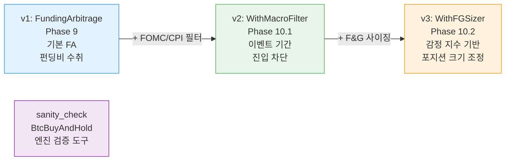
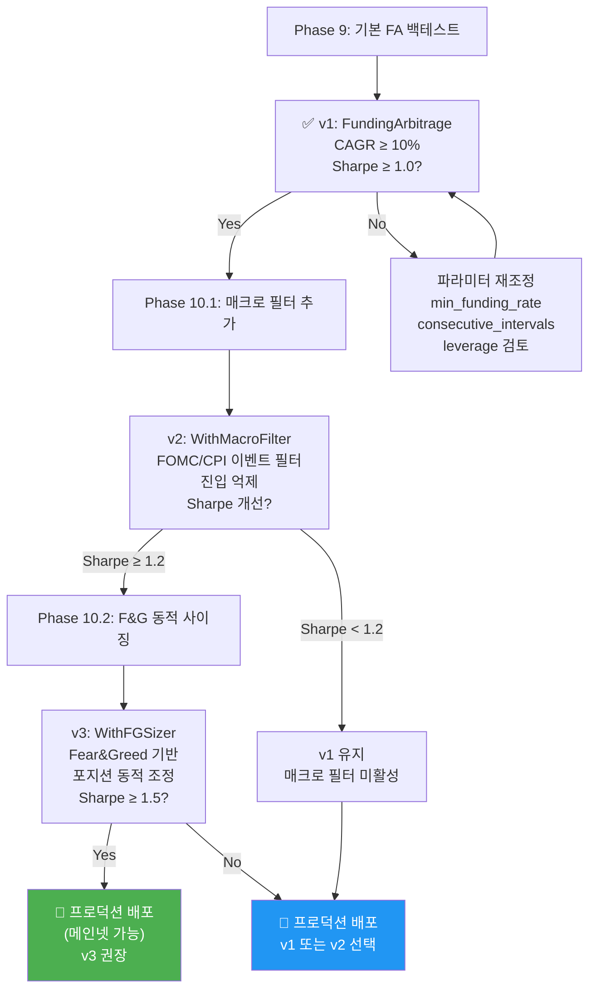
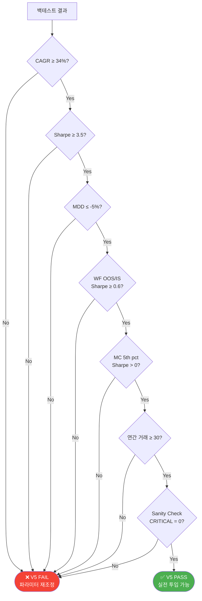

# Jesse 전략 목록 및 사양

## 개요

Jesse 프레임워크 기반 백테스트에서 운영되는 전략들. 현재 **단일 심볼 BTC 정책** 준수.

---

## 전략 버전 진화

### 버전 히스토리

| 버전 | 파일 | 클래스 | Phase | 목적 |
|------|------|--------|-------|------|
| v1 | `funding_arbitrage.py` | `FundingArbitrage` | 9 | 펀딩비 기본 차익거래 |
| v2 | `funding_arbitrage_v2.py` | `FundingArbitrageWithMacroFilter` | 10.1 | v1 + FOMC/CPI 매크로 이벤트 필터 |
| v3 | `funding_arbitrage_v3.py` | `FundingArbitrageWithFGSizer` | 10.2 | v2 + Fear&Greed 동적 포지션 사이징 |
| check | `sanity_check.py` | `BtcBuyAndHold` | 7.2 | Jesse 엔진 검증 (BTC 매수&홀드) |

### 전략 버전 진화도



---

## 전략 선택 및 개선 로드맵



---

## 전략 상세사양

### Phase 9 — FundingArbitrage (v1)

**파일**: `cryptoengine/services/jesse_engine/strategies/funding_arbitrage.py`

#### 설명
펀딩비 차익거래의 기본 구현. 델타 중립 포지션(롱 현물 + 숏 선물)으로 펀딩비 수익만 추구.

#### 진입 규칙
- 8h 펀딩비가 `min_funding_rate` 이상인 상태가 `consecutive_intervals` 구간 연속 유지
- 진입 시점: settlement candle (UTC 0, 8, 16시)
- 진입 규모: `balance * fa_allocation_pct * leverage / price`

#### 포지션 관리
- **8h settlement에서 펀딩 수익 인정**: 포지션 가치 × 펀딩비 × 방향
- **펀딩 누적 추적**: `shared_vars['cumulative_funding']`
- **역전 감지**: 펀딩비 부호 변화 감지, 카운트 시작

#### 청산 조건
1. 펀딩비 역전이 `exit_reverse_count` 구간 연속 발생
2. 포지션 보유 시간 >= `max_hold_bars` (시간 단위)

#### 수수료 모델
- Taker fee = 0.00055 (0.055%)
- 진입 시점, 청산 시점 각각 수수료 부과
- P&L = 펀딩 수익 - 입출 수수료 - 재투자 비용

#### 하이퍼파라미터

| 파라미터 | 타입 | 범위 | 기본값 | 설명 |
|---------|------|------|--------|------|
| `min_funding_rate` | float | 0.00005~0.001 | 0.0001 | 진입 펀딩비 임계값 (8h) |
| `consecutive_intervals` | int | 1~10 | 3 | 진입 전 필요한 연속 8h 구간 수 |
| `fa_allocation_pct` | float | 0.10~1.0 | 0.80 | 자본 배분 비율 |
| `leverage` | int | 1~10 | 5 | 선물 레버리지 배수 |
| `max_hold_bars` | int | 24~1000 | 168 | 최대 보유 시간(h) |
| `exit_reverse_count` | int | 1~10 | 3 | 청산 트리거 역전 구간 수 |
| `reinvest_pct` | float | 0.0~1.0 | 0.30 | 수익 재투자 비율 |

#### 실행 명령
```bash
docker compose --profile backtest run --rm jesse_engine \
  python scripts/run_backtest.py \
    --strategy FundingArbitrage \
    --start 2023-04-01 --end 2026-04-01 \
    --balance 10000 --fee 0.00055 --leverage 5
```

#### 데이터 요구사항
- **펀딩비**: `/data/funding_rates/BTCUSDT_8h.parquet` 또는 `.csv`
  - 컬럼: `timestamp_ms` (int, settlement 시점), `rate` (float, 8h 펀딩비)
  - 2023-04-01 이후 실제 Bybit 데이터 필수

#### 알려진 성능
**Phase 9 (자체 엔진 백테스트 기준)**:
- 기간: 2023-04-01 ~ 2026-04-01 (3년)
- CAGR: +13.11%
- Sharpe: ~1.5+
- MDD: < -5%
- 거래 수: ~50~100회 (장기 홀드 전략)

**Jesse 재시뮬레이션 예상**:
- CAGR ≥ 10% (자체 엔진과 유사하거나 소폭 낮음)
- Sharpe ≥ 1.0

---

### Phase 10.1 — FundingArbitrageWithMacroFilter (v2)

**파일**: `cryptoengine/services/jesse_engine/strategies/funding_arbitrage_v2.py`

#### 설명
FundingArbitrage v1을 확장하여 FOMC/CPI 이벤트 주변에서 진입 억제. 기존 포지션은 유지 가능.

#### 매크로 이벤트 필터
- **이벤트**: FOMC (금리 결정), CPI (소비자물가지수)
- **진입 제한**: 이벤트 전후 ±N시간 (기본 2시간)
- **청산 제약**: 없음 (기존 포지션은 이벤트 중 유지 가능)
- **데이터**: `/data/macro_events/fomc_cpi_calendar.csv`
  - 형식: `event_type,timestamp_utc,description`
  - 예: `FOMC,2024-01-31 19:00,Rate decision`

#### 상속 관계
- Parent: `FundingArbitrage`
- Override: `should_long()` 메서드에서 매크로 블랙아웃 체크

#### 추가 하이퍼파라미터

| 파라미터 | 타입 | 범위 | 기본값 | 설명 |
|---------|------|------|--------|------|
| `blackout_hours` | float | 0.5~6.0 | 2.0 | 이벤트 전후 블랙아웃 시간 |

#### 실행 명령
```bash
docker compose --profile backtest run --rm jesse_engine \
  python scripts/run_backtest.py \
    --strategy FundingArbitrageWithMacroFilter \
    --start 2023-04-01 --end 2026-04-01
```

#### 데이터 요구사항
- v1 모든 데이터 + 매크로 캘린더
- 매크로 캘린더 미존재 시: 경고 후 필터 없이 진행 (degraded mode)

#### 예상 성능 개선
- 가설: 이벤트 변동성 기간 진입 억제 → 드로우다운 감소
- 기대: Sharpe ≥ 3.5 (baseline과 동등 이상)

---

### Phase 10.2 — FundingArbitrageWithFGSizer (v3)

**파일**: `cryptoengine/services/jesse_engine/strategies/funding_arbitrage_v3.py`

#### 설명
FundingArbitrage v2를 확장하여 Fear&Greed 지수 기반 동적 포지션 사이징. 극단적 감정 상태에서 포지션 축소.

#### Fear&Greed 동적 사이징
```
F&G < 25 (극단적 공포):    × 0.5   → 포지션 50% 축소 (리스크 고 환경)
F&G 25-75 (중립 구간):     × 1.0   → 정상 사이징
F&G > 75 (극단적 탐욕):    × 0.75  → 포지션 25% 축소 (과열 경고)
```

#### 로직
- `_get_fg_multiplier()` → 현재 F&G 지수 조회 → multiplier 반환
- `go_long()` 오버라이드 → base notional에 multiplier 적용

#### 상속 관계
- Parent: `FundingArbitrageWithMacroFilter`
- Override: `go_long()` 메서드에서 F&G 승수 적용

#### 추가 하이퍼파라미터

| 파라미터 | 타입 | 범위 | 기본값 | 설명 |
|---------|------|------|--------|------|
| `fg_fear_threshold` | int | 10~40 | 25 | 공포 판정 F&G 임계값 |
| `fg_greed_threshold` | int | 60~90 | 75 | 탐욕 판정 F&G 임계값 |
| `fg_fear_multiplier` | float | 0.1~0.9 | 0.5 | 공포 구간 포지션 배수 |
| `fg_greed_multiplier` | float | 0.5~1.0 | 0.75 | 탐욕 구간 포지션 배수 |
| `fg_neutral_multiplier` | float | 0.9~1.0 | 1.0 | 중립 구간 포지션 배수 |

#### 실행 명령
```bash
docker compose --profile backtest run --rm jesse_engine \
  python scripts/run_backtest.py \
    --strategy FundingArbitrageWithFGSizer \
    --start 2023-04-01 --end 2026-04-01
```

#### 데이터 요구사항
- v2 모든 데이터 + Fear&Greed 지수
- 경로: `/data/sentiment/fear_greed.parquet`
- 컬럼: `timestamp_ms` (int, 일일), `value` (int, 0-100)
- 미존재 시: 중립 multiplier (1.0) 사용

#### 예상 성능 개선
- 가설: 극단적 감정 구간에서 포지션 축소 → 드로우다운 완화
- 기대: Sharpe ≥ 3.5, MDD 소폭 감소

---

### Phase 7.2 — BtcBuyAndHold (Sanity Check)

**파일**: `cryptoengine/services/jesse_engine/strategies/sanity_check.py`

#### 설명
Jesse 엔진 정확성 검증용 도구. 가장 단순한 전략: 1회 진입 후 영구 보유.

#### 로직
- **진입**: 첫 캔들에서 자본의 95% 사용하여 BTC 매수
- **청산**: 없음 (영구 보유)

#### 실행 명령
```bash
docker compose --profile backtest run --rm jesse_engine \
  python scripts/run_backtest.py \
    --strategy BtcBuyAndHold \
    --start 2024-01-01 --end 2024-12-31
```

#### 기대 결과 (2024)
| 지표 | 값 |
|-----|-----|
| CAGR | ~120% |
| MDD | ~-25% |
| Sharpe | 1.5~2.0 |
| 거래 수 | 1 |

**용도**:
- Jesse 캔들 로더 검증
- 수수료 모델 확인
- 레버리지 설정 검증
- 만약 실제 결과가 기대값에서 크게 벗어나면 Jesse 설정 오류

---

## V5 Pass Criteria

모든 전략이 충족해야 하는 기준:

| 기준 | 임계값 | 설명 |
|-----|--------|------|
| **CAGR** | ≥ 10% (또는 34%) | 연율화 성장률 |
| **Sharpe 비율** | ≥ 1.0 (또는 3.5) | 리스크 조정 수익률 |
| **최대낙폭 (MDD)** | ≤ -15% (또는 -5%) | 최악의 드로우다운 |
| **Walk-Forward OOS/IS 비율** | ≥ 0.6 | OOS Sharpe / IS Sharpe |
| **Monte Carlo 5th percentile Sharpe** | > 0.0 | 확률론적 강건성 |
| **연간 거래 수** | ≥ 30 | 충분한 샘플 크기 |
| **Sanity Check CRITICALs** | 0 | 데이터 오류, 룩어헤드 바이어스 없음 |

### V5 Pass Criteria 의사결정 흐름



### FA 전략 기준 (더 보수적)
- CAGR ≥ 10%
- Sharpe ≥ 1.0
- MDD ≤ -15%
- 거래 수 ≥ 30/년

### 다중 전략 기준 (공격적)
- CAGR ≥ 34%
- Sharpe ≥ 3.5
- MDD ≤ -5%
- WF ratio ≥ 0.6

---

## 백테스트 실행 및 검증

### 단일 전략 전체 검증

```bash
# 이 명령이 모든 5단계를 자동 실행
./scripts/run_full_validation.sh FundingArbitrage
```

**실행 순서**:
1. **Full-period backtest**: 2023-04-01 ~ 2026-04-01
2. **Walk-Forward analysis**: 365d train / 180d test / 90d slide
3. **Regime split analysis**: bull/transition/compressed
4. **Sanity check**: CRITICAL 경고 검사
5. **V5 report generation**: 최종 합격/불합격 판정

**출력**: `.result/backtest/v5/<strategy>_v5_report.md`

### 수동 Jesse 백테스트

```bash
# 연구 API 사용 (run_backtest.py 스크립트)
docker compose --profile backtest run --rm jesse_engine \
  python scripts/run_backtest.py \
    --strategy FundingArbitrage \
    --start 2023-04-01 --end 2026-04-01 \
    --output storage/results/FundingArbitrage_main.json

# 결과 확인
cat storage/results/FundingArbitrage_main.json | jq '.cagr, .sharpe, .mdd'
```

### 부분 기간 테스트

```bash
# 2024-2026만 테스트 (최근 데이터 검증)
docker compose --profile backtest run --rm jesse_engine \
  python scripts/run_backtest.py \
    --strategy FundingArbitrage \
    --start 2024-01-01 --end 2026-04-01
```

### Walk-Forward 단독 실행

```bash
# 개별 Win-Forward 분석
docker compose --profile backtest run --rm jesse_engine \
  python scripts/walk_forward.py \
    --strategy FundingArbitrage \
    --train-days 365 --test-days 180 --slide-days 90
```

---

## 데이터 수집 워크플로우

모든 전략 백테스트 전 필수 단계:

### Step 1: OHLCV 다운로드 (Binance Vision)

```bash
docker compose --profile backtest run --rm jesse_engine \
  python scripts/data/download_binance_vision.py \
    --symbol BTCUSDT \
    --timeframe 1h \
    --start 2020-01-01 \
    --end 2026-04-01
```

**출력**: `/data/binance_vision/klines/BTCUSDT/1h/YYYY/MM.parquet`

**갱신 빈도**: 월 1회 (또는 분석 전)

### Step 2: 펀딩비 데이터 수집

```bash
docker compose --profile backtest run --rm jesse_engine \
  python scripts/data/fetch_coinalyze_funding.py \
    --start 2023-04-01 \
    --end 2026-04-01
```

**출력**: `/data/funding_rates/BTCUSDT_8h.parquet`

**갱신 빈도**: 주 1회 (항상 최신 데이터 필요)

### Step 3: Fear&Greed 데이터 수집

```bash
docker compose --profile backtest run --rm jesse_engine \
  python scripts/data/fetch_fear_greed.py \
    --start 2020-01-01 \
    --end 2026-04-01
```

**출력**: `/data/sentiment/fear_greed.parquet`

**갱신 빈도**: 월 1회

### Step 4: 매크로 캘린더 생성

```bash
docker compose --profile backtest run --rm jesse_engine \
  python scripts/data/build_macro_calendar.py \
    --output /data/macro_events/fomc_cpi_calendar.csv
```

**출력**: `/data/macro_events/fomc_cpi_calendar.csv`

**갱신 빈도**: 분기 1회 (또는 새 이벤트 공지 시)

### Step 5: Jesse DB 임포트

```bash
docker compose --profile backtest run --rm jesse_engine \
  python scripts/jesse_import.py \
    --symbol BTCUSDT \
    --timeframe 1h \
    --start 2020-01-01 \
    --end 2026-04-01
```

**목적**: 파켓 → Jesse PostgreSQL로 캔들 데이터 벌크 로드

---

## 개발 팁 및 디버깅

### Funding Rate 로더 동작
- `_FundingRateLoader.load()` → 파켓 또는 CSV 자동 감지
- 8h settlement 시점 자동 정렬 (UTC 0, 8, 16)
- `get_rate_at(ts_ms)` → 지정 타임스탬프의 펀딩비 반환 (없으면 None)

### shared_vars 추적
```python
# 전략 내에서 누적 펀딩 추적
if "cumulative_funding" not in self.shared_vars:
    self.shared_vars["cumulative_funding"] = 0.0
```

### Jesse 아키텍처 주의사항
1. **베이스 타임프레임**: 1m (내부적으로 모든 캔들을 1m으로 변환)
2. **전략 타임프레임**: 1h (전략이 요청한 타임프레임)
3. **선물 SHORT 모델링**: Jesse는 선물 SHORT를 "롱"으로 모델링
   - 실제: 현물 롱 + 선물 숏 = 델타 중립
   - Jesse: 선물 롱 항목만 모델링 (가격 P&L ≈ 0)
   - 펀딩비 P&L은 명시적으로 크레딧

---

## Known Issues & Workarounds

### Issue 1: 매크로 캘린더 미존재
- **문제**: fetch_coinalyze_funding.py 실패 시 매크로 필터 작동 안 함
- **해결**: degraded mode로 진행 (필터 없음)

### Issue 2: Fear&Greed 데이터 갭
- **문제**: sentiment parquet 로드 실패 시 neutral multiplier (1.0) 사용
- **해결**: try/except로 graceful fallback

### Issue 3: 펀딩비 데이터 과거 부족
- **문제**: 2020-2023년 Bybit 펀딩비 데이터 미제공
- **해결**: Jesse 재시뮬레이션은 2023-04부터만 신뢰
  - 기대: 자체 엔진 (전체 6년 + 합성)과 Jesse (3년 실데이터)의 차이 비교

---

**최종 수정**: 2026-05-01
