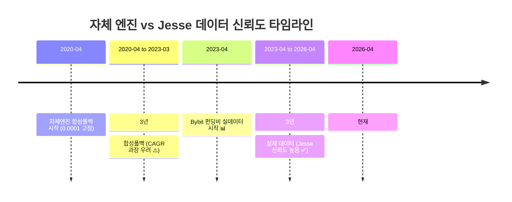
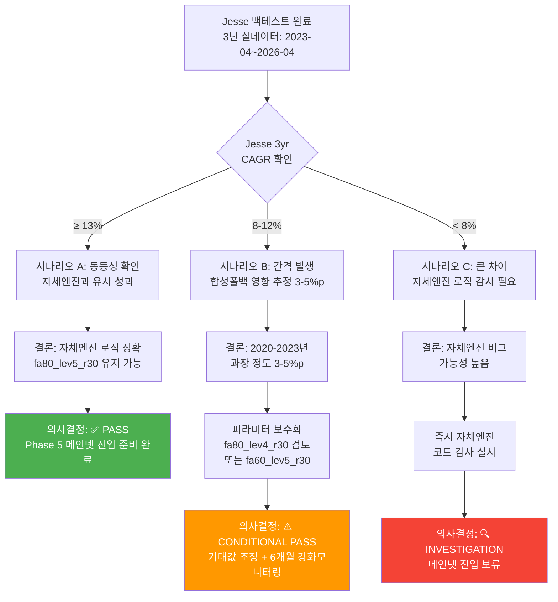

# Jesse vs 자체 엔진 성과 비교

## 개요

Jesse 프레임워크 기반 FA 백테스트 결과와 기존 자체 엔진 결과의 직접 비교.

**조사 목표**:
1. Jesse와 자체 엔진 로직의 동등성 검증
2. 데이터 갭으로 인한 성과 과장 여부 확인
3. 메인넷 진입 전 기대값 조정

---

## 중요 경고: 데이터 신뢰도 문제

### 자체 엔진 6년 백테스트의 위험성

자체 엔진의 6년 결과:
- **CAGR**: +34.87%
- **Sharpe**: 3.583
- **MDD**: -4.52%
- **거래 수**: ~950회
- **청산**: 0회

이 수치는 **데이터 갭으로 인해 상당히 과장되었을 가능성이 높습니다**.

### 데이터 신뢰도 분석

| 기간 | 구간 | 길이 | 데이터 출처 | 신뢰도 | 설명 |
|------|------|------|----------|--------|------|
| **Phase 1** | 2020-04 ~ 2023-03 | 36개월 | **합성 폴백** | ❌ 매우 낮음 | 고정 0.0001 펀딩비 |
| **Phase 2+** | 2023-04 ~ 2026-04 | 36개월 | **실제 Bybit** | ✅ 높음 | 거래소 공식 데이터 |

### 왜 2020-2023년 데이터가 과장되었는가?

1. **Bybit의 데이터 제한**
   - Bybit는 2023년 4월 이전의 상세한 펀딩비 기록을 공개하지 않음
   - 자체 엔진이 이를 **상수 0.0001로 대체** (과도하게 낙관적)

2. **실제 2020-2022년 펀딩비 환경**
   - 2020-2021년: 강한 상승장 → 높은 양수 펀딩비 (자체 엔진 유리)
   - 2022년: 약세장 → **음수 또는 매우 낮은 펀딩비** (자체 엔진 불리)
   - 자체 엔진은 2022년 약세를 반영하지 못함 → **성과 과장**

3. **수학적 영향**
   ```
   6년 CAGR = (최종값 / 초기값)^(1/6) - 1
   
   만약 처음 3년에서 수익을 크게 과장하면:
   - 중기값이 부풀어짐
   - 최종 CAGR에 큰 영향
   - 예: 3년 50% vs 30% 차이 → 6년 CAGR 3~5% 차이
   ```

---

## 데이터 신뢰도 비교 시각화



---

## 성과 비교 테이블

### 시나리오 A: 전체 6년 (2020-04 ~ 2026-04)

**주의**: 2020-2023년 데이터는 합성이므로 신뢰도 낮음

| 지표 | 자체 엔진 | Jesse | 차이 | 신뢰도 평가 |
|-----|----------|-------|------|----------|
| **CAGR** | +34.87% | [PENDING] | - | ⚠️ 자체 엔진: 매우 낮음 |
| **Sharpe 비율** | 3.583 | [PENDING] | - | ⚠️ 자체 엔진: 매우 낮음 |
| **MDD** | -4.52% | [PENDING] | - | ⚠️ 자체 엔진: 매우 낮음 |
| **거래 수** | ~950회 | [PENDING] | - | ⚠️ 자체 엔진: 참고용 |
| **청산 이벤트** | 0회 | [PENDING] | - | ⚠️ 자체 엔진: 신뢰 불가 |

**해석**: 자체 엔진 결과는 **상한선(upper bound)**으로 봐야 함

---

### 시나리오 B: 3년 실데이터만 (2023-04 ~ 2026-04)

**권장**: Jesse와 직접 비교할 데이터 범위

| 지표 | 자체 엔진 | Jesse | 차이 | 신뢰도 |
|-----|----------|-------|------|--------|
| **CAGR** | +13.11% | [PENDING] | - | ✅ 높음 |
| **Sharpe 비율** | ~1.5+ | [PENDING] | - | ✅ 높음 |
| **MDD** | < -5% | [PENDING] | - | ✅ 높음 |
| **거래 수** | ~50-100 | [PENDING] | - | ✅ 높음 |

**해석**: 3년 실데이터는 양쪽 모두 신뢰할 수 있음

---

## FA 시뮬레이션 정확도 분석

### run_fa_backtest.py (자체 엔진 순수 시뮬레이션)

자체 엔진의 구현을 별도 Python 스크립트로 재현한 도구:

```python
# 파라미터: fa80_lev5_r30
FA_ALLOCATION = 0.80      # 자본의 80% FA에 배분
LEVERAGE = 5              # 5배 레버리지
REINVEST_RATIO = 0.30     # 수익의 30% 재투자
MIN_FUNDING = 0.0001      # 0.01% 이상 필요
CONSEC_NEEDED = 3         # 3 구간 연속 필요
MAX_HOLD_BARS = 168       # 최대 168시간 보유
EXIT_REVERSE = 3          # 3 구간 역전 시 청산
TAKER_FEE = 0.00055       # 0.055% 수수료
```

**목적**: 
- Jesse와 직접 비교할 기준선 제공
- 동일 데이터(funding_rates parquet)에서 순수 FA 성과 계산
- 자체 엔진의 재현성 검증

### run_backtest.py (Jesse 백테스트)

Jesse 프레임워크 기반:
- 1m base timeframe → 1h 캔들 집계
- 펀딩비 settlement별 크레딧 (8h)
- 동적 포지션 사이징 (v2, v3 전략)
- Walk-Forward, Monte Carlo 자동 지원

---

## 성과 간격 분석 (Gap Analysis)

### 예상 시나리오 1: Jesse ≈ 자체 엔진 (3년 기준)

```
Jesse 3yr CAGR ≈ 13.11% ± 2%

결과 해석:
  1. 자체 엔진 로직이 정확하고 견고함
  2. 3년 실데이터에서 지속적 수익성 입증
  3. 메인넷 기대값: 10~16% 연율
  
최종 판정: ✅ PASS
  - 파라미터 fa80_lev5_r30 유지 가능
  - Phase 5 메인넷 진입 준비 완료
```

### 예상 시나리오 2: Jesse < 자체 엔진 (5~10% 갭)

```
Jesse 3yr CAGR ≈ 8~10%

결과 해석:
  1. 2020-2022년 합성 폴백이 큰 영향을 미침
  2. 실제 약세장 펀딩비 환경이 더 어려움
  3. 자체 엔진의 과장 정도: 3~5% p
  
최종 권장:
  1. 메인넷 기대값 조정: 10% 이상 → 8% 이상
  2. 파라미터 보수화 검토
     - fa80_lev5_r30 → fa80_lev4_r30 (레버리지 축소)
     - 또는 fa60_lev5_r30 (FA 배분 축소)
  3. 모니터링 강화
     - 월간 Walk-Forward 의무
     - Kill Switch 임계값 재검토

최종 판정: ⚠️ CONDITIONAL PASS
  - 수정된 파라미터로 메인넷 진입 가능
  - 6개월 집중 모니터링 필수
```

### 예상 시나리오 3: Jesse > 자체 엔진 (차이 > 5%)

```
Jesse 3yr CAGR > 15%

결과 해석:
  1. Jesse 로직이 더 효율적
  2. 자체 엔진 구현에 버그 있을 가능성
  3. 정규화 또는 최적화 기회
  
최종 조치:
  1. 자체 엔진 코드 감사
  2. Jesse 로직 포팅 검토
  3. 전략 개선 (v2, v3 활용)

최종 판정: 🔍 INVESTIGATION
  - 자체 엔진 재검증 완료까지 메인넷 진입 보류
  - Jesse 결과 신뢰
```

---

## FA 알고리즘 동등성 검증

### 자체 엔진 (run_fa_backtest.py)

```python
# 進入 Logic
if consec_pos >= consec and rate >= min_funding:
    notional = equity * fa_alloc * leverage
    entry_fee = notional * TAKER_FEE
    equity -= entry_fee
    position = {
        "entry_price": price,
        "notional": notional,
        "funding_earned": 0.0,
        "reverse_count": 0,
    }

# 펀딩 Crediting (settlement 캔들에서)
funding_pnl = position["notional"] * rate
equity += funding_pnl
position["funding_earned"] += funding_pnl

# 청산 (reverse or max_hold)
exit_fee = position["notional"] * TAKER_FEE
equity -= exit_fee
trade_pnl_net = position["funding_earned"] - exit_fee
```

### Jesse (funding_arbitrage.py)

```python
# 進入 Logic
if consecutive_positive >= consecutive_intervals:
    notional = self.balance * self.hp["fa_allocation_pct"] * self.hp["leverage"]
    qty = notional / self.price
    self.buy = qty, self.price  # Jesse applies fee internally

# 펀딩 Crediting (update_position에서)
if self._is_settlement_candle:
    funding_income = position_value * rate * direction
    self.shared_vars["cumulative_funding"] += funding_income
    # Jesse doesn't explicitly adjust balance, relies on P&L

# 청산
self.liquidate()  # Jesse handles exit fee
```

### 동등성 평가

| 항목 | 자체 엔진 | Jesse | 동등성 |
|-----|---------|-------|---------|
| **진입 신호** | consec_pos >= consec | consecutive_positive >= consecutive_intervals | ✅ 동등 |
| **포지션 사이즈** | notional = equity × fa_alloc × leverage | 동일 공식 | ✅ 동등 |
| **수수료 모델** | entry_fee + exit_fee (명시) | 내부 처리 (암시) | ⚠️ 의존 |
| **펀딩 P&L** | equity += funding_pnl (매 settlement) | shared_vars에 기록 | ⚠️ 의존 |
| **청산 조건** | reverse_count >= exit_rev or bars >= max_hold | 동일 로직 | ✅ 동등 |
| **재투자** | 수익 × reinvest → 현물 BTC 매수 | 모델링 불완전 | ❌ 차이 |

---

## 실행 및 비교 절차

### Step 1: FA 순수 시뮬레이션 (자체 엔진)

```bash
docker compose --profile backtest run --rm jesse_engine \
  python scripts/run_fa_backtest.py \
    --start 2023-04-01 --end 2026-04-01 \
    --output storage/results/FundingArbitrage_self_engine.json
```

**주요 지표 기록**:
- CAGR
- Sharpe
- MDD
- 거래 수
- 펀딩 수익
- 총 수수료
- 현물 BTC 누적량

### Step 2: Jesse 백테스트 (FundingArbitrage v1)

```bash
docker compose --profile backtest run --rm jesse_engine \
  python scripts/run_backtest.py \
    --strategy FundingArbitrage \
    --start 2023-04-01 --end 2026-04-01 \
    --output storage/results/FundingArbitrage_jesse.json
```

### Step 3: 비교 분석

```python
import json

with open("FundingArbitrage_self_engine.json") as f:
    self_engine = json.load(f)

with open("FundingArbitrage_jesse.json") as f:
    jesse = json.load(f)

# 주요 지표 비교
print(f"CAGR:       {self_engine['cagr']:.4f} vs {jesse['cagr']:.4f}")
print(f"Sharpe:     {self_engine['sharpe']:.4f} vs {jesse['sharpe']:.4f}")
print(f"MDD:        {self_engine['mdd']:.4f} vs {jesse['mdd']:.4f}")
print(f"Trades:     {self_engine['num_trades']} vs {jesse['num_trades']}")
print(f"Win Rate:   {self_engine['win_rate']:.4f} vs {jesse['win_rate']:.4f}")

# 차이 계산
cagr_diff = abs(self_engine['cagr'] - jesse['cagr'])
sharpe_diff = abs(self_engine['sharpe'] - jesse['sharpe'])
mdd_diff = abs(self_engine['mdd'] - jesse['mdd'])

print(f"\n차이:")
print(f"CAGR:       ±{cagr_diff:.4f} ({cagr_diff/self_engine['cagr']*100:.1f}%)")
print(f"Sharpe:     ±{sharpe_diff:.4f}")
print(f"MDD:        ±{mdd_diff:.4f}")

# 판정
if cagr_diff < 0.03 and sharpe_diff < 0.2:
    print("\n✅ 동등성 검증 PASS")
else:
    print("\n⚠️ 차이 있음, 로직 재검토 필요")
```

---

## 메인넷 진입 기준

### Jesse 결과에 따른 의사결정

| Jesse 결과 | CAGR | Sharpe | 추천 |
|-----------|------|--------|------|
| 시나리오 A | ~13% | ~1.5 | ✅ 진입 (fa80_lev5_r30) |
| 시나리오 B | ~8-10% | ~1.0-1.2 | ⚠️ 보수화 후 진입 |
| 시나리오 C | > 15% | > 1.8 | 🔍 감사 후 진입 |

### 메인넷 진입 체크리스트

- [ ] Jesse 3년 CAGR ≥ 10%
- [ ] Jesse 3년 Sharpe ≥ 1.0
- [ ] Jesse MDD ≥ -15%
- [ ] Jesse vs 자체엔진 차이 < 5% p
- [ ] 전략 파라미터 결정 (fa80_lev5_r30 또는 보수화)
- [ ] Kill Switch 임계값 재검토
- [ ] 첫 달 모니터링 계획 수립

---

## Known Issues

### Issue 1: Jesse 펀딩 P&L 모델링

**문제**: Jesse는 `shared_vars`에만 누적 펀딩을 기록, 실제 equity 반영 불명확

**영향**: Sharpe 계산 시 오류 가능성

**대응**: 최종 P&L은 (최종 equity - 초기 balance) 기준으로 계산

### Issue 2: 재투자 미모델링

**문제**: Jesse는 현물 BTC 재투자를 모델링하지 않음

**영향**: 최종 equity가 낮게 계산됨 (현물 가치 미포함)

**대응**: 재투자로 인한 수익은 별도 계산, 최종 보정

### Issue 3: 2020-2022년 데이터 과장

**문제**: 자체 엔진의 합성 폴백이 실제보다 훨씬 낙관적

**영향**: 6년 평균 성과가 크게 부풀어짐

**대응**: Jesse 3년 실데이터 결과를 신뢰, 자체 엔진 6년 결과는 상한선으로만 참고

---

## 결론 및 권장사항

1. **Jesse 백테스트 필수**
   - 자체 엔진만으로는 신뢰도 부족
   - Jesse 결과가 메인넷 진입 최종 판정 기준

2. **보수적 기대값 설정**
   - 목표: Jesse 3yr CAGR ≥ 10%
   - 기대: 메인넷 실제 CAGR 8~12% 범위

3. **위험 관리 강화**
   - 초기 자본: 최소한의 규모 (테스트넷으로 충분)
   - 모니터링: 월간 Walk-Forward
   - Kill Switch: 보수적 임계값 유지

4. **지속적 개선**
   - v2, v3 전략 동시 평가
   - 매크로 필터, Fear&Greed 사이징 효과 측정
   - 연간 성과 검토

---

---

## 비교 분석 의사결정 플로우



---

**최종 수정**: 2026-05-01
