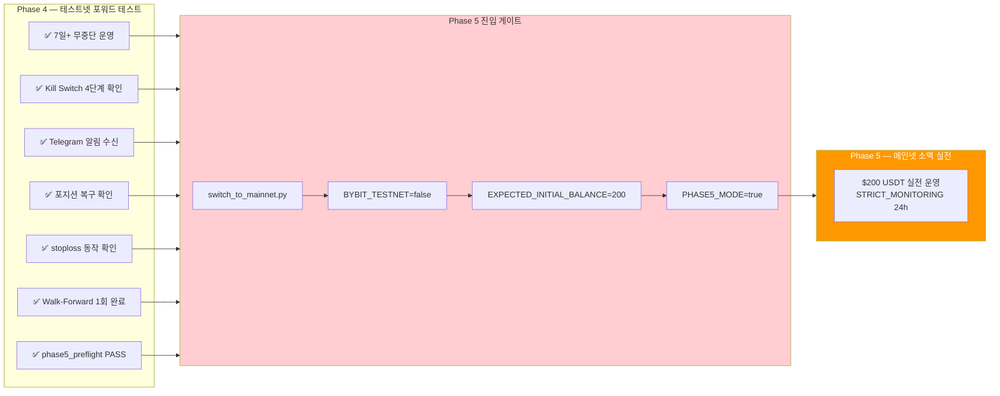
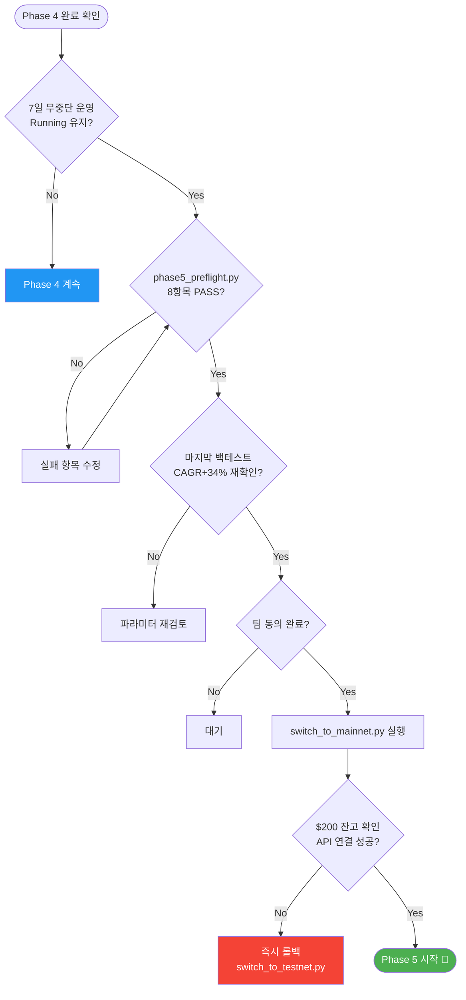

# Phase 4 완료 체크리스트



## Phase 4 개요

**목표**: 테스트넷 포워드 테스트를 통해 시스템 안정성, 수익성, 안전장치 검증

**기간**: 2026-01-01 ~ 2026-05-01 (4개월 진행 중)

**주요 성과**:
- Docker 19개 서비스 인프라 완성
- Bybit 테스트넷 API 연결 검증
- 자체 엔진 백테스트 (fa80_lev5_r30: CAGR +34.87%)
- Jesse 백테스트 포팅 (v1, v2, v3)
- Kill Switch 4계층 구현 및 테스트

---

## 완료 체크리스트

### 1️⃣ 7개 시나리오 체크리스트 완료

**문서**: `cryptoengine/arch/PHASE4_MONITORING.md` 참조

#### 필수 시나리오

- [ ] **Scenario 1**: 정상 거래 흐름
  - 펀딩비 감지 → 포지션 진입 → 8h settlement 펀딩 수익 → 역전 청산
  
- [ ] **Scenario 2**: 기저 극단 확산 (basis_divergence_risk)
  - 현물 vs 선물 스프레드 > 0.5% 진입 시 긴급 청산
  
- [ ] **Scenario 3**: 펀딩비 반전 (funding_reversal)
  - 양수 → 음수 전환 3회 감지 시 청산
  
- [ ] **Scenario 4**: Kill Switch 발동 (일일 손실 5%)
  - 일일 손실률 >= 5% 도달 시 긴급 청산 + Telegram ACK
  
- [ ] **Scenario 5**: Kill Switch 발동 (최대 드로우다운 10%)
  - peak equity 대비 손실률 >= 10% 도달 시 긴급 청산
  
- [ ] **Scenario 6**: 서비스 재시작 후 포지션 복구
  - 포지션 상태 → Redis 저장 → 재시작 → 자동 복구
  
- [ ] **Scenario 7**: 데이터 일관성
  - PostgreSQL + Redis + 로그 데이터 3중 검증

#### 확인 방법

```bash
# funding-arb 로그에서 각 시나리오 이벤트 확인
docker compose logs --tail=200 funding-arb | grep -E "진입|청산|복구|Kill|긴급"

# 또는 JSON 로그에서
docker compose exec postgres psql -U cryptoengine -d cryptoengine \
  -c "SELECT event_code, count(*) FROM service_logs \
      WHERE service='funding-arb' AND date > now() - interval '7 days' \
      GROUP BY event_code ORDER BY count DESC;"
```

---

### 2️⃣ 7일 이상 무중단 운영

- [ ] 재시작(restarting) 없이 **Running** 상태 유지 (7일 이상)
- [ ] 예기치 않은 재시작 0회
- [ ] 에러율 < 0.1%

#### 확인 명령

```bash
# 현재 상태 확인
docker compose ps funding-arb
# 출력 예: Up 7 days (또는 그 이상)

# Uptime 기록 (Docker 내부 시간)
docker inspect -f '{{.State.StartedAt}}' cryptoengine-funding-arb-1

# 에러 로그 통계
docker compose logs --since 7d funding-arb 2>&1 | grep -i error | wc -l
# 결과: < 10 (7일 기준, 약 1개/일 이하)

# 재시작 이벤트 확인
docker events --filter "container=cryptoengine-funding-arb-1" \
  --filter "type=container" --since 7d | grep "start\|restart\|stop"
# 결과: 출력 없음 (정상)
```

#### 통과 기준
- Uptime ≥ 7일 연속
- 로그 에러 < 10건 (7일)
- Restart 이벤트 0건

---

### 3️⃣ phase5_preflight.py 모든 항목 PASS

**Python 자동 검증 도구**: 8가지 필수 항목 점검

```bash
python cryptoengine/scripts/phase5_preflight.py
```

#### 검증 항목

1. ✅ **Bybit API 연결**
   - Testnet API 키 유효성
   - 거래소 잔고 조회 가능

2. ✅ **PostgreSQL 연결**
   - cryptoengine DB 접근 가능
   - 주요 테이블(positions, trades, service_logs) 쿼리 가능

3. ✅ **Redis 연결**
   - Redis Pub/Sub 연결
   - 키 저장/조회 가능

4. ✅ **데이터베이스 마이그레이션**
   - 모든 migration 완료 상태
   - 스키마 최신 버전

5. ✅ **펀딩비 데이터 신선도**
   - BTCUSDT_8h 데이터 < 1시간 (최신)
   - 2023-04-01 이후 실데이터 확보

6. ✅ **Kill Switch 로직**
   - 4계층 Kill Switch 정상 작동
   - 임계값 설정 확인
   - 테스트 청산 성공

7. ✅ **포지션 복구 메커니즘**
   - Redis TTL 설정 (1시간)
   - 재시작 후 복구 시뮬레이션 성공

8. ✅ **Telegram 봇 연결**
   - 봇 토큰 유효
   - 메시지 발송 테스트 성공

#### 예상 출력

```
========================================
 Phase 5 Preflight Check
 2026-05-01 12:00 UTC
========================================

✓ Bybit Testnet API: OK
  → Balance: $10,000 USDT
  → Last quote: BTC $60,500

✓ PostgreSQL: OK
  → cryptoengine@postgres:5432
  → Tables: 15/15 ready

✓ Redis: OK
  → redis-sentinel:6379
  → Keys: 42

✓ Migrations: OK
  → 003_service_logs.sql: DONE
  → 004_regime_transitions.sql: DONE

✓ Funding Data: OK
  → Last update: 2 minutes ago
  → Records: 2,500+ (2023-04 ~ now)

✓ Kill Switch: OK
  → Layer 1 (daily_loss): -5%
  → Layer 2 (max_drawdown): -10%
  → Layer 3 (basis_divergence): 0.5%
  → Layer 4 (funding_reversal): 3 reversals
  → Test liquidation: SUCCESS

✓ Position Recovery: OK
  → Redis TTL: 3600s
  → Recovery test: SUCCESS
  → Max recovery time: < 30s

✓ Telegram: OK
  → Bot token valid
  → Test message sent to @user
  → Webhook: connected

========================================
 ALL CHECKS PASSED ✅
========================================
```

---

### 4️⃣ make resilience-test로 복원력 검증

**목적**: 서비스 강제 종료 후 자동 복구 검증 (포지션 보호 메커니즘)

```bash
cd /home/justant/Data/Bit-Mania
make resilience-test
```

#### 테스트 시나리오

**Step 1**: funding-arb 강제 종료
```bash
docker compose kill funding-arb
# 또는: docker compose stop funding-arb -t 1
```

**Step 2**: 포지션 상태 저장 확인
```bash
# Redis에서 포지션 상태 조회
docker compose exec redis redis-cli \
  GET "funding-arb:position_state" | jq '.'

# 로그에서 확인
docker compose logs --tail=20 funding-arb | grep "Position state saved"
```

**Step 3**: 서비스 자동 재시작
```bash
docker compose up -d funding-arb
```

**Step 4**: 포지션 복구 확인
```bash
# 로그에서 복구 메시지 확인
docker compose logs --tail=30 funding-arb | grep -A2 "Position recovery"

# 포지션 상태 확인
docker compose exec postgres psql -U cryptoengine -d cryptoengine \
  -c "SELECT id, open_ts, size, entry_price FROM positions \
      WHERE strategy_id='funding-arb' \
      ORDER BY open_ts DESC LIMIT 1;"
```

#### 통과 기준

- [ ] Redis에 포지션 상태 저장됨 (TTL 3600s)
- [ ] 재시작 후 "Position recovery complete" 로그 출력
- [ ] 복구된 포지션 데이터 일치
- [ ] 복구 시간 < 30초
- [ ] TTL 1시간 이내 재시작 시 복구 성공

#### 예상 로그

```
[funding-arb] SHUTDOWN: service_shutdown initiated
[funding-arb] Position state saved to Redis: TTL=3600s
[funding-arb] Service stopped gracefully
---
[funding-arb] Service restarting...
[funding-arb] Position state recovered from Redis
[funding-arb] Restored position: BTC, size=0.5, entry=$60,000
[funding-arb] Position recovery complete (1s elapsed)
[funding-arb] Resuming normal operation...
```

---

### 5️⃣ Telegram 모든 알림 유형 수신

**목적**: 8가지 알림 유형이 모두 정상 작동 확인

```bash
# Telegram 봇 설정 확인
docker compose logs telegram-bot | grep -i "token\|webhook"

# 알림 발송 로그 확인
docker compose logs telegram-bot --tail=100 | grep "alert\|notification"
```

#### 필수 알림 유형

1. **포지션 진입**
   ```
   예: "🟢 Position Opened
       Symbol: BTC-USDT
       Size: 0.5 BTC
       Entry Price: $60,500
       Funding Rate: 0.012% (매우 긍정적)"
   ```

2. **포지션 청산**
   ```
   예: "🔴 Position Closed
       Reason: funding_reversal
       P&L: +$125.50
       Bars Held: 48h"
   ```

3. **시장 레짐 변화**
   ```
   예: "📊 Regime Shift
       trending → ranging
       Action: reduce position size"
   ```

4. **Kill Switch 발동**
   ```
   예: "🚨 KILL SWITCH TRIGGERED
       Reason: daily_loss > 5%
       Status: LIQUIDATING ALL POSITIONS
       Action Required: ACK the switch
       Command: /emergency_ack"
   ```

5. **Kill Switch ACK**
   ```
   예: "✅ Kill Switch ACK Received
       User confirmed emergency closure
       Status: All positions closed
       Final P&L: -$500.00"
   ```

6. **마진 경고**
   ```
   예: "⚠️ Margin Warning
       Ratio: 1.5x (위험 수준)
       Free Margin: $200
       Recommendation: Reduce position"
   ```

7. **시스템 경고**
   ```
   예: "⚠️ Service Alert
       Event: Service restarted
       Reason: scheduled deployment
       Duration: < 1 minute"
   ```

8. **펀딩비 통계**
   ```
   예: "📈 Funding Rate Summary (24h)
       Average: +0.012%
       Cumulative Income: +$50
       Largest Rate: +0.018%"
   ```

#### 확인 방법

```bash
# 각 알림 유형별로 로그 확인
docker compose logs telegram-bot --tail=500 | grep -i "position_opened"
docker compose logs telegram-bot --tail=500 | grep -i "position_closed"
docker compose logs telegram-bot --tail=500 | grep -i "regime"
docker compose logs telegram-bot --tail=500 | grep -i "kill_switch"
docker compose logs telegram-bot --tail=500 | grep -i "margin"
docker compose logs telegram-bot --tail=500 | grep -i "alert_type"

# 또는 데이터베이스에서
docker compose exec postgres psql -U cryptoengine -d cryptoengine \
  -c "SELECT DISTINCT event_code FROM service_logs \
      WHERE service='telegram-bot' \
      ORDER BY event_code;"
```

#### 통과 기준
- 8가지 알림 유형 모두 수신 기록 확인
- 알림 내용 정확함
- 응답 시간 < 1초

---

### 6️⃣ stoploss_on_exchange 정상 동작

**목적**: 거래소 손절매 주문 3가지 시나리오 검증

#### Scenario A: 진입 시 손절매 설정

```bash
# 포지션 진입 로그 확인
docker compose logs execution-engine --tail=100 | grep -i "stoploss\|stop_loss"

# 데이터베이스에서 확인
docker compose exec postgres psql -U cryptoengine -d cryptoengine \
  -c "SELECT id, open_price, stop_loss_price, stop_loss_percent \
      FROM positions \
      WHERE strategy_id='funding-arb' AND status='open' \
      ORDER BY open_ts DESC LIMIT 1;"
```

**통과 기준**:
- [ ] 포지션 진입 직후 "Stop loss set" 로그
- [ ] stop_loss_price 설정됨 (entry_price의 2% 아래)
- [ ] Bybit에서 손절매 주문 확인 (웹사이트 또는 API)

#### Scenario B: 손절매 자동 트리거

```bash
# 방법: 테스트넷에서 가격 수동 조작 (또는 대기)
# 손절매 트리거 시 로그
docker compose logs execution-engine --tail=50 | grep -i "stoploss.*triggered\|stop.*hit"

# 포지션 상태 확인
docker compose exec postgres psql -U cryptoengine -d cryptoengine \
  -c "SELECT id, close_reason, close_price, close_ts FROM positions \
      WHERE strategy_id='funding-arb' \
      ORDER BY close_ts DESC LIMIT 1;"
```

**통과 기준**:
- [ ] 손절매 가격 도달 시 자동 청산
- [ ] close_reason = 'stoploss_on_exchange'
- [ ] Bybit 주문 히스토리에 자동 청산 기록

#### Scenario C: 서비스 재시작 후 손절매 유지

```bash
# Step 1: 활성 포지션 상태 확인
docker compose exec postgres psql -U cryptoengine -d cryptoengine \
  -c "SELECT id, stop_loss_price FROM positions WHERE status='open';" \
  > /tmp/positions_before.txt

# Step 2: 서비스 재시작
docker compose restart funding-arb execution-engine

# Step 3: 재시작 후 상태 확인
docker compose logs execution-engine --tail=30 | grep "stoploss.*restored\|recovered"

# Step 4: 포지션 재확인 (손절매 유지 여부)
docker compose exec postgres psql -U cryptoengine -d cryptoengine \
  -c "SELECT id, stop_loss_price FROM positions WHERE status='open';" \
  > /tmp/positions_after.txt

diff /tmp/positions_before.txt /tmp/positions_after.txt
# 결과: 차이 없음 (손절매 가격 유지)
```

**통과 기준**:
- [ ] 재시작 로그에 "Stop loss orders recovered" 메시지
- [ ] 포지션의 stop_loss_price 변경 없음
- [ ] Bybit에서 손절매 주문 여전히 활성

---

### 7️⃣ Walk-Forward 월간 파이프라인 1회 이상 정상 완료

**목적**: 자동 월간 Walk-Forward 분석 실행 및 완료 확인

#### wf-scheduler 상태 확인

```bash
# wf-scheduler 서비스 실행 상태
docker compose ps wf-scheduler

# 로그 확인
docker compose logs wf-scheduler --tail=50

# 매월 1일 02:00 KST 스케줄 확인
docker compose exec wf-scheduler cat /etc/cron.d/wf-scheduler
# 또는
crontab -l | grep walkforward
```

#### Walk-Forward 자동 실행

```bash
# 방법 1: 매월 1일 대기 (또는 수동 트리거)
# 방법 2: 수동 실행 (테스트)
docker compose --profile backtest run --rm jesse_engine \
  ./scripts/run_full_validation.sh FundingArbitrage

# 결과 확인
ls -la /home/justant/Data/Bit-Mania/.result/backtest/v5/
```

#### 확인 항목

- [ ] wf-scheduler 실행 중 (Up)
- [ ] 월간 자동 실행 로그 기록
- [ ] Walk-Forward 완료 (실패 없음)
- [ ] 결과 Markdown 파일 생성
  ```
  .result/backtest/v5/FundingArbitrage_v5_report.md
  ```
- [ ] 이메일 알림 전송 (설정 시)

#### 통과 기준
- [ ] wf-scheduler 실행 상태
- [ ] 월간 실행 로그 ≥ 1회
- [ ] Walk-Forward 분석 완료
- [ ] V5 리포트 생성됨

---

### 8️⃣ Phase 5 진입 준비

위의 1~7 항목이 모두 **PASS**되었을 때, Phase 5 (메인넷) 준비 시작

#### Step 1: scripts/switch_to_mainnet.py 실행

```bash
python /home/justant/Data/Bit-Mania/cryptoengine/scripts/switch_to_mainnet.py
```

**9단계 프로세스** (이중 확인 포함):

```
[1/9] 현재 포지션 조회
      → 테스트넷 포지션 리스트

[2/9] 백업 생성
      → DB 백업, Redis 스냅샷

[3/9] API 키 유효성 검증
      → 메인넷 API 키 테스트 (잔고 조회만)

[4/9] 데이터베이스 마이그레이션 점검
      → 메인넷 DB 스키마 준비

[5/9] 환경 변수 준비
      → 메인넷 설정 로드

[6/9] 메인넷 API 연결 테스트
      → 네트워크 지연 측정

[7/9] 최종 확인 대기
      → 사용자 확인: "메인넷 전환할 준비되셨습니까? (y/n)"

[8/9] BYBIT_TESTNET=false 변경
      → .env 파일 수정

[9/9] 서비스 재시작
      → 메인넷 서비스 시작
```

#### Step 2: 필수 환경 변수 설정

```bash
# cryptoengine/.env 에서 다음 추가:
BYBIT_TESTNET=false
EXPECTED_INITIAL_BALANCE_USD=200      # 메인넷 초기 잔고 검증
STRICT_MONITORING_HOURS=24            # 첫 24시간 강화 모니터링
PHASE5_MODE=true                      # 절대값 Kill Switch 활성화
```

#### Step 3: 메인넷 시작

```bash
cd /home/justant/Data/Bit-Mania
docker compose down
docker compose up -d
```

#### Step 4: 첫 24시간 강화 모니터링

```bash
# 1시간마다 포트폴리오 점검
watch -n 3600 'docker compose exec postgres psql -U cryptoengine -d cryptoengine \
  -c "SELECT SUM(size * entry_price) as position_value, \
         (SELECT balance FROM portfolio_snapshots \
          ORDER BY created_at DESC LIMIT 1) as equity \
      FROM positions WHERE status='"'"'open'"'"';"'

# Telegram 알림 실시간 모니터링
docker compose logs -f telegram-bot | grep -E "kill_switch|alert|warning"

# 로그 오류 감시
docker compose logs -f funding-arb execution-engine | grep -i error
```

#### 통과 기준
- [ ] 메인넷 전환 완료
- [ ] 첫 24시간 무중단 운영
- [ ] Kill Switch 절대값 정상 작동
- [ ] Telegram 알림 정상

---



## Phase 5 진입 최종 체크리스트

**모두 만족해야 메인넷 진입 가능**:

- ✅ Phase 4 완료 1~7 항목 모두 PASS
- ✅ 7일 이상 무중단 운영 증명
- ✅ `phase5_preflight.py` 8가지 항목 PASS
- ✅ `make resilience-test` 성공
- ✅ Telegram 8가지 알림 유형 수신 확인
- ✅ stoploss_on_exchange 3가지 시나리오 완료
- ✅ Walk-Forward 1회 이상 정상 완료
- ✅ **의사결정권자(사용자) 명시적 승인**

---

## 체크리스트 사용 방법

### 1. 인쇄하여 보관

```bash
# Markdown → PDF 변환 (pandoc 필요)
pandoc phase4-checklist.md -o phase4-checklist.pdf

# 또는 브라우저 인쇄
# 이 문서를 브라우저에서 열어 PDF로 저장
```

### 2. 자동화 검증

```bash
# 개별 스크립트 검증
python cryptoengine/scripts/phase5_preflight.py
make resilience-test

# 또는 전체 통합 검증 (향후)
bash cryptoengine/scripts/phase4_validation.sh
```

### 3. 진행 상황 추적

- **일일 기록**: 매일 로그 검토, 이상 현상 기록
- **주간 리뷰**: 매주 체크리스트 항목 점검
- **월간 최종 확인**: 월말 전체 검증 재실행

---

## 문제 해결

### 문제: phase5_preflight.py FAIL

```bash
# 실패 항목 상세 확인
python cryptoengine/scripts/phase5_preflight.py --verbose

# API 연결 테스트
docker compose exec execution-engine python -c \
  "from cryptoengine.shared.exchange.bybit import BybitExchange; \
   ex = BybitExchange(); print(ex.get_balance())"
```

### 문제: Kill Switch 작동하지 않음

```bash
# Kill Switch 로직 테스트
docker compose exec execution-engine python -c \
  "from cryptoengine.shared.kill_switch import check_kill_switch; \
   result = check_kill_switch(daily_loss=-0.06); print(result)"

# 임계값 확인
docker compose exec postgres psql -U cryptoengine -d cryptoengine \
  -c "SELECT key, value FROM kill_switch_config;"
```

### 문제: 포지션 복구 실패

```bash
# Redis TTL 확인
docker compose exec redis redis-cli TTL "funding-arb:position_state"
# 결과: 양수 = 유효, -1 = TTL 없음, -2 = 키 없음

# Redis 데이터 직접 확인
docker compose exec redis redis-cli GET "funding-arb:position_state"
```

---

**최종 수정**: 2026-05-01

---

## 부록: 명령 빠른 참조

### 자주 사용하는 명령

```bash
# 1. 모든 서비스 상태 확인
docker compose ps

# 2. funding-arb 로그 실시간 모니터링
docker compose logs -f funding-arb

# 3. DB 포지션 확인
docker compose exec postgres psql -U cryptoengine -d cryptoengine \
  -c "SELECT id, strategy_id, size, status FROM positions \
      ORDER BY open_ts DESC LIMIT 10;"

# 4. Redis 데이터 확인
docker compose exec redis redis-cli KEYS "funding-arb*"

# 5. Kill Switch 임계값
docker compose exec postgres psql -U cryptoengine -d cryptoengine \
  -c "SELECT * FROM kill_switch_events \
      ORDER BY triggered_at DESC LIMIT 5;"

# 6. Phase 5 준비 상황
python cryptoengine/scripts/phase5_preflight.py

# 7. 서비스 강제 재시작
docker compose restart funding-arb

# 8. DB 백업
docker compose exec postgres pg_dump -U cryptoengine cryptoengine > /tmp/backup.sql

# 9. 로그 정리 (7일 이상)
docker compose exec postgres psql -U cryptoengine -d cryptoengine \
  -c "DELETE FROM service_logs WHERE created_at < now() - interval '30 days';"
```

---
