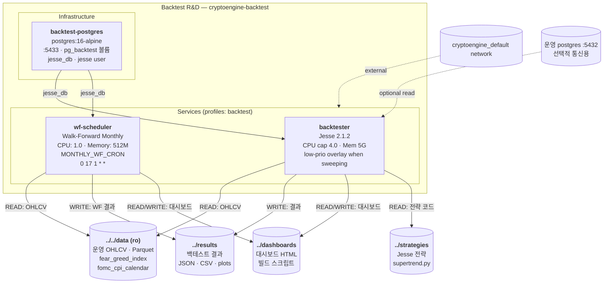
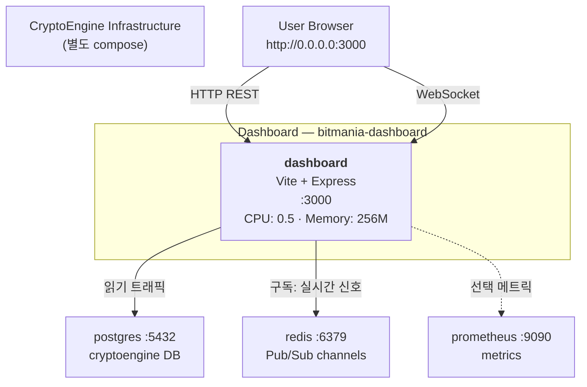

# L2 Containers — 배포 단위 · 포트 · 네트워크

CryptoEngine 프로젝트의 모든 서비스는 **Docker Compose 기반 컨테이너 오케스트레이션**으로 배포됩니다.
이 문서는 C4 L2(Container) 계층에서 배포 단위, 네트워크, 볼륨, 환경변수를 정의합니다.

---

## 1. CryptoEngine 운영 스택 (Production)

```mermaid
flowchart TB
  subgraph prod["CryptoEngine Production — Docker Compose"]
    subgraph infra["Infrastructure Layer"]
      postgres["<b>postgres:16-alpine</b><br/>:5432 · pgdata 볼륨<br/>cryptoengine DB<br/>replicas=256M"]
      redis["<b>redis:7-alpine</b><br/>:6379 · redisdata 볼륨<br/>AOF · 256MB maxmemory<br/>requirepass"]
      prometheus["<b>prometheus:v2.51.0</b><br/>:9090 · prometheus-data 볼륨<br/>30d retention · tsdb"]
      nexp["<b>node-exporter:v1.8.0</b><br/>:9100 expose only<br/>host metrics scraping"]
      rexp["<b>redis-exporter:latest</b><br/>:9121 expose only<br/>redis metrics scraping"]
      pgbak["<b>pg-backup</b><br/>pg_backup.sh<br/>cron: 0 17 * * *<br/>UTC=02:00 KST"]
      logret["<b>log-retention</b><br/>log_retention.sh<br/>cron: 0 18 * * *<br/>UTC=03:00 KST"]
      ohlcvret["<b>ohlcv-retention</b><br/>ohlcv_retention.sh<br/>cron: 0 18 * * *<br/>rolling 7d"]
    end

    subgraph core["Core + Strategy Layer"]
      market_data["<b>market-data</b><br/>Bybit WS · OHLCV<br/>4h/1h candles<br/>Redis Pub/Sub broadcast"]
      md_binance["<b>market-data-binance</b><br/>Binance WS<br/>Track C · optional"]
      md_okx["<b>market-data-okx</b><br/>OKX WS<br/>Track C · optional"]
      orchestrator["<b>strategy-orchestrator</b><br/>Kill Switch logic<br/>Capital allocation<br/>Signal router"]
      execution["<b>execution-engine</b><br/>Order execution (Bybit)<br/>Position tracking<br/>Risk gates"]
      supertrend["<b>supertrend</b><br/>STRATEGY_ID=supertrend-01<br/>4h Long-Only · 3x<br/>combo #7908"]
    end

    subgraph iface["Interface + Observability"]
      telegram["<b>telegram-bot</b><br/>Alert dispatcher<br/>/kill · /positions<br/>Telegram API"]
      grafana["<b>grafana (future)</b><br/>:3002 planned<br/>Prometheus datasource"]
    end
  end

  external_bybit["Bybit Mainnet API<br/>REST · WS"]
  external_tg["Telegram API<br/>Bot API"]
  external_pg[("PostgreSQL Data<br/>OHLCV · logs · positions")]
  external_redis[("Redis Pub/Sub<br/>signal channels")]

  postgres -.->|"health"| postgres
  redis -.->|"health"| redis
  prometheus -->|"scrape"| nexp
  prometheus -->|"scrape"| rexp
  prometheus -->|"tsdb"| prometheus

  market_data -->|"write OHLCV"| postgres
  orchestrator -->|"read metrics"| postgres
  orchestrator -->|"subscr signals"| redis
  execution -->|"read/write"| postgres
  execution -->|"publish fills"| redis
  supertrend -->|"read candles"| redis
  supertrend -->|"publish signals"| redis

  execution -->|"REST · WS<br/>BYBIT_TESTNET=false"| external_bybit
  market_data -->|"WS"| external_bybit

  telegram -->|"send alerts"| external_tg

  pgbak -->|"backup"| postgres
  logret -->|"vacuum logs"| postgres
  ohlcvret -->|"prune old OHLCV"| postgres
```

<!-- last-verified: 2026-06-15 -->
<!-- code-ref: /cryptoengine/docker-compose.yml -->



### 구조 설명

**Infrastructure Layer** — 공유 기반 리소스:
- `postgres`: 모든 서비스의 중앙 상태 저장소 (OHLCV, 포지션, 로그, 메트릭)
- `redis`: Pub/Sub 신호 전파 채널 (시장 데이터 → 전략 → 실행)
- `prometheus`: 메트릭 수집 (node-exporter, redis-exporter)
- 유지보수 작업: 백업, 로그 정리, 캔들 데이터 롤링 보존

**Core + Strategy Layer** — 비즈니스 로직:
- `market-data`: Bybit 메인넷에서 OHLCV 수집 (4h/1h), Redis Pub/Sub으로 broadcast. Track C 분기물은 instruments-info로 동적 해석하며 **core BTCUSDT 구독과 분리** (만기 심볼이 전체 subscribe를 깨지 않음)
- `strategy-orchestrator`: Kill Switch 4단계, 자본 배분, 신호 라우팅
- `execution-engine`: 주문 실행 (Bybit REST), 포지션 추적, 위험 게이트
- `supertrend`: Supertrend 4h 전략 (combo #7908, Long-only, 3x)
- Track C 선택 사항: `market-data-binance`, `market-data-okx`

**Interface + Observability**:
- `telegram-bot`: Telegram 알림 (trade, alert, /kill, /positions)
- `grafana`: 미래 계획 (Prometheus 데이터소스)

> 대시보드는 `cryptoengine/docker-compose.yml`에 포함되지 않는다 — 독립 프로젝트 `bitmania-dashboard`(§9)로 분리 운영됨.

---

## 2. 서비스 상세 사양

| 서비스 | 이미지 | 호스트 포트 | 내부 포트 | Depends On | CPU Limit | Memory Limit | Restart |
|--------|--------|-----------|----------|-----------|-----------|-------------|---------|
| **postgres** | postgres:16-alpine | 127.0.0.1:5432 | 5432 | — | 1.0 | 512M | always |
| **redis** | redis:7-alpine | 127.0.0.1:6379 | 6379 | — | 0.5 | 320M | always |
| **prometheus** | prom/prometheus:v2.51.0 | 0.0.0.0:9090 | 9090 | redis-exp, node-exp | 0.5 | 512M | always |
| **node-exporter** | prom/node-exporter:v1.8.0 | expose | 9100 | — | 0.1 | 64M | always |
| **redis-exporter** | oliver006/redis_exporter:latest | expose | 9121 | redis | 0.1 | 64M | always |
| **pg-backup** | postgres:16-alpine | — | — | postgres | 0.5 | 128M | always |
| **log-retention** | postgres:16-alpine | — | — | postgres | 0.2 | 64M | always |
| **ohlcv-retention** | postgres:16-alpine | — | — | postgres | 0.2 | 64M | always |
| **market-data** | cryptoengine/market-data | — | — | redis, postgres | 0.5 | 256M | always |
| **market-data-binance** | cryptoengine/market-data | — | — | redis, postgres | 0.2 | 128M | unless-stopped |
| **market-data-okx** | cryptoengine/market-data | — | — | redis, postgres | 0.2 | 128M | unless-stopped |
| **strategy-orchestrator** | cryptoengine/orchestrator | — | — | redis, postgres, market-data | 0.5 | 256M | always |
| **execution-engine** | cryptoengine/execution | — | — | redis, postgres | 0.5 | 256M | always |
| **supertrend** | cryptoengine/supertrend | — | — | redis, postgres, market-data | 0.5 | 256M | always |
| **telegram-bot** | cryptoengine/telegram-bot | — | — | redis, postgres | 0.2 | 128M | always |

### 재시작 정책

- **always** — 크리티컬 서비스. 종료 시 자동 재시작
- **unless-stopped** — Track C 선택 수집기. 명시적 중단 시에만 정지

---

## 3. Backtest R&D 스택

<!-- last-verified: 2026-06-15 -->
<!-- code-ref: /backtest/docker/docker-compose.yml -->



### 구조 설명

**별도 독립 스택**:
- Backtest는 `profile: backtest`로 격리 (기본 프로덕션과 분리)
- 실행: `docker compose --profile backtest up -d`

**Data Flow**:
- **Input**: `/data` (운영 OHLCV, read-only 마운트)
- **Output**: `results/`, `dashboards/` (백테스트 산출물)
- **jesse_db**: 백테스트 결과 저장 (메인 cryptoengine DB와 분리)

**서비스**:
- **backtester**: 기본 상한 4 CPU / 5GB. ATR-SL 재스윕은 `compose.sweep-day.yml`(주간 2워커, cpuset 6–7) / `compose.sweep-night.yml`(00–06 KST 6워커, cpuset 3–7) + `nice 19`로 운영 Docker보다 양보한다.
- **wf-scheduler**: 월단위 Walk-Forward 자동 실행 (00:17 UTC = 09:17 KST)

---

## 4. Dashboard 스택

<!-- last-verified: 2026-06-15 -->
<!-- code-ref: /dashboard/docker-compose.yml -->



### 구조 설명

**네트워크**:
- `cryptoengine_default` (external)에 연결
- 운영 postgres, redis, prometheus 접근 가능

**역할**:
- 실시간 포지션, 자산, 신호 시각화
- Telegram 이외 웹 기반 모니터링 인터페이스

**포트**:
- 호스트 바인딩: `0.0.0.0:3000:3000` (운영 네트워크에서 접근)

---

## 5. 포트 맵

| 포트 | 서비스 | 호스트 바인딩 | 용도 | 접근성 |
|------|--------|-------------|------|--------|
| **5432** | postgres | 127.0.0.1 | 운영 데이터베이스 | 로컬 (localhost) |
| **5433** | backtest-postgres | 0.0.0.0 (기본) | 백테스트 jesse_db | 로컬 (백테스트용) |
| **6379** | redis | 127.0.0.1 | Pub/Sub 브로커 | 로컬 (컨테이너 내부) |
| **9090** | prometheus | 0.0.0.0:9090 | 메트릭 쿼리 · UI | 호스트 접근 가능 |
| **9100** | node-exporter | expose only | Prometheus 스크래핑 | 컨테이너 네트워크만 |
| **9121** | redis-exporter | expose only | Prometheus 스크래핑 | 컨테이너 네트워크만 |
| **3000** | dashboard (bitmania-dashboard, §9) | 0.0.0.0:3000 | 실시간 매매 대시보드 | 호스트 접근 가능 |
| **3002** | grafana (future) | 0.0.0.0:3002 | Grafana UI | 호스트 접근 가능 |

### 보안 주의

- **localhost only** (`127.0.0.1`): postgres, redis (내부 통신)
- **공개** (`0.0.0.0`): prometheus, dashboard (모니터링/인터페이스)
- **expose only**: node-exporter, redis-exporter (컨테이너 네트워크 내부 메트릭)

---

## 6. Named Volumes

| 볼륨 | 마운트 경로 | 드라이버 | 용도 |
|------|-----------|---------|------|
| **pgdata** | /var/lib/postgresql/data | local | 운영 데이터베이스 영구 저장 |
| **pg_backtest** | /var/lib/postgresql/data | local | 백테스트 jesse_db 영구 저장 |
| **redisdata** | /data | local | Redis AOF 영구 저장 (256MB maxmemory) |
| **prometheus-data** | /prometheus | local | 메트릭 시계열 저장 (30d) |
| **pg-backups** | /backups | local | PostgreSQL 매일 백업 (02:00 KST) |

### 호스트 경로 바인드

| 호스트 경로 | 컨테이너 경로 | 서비스 | 권한 | 용도 |
|-----------|-------------|--------|------|------|
| `./config` | /app/config | market-data, orchestrator, execution, supertrend, telegram-bot | :ro | 설정 파일 (읽기 전용) |
| `./config/prometheus` | /etc/prometheus | prometheus | :ro | Prometheus 설정 |
| `./scripts/sh/` | /scripts | pg-backup, log-retention, ohlcv-retention | :ro | 유지보수 스크립트 |
| `../.request` | /app/request_dir | telegram-bot | rw | Telegram 요청 큐 |
| `../.result` | /app/result_dir | telegram-bot | rw | Telegram 결과 큐 |

---

## 7. 환경변수 (Critical)

### 공유 환경 (`x-common-env`)

| 변수 | 기본값 | 설명 |
|------|--------|------|
| `DB_HOST` | postgres | 데이터베이스 호스트 |
| `DB_PORT` | 5432 | 데이터베이스 포트 |
| `DB_NAME` | cryptoengine | 데이터베이스 명 |
| `DB_USER` | cryptoengine | 데이터베이스 사용자 |
| `DB_PASSWORD` | (required) | 데이터베이스 암호 |
| `REDIS_URL` | redis://:***REMOVED***@redis:6379 | Redis 연결 URI |
| `LOG_LEVEL` | INFO | 로깅 레벨 (DEBUG, INFO, WARN, ERROR) |
| `ENVIRONMENT` | testnet | 환경 구분 (testnet, mainnet) |

### Phase 5 (운영 모드) — ⚠️ Critical

| 변수 | 서비스 | 값 | 설명 |
|------|--------|-----|------|
| **BYBIT_TESTNET** | market-data, execution-engine, supertrend | **false** | ⚠️ 메인넷 실전. 절대 true로 전환 금지 (포지션 손실) |
| **PHASE5_MODE** | strategy-orchestrator, execution-engine, supertrend | **true** | Phase 5 안전 모드 활성화 |
| **EXPECTED_INITIAL_BALANCE_USD** | strategy-orchestrator, execution-engine, supertrend | **159.74** | 잔고 게이트 폴백 임계값 (Redis `ce:phase5:equity_baseline` 우선) |

### Bybit API

| 변수 | 서비스 | 기본값 | 설명 |
|------|--------|--------|------|
| `BYBIT_API_KEY` | market-data, execution-engine, supertrend | (required) | Bybit API Key |
| `BYBIT_API_SECRET` | market-data, execution-engine, supertrend | (required) | Bybit API Secret |

### Risk Management

| 변수 | 서비스 | 기본값 | 설명 |
|------|--------|--------|------|
| `SAFETY_LEVERAGE_LIMIT` | execution-engine | **3.0** | 레버리지 하드 상한 (절대 초과 금지) |
| `STOP_LOSS_PCT` | execution-engine | 0.2333 | 안전 스탑로스 퍼센트 (진입가 − 70%/lev) |
| `STRICT_MONITORING_HOURS` | strategy-orchestrator, execution-engine, supertrend | 0 | 엄격 모니터링 시간 (0 = 24h) |

### 유지보수 크론

| 변수 | 서비스 | 기본값 | 설명 |
|------|--------|--------|------|
| `BACKUP_CRON` | pg-backup | 0 17 * * * | 백업 스케줄 (02:00 KST) |
| `LOG_RETENTION_CRON` | log-retention | 0 18 * * * | 로그 정리 (03:00 KST) |
| `OHLCV_RETENTION_CRON` | ohlcv-retention | 0 18 * * * | 캔들 롤링 보존 (03:00 KST) |
| `OHLCV_RETENTION_DAYS` | ohlcv-retention | 7 | 보존 기간 (일) |

### Telegram

| 변수 | 서비스 | 기본값 | 설명 |
|------|--------|--------|------|
| `TELEGRAM_BOT_TOKEN` | telegram-bot | (required) | Telegram Bot Token |
| `TELEGRAM_CHAT_ID` | telegram-bot | (required) | 운영자 Chat ID |

### Backtest (profiles: backtest)

| 변수 | 서비스 | 기본값 | 설명 |
|------|--------|--------|------|
| `JESSE_DB_HOST` | backtester, wf-scheduler | backtest-postgres | 백테스트 DB 호스트 |
| `JESSE_DB_PORT` | backtester, wf-scheduler | 5432 | 백테스트 DB 포트 |
| `JESSE_DB_NAME` | backtester, wf-scheduler | jesse_db | 백테스트 DB 명 |
| `JESSE_DB_USER` | backtester, wf-scheduler | jesse | 백테스트 DB 사용자 |
| `JESSE_DB_PASSWORD` | backtester, wf-scheduler | ***REMOVED*** | 백테스트 DB 암호 |
| `MONTHLY_WF_CRON` | wf-scheduler | 0 17 1 * * | 월간 Walk-Forward 스케줄 (09:17 KST) |
| `WF_CAPITAL` | wf-scheduler | 10000.0 | Walk-Forward 자본 (USD) |
| `WF_LOOKBACK_DAYS` | wf-scheduler | 180 | 백테스트 lookback 기간 |
| `WF_TRAIN_DAYS` | wf-scheduler | 120 | 훈련 기간 (일) |
| `WF_TEST_DAYS` | wf-scheduler | 60 | 테스트 기간 (일) |
| `WF_LEVERAGE` | wf-scheduler | 5.0 | Walk-Forward 레버리지 |

---

## 8. Dockerfile 패턴

### 표준 Application Dockerfile

```dockerfile
FROM python:3.12-slim

WORKDIR /app

# 공유 라이브러리 복사 (프로젝트 루트에서 COPY)
COPY cryptoengine/shared /app/shared

# 서비스별 코드 복사
COPY cryptoengine/services/<SERVICE_NAME> /app/

# Python 경로 설정
ENV PYTHONPATH=/app

# 진입점
CMD ["python", "main.py"]
```

### Build Context

**반드시 프로젝트 루트(`.`)에서 빌드**:

```bash
# ✓ 올바른 빌드 명령
docker compose build market-data

# ✗ 실패할 명령
cd cryptoengine && docker compose build market-data  # COPY 경로 해석 실패
```

### 빌드 컨텍스트 경로

```yaml
# docker-compose.yml
services:
  market-data:
    build:
      context: .                                    # 프로젝트 루트
      dockerfile: services/market-data/Dockerfile  # 상대 경로 (context 기준)

  backtester:
    build:
      context: ../..                                # backtest/docker에서 프로젝트 루트로
      dockerfile: backtest/docker/Dockerfile
```

---

## 9. 네트워크 토폴로지

### Production (cryptoengine_default)

```
┌─ docker-compose.yml
│  └─ networks:
│     └─ cryptoengine_default (bridge, implicit)
│        ├─ postgres :5432
│        ├─ redis :6379
│        ├─ prometheus :9090
│        ├─ market-data
│        ├─ strategy-orchestrator
│        ├─ execution-engine
│        ├─ supertrend
│        ├─ telegram-bot
│        ├─ pg-backup
│        ├─ log-retention
│        ├─ ohlcv-retention
│        ├─ node-exporter
│        └─ redis-exporter
```

### Backtest (cryptoengine-backtest-net + external cryptoengine_default)

```
┌─ backtest/docker/docker-compose.yml
│  └─ networks:
│     ├─ cryptoengine-backtest-net (isolated)
│     │  ├─ backtest-postgres :5433
│     │  ├─ backtester
│     │  └─ wf-scheduler
│     └─ cryptoengine_default (external, optional)
│        └─ 운영 postgres에 read-only 접근 가능
```

### Service-to-Service Communication

**Production:**
- 모든 서비스 → postgres: TCP 5432 (heartbeat, schema)
- 모든 서비스 → redis: TCP 6379 (Pub/Sub)
- prometheus → node-exporter: TCP 9100 (scrape)
- prometheus → redis-exporter: TCP 9121 (scrape)

**External:**
- market-data, execution-engine → Bybit: HTTPS (API), WSS (WebSocket)
- telegram-bot → Telegram: HTTPS (Bot API)

---

## 10. 배포 명령

### 프로덕션 기동

```bash
# 모든 서비스 기동
docker compose up -d

# 인프라만 기동 (postgres, redis)
docker compose up -d postgres redis

# 특정 서비스 재빌드 후 기동
docker compose up -d --build --no-deps market-data

# shared/ 변경 시 전체 재빌드 (필수)
docker compose build \
  market-data market-data-binance market-data-okx \
  strategy-orchestrator execution-engine supertrend \
  telegram-bot
```

> `dashboard`는 별도 프로젝트(`/home/justant/Data/Bit-Mania/dashboard`)이므로 여기 재빌드 목록에 포함되지 않는다. §9 참조.

### 모니터링

```bash
# 실시간 로그 (tail 20줄)
docker compose logs --tail=20 -f supertrend

# 특정 시간대 로그
docker compose logs --since=2h -f execution-engine

# 서비스 상태 확인
docker compose ps
```

### 백테스트 실행

```bash
# 일회성 백테스트
docker compose --profile backtest run --rm backtester \
  python /app/scripts/runners/run_external_backtest.py

# 백테스트 스택 기동
docker compose --profile backtest up -d

# 월간 Walk-Forward 수동 실행
docker compose --profile backtest exec wf-scheduler \
  python /app/scripts/runners/run_monthly_wf.py
```

---

## 11. 상태 게이트 (Health Checks)

모든 데이터 레이어 서비스는 startup 검사 포함:

| 서비스 | 검사 방식 | 시작 대기 | Retries |
|--------|---------|---------|---------|
| postgres | pg_isready -U cryptoengine | 30s | 5 |
| redis | redis-cli PING | 10s | 5 |
| market-data | /tmp/heartbeat_ok | 30s | 3 |
| execution-engine | /tmp/heartbeat_ok | 30s | 3 |
| supertrend | /tmp/heartbeat_ok | 30s | 3 |
| dashboard | wget /health | 15s | 3 |

**종속 시작 순서** (depends_on):
1. postgres, redis (기반)
2. market-data (데이터 수집)
3. strategy-orchestrator, execution-engine (코어)
4. supertrend (전략)
5. telegram-bot, dashboard (인터페이스)

---

## 참고 문서

- `docs/README.md` — 프로젝트 MOC
- `docs/structure/services.md` — 서비스 상세 역할
- `docs/policies/operations/runbook.md` — Docker 운영 가이드
- `docs/policies/strategies/supertrend.md` — 전략 파라미터 (SSOT)
- `docs/architecture/data-flow.md` — Redis Pub/Sub 채널
- `docs/env/env-vars.md` — 환경변수 전체 목록
- `backtest/README.md` — 백테스트 인프라
