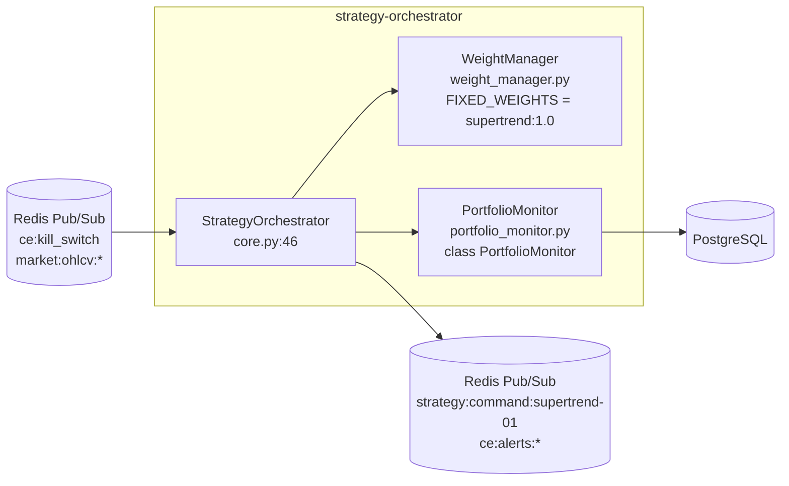
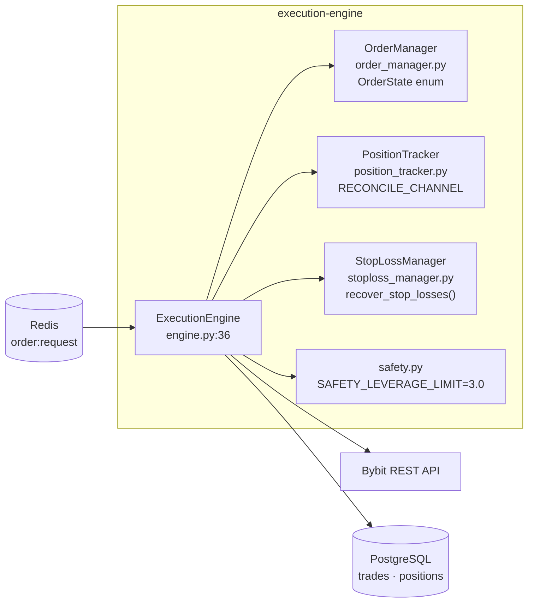
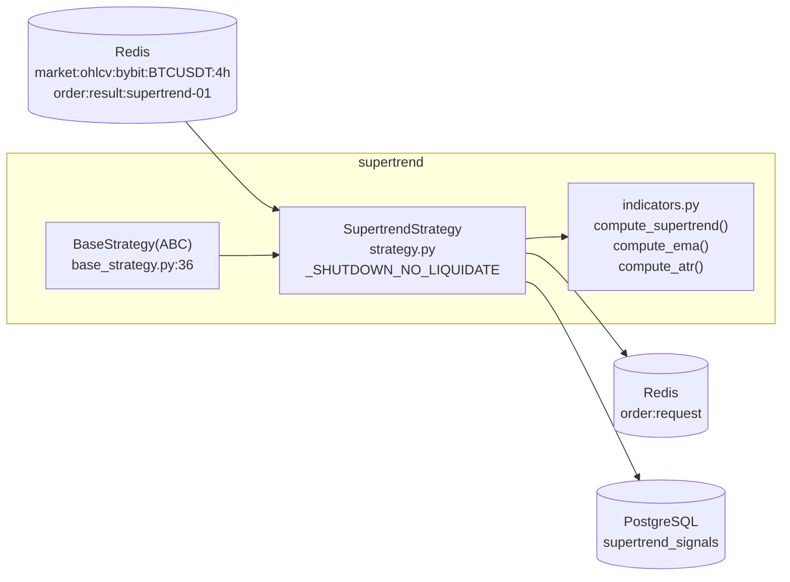
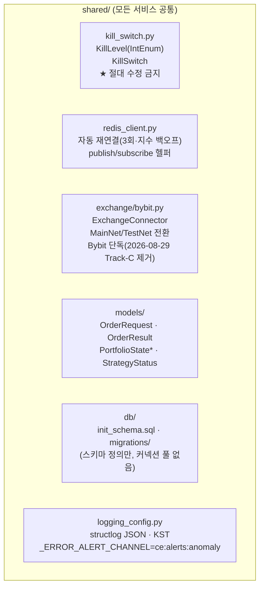

# L3 Components — 서비스 내부 모듈 책임

CryptoEngine의 **C4 L3 Component** 계층 문서입니다. 각 마이크로서비스 내부의 핵심 모듈과 책임 영역을 정의합니다.

---

## Diagram E: StrategyOrchestrator 내부

<!-- last-verified: 2026-08-04 -->
<!-- code-ref: cryptoengine/services/orchestrator/core.py, weight_manager.py, portfolio_monitor.py -->



**모듈 책임**

| 모듈 | 파일 | 핵심 책임 |
|---|---|---|
| StrategyOrchestrator | services/orchestrator/core.py:46 | Kill Switch 4단계 모니터링 · 전략 자본 배분 명령 발행 |
| WeightManager | services/orchestrator/weight_manager.py | FIXED_WEIGHTS = {"supertrend": 1.0, "cash": 0.0} 고정 배분 |
| PortfolioMonitor | services/orchestrator/portfolio_monitor.py | 포트폴리오 P&L 추적 · class PortfolioState · daily/weekly/monthly peak는 **해당 기간** equity만으로 복원 (전체 history max 사용 금지) |

**운영 규칙**:
- 루프 주기: `loop_interval_seconds = 300` (5분)
- Phase 5 감지: `PHASE5_MODE=true` 또는 `BYBIT_TESTNET=false` 시 절대값 임계값 모드 활성화
- Supertrend만 100% 배분 (레짐 배분 폐기, 2026-05-25)
- Kill Switch가 이미 활성(쿨다운)일 때 orchestration 사이클은 CRITICAL 재로깅하지 않음 (Telegram anomaly 스팸 방지). Dead Man's도 이미 KS 활성이면 재_trigger 생략.

---

## Diagram F: ExecutionEngine 내부

<!-- last-verified: 2026-06-15 -->
<!-- code-ref: cryptoengine/services/execution/engine.py, order_manager.py, position_tracker.py, stoploss_manager.py, safety.py -->



**모듈 책임**

| 모듈 | 파일 | 핵심 책임 |
|---|---|---|
| ExecutionEngine | services/execution/engine.py:36 | order:request 구독 → Bybit 주문 실행 · order:result 발행 |
| OrderManager | services/execution/order_manager.py | OrderState(str, Enum) 전이 관리 · 재페그 재시도 (max 20회) |
| PositionTracker | services/execution/position_tracker.py | 포지션 실시간 추적 · RECONCILE_CHANNEL 동기화 |
| StopLossManager | services/execution/stoploss_manager.py | 거래소 스탑로스 주문 배치/취소/복구 |
| safety | services/execution/safety.py | SAFETY_LEVERAGE_LIMIT=3.0 하드캡 강제 |

**운영 규칙**:
- 최대 동시 주문: `MAX_CONCURRENT_ORDERS = 5`
- 주문 타임아웃: `ORDER_TIMEOUT = 420.0` (7분, 재페그 worst-case 대비)
- 포지션 복구: 재시작 시 StopLossManager가 미결 스탑로스 주문 자동 복구

---

## Diagram G: Supertrend 전략 내부

<!-- last-verified: 2026-08-20 -->
<!-- code-ref: cryptoengine/services/strategies/supertrend/strategy.py, indicators.py, services/strategies/base_strategy.py -->



**모듈 책임**

| 모듈 | 파일 | 핵심 책임 |
|---|---|---|
| BaseStrategy | services/strategies/base_strategy.py:36 | 추상 전략 인터페이스 · order:request 발행 · on_stop() |
| SupertrendLiveStrategy | services/strategies/supertrend/strategy.py | 4h 봉 신호 계산 · 진입/청산 결정 · 상태 확정 기반 전환 |
| indicators | services/strategies/supertrend/indicators.py | Jesse 2.1.2 정합 Wilder ATR · EMA · Supertrend 계산 |

**불변 상수** (combo #7908):
- `st_factor = 2.6` — Supertrend ATR 배수
- `st_period = 9` — Supertrend ATR 기간
- `fast_ema_len = 7` — 빠른 EMA
- `slow_ema_len = 29` — 느린 EMA
- `dir_ema_len = 240` — 방향 필터 EMA
- `atr_mult = 3.3` — ATR 손절 배수 (익절 없음, 2026-08-20~)
- `leverage = 3` — 고정 레버리지 (하드캡)
- `CANDLE_LOOKBACK = 1000` — dir_ema(240) 시드 정합 (2026-06-14 300→1000)
- `TIMEFRAME = "4h"` — 4시간 봉
- `SYMBOL = "BTC/USDT:USDT"` — BTC 단일

**상태 확정 기반 전환 규칙** (2026-05-27):
- 진실은 거래소다. 매 봉 신호 판단 전 get_position으로 내부 상태를 교정한다.
- 주문 제출은 낙관적 상태 갱신 없이 pending으로 추적하고, order:result 수신 또는 포지션 폴링으로만 확정한다.
- exit 거부 시 60초 후 1회 재시도 (`EXIT_RETRY_DELAY_S = 60.0`), entry 거부는 재시도하지 않는다.

**셧다운 모드**:
- `_SHUTDOWN_NO_LIQUIDATE = frozenset({"service_shutdown"})` — 서비스 재시작 시 청산 없이 Redis 복구

---

## Diagram H: shared/ 핵심 모듈

<!-- last-verified: 2026-08-29 -->
<!-- code-ref: cryptoengine/shared/kill_switch.py, redis_client.py, exchange/bybit.py, models/, db/init_schema.sql -->



> **2026-08-29 죽은 모듈 제거**: `shared/db/connection.py`, `shared/db/repository.py`(+`__init__.py`)는 임포터가 없어 삭제되었다. 각 서비스는 자체 asyncpg 커넥션 풀을 직접 관리한다(중앙화된 shared 풀 없음). `shared/exchange/binance.py`와 Track-C 팩토리 등록도 함께 삭제 — Bybit 단독. 상세: `docs/90-adr/0009-legacy-strategy-retirement.md`

**KillLevel 계층**:

```python
class KillLevel(IntEnum):
    NONE = 0      # 정상
    STRATEGY = 1  # 개별 전략 정지
    PORTFOLIO = 2 # 전체 포트폴리오
    SYSTEM = 3    # 시스템 장애
    MANUAL = 4    # 수동 비상
```

**모듈 책임**

| 모듈 | 파일 | 핵심 책임 |
|---|---|---|
| KillSwitch | shared/kill_switch.py:50 | 4단계 리스크 계층 관리 · 절대값+퍼센트 혼합 체크 (Phase 5) · 60분 쿨다운 |
| RedisClient | shared/redis_client.py | asyncpg 자동 재연결 (3회·지수 백오프) · Pub/Sub 헬퍼 |
| ExchangeConnector | shared/exchange/bybit.py | REST/WebSocket 통합 · MainNet/TestNet 전환 · rate limit 관리 |
| models | shared/models/ | 서비스 간 메시지 스키마 (Pydantic) |
| db | shared/db/ | `init_schema.sql`(스키마 SSOT) + `migrations/`(순번 .sql). 커넥션 풀·리포지토리 모듈은 2026-08-29 삭제(각 서비스가 개별 관리) |
| logging_config | shared/logging_config.py | structlog JSON 출력 · KST 타임존 · 이벤트 기반 로깅 |

**PortfolioState** 정보:
- 정본: `shared/models/position.py:44`
- 참고: `services/orchestrator/portfolio_monitor.py:29`에 중복 정의 존재 → ADR-0007 해소 예정

**Kill Switch 임계값 (Phase 5 MODE)**:

| 주기 | 퍼센트 | 절대값 (USD) | 발동 조건 |
|------|--------|-----------|-----------|
| 일일 | 5% | $10 | 둘 다 초과 (AND) |
| 주간 | 10% | $20 | 둘 다 초과 (AND) |
| 월간 | 15% | $30 | 둘 다 초과 (AND) |
| cooldown | — | — | 60분 |

정본: `cryptoengine/config/orchestrator.yaml` §phase5

---

## 참고 자료

- **Phase 5 운영 현황**: `docs/README.md` § 현재 진행 상태
- **전략 파라미터**: `docs/policies/strategies/supertrend.md`
- **K3 서비스 구조**: `docs/structure/services.md`
- **Data Flow (Redis Pub/Sub)**: `docs/architecture/data-flow.md`
- **PostgreSQL 테이블**: `docs/structure/README.md`
- **배포 가이드**: `docs/policies/operations/runbook.md`
