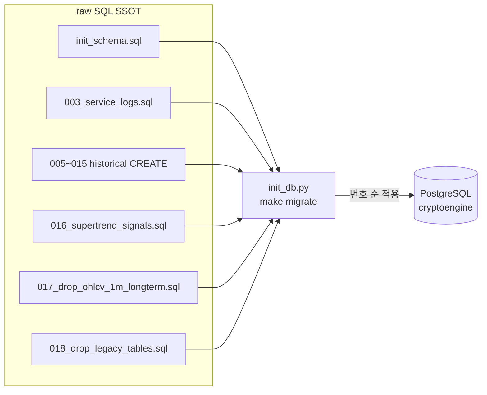

# L4 Data Model — PostgreSQL 스키마 · 마이그레이션

> **권위 규칙**: 스키마 진실 원천 = 코드(마이그레이션 파일) > 이 문서. 충돌 시 코드 우선.

## §1. DB 개요

| 항목 | 값 |
|---|---|
| DBMS | PostgreSQL 16 (Alpine) |
| DB명 (운영) | `cryptoengine` |
| DB명 (백테스트) | `jesse_db` (포트 5433, 별도 compose) |
| 연결 | asyncpg 비동기 풀 min=2 max=10 |
| 마이그레이션 (운영) | raw SQL 단일 트랙 (`shared/db/migrations/NNN_*.sql` through **018**) — `sql_migrations.py` + `scripts/init_db.py` (ADR-0006). Alembic 제거됨 (D4) |
| 마이그레이션 (백테스트) | Jesse 내장 마이그레이션 |
| 초기 스키마 | `cryptoengine/shared/db/init_schema.sql` |
| 포트 (운영) | 5432 (`127.0.0.1` 바인딩) |
| 포트 (백테스트) | 5433 **`127.0.0.1` only** (D8). 예전 `0.0.0.0` 노출 제거 |
| 라이브 크기 (018 후) | **~306MB** (이전 ~9.4GB, 대부분 `quarterly_perp_spread`) |

### 4h 캔들 시각

운영 정본은 `ohlcv_history`에서 `exchange='bybit' AND symbol='BTCUSDT' AND timeframe='4h'`. `timestamp`는 Bybit kline **start**. 종가 UTC 08:00인 봉의 키는 **04:00 UTC**. 상세 [ADR-0010](../90-adr/0010-ops-cleanup-20260829.md) · [strategy.md](../70-policy/strategy.md) §1.1.

---

## §2. ER 다이어그램

<!-- last-verified: 2026-08-29 -->
<!-- code-ref: cryptoengine/shared/db/init_schema.sql, cryptoengine/shared/db/migrations/003_service_logs.sql, cryptoengine/shared/db/migrations/016_supertrend_signals.sql, cryptoengine/shared/db/migrations/018_drop_legacy_tables.sql, cryptoengine/services/execution/main.py -->

```mermaid
erDiagram
    TRADES ||--o{ POSITIONS : "strategy_id"
    TRADES ||--o{ DAILY_REPORTS : "date"
    POSITIONS ||--o{ STRATEGY_STATES : "strategy_id"
    FUNDING_PAYMENTS ||--o{ DAILY_REPORTS : "date"
    KILL_SWITCH_EVENTS ||--o{ STRATEGY_STATES : "strategy_id"
    OHLCV_HISTORY ||--o{ SUPERTREND_SIGNALS : "symbol"
    SUPERTREND_SIGNALS ||--o{ POSITIONS : "bar_ts"
    ORDERS ||--o{ TRADES : "request_id"

    TRADES {
        bigserial id PK
        varchar strategy_id FK
        varchar exchange
        varchar symbol
        varchar side
        varchar order_type
        decimal quantity
        decimal price
        decimal fee
        varchar request_id UK
        varchar status
        timestamptz created_at
        timestamptz filled_at
    }

    POSITIONS {
        bigserial id PK
        varchar strategy_id FK
        varchar exchange
        varchar symbol
        varchar side
        decimal size
        decimal entry_price
        decimal current_price
        decimal unrealized_pnl
        decimal leverage
        timestamptz opened_at
        timestamptz closed_at
        varchar close_reason
    }

    STRATEGY_STATES {
        bigserial id PK
        varchar strategy_id UK
        boolean is_running
        decimal allocated_capital
        decimal current_pnl
        integer position_count
        jsonb config_override
        timestamptz updated_at
    }

    FUNDING_PAYMENTS {
        bigserial id PK
        varchar exchange
        varchar symbol
        decimal funding_rate
        decimal payment
        decimal position_size
        timestamptz collected_at
    }

    OHLCV_HISTORY {
        bigserial id PK
        varchar exchange
        varchar symbol
        varchar timeframe
        decimal open
        decimal high
        decimal low
        decimal close
        decimal volume
        timestamptz timestamp UK
    }

    PORTFOLIO_SNAPSHOTS {
        bigserial id PK
        decimal total_equity
        decimal unrealized_pnl
        decimal realized_pnl_today
        decimal sharpe_ratio_30d
        jsonb strategies
        timestamptz snapshot_at
    }

    DAILY_REPORTS {
        bigserial id PK
        date date UK
        decimal starting_equity
        decimal ending_equity
        decimal daily_pnl
        decimal daily_return
        integer trade_count
        decimal funding_income
        decimal max_drawdown
        text llm_summary
    }

    KILL_SWITCH_EVENTS {
        bigserial id PK
        integer level
        varchar reason
        integer positions_closed
        decimal pnl_at_trigger
        jsonb details
        timestamptz triggered_at
        timestamptz resolved_at
    }

    SERVICE_LOGS {
        bigserial id PK
        varchar service
        varchar level
        varchar event
        text message
        jsonb data
        timestamptz created_at
    }

    LLM_JUDGMENTS {
        bigserial id PK
        varchar rating
        decimal confidence
        varchar regime
        text reasoning
        timestamptz created_at
    }

    LLM_REPORTS {
        bigserial id PK
        varchar title
        varchar rating
        varchar regime
        decimal btc_price
        text debate_conclusion
        timestamptz created_at
    }

    SUPERTREND_SIGNALS {
        bigserial id PK
        timestamptz bar_ts UK
        timestamptz computed_at
        smallint st_dir
        double precision fast_ema
        double precision slow_ema
        double precision dir_ema
        double precision price
        double precision atr_14
        double precision allocated_capital
        boolean had_position
        boolean entry_ok
        boolean exit_signal
        varchar exit_reason
        varchar expected_action
        double precision expected_qty
        double precision expected_stop_loss
    }

    ORDERS {
        bigserial id PK
        text request_id UK
        text order_id
        text exchange
        text symbol
        text side
        text order_type
        double precision quantity
        text status
        text strategy_id
        timestamptz created_at
    }

    OPEN_INTEREST_HISTORY {
        bigserial id PK
        text exchange
        text symbol
        double precision open_interest
        timestamptz timestamp
    }
```

---

## §3. 테이블 분류 및 용도

### 3.1 거래·포지션 (Core Business)

| 테이블 | 용도 | 주요 컬럼 |
|---|---|---|
| `trades` | 모든 주문 기록 (유지 — 018 미DROP) | strategy_id, symbol, side, status, request_id (UK), filled_at |
| `orders` | 실행엔진 주문 추적 (기동 시 CREATE, keep-list) | request_id (UK), order_id, status, strategy_id |
| `positions` | 현재/과거 포지션 | strategy_id, opened_at, closed_at, close_reason, leverage |
| `supertrend_signals` | Supertrend 4h 신호 로그 | bar_ts (UK), entry_ok, exit_signal, expected_action, allocated_capital |

**인덱스**: 
- `trades`: (strategy_id, created_at), (filled_at), (request_id)
- `orders`: (request_id), (status), (strategy_id)
- `positions`: (strategy_id, opened_at), (strategy_id) WHERE closed_at IS NULL
- `supertrend_signals`: (bar_ts), (computed_at DESC), (expected_action, bar_ts DESC)

### 3.2 포트폴리오·보고

| 테이블 | 용도 | 주요 컬럼 |
|---|---|---|
| `portfolio_snapshots` | 시간당/일일 포트폴리오 스냅샷 | total_equity, unrealized_pnl, sharpe_ratio_30d, snapshot_at |
| `daily_reports` | 일일 P&L 리포트 (유지). **`daily_pnl` 테이블은 존재하지 않음** | date (UK), starting_equity, daily_pnl, funding_income, trade_count |
| `strategy_states` | 전략 실행 상태 | strategy_id (UK), is_running, allocated_capital, position_count |
| `kill_switch_events` | Kill Switch 트리거 기록 | level (1~4), reason, positions_closed, triggered_at |

**인덱스**: (date), (strategy_id), (triggered_at)

### 3.3 시장 데이터

| 테이블 | 용도 | 주요 컬럼 |
|---|---|---|
| `ohlcv_history` | 캔들 데이터. 라이브 수집은 **Bybit BTCUSDT 4h만** | exchange, symbol, timeframe, timestamp (UK with exchange, symbol, timeframe) |
| `funding_rate_history` | 펀딩비 이력 | exchange, symbol, rate, timestamp (UK with exchange, symbol) |
| `funding_payments` | 수취한 펀딩비 (유지 — 018 미DROP) | exchange, symbol, funding_rate, payment, collected_at |
| `open_interest_history` | OI 이력 (라이브에 잔존). collector는 Redis `market:open_interest:...` 발행 | exchange, symbol, open_interest, timestamp |

**OHLCV 보존 정책** (`ohlcv_retention.py` / ohlcv-retention 컨테이너):
- 운영 수집: **4h만**, 영구 보존
- 잔여 단기봉(구 수집분): 7일 후 삭제

### 3.4 LLM 분석

| 테이블 | 용도 | 주요 컬럼 |
|---|---|---|
| `llm_judgments` | 단일 판정 (평가용). **라이브 스키마 유지** | rating, confidence, regime, actual_outcome, accuracy_score |
| `llm_reports` | 전문 리포트 (조회/아카이브). **라이브 스키마 유지** | title, rating, confidence, technical_summary, debate_conclusion, asset_report |

### 3.5 인프라·로깅

| 테이블 | 용도 | 주요 컬럼 |
|---|---|---|
| `service_logs` | 서비스 로그 집계 | service, level, event, message, data (JSONB) |

**보존 정책**: 30일 자동 삭제 (log-retention cronjob)

### 3.6 레거시 테이블 — DROPPED (2026-08-29 D2/D3)

> **018 적용 완료.** `018_drop_legacy_tables.sql`을 라이브 Postgres에 적용했다. DB 크기 **~9.4GB → ~306MB**.
> D1: pgdata 볼륨 tar (`~/legacy-cleanup-20260829_pgdata.tar.gz` ~1.5G + compose 볼륨 백업). Postgres ~3분 정지.
> D2: `quarterly_lifecycle.py` 삭제, collector가 quarterly 테이블에 쓰지 않음, DROP 후 market-data 재빌드.
> **018이 DROP하지 않은 것**: `trades`, `funding_payments`, `llm_judgments`, `llm_reports`, keep-list, `daily_reports`.
> **`daily_pnl` 테이블은 원래 없음** (keep-list 주석에만 등장). 일일 P&L은 `daily_reports`.

**라이브 user 테이블 (018 이후)**: `service_logs`, `ohlcv_history`, `funding_rate_history`, `portfolio_snapshots`, `supertrend_signals`, `llm_reports`, `orders`, `positions`, `strategy_states`, `open_interest_history`, `trades`, `daily_reports`, `funding_payments`, `llm_judgments`, `kill_switch_events`.

| 테이블 | 상태 | 비고 |
|---|---|---|
| `quarterly_perp_spread`, `quarterly_futures_history` | **DROPPED** | D2. 구 8.9GB write-only 캘린더 스프레드 잔재 |
| `dca_purchases` | **DROPPED** | D3. DCA 폐지 잔재 |
| `market_regime_history`, `regime_raw_log`, `regime_transitions` | **DROPPED** | D3. 레짐 배분 폐지 잔재 |
| `macro_indicators`, `onchain_metrics`, `multi_exchange_ohlcv`, `multi_exchange_funding` | **DROPPED** | D3 |
| 빈 껍데기 | **DROPPED** | `grid_orders`, `market_regimes`, `etf_flow_*`, `xgboost_ensemble_results`, `calendar_spread_results`, `volatility_squeeze_results`, `funding_extreme_reversal_results`, `regime_accuracy_results`, `liquidation_history`, `macro_events`, `fear_greed_history`, `strategy_variant_results`, `weight_optimization_results`, `walk_forward_results`, `test12_results`, `backtest_results`, 구`ohlcv`, 구`funding_rates` |

**유지 (keep-list + 운영 코어)**: `supertrend_signals`, `orders`, `service_logs`, `portfolio_snapshots`, `ohlcv_history`, `positions`, `strategy_states`, `kill_switch_events`, `llm_judgments`, `llm_reports`, `funding_rate_history`, `trades`, `funding_payments`, `daily_reports`.

---

## §4. 마이그레이션 트랙 (raw SQL 단일 — ADR-0006)

<!-- last-verified: 2026-08-29 -->
<!-- code-ref: cryptoengine/shared/db/sql_migrations.py, cryptoengine/scripts/init_db.py, cryptoengine/shared/db/migrations/018_drop_legacy_tables.sql -->



Alembic (`versions/*.py`, `alembic.ini`, `env.py`, `script.py.mako`)은 **D4에서 저장소에서 제거**됐다. 현행 트랙이 아니다.

### 4.1 numbered `.sql` (운영 SSOT)

Greenfield: `init_schema.sql` 후 `migrations/NNN_*.sql`을 번호 순으로 적용 (`sql_migrations.py`). leftover `versions/` 디렉터리는 건너뜀. 파일 없음·빈 디렉터리·버전 번호 중복은 fail-closed.

| 순번 | 파일 | 용도 | 상태 (라이브 2026-08-29) |
|---|---|---|---|
| 003 | `003_service_logs.sql` | service_logs | ✓ 현행 |
| 005 | `005_etf_flow.sql` | etf/macro CREATE | 객체가 018로 DROP됨 (파일은 이력) |
| 007 | `007_quarterly_futures.sql` | quarterly_futures_history | **DROPPED** (018 / D2) |
| 008 | `008_liquidations.sql` | liquidation_history | **DROPPED** (018) |
| 009 | `009_onchain_metrics.sql` | onchain / fear_greed | **DROPPED** (018) |
| 010 | `010_macro_indicators.sql` | macro_indicators | **DROPPED** (018) |
| 011 | `011_ohlcv_1m_longterm.sql` | ohlcv_1m_longterm | 017에서 DROP |
| 012 | `012_quarterly_perp_spread.sql` | quarterly_perp_spread | **DROPPED** (018 / D2) |
| 013 | `013_multi_exchange.sql` | multi_exchange_* | **DROPPED** (018) |
| 014 | `014_dashboard_performance_indexes.sql` | keep-list 인덱스 | ✓ 현행 |
| 015 | `015_quarterly_perp_spread_unique.sql` | quarterly UNIQUE | 대상 테이블 018 DROP |
| 016 | `016_supertrend_signals.sql` | supertrend_signals | ✓ 현행 |
| 017 | `017_drop_ohlcv_1m_longterm.sql` | 1m longterm DROP | ✓ 현행 |
| 018 | `018_drop_legacy_tables.sql` | 레거시 DROP IF EXISTS | ✓ **라이브 적용** (D3) |

### 4.2 실행 커맨드

```bash
make -C cryptoengine migrate
# → python3 scripts/init_db.py
# → init_schema.sql 후 numbered SQL 순차 적용 (003…018)
```

신규 스키마 변경은 **다음 번호 `.sql`만** 추가한다. Alembic 리비전은 만들지 않는다.

---

## §5. Redis 캐시 키 (보조 Store)

| 키 | 타입 | TTL | 용도 |
|---|---|---|---|
| `cache:portfolio_state` | String(JSON) | 300s | 포트폴리오 상태 스냅샷 |
| `market:ticker:{symbol}` | String(JSON) | 60s | 최신 시세 (e.g., `market:ticker:BTCUSDT`) |
| `cache:balance:bybit` | String(JSON) | 60s | 실시간 잔고 |
| `orchestrator:state` | String(JSON) | 600s | 오케스트레이터 상태 |
| `strategy:saved_state:supertrend-01` | String(JSON) | 3600s | 포지션 복구용 (shutdown → restart recovery) |
| `ce:kill_switch:active` | String | — | Kill Switch 활성 상태 플래그 |
| `stream:market_data` | Stream | — | Redis Pub/Sub (실시간 시세 브로드캐스트) |

---

## §6. 주요 쿼리 패턴

### 6.1 현재 포지션 조회

```sql
SELECT * FROM positions
WHERE strategy_id = 'supertrend_4h_x3_7908'
  AND closed_at IS NULL;
```

### 6.2 일간 P&L

```sql
SELECT 
  date,
  starting_equity,
  ending_equity,
  daily_pnl,
  daily_return,
  trade_count,
  funding_income
FROM daily_reports
WHERE date >= NOW() - INTERVAL '30 days'
ORDER BY date DESC;
```

### 6.3 Supertrend 신호 최근 10봉

```sql
SELECT 
  bar_ts,
  st_dir,
  fast_ema,
  slow_ema,
  entry_ok,
  exit_signal,
  expected_action
FROM supertrend_signals
ORDER BY bar_ts DESC
LIMIT 10;
```

### 6.4 Kill Switch 이벤트

```sql
SELECT 
  triggered_at,
  level,
  reason,
  positions_closed,
  pnl_at_trigger
FROM kill_switch_events
WHERE triggered_at >= NOW() - INTERVAL '7 days'
ORDER BY triggered_at DESC;
```

---

## §7. 데이터 무결성 규칙

| 규칙 | 시행 | 설명 |
|---|---|---|
| **FK 참조** | DB 제약 | strategy_id는 strategy_states에 존재해야 함 |
| **UNIQUE** | DB 제약 | request_id (trades), date (daily_reports), bar_ts (supertrend_signals) |
| **NOT NULL** | DB 제약 | 거래/포지션 핵심 필드 (symbol, side, price, quantity) |
| **타임스탐프 일관성** | 애플리케이션 | created_at ≤ filled_at (trades) |
| **포지션 상태** | 애플리케이션 | closed_at 설정 시 close_reason 필수 |
| **OHLCV 유일성** | DB 제약 | (exchange, symbol, timeframe, timestamp) 조합 |

---

## §8. 성능 및 유지보수

### 8.1 주요 인덱스 전략

- **시계열 쿼리**: timestamp/created_at 내림차순 인덱스 (dashboard, 리포트)
- **필터링**: (strategy_id, created_at) 복합 인덱스 (전략별 조회)
- **범위 쿼리**: (symbol, timestamp) 또는 (date) 인덱스 (시계열 분석)

### 8.2 자동 정리 작업

```bash
# OHLCV 자동 보존 정책 (매일 03:00 UTC)
python cryptoengine/scripts/ohlcv_retention.py

# 서비스 로그 자동 삭제 (매일 04:00 UTC)
DELETE FROM service_logs WHERE created_at < NOW() - INTERVAL '30 days';
```

### 8.3 백업 및 복구

```bash
# 전체 덤프
pg_dump -h postgres -U cryptoengine_user cryptoengine > backup_$(date +%Y%m%d).sql

# D1 (2026-08-29) 018 직전 pgdata tar: ~/legacy-cleanup-20260829_pgdata.tar.gz (~1.5G)

# 복구
psql -h postgres -U cryptoengine_user cryptoengine < backup_20260615.sql
```

---

## §9. 문서 동기화 규칙

**이 문서는 코드의 보조 참조**입니다:

1. **스키마 변경** (테이블/컬럼 추가·제거): 
   - `init_schema.sql` 또는 마이그레이션 파일 수정 후
   - **같은 커밋에서** 이 문서 §2~4 업데이트 + `last_updated` 갱신

2. **마이그레이션 순서 변경**:
   - numbered `.sql` / `init_db.py` / `sql_migrations.py` 변경 후
   - 이 문서 §4 + ADR-0006 업데이트

3. **캐시 키/쿼리 추가**:
   - Redis 또는 SQL 로직 변경 후
   - §5, §6 업데이트

---

## 참고 문서

- **운영 가이드**: [70-policy/operations.md](../70-policy/operations.md)
- **전략 사양**: [70-policy/strategy.md](../70-policy/strategy.md)
- **마이그레이션 ADR**: [90-adr/0006-db-migration-tracks.md](../90-adr/0006-db-migration-tracks.md)
- **코드 경로 인덱스**: [_index.md](../_index.md)
