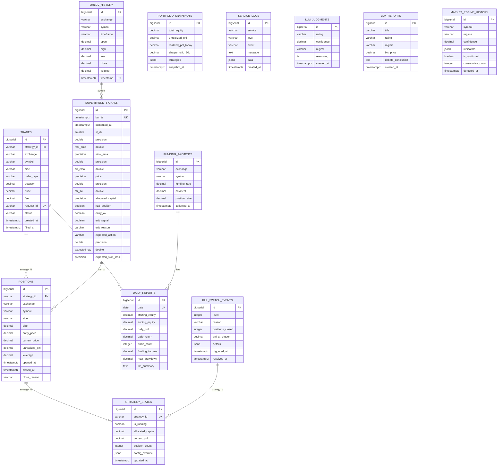
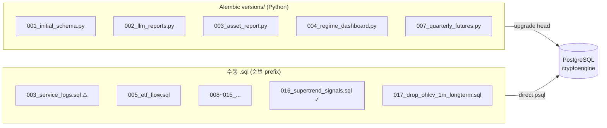

# L4 Data Model — PostgreSQL 스키마 · 마이그레이션

> **권위 규칙**: 스키마 진실 원천 = 코드(마이그레이션 파일) > 이 문서. 충돌 시 코드 우선.

## §1. DB 개요

| 항목 | 값 |
|---|---|
| DBMS | PostgreSQL 16 (Alpine) |
| DB명 (운영) | `cryptoengine` |
| DB명 (백테스트) | `jesse_db` (포트 5433, 별도 compose) |
| 연결 | asyncpg 비동기 풀 min=2 max=10 |
| 마이그레이션 (운영) | Alembic (`shared/db/migrations/versions/`) + 수동 `.sql` (병행) |
| 마이그레이션 (백테스트) | Jesse 내장 마이그레이션 |
| 초기 스키마 | `cryptoengine/shared/db/init_schema.sql` |
| 포트 (운영) | 5432 (내부) |

---

## §2. ER 다이어그램

<!-- last-verified: 2026-06-15 -->
<!-- code-ref: cryptoengine/shared/db/init_schema.sql, cryptoengine/shared/db/migrations/versions/001_initial_schema.py -->



---

## §3. 테이블 분류 및 용도

### 3.1 거래·포지션 (Core Business)

| 테이블 | 용도 | 주요 컬럼 |
|---|---|---|
| `trades` | 모든 주문 기록 | strategy_id, symbol, side, status, request_id (UK), filled_at |
| `positions` | 현재/과거 포지션 | strategy_id, opened_at, closed_at, close_reason, leverage |
| `supertrend_signals` | Supertrend 4h 신호 로그 | bar_ts (UK), entry_ok, exit_signal, expected_action, allocated_capital |

**인덱스**: 
- `trades`: (strategy_id, created_at), (filled_at), (request_id)
- `positions`: (strategy_id, opened_at), (strategy_id) WHERE closed_at IS NULL
- `supertrend_signals`: (bar_ts), (computed_at DESC), (expected_action, bar_ts DESC)

### 3.2 포트폴리오·보고

| 테이블 | 용도 | 주요 컬럼 |
|---|---|---|
| `portfolio_snapshots` | 시간당/일일 포트폴리오 스냅샷 | total_equity, unrealized_pnl, sharpe_ratio_30d, snapshot_at |
| `daily_reports` | 일일 P&L 리포트 | date (UK), starting_equity, daily_pnl, funding_income, trade_count |
| `strategy_states` | 전략 실행 상태 | strategy_id (UK), is_running, allocated_capital, position_count |
| `kill_switch_events` | Kill Switch 트리거 기록 | level (1~4), reason, positions_closed, triggered_at |

**인덱스**: (date), (strategy_id), (triggered_at)

### 3.3 시장 데이터

| 테이블 | 용도 | 주요 컬럼 |
|---|---|---|
| `ohlcv_history` | 캔들 데이터 | exchange, symbol, timeframe, timestamp (UK with exchange, symbol, timeframe) |
| `funding_rate_history` | 펀딩비 이력 | exchange, symbol, rate, timestamp (UK with exchange, symbol) |
| `funding_payments` | 수취한 펀딩비 | exchange, symbol, funding_rate, payment, collected_at |
| `market_regime_history` | 시장 레짐 분류 ⚠️ **폐기 예정 (DROP 예정)** | symbol, regime, is_confirmed, consecutive_count, detected_at |

**OHLCV 보존 정책** (`ohlcv_retention.py` 관리):
- 1m: 30일
- 5m: 90일
- 15m: 180일
- 1h: 365일
- 4h: 730일 (2년)

### 3.4 LLM 분석

| 테이블 | 용도 | 주요 컬럼 |
|---|---|---|
| `llm_judgments` | 단일 판정 (평가용) | rating, confidence, regime, actual_outcome, accuracy_score |
| `llm_reports` | 전문 리포트 (조회/아카이브) | title, rating, confidence, technical_summary, debate_conclusion, asset_report |

### 3.5 인프라·로깅

| 테이블 | 용도 | 주요 컬럼 |
|---|---|---|
| `service_logs` | 서비스 로그 집계 | service, level, event, message, data (JSONB) |
| `dca_purchases` | DCA 구매 이력 (레거시) ⚠️ **폐기 예정 (DROP 예정)** | fear_greed_index, amount_usdt, btc_price, purchased_at |

**보존 정책**: 30일 자동 삭제 (log-retention cronjob)

### 3.6 레거시 테이블 — 폐기 예정 (DROP 예정, 미실행)

> ⚠️ **이 표는 삭제 계획이지 현재 상태가 아니다.** 아래 테이블은 2026-08-29 기준 **DB에 여전히 존재**하며 코드도 이들을 참조할 수 있다.
> DROP은 별도 지연 세션(작업 D3, 봉 마감 직후 실행 창)에서 수행된다. 실행 전까지는 문서·코드 어디에서도 이 테이블들을 삭제된 것으로 취급하지 말 것.
> 근거: `.request/legacy-cleanup-deferred-20260829.md` §작업 D3 (Q11 — 레거시 DB 테이블 전부 DROP + 사전 백업 필수)

| 테이블 | 상태 | 비고 |
|---|---|---|
| `dca_purchases` | 폐기 예정 | DCA 전략 폐지 잔재 (FA→Supertrend 전환, 2026-05) |
| `market_regime_history` | 폐기 예정 | 레짐 분류 데이터 12,776행. 레짐 배분 폐지(2026-05-25)로 미사용 |
| `regime_raw_log` | 폐기 예정 | 12,776행. `market_regime_history` 원시 로그 |
| `regime_transitions` | 폐기 예정 | 550행. 레짐 전이 이력 |
| 빈 껍데기 테이블 약 20개 | 폐기 예정 | `grid_orders`, `market_regimes`, `etf_flow_history`, `etf_flow_results`, `xgboost_ensemble_results`, `calendar_spread_results`, `volatility_squeeze_results`, `funding_extreme_reversal_results`, `regime_accuracy_results`, `liquidation_history`, `macro_events`, `fear_greed_history`, `strategy_variant_results`, `weight_optimization_results`, `walk_forward_results`, `test12_results`, `backtest_results`, 구`ohlcv`, 구`funding_rates`, 구`trades` 등 — 전량 빈 테이블 |

**DROP 제외(대시보드 의존, 유지)**: `supertrend_signals`, `orders`, `service_logs`, `portfolio_snapshots`, `ohlcv_history`, `positions`, `strategy_states`, `kill_switch_events`, `daily_pnl`, `llm_judgments`, `llm_reports`, `funding_rate_history`
> `llm_judgments`/`llm_reports`는 비어 있으나 대시보드가 SELECT함 — DROP 시 `dashboard/src/routes/internal.ts` 동시 수정 필요.

**참고 (D2, 별도 트랙)**: `quarterly_perp_spread`는 **8.9GB / 약 2,791만 행** — 저장소 전체에 `SELECT`가 하나도 없는 write-only 테이블이며, 라이브 `market-data`가 하루 약 30만 행씩 계속 적재 중이다(폐기된 캘린더 스프레드 전략의 잔재, migration 007/012/015). 코드 제거(`quarterly_lifecycle.py` 등) + 테이블 DROP은 D2에서 함께 처리된다 — §4.2 `quarterly_perp_spread` 참조.

---

## §4. 마이그레이션 트랙 (이중 트랙)

<!-- last-verified: 2026-06-15 -->
<!-- code-ref: cryptoengine/shared/db/migrations/versions/, cryptoengine/shared/db/migrations/ -->



### 4.1 Alembic 버전 (운영)

| 버전 | 파일 | 주요 추가 테이블 |
|---|---|---|
| 001 | `001_initial_schema.py` | trades, positions, funding_payments, portfolio_snapshots, daily_reports, strategy_states, kill_switch_events, llm_judgments, ohlcv_history, funding_rate_history, dca_purchases, market_regime_history |
| 002 | `002_llm_reports.py` | llm_reports |
| 003 | `003_asset_report.py` | asset_report 컬럼 추가 (llm_reports) |
| 004 | `004_regime_dashboard.py` | 마켓 레짐 관련 인덱스 최적화 ⚠️ 대상 테이블 폐기 예정 (§3.6) |
| 007 | `007_quarterly_futures.py` | (미지정 — 코드 검증 필요) |

### 4.2 수동 .sql 마이그레이션 (운영)

| 순번 | 파일 | 용도 | 상태 |
|---|---|---|---|
| 003 | `003_service_logs.sql` | service_logs 테이블 신설 | ⚠️ Alembic 003과 충돌 |
| 005 | `005_etf_flow.sql` | (레거시 — 현재 미사용) | deprecated |
| 007 | `007_quarterly_futures.sql` | quarterly_futures 테이블 | active |
| 008 | `008_liquidations.sql` | liquidations 테이블 | active |
| 009 | `009_onchain_metrics.sql` | onchain_metrics 테이블 | active |
| 010 | `010_macro_indicators.sql` | macro_indicators 테이블 | active |
| 011 | `011_ohlcv_1m_longterm.sql` | ohlcv_1m_longterm (이후 DROP) | deprecated |
| 012 | `012_quarterly_perp_spread.sql` | quarterly_perp_spread 테이블 | active ⚠️ write-only 8.9GB/2,791만 행, 제거 대기 (D2, §3.6) |
| 013 | `013_multi_exchange.sql` | multi_exchange_ohlcv 테이블 | active |
| 014 | `014_dashboard_performance_indexes.sql` | 성능 인덱스 추가 | active |
| 015 | `015_quarterly_perp_spread_unique.sql` | quarterly_perp_spread UNIQUE 제약 | active |
| 016 | `016_supertrend_signals.sql` | **supertrend_signals 테이블 신설** | ✓ 현행 |
| 017 | `017_drop_ohlcv_1m_longterm.sql` | ohlcv_1m_longterm DROP | ✓ 현행 |

### 4.3 실행 순서 및 커맨드

```bash
# 1. Alembic 마이그레이션 (자동)
make -C cryptoengine migrate
# → alembic upgrade head (versions/001~007)

# 2. 수만 .sql 실행 (수동, 파일명 순)
# 프로젝트 루트 또는 shared/db/migrations/에서:
for sql in $(ls -1 *.sql | sort); do
  psql "$DB_URL" -f "$sql"
done
```

> **번호 충돌 주의**: `003_asset_report.py` (Alembic) vs `003_service_logs.sql` (수동)
> - 현재: 실제로 두 개 모두 존재 (마이그레이션 트랙 독립)
> - 향후 (ADR-0006): Alembic 단일 SSOT 수렴 예정 (향후 PR)

---

## §5. Redis 캐시 키 (보조 Store)

| 키 | 타입 | TTL | 용도 |
|---|---|---|---|
| `cache:portfolio_state` | String(JSON) | 300s | 포트폴리오 상태 스냅샷 |
| `market:ticker:{symbol}` | String(JSON) | 60s | 최신 시세 (e.g., `market:ticker:BTCUSDT`) |
| `cache:balance:bybit` | String(JSON) | 60s | 실시간 잔고 |
| `orchestrator:state` | String(JSON) | 600s | 오케스트레이터 상태 |
| `strategy:saved_state:supertrend-01` | String(JSON) | 3600s | 포지션 복구용 (shutdown → restart recovery) |
| `ce:kill_switch:active` | String | — | Kill Switch 활성 상태 플래그 |
| `stream:market_data` | Stream | — | Redis Pub/Sub (실시간 시세 브로드캐스트) |

---

## §6. 주요 쿼리 패턴

### 6.1 현재 포지션 조회

```sql
SELECT * FROM positions
WHERE strategy_id = 'supertrend_4h_x3_7908'
  AND closed_at IS NULL;
```

### 6.2 일간 P&L

```sql
SELECT 
  date,
  starting_equity,
  ending_equity,
  daily_pnl,
  daily_return,
  trade_count,
  funding_income
FROM daily_reports
WHERE date >= NOW() - INTERVAL '30 days'
ORDER BY date DESC;
```

### 6.3 Supertrend 신호 최근 10봉

```sql
SELECT 
  bar_ts,
  st_dir,
  fast_ema,
  slow_ema,
  entry_ok,
  exit_signal,
  expected_action
FROM supertrend_signals
ORDER BY bar_ts DESC
LIMIT 10;
```

### 6.4 Kill Switch 이벤트

```sql
SELECT 
  triggered_at,
  level,
  reason,
  positions_closed,
  pnl_at_trigger
FROM kill_switch_events
WHERE triggered_at >= NOW() - INTERVAL '7 days'
ORDER BY triggered_at DESC;
```

---

## §7. 데이터 무결성 규칙

| 규칙 | 시행 | 설명 |
|---|---|---|
| **FK 참조** | DB 제약 | strategy_id는 strategy_states에 존재해야 함 |
| **UNIQUE** | DB 제약 | request_id (trades), date (daily_reports), bar_ts (supertrend_signals) |
| **NOT NULL** | DB 제약 | 거래/포지션 핵심 필드 (symbol, side, price, quantity) |
| **타임스탐프 일관성** | 애플리케이션 | created_at ≤ filled_at (trades) |
| **포지션 상태** | 애플리케이션 | closed_at 설정 시 close_reason 필수 |
| **OHLCV 유일성** | DB 제약 | (exchange, symbol, timeframe, timestamp) 조합 |

---

## §8. 성능 및 유지보수

### 8.1 주요 인덱스 전략

- **시계열 쿼리**: timestamp/created_at 내림차순 인덱스 (dashboard, 리포트)
- **필터링**: (strategy_id, created_at) 복합 인덱스 (전략별 조회)
- **범위 쿼리**: (symbol, timestamp) 또는 (date) 인덱스 (시계열 분석)

### 8.2 자동 정리 작업

```bash
# OHLCV 자동 보존 정책 (매일 03:00 UTC)
python cryptoengine/scripts/ohlcv_retention.py

# 서비스 로그 자동 삭제 (매일 04:00 UTC)
DELETE FROM service_logs WHERE created_at < NOW() - INTERVAL '30 days';
```

### 8.3 백업 및 복구

```bash
# 전체 덤프
pg_dump -h postgres -U cryptoengine_user cryptoengine > backup_$(date +%Y%m%d).sql

# 복구
psql -h postgres -U cryptoengine_user cryptoengine < backup_20260615.sql
```

---

## §9. 문서 동기화 규칙

**이 문서는 코드의 보조 참조**입니다:

1. **스키마 변경** (테이블/컬럼 추가·제거): 
   - `init_schema.sql` 또는 마이그레이션 파일 수정 후
   - **같은 커밋에서** 이 문서 §2~4 업데이트 + `last_updated` 갱신

2. **마이그레이션 순서 변경**:
   - Alembic 또는 .sql 파일 변경 후
   - 이 문서 §4 업데이트

3. **캐시 키/쿼리 추가**:
   - Redis 또는 SQL 로직 변경 후
   - §5, §6 업데이트

---

## 참고 문서

- **운영 가이드**: `docs/policies/operations/runbook.md`
- **전략 사양**: `docs/policies/strategies/supertrend.md`
- **시스템 아키텍처**: `docs/architecture/data-flow.md`
- **환경 변수**: `docs/env/env-vars.md`
- **코드 경로 인덱스**: `docs/CODE_MAP.md`
