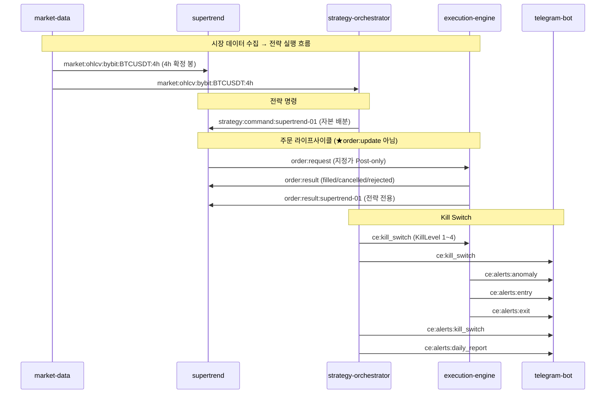

# L5 API — Redis Pub/Sub 채널 카탈로그 + Dashboard REST

> CryptoEngine 마이크로서비스 간 비동기 통신 규약 및 REST 대시보드 인터페이스 명세.

---

## §1. 채널 카탈로그 (Diagram J)

★ **중요**: 기존 문서의 `order:update`는 **코드 드리프트**입니다.
코드 실제 채널: `order:result` + `order:result:{strategy_id}` (execution/engine.py:257,262,312,314)

<!-- last-verified: 2026-06-15 -->
<!-- code-ref: cryptoengine/shared/kill_switch.py:32-35, cryptoengine/services/execution/engine.py, cryptoengine/services/strategies/supertrend/strategy.py, cryptoengine/services/telegram-bot/main.py:72-80 -->

---

## §2. 채널 상수 정의 위치

| 채널 | 상수 정의 | 파일 |
|---|---|---|
| `ce:kill_switch` | `KILL_SWITCH_CHANNEL` | `shared/kill_switch.py:32` |
| `ce:kill_switch:ack` | `KILL_SWITCH_ACK_CHANNEL` | `shared/kill_switch.py:34` |
| `ce:alerts:anomaly` | `_ERROR_ALERT_CHANNEL` | `shared/logging_config.py:154` |
| `position:reconcile_event` | `RECONCILE_CHANNEL` | `services/execution/position_tracker.py:37` |
| `market:ohlcv:bybit:BTCUSDT:4h` | 하드코딩 | `services/strategies/supertrend/strategy.py:926` |

---

## §3. f-string 채널 패턴

| 패턴 | 발행자 | 구독자 |
|---|---|---|
| `market:ohlcv:{exchange}:{symbol}:{tf}` | market-data | supertrend, orchestrator |
| `market:ohlcv:{exchange}:{quarterly}:{tf}` | market-data (분기물, quarterly futures — optional) | analytics |
| `market:ticker:{exchange}:{quarterly}` | market-data (분기물, quarterly futures — optional) | analytics |
| `market:funding:{exchange}:{symbol}` | market-data, funding_monitor | orchestrator |
| `market:open_interest:...` | market-data | orchestrator |
| `market:liquidations:...` | market-data | orchestrator |

> 분기물(quarterly futures) 심볼은 하드코딩하지 않는다. `quarterly_lifecycle.resolve_quarterly_symbols()`가
> Bybit `instruments-info`에서 `BTCUSDT-{dd}{MAR|JUN|SEP|DEC}{yy}` Trading 계약만 골라 구독한다.
> core BTCUSDT 토픽과 분기물 토픽은 **별도 subscribe 배치**로 보내 만기 심볼이 OHLCV 본선을 끊지 않게 한다.
> ⚠️ 이 분기물 파이프라인 자체는 write-only(`quarterly_perp_spread` 8.9GB/무독자)이며 제거 대기 중이다 —
> `.request/legacy-cleanup-deferred-20260829.md` D2, `docs/40-data/data-model.md` §3.6 참조. Track-C(멀티거래소, Binance/OKX)와는 별개다 — Track-C는 2026-08-29 전량 삭제됨.
| `order:request` | supertrend | execution-engine |
| `order:result` | execution-engine | supertrend |
| `order:result:{strategy_id}` | execution-engine | supertrend (전략 전용) |
| `strategy:command:{strategy_id}` | orchestrator | supertrend |
| `ce:strategy:command` | telegram-bot | orchestrator |
| `ce:alerts:{type}` | 전 서비스 | telegram-bot |
| `llm:advisory` | ⚠️ **DEAD** — 발행자 없음 | — |

> `llm:advisory`: `llm-advisor` 서비스와 orchestrator의 `_subscribe_llm_advisory()` 구독 로직이 2026-08-29 전량 삭제되었다. 채널 상수만 코드에 잔존할 수 있으나 발행자가 없어 죽은 채널이다.

---

## §3.1 Redis KV 키 (잔고 · 하트비트)

| 키 | TTL | Writer | 용도 |
|---|---|---|---|
| `ce:phase5:equity_baseline` | 없음 | execution-engine | Phase 5 잔고 게이트 기준선 (전원 장애 복구). JSON: `equity`, `updated_at`, `source` |
| `cache:wallet_balance` | 300s | execution-engine | orchestrator 포트폴리오 equity 조회 |
| `cache:balance:{exchange}` | 300s | execution-engine | 거래소별 잔고 캐시 |
| `heartbeat:execution-engine` | 300s | execution-engine | Dead Man's Switch 감시 |

---

## §4. Dashboard REST API

Dashboard(`dashboard/src/routes/`) 제공 엔드포인트:

### 4.1 내부 API (포트 3000)

| Method | Path | 설명 |
|---|---|---|
| GET | `/api/internal/portfolio` | 포트폴리오 상태 |
| GET | `/api/internal/positions` | 열린 포지션 |
| GET | `/api/internal/trades?limit=&strategy=` | 거래 이력 |
| POST | `/api/internal/kill-switch` | Kill Switch 수동 발동 |
| POST | `/api/internal/resume` | Kill Switch 해제 |
| GET | `/api/internal/supertrend/candles` | 4h OHLCV만 (`ohlcv_history`). 차트 EMA는 라이브 `supertrend_signals` 우선 |
| GET | `/api/internal/supertrend/candles/in-progress` | 미확정 4h 봉 (`cache:ohlcv:bybit:BTCUSDT:4h`) |
| GET | `/compare` | 신호 vs 체결 비교 |
| GET | `/equity` | 자산 곡선 |
| GET | `/status` | 전략 상태 |

### 4.2 공개 API (포트 3001)

| Method | Path | 설명 |
|---|---|---|
| GET | `/api/public/status` | 시스템 상태 (제한) |
| GET | `/api/public/performance` | 성과 요약 (제한) |

---
