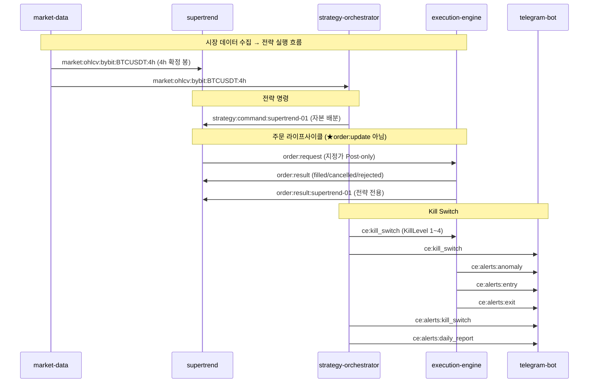

# L5 API — Redis Pub/Sub 채널 카탈로그 + Dashboard REST

> CryptoEngine 마이크로서비스 간 비동기 통신 규약 및 REST 대시보드 인터페이스 명세.

---

## §1. 채널 카탈로그 (Diagram J)

★ **중요**: 기존 문서의 `order:update`는 **코드 드리프트**입니다.
코드 실제 채널: `order:result` + `order:result:{strategy_id}` (execution/engine.py:257,262,312,314)

<!-- last-verified: 2026-06-15 -->
<!-- code-ref: cryptoengine/shared/kill_switch.py:32-35, cryptoengine/services/execution/engine.py, cryptoengine/services/strategies/supertrend/strategy.py, cryptoengine/services/telegram-bot/main.py:72-80 -->

---

## §2. 채널 상수 정의 위치

| 채널 | 상수 정의 | 파일 |
|---|---|---|
| `ce:kill_switch` | `KILL_SWITCH_CHANNEL` | `shared/kill_switch.py:32` |
| `ce:kill_switch:ack` | `KILL_SWITCH_ACK_CHANNEL` | `shared/kill_switch.py:34` |
| `ce:alerts:anomaly` | `_ERROR_ALERT_CHANNEL` | `shared/logging_config.py:154` |
| `position:reconcile_event` | `RECONCILE_CHANNEL` | `services/execution/position_tracker.py:37` |
| `market:ohlcv:bybit:BTCUSDT:4h` | 하드코딩 | `services/strategies/supertrend/strategy.py:926` |

---

## §3. f-string 채널 패턴

| 패턴 | 발행자 | 구독자 |
|---|---|---|
| `market:ohlcv:{exchange}:{symbol}:{tf}` | market-data | supertrend, orchestrator |
| `market:funding:{exchange}:{symbol}` | market-data, funding_monitor | orchestrator |
| `market:open_interest:...` | market-data | orchestrator |
| `market:liquidations:...` | market-data | orchestrator |
| `order:request` | supertrend | execution-engine |
| `order:result` | execution-engine | supertrend |
| `order:result:{strategy_id}` | execution-engine | supertrend (전략 전용) |
| `strategy:command:{strategy_id}` | orchestrator | supertrend |
| `ce:strategy:command` | telegram-bot | orchestrator |
| `ce:alerts:{type}` | 전 서비스 | telegram-bot |
| `llm:advisory` | llm-advisor | orchestrator |

---

## §4. Dashboard REST API

Dashboard(`dashboard/src/routes/`) 제공 엔드포인트:

### 4.1 내부 API (포트 3000)

| Method | Path | 설명 |
|---|---|---|
| GET | `/api/internal/portfolio` | 포트폴리오 상태 |
| GET | `/api/internal/positions` | 열린 포지션 |
| GET | `/api/internal/trades?limit=&strategy=` | 거래 이력 |
| POST | `/api/internal/kill-switch` | Kill Switch 수동 발동 |
| POST | `/api/internal/resume` | Kill Switch 해제 |
| GET | `/candles` | OHLCV + EMA + ST 차트 데이터 |
| GET | `/compare` | 신호 vs 체결 비교 |
| GET | `/equity` | 자산 곡선 |
| GET | `/status` | 전략 상태 |

### 4.2 공개 API (포트 3001)

| Method | Path | 설명 |
|---|---|---|
| GET | `/api/public/status` | 시스템 상태 (제한) |
| GET | `/api/public/performance` | 성과 요약 (제한) |

---
