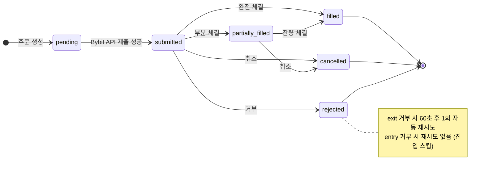
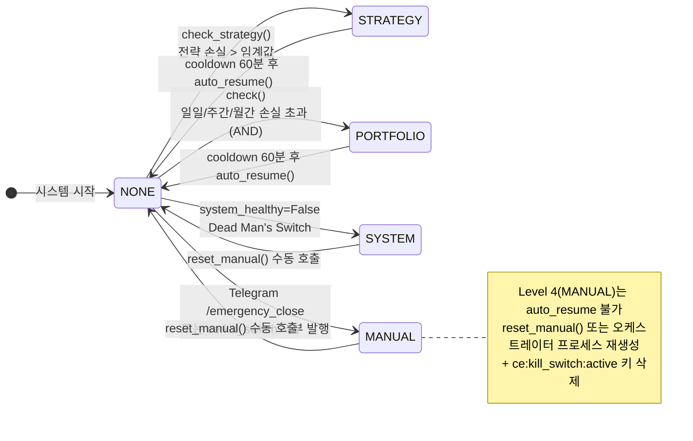
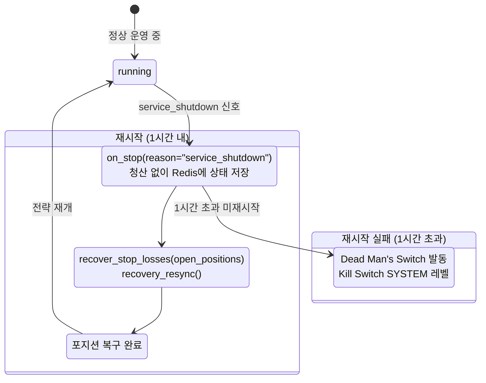

# L6 Runtime — 상태 전이 · service_shutdown 복구

> 주문 상태, Kill Switch 레벨, 서비스 복구 흐름의 완전한 상태 다이어그램 및 전이 규칙.

---

## §1. OrderState 내부 (Diagram K1)

<!-- last-verified: 2026-08-29 -->
<!-- code-ref: cryptoengine/services/execution/order_manager.py:36 -->

### 내부 `OrderState` vs 외부 `OrderResult.status` 매핑

| 내부 OrderState | 외부 OrderResult.status | 비고 |
|---|---|---|
| pending | — | 내부만 (Bybit 미인식) |
| submitted | new | Bybit 접수 확인 |
| partially_filled | partially_filled | 부분 체결 |
| filled | filled | 완전 체결 |
| cancelled | cancelled | 취소 |
| rejected | rejected | 거부 |
| — | expired | Bybit 만료 (내부 enum 없음) |

---

## §2. KillLevel 상태 전이 (Diagram K2)

<!-- last-verified: 2026-08-29 -->
<!-- code-ref: cryptoengine/shared/kill_switch.py:42, cryptoengine/config/orchestrator.yaml, cryptoengine/services/orchestrator/core.py -->

### Phase 5 임계값 (cryptoengine/config/orchestrator.yaml §phase5)

| 주기 | 퍼센트 | 절대값 | 발동 조건 |
|---|---|---|---|
| 일일 | -5% | -$10 | AND (둘 다 초과) |
| 주간 | -10% | -$20 | AND |
| 월간 | -15% | -$30 | AND |
| cooldown | — | — | 60분 |

**ACK 프로토콜**: `ACK_TIMEOUT_SECONDS=5`, `ACK_MAX_RETRIES=3`

---

## §3. service_shutdown 복구 흐름 (Diagram K3)

<!-- last-verified: 2026-08-29 -->
<!-- code-ref: cryptoengine/services/strategies/supertrend/strategy.py:73, cryptoengine/services/execution/engine.py:108, cryptoengine/services/execution/stoploss_manager.py:248 -->

### 복구 핵심 코드

- **청산 제외 사유**: `_SHUTDOWN_NO_LIQUIDATE = frozenset({"service_shutdown"})` — 이 사유 시 청산 없음
- **포지션 상태**: `positions.close_reason` — `signal | stop_loss | kill_switch` (service_shutdown 없음 = 청산 미발생)
- **복구 경로**: `on_stop()` → Redis `strategy:saved_state:supertrend-01` (TTL 3600s) → `recover_stop_losses()` → `recovery_resync()`

**Dead Man's Switch와 혼동하지 말 것**: EE 하트비트 미수신 **5분** → KillLevel SYSTEM. Redis 포지션 스냅샷 TTL **1시간**은 배포 복구용이다. Postgres만 잠시 내려도 EE 프로세스가 살아 있으면 dead-man은 발동하지 않는다 (D1 tar 시 EE 유지).

---

## §4. 외부 킬스위치 수신 (2026-08-29)

<!-- last-verified: 2026-08-29 -->
<!-- code-ref: cryptoengine/services/orchestrator/core.py -->

2026-08-29 이전: `ce:kill_switch` **구독자 0**. Telegram이 발행해도 `ce:kill_switch:active`만 서고 포지션은 남음. ACK 타임아웃. `make emergency`는 없는 모듈로 즉시 실패.

현재: `StrategyOrchestrator._listen_external_kill()`이 채널을 구독한다 (`PUBSUB NUMSUB ce:kill_switch` ≥ 1). 페이로드 JSON `trigger_reason` / `triggered_by` → `KillSwitch.trigger_manual()` → 기존 `_on_kill_switch_trigger` → 전략 `stop(reason=kill_switch)`. **`shared/kill_switch.py`는 수정하지 않음.**

`make -C cryptoengine emergency`는 `emergency_close_all.py`를 EE stdin으로 주입: active 키 SET + 채널 PUBLISH + 전략 stop **직접** 발행(오케스트레이터 다운 시 최후 수단). 청산 확인 후에만 ST/orch `stop`.

플랫 북 검증(2026-08-29 18:35 KST): 테스트 페이로드 발행 → `kill_switch_triggered` 로그 → `DEL`/`SET 0` active → ST 먼저 재생성 후 orch. 이후 `is_running=true`.

---

## §5. 전략 `start` 레이스 (`tick_interval` 60s)

<!-- last-verified: 2026-08-29 -->
<!-- code-ref: cryptoengine/services/strategies/base_strategy.py, cryptoengine/config/strategies/supertrend.yaml -->

메인 루프는 커맨드를 짧게 drain한 뒤 `asyncio.sleep(tick_interval)`(60초)한다. 오케스트레이터가 구독 전에 `start`를 발행하면 메시지는 Redis pub/sub 버퍼에 남고, **다음 틱에서** `command_received`가 난다. 대시보드 `is_running: false`가 1분 미만 지속될 수 있다.

배포 시 **supertrend를 strategy-orchestrator보다 먼저** 올린다. 상세: [ADR-0010](../shared/90-adr/0010-ops-cleanup-20260829.md).

---
