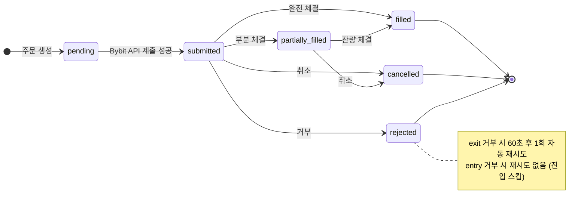
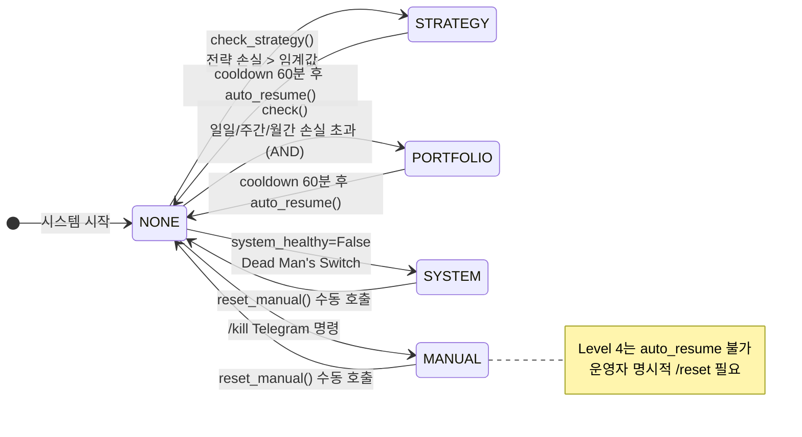
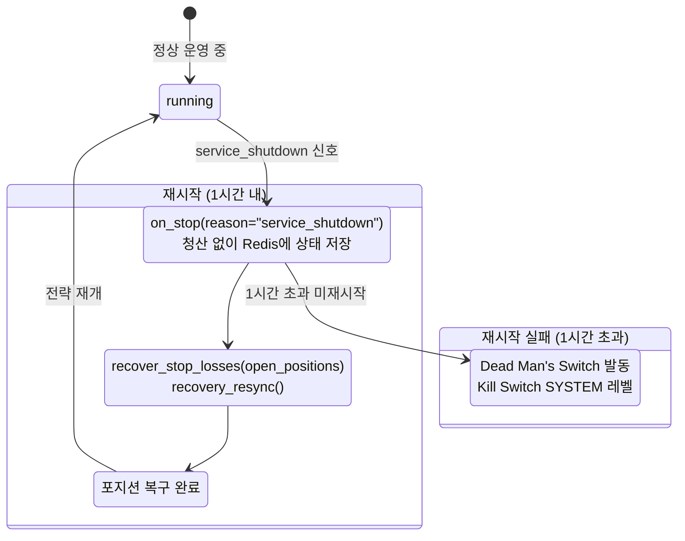

# L6 Runtime — 상태 전이 · service_shutdown 복구

> 주문 상태, Kill Switch 레벨, 서비스 복구 흐름의 완전한 상태 다이어그램 및 전이 규칙.

---

## §1. OrderState 내부 (Diagram K1)

<!-- last-verified: 2026-06-15 -->
<!-- code-ref: cryptoengine/services/execution/order_manager.py:36 -->

### 내부 `OrderState` vs 외부 `OrderResult.status` 매핑

| 내부 OrderState | 외부 OrderResult.status | 비고 |
|---|---|---|
| pending | — | 내부만 (Bybit 미인식) |
| submitted | new | Bybit 접수 확인 |
| partially_filled | partially_filled | 부분 체결 |
| filled | filled | 완전 체결 |
| cancelled | cancelled | 취소 |
| rejected | rejected | 거부 |
| — | expired | Bybit 만료 (내부 enum 없음) |

---

## §2. KillLevel 상태 전이 (Diagram K2)

<!-- last-verified: 2026-06-15 -->
<!-- code-ref: cryptoengine/shared/kill_switch.py:42, cryptoengine/config/orchestrator.yaml -->

### Phase 5 임계값 (cryptoengine/config/orchestrator.yaml §phase5)

| 주기 | 퍼센트 | 절대값 | 발동 조건 |
|---|---|---|---|
| 일일 | -5% | -$10 | AND (둘 다 초과) |
| 주간 | -10% | -$20 | AND |
| 월간 | -15% | -$30 | AND |
| cooldown | — | — | 60분 |

**ACK 프로토콜**: `ACK_TIMEOUT_SECONDS=5`, `ACK_MAX_RETRIES=3`

---

## §3. service_shutdown 복구 흐름 (Diagram K3)

<!-- last-verified: 2026-06-15 -->
<!-- code-ref: cryptoengine/services/strategies/supertrend/strategy.py:73, cryptoengine/services/execution/engine.py:108, cryptoengine/services/execution/stoploss_manager.py:248 -->

### 복구 핵심 코드

- **청산 제외 사유**: `_SHUTDOWN_NO_LIQUIDATE = frozenset({"service_shutdown"})` — 이 사유 시 청산 없음
- **포지션 상태**: `positions.close_reason` — `signal | stop_loss | kill_switch` (service_shutdown 없음 = 청산 미발생)
- **복구 경로**: `on_stop()` → Redis `strategy:saved_state:supertrend-01` (TTL 3600s) → `recover_stop_losses()` → `recovery_resync()`

---
