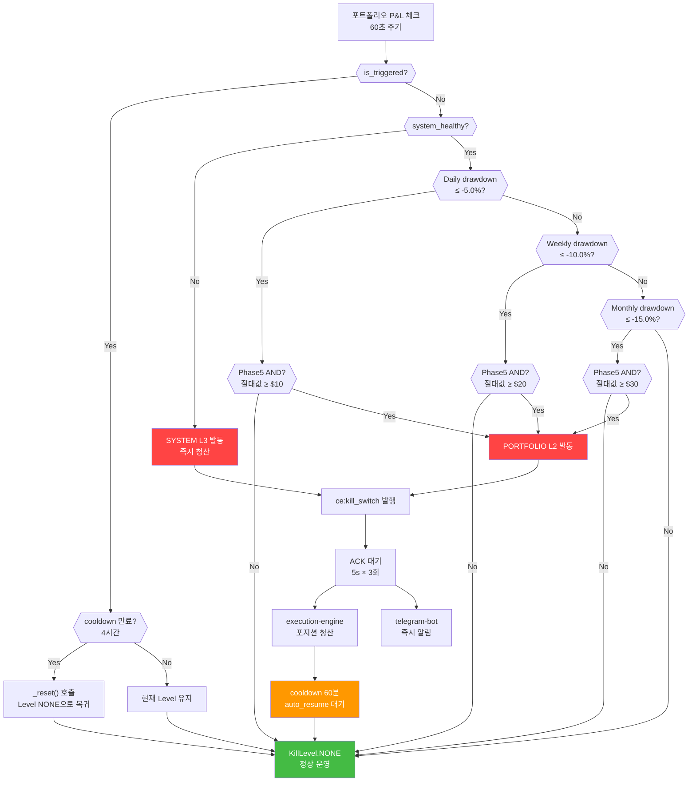

# 70 Policy — 안전 정책

## ⚠️ 불변 규칙 요약 (절대 위반 금지)

다음 규칙은 자금 보호의 최후 방어선이다. **어떤 상황에서도 위반 불가**:

1. **BYBIT_TESTNET=false** — Phase 5 메인넷 실전 중. 테스트넷 전환 전 포지션 수동 청산 필수
2. **Kill Switch 로직 수정 금지** — `shared/kill_switch.py` 절대 변경 불가
3. **레버리지 3x 하드캡** — `SAFETY_LEVERAGE_LIMIT=3.0` 초과 절대 금지
4. **BTC 단일 운영** — 다중 심볼 거래 금지 (ETH, SOL, BNB, XRP 등 모두 금지)
5. **전액 95%×3x 배분** — 레짐 배분 없음, 항상 고정
6. **지정가 우선** — 시장가 직접 진입 금지 (긴급 청산 제외)

---

## §1. Kill Switch 정책

### 1.1 개요

Kill Switch는 CryptoEngine의 **자금 보호 최후 방어선**이다. 포트폴리오 손실이 임계값을 초과하거나 시스템이 이상 상태가 되면 자동으로 모든 포지션을 청산하여 추가 손실을 방지한다.

**원칙**: 수익 추구보다 자본 보호. 수익 기회를 놓치더라도 자본을 지킨다.

**기술**: Stateful, cooldown 기반, auto-resume 지원. Redis Pub/Sub + ACK 프로토콜로 분산 시스템 간 동기화.

### 1.2 KillLevel 계층 (우선순위)

| Level | 이름 | 발동 조건 | 동작 | 자동 재개 |
|---|---|---|---|---|
| 0 | NONE | — | 정상 운영 | — |
| 1 | STRATEGY | 전략 손실 > 임계값 | 해당 전략 포지션 청산 | 4h cooldown 후 |
| 2 | PORTFOLIO | 일일/주간/월간 손실 AND 절대값 | 전체 포지션 청산 | 4h cooldown 후 |
| 3 | SYSTEM | 시스템 장애 (API 오류, 하트비트 5분 미수신) | 즉시 시장가 청산 | **불가** |
| 4 | MANUAL | 운영자 `/kill` 명령 | 즉시 시장가 청산 | **절대 불가** |

### 1.3 Kill Switch Trigger Flow

<!-- last-verified: 2026-06-15 -->
<!-- code-ref: cryptoengine/shared/kill_switch.py, cryptoengine/config/orchestrator.yaml -->



### 1.4 Phase 5 임계값 (메인넷 실전)

**설정 파일**: `cryptoengine/config/orchestrator.yaml §phase5` (핫 리로드 지원, 30초 반영)

| 주기 | 퍼센트 | 절대값 USD | 조건 | Cooldown |
|---|---|---|---|---|
| 일일 | -5.0% | -$10 | AND | 60분 |
| 주간 | -10.0% | -$20 | AND | 60분 |
| 월간 | -15.0% | -$30 | AND | 60분 |

**핵심**: 소액 운영($185 USDT 기준)에서 노이즈 발동을 방지한다.

**예시**:
- 시나리오 A: -3% 상대 손실이지만 $4 절대 손실 → 발동 ❌ (절대값 미달)
- 시나리오 B: -5.5% 상대 + $15 절대 손실 → 발동 ✅ (둘 다 만족)
- 시나리오 C: -6% 상대이지만 $9 절대 손실 → 발동 ❌ (절대값 미달)

### 1.5 ACK 프로토콜

Kill Switch 발동 → execution-engine 포지션 청산 확인:

1. orchestrator: Kill Switch 발동
2. on_trigger 콜백: Redis `ce:kill_switch` 채널 메시지 발행
3. execution-engine: 구독 → 포지션 청산 실행
4. execution-engine: Redis `ce:kill_switch:ack` 채널 ACK 발행
5. orchestrator: ACK 수신 (5초 타임아웃, 최대 3회 재시도)

**상수** (shared/kill_switch.py):
- `KILL_SWITCH_ACK_TIMEOUT_SECONDS = 5`
- `KILL_SWITCH_ACK_MAX_RETRIES = 3`

---

## §2. 레버리지 제한

### 2.1 하드캡

```
코드 상한: 3x (shared/exchange/bybit.py MAX_LEVERAGE=3)
현재 설정: supertrend_4h_x3_7908 (3x 레버리지, Long-only)
절대 5배 초과 금지
```

### 2.2 현재 설정: supertrend_4h_x3_7908

| 파라미터 | 값 | 설명 |
|---------|-----|------|
| **Leverage** | 3x | 선물 포지션에 3배 레버리지 적용 |
| **Position Sizing** | capital × 0.95 × 3 / price | 배분 자본의 95%를 레버리지 포함 포지션으로 |
| **Exchange SL** | entry × 0.7667 | catastrophic backstop (70% equity loss / 3x) |
| **Strategy** | Long-only | 매수 포지션만 (숏 없음) |

### 2.3 백테스트 성과 (Bybit 네이티브 4h: 2017-08 ~ 2026-04)

```
CAGR:           +219.06%    ✅ 매우 높음
Sharpe 비율:    1.667       ✅ 양호
최대낙폭(MDD):  -66.70%     ⚠️ 고위험 (사용자 승인, ATR 익절 없음 2026-08-20)
거래 수:        198회       ✅ 충분한 샘플
```

### 2.4 포지션 사이징 공식

```python
allocated_capital = 200.0    # orchestrator 배분 자본 (전체 잔고)
leverage = 3.0
btc_price = 95_000

qty = (allocated_capital * 0.95 * leverage) / btc_price  # ≈ 0.0060 BTC
notional = qty * btc_price                                # ≈ $570
stop_loss = btc_price * (1 - 0.70 / leverage)            # entry × 0.7667
```

### 2.5 마진 안전성 위험 레벨

| 마진비율 | 상태 | 조치 |
|---------|------|------|
| > 5x | 🟢 안전 | 정상 운영 |
| 3x ~ 5x | 🟡 경고 | Telegram 경고 |
| 1.5x ~ 3x | 🔴 위험 | Kill Switch 검토 |
| < 1.5x | 🔴🔴 긴급 | **즉시 포지션 청산** |

---

## §3. BTC 단일 운영 정책

### 3.1 정책 선언

**CryptoEngine은 BTCUSDT 심볼만 거래한다. 다른 모든 암호자산의 거래는 절대 금지된다.**

| 종류 | 상태 |
|------|------|
| ✅ 허용 | BTCUSDT 현물 + 선물 (Bybit) |
| ❌ 금지 | 모든 알트코인 (ETH, SOL, BNB, XRP, AVAX, DOGE 등) |
| ❌ 금지 | 크로스 심볼 거래 (예: ETH/BTC 상대거래) |
| ❌ 금지 | 선물 단독 (현물 헤징 없는 숏) |
| ❌ 금지 | 다중 거래소 차익거래 |

### 3.2 근거 (3가지 핵심)

**1. BTC의 최상 변동성·유동성·신뢰도**
- BTC: 일일 변동성 2-4%, 연 변동성 ~65%
- ETH: 일일 변동성 3-6%, 연 변동성 ~85%
- 소액 알트: 일일 변동성 10-30%+, 연 변동성 200%+

Supertrend 추세추종 전략 관점: 낮은 변동성 = 신호 신뢰도 높음, 높은 유동성 = 슬리피지 최소

**2. 다중 심볼의 운영 복잡도 및 상관관계 리스크**
- 2022년 암호화폐 동조 하락: BTC -65%, ETH -67%, SOL -88%, LINK -87%
- 포트폴리오 분산 효과 제한적
- 극단 시나리오에서 모두 동시 손실

**3. 현재 Supertrend 전략의 BTC 기반 성과**
- BTC 단일: CAGR +219.06%, Sharpe 1.667, MDD -66.70%, 198 trades ✅
- 멀티심볼: CAGR 음수, Sharpe < 1.0 (백테스트 결과) ❌

### 3.3 구현 (코드 레벨)

```yaml
# config/strategies/supertrend.yaml
entry:
  pairs:
    - BTCUSDT  # 단독 지정, 다른 심볼 금지

# config/exchanges/bybit.yaml
websocket:
  public_topics:
    - kline.240.BTCUSDT  # 4h 캔들만
    # ETH, SOL, BNB, XRP 구독 제거 ✅
```

### 3.4 위반 탐지

정책 위반 탐지 및 방지 흐름:

```bash
# ETH, SOL, BNB, XRP 검색
grep -r "ETH\|SOL\|BNB\|XRP" \
  config/strategies/*.yaml \
  config/exchanges/*.yaml \
  services/market-data/*.py

# 검출 시 빌드 실패 (CI/CD) + PR 거부
```

---

## §4. 배포 시 포지션 보호

### 4.1 핵심 원칙

**배포(재시작)는 포지션을 청산하지 않는다.**

```
배포 = 서비스 재시작
포지션 유지 = Redis에 상태 저장 → 재시작 후 자동 복구
```

### 4.2 종료 사유별 동작

| 종료 사유 | 포지션 | 상태 저장 | 재시작 후 |
|---------|--------|----------|----------|
| `service_shutdown` (배포) | **유지** | Redis 저장 | 자동 복구 |
| `kill_switch` | **즉시 청산** | 이벤트만 저장 | 청산됨 (긴급 상황) |
| `signal_exit` | **즉시 청산** | 거래 기록만 저장 | 청산됨 (신호 기반) |
| `strategy_stop` | **즉시 청산** | 이벤트만 저장 | 청산됨 (전략 정지) |

### 4.3 Redis TTL (Time To Live)

```python
TTL = 3600 초 = 1시간

배포 시 저장된 상태의 유효 기간
→ 재시작 시 TTL 내면 자동 복구
→ TTL 만료 시 포지션 소실 (수동 청산 필요)
```

⚠️ **1시간 이상 중단 후 재시작 시 포지션 복구 불가** → 수동 청산 필요

### 4.4 안전한 배포 절차

```bash
# 1. 이미지 빌드
docker compose build supertrend

# 2. 서비스 재시작 (포지션 자동 유지)
docker compose up -d --build --no-deps supertrend

# 3. 복구 확인 (1-2분 소요)
docker compose logs --tail=50 supertrend | grep -E "복구|recovered"

# shared/ 변경 시 모든 서비스 재빌드 필수
docker compose build market-data execution-engine supertrend strategy-orchestrator telegram-bot
```

### 4.5 공유 라이브러리 (shared/) 변경 시

`shared/` 디렉토리 변경은 모든 서비스에 영향:

```
shared/ 변경
├─ market-data (데이터 수집 영향)
├─ execution-engine (주문 실행 영향)
├─ supertrend (전략 실행 영향)
├─ strategy-orchestrator (오케스트레이션 영향)
└─ telegram-bot (메시징 영향)
```

**필수 조치**: 모든 이미지 재빌드 + 순차 재시작 (2-3분 안정화 대기)

---

## §5. 긴급 수동 청산 SOP

### 5.1 언제 사용하는가

| 상황 | 1차 시도 | 이 절차 사용 |
|------|---------|-----------|
| 봇 응답 없음 | Telegram `/emergency_close` | ACK 5초 내 미수신 |
| Docker 응답 없음 | `make emergency` 실행 | 명령어 실패 시 |
| 서버 완전 다운 | SSH 접속 후 `make emergency` | SSH 접속 불가 시 |
| Bybit 봇 API 장애 | 자동 retry → Kill Switch L3 | 거래소 장애 지속 시 |

### 5.2 비상 청산 프로세스

**Step 0: 사전 확인 (30초)**
1. Bybit 앱/웹 접속: https://www.bybit.com → 로그인
2. **[선물]** 탭 → **[포지션]** 확인 (종목, 수량, 진입가, 현재 손익 기록)
3. **[현물]** 탭 → BTC 보유량 확인

**Step 1: 영구선물 포지션 청산 (모바일 앱)**
1. 하단 **[거래]** 탭
2. **[선물]** → **[포지션]** 확인
3. `BTCUSDT Long` 포지션 찾기
4. **[청산]** 버튼 → 수량: 전량 → 주문 유형: **시장가(Market)**
5. **[확인]** → PIN/생체 인증

**Step 2: 미체결 주문 취소**
1. **[거래]** → **[미체결 주문]** 탭
2. StopMarket, StopLoss 유형 주문 모두 **[취소]**

**Step 3: 청산 완료 확인**
| 확인 항목 | 기대값 |
|---------|--------|
| 선물 포지션 | 0 (없음) |
| 미체결 선물 주문 | 0 |
| USDT 잔고 | 초기 잔고 ± 손익 |

**Step 4: 봇/DB 상태 정리 (SSH 가능 시)**
```bash
docker compose stop supertrend execution-engine strategy-orchestrator
docker compose exec postgres psql -U cryptoengine -d cryptoengine -c \
  "UPDATE positions SET status='closed', exit_reason='emergency_manual' WHERE status='open';"
docker compose exec redis redis-cli -a ${REDIS_PASSWORD} FLUSHDB  # 캐시 클리어
docker compose up -d execution-engine strategy-orchestrator supertrend
```

**Step 5: 원인 분석**
```bash
docker compose logs --since=1h supertrend execution-engine | grep -E "ERROR|CRITICAL"
docker compose exec postgres psql -U cryptoengine -d cryptoengine -c \
  "SELECT * FROM kill_switch_events ORDER BY triggered_at DESC LIMIT 5;"
```

**Step 6: 사고 보고 체크리스트**
- [ ] 비상 청산 시각 기록
- [ ] 청산 당시 포지션 상세 (종목, 수량, 진입가, 청산가, 손익)
- [ ] 원인 파악 (서비스 로그, Kill Switch 이벤트)
- [ ] 재발 방지 조치 결정
- [ ] `docs/incident_log/YYYY-MM-DD.md` 에 사고 내용 기록

### 5.3 Phase 5 계속 진행 여부

- 손실 < $10 → 원인 분석 후 재개 가능
- 손실 $10~$30 → Phase 4 복귀 검토
- 손실 > $30 → **Phase 5 즉시 종료**, 전략 재검토

---

## §6. 모니터링 및 확인

### 6.1 Redis 상태 확인

```bash
# Kill Switch 활성 여부
redis-cli GET ce:kill_switch:active
# 결과: "1" (활성) 또는 없음 (비활성)

# Kill Switch 채널 구독 (디버그)
redis-cli SUBSCRIBE ce:kill_switch
```

### 6.2 데이터베이스 로그 확인

```bash
# Kill Switch 발동 이력
docker compose exec postgres psql -U cryptoengine -d cryptoengine -c \
  "SELECT timestamp, event_code, message FROM service_logs \
   WHERE event_code LIKE 'kill_switch%' \
   ORDER BY timestamp DESC LIMIT 20;"
```

### 6.3 Grafana 대시보드

http://localhost:3002 (기본 로그인: admin / ***REMOVED***)

대시보드 패널:
- **Kill Switch Status**: 현재 활성 레벨
- **Last Trigger Time**: 마지막 발동 시각
- **Portfolio Drawdown**: 일간/주간/월간 낙폭 추이
- **Margin Ratio**: 마진비율 실시간 모니터링

---

## §7. 주의사항

### 7.1 Kill Switch 약화 금지

Kill Switch는 자본 보호의 최후 방어선이다. 다음은 절대 금지:

- ❌ 임계값 상향 조정 (발동 어렵게 함)
- ❌ auto_resume 비활성화 (L1, L2에서)
- ❌ 콜백 함수 제거 또는 무시
- ❌ ACK 프로토콜 우회
- ❌ 절대값 AND 조건 제거 (Phase 5)

**변경 필요 시**:
1. ADR (Architecture Decision Record) 작성
2. 백테스트로 영향도 검증
3. Phase 4 테스트넷에서 충분히 검증
4. 팀 동의 후 Phase 5 적용

### 7.2 배포 전 필수 사항

execution-engine 재시작 시 Phase 5 잔고 게이트는 다음 순서로 기준값을 고른다.

1. Redis `ce:phase5:equity_baseline` (운영 중 60초마다 자동 갱신, TTL 없음)
2. 없으면 `.env`의 `EXPECTED_INITIAL_BALANCE_USD` (콜드스타트 / Redis wipe 폴백)

허용 오차 5%. 게이트·Kill Switch 로직 약화 금지.

```bash
# Redis baseline 이 없거나 게이트 실패 시에만 .env 현행화
# 현재 잔고 확인 (Bybit 대시보드 또는 로그 actual_usdt)
EXPECTED_INITIAL_BALANCE_USD=159.74  # 실제 잔고
```

하트비트 단절로 Dead Man's Switch가 발동했다면 `strategy-orchestrator` 재시작으로 인메모리 Kill 상태를 초기화한다.

---

## 관련 문서

- [state-machines.md](../60-runtime/state-machines.md) — KillLevel 상태머신 · OrderState
- [operations.md](operations.md) — 운영 Runbook · 배포 · 모니터링
- [strategy.md](strategy.md) — Supertrend 전략 사양 · 백테스트
- [system-context.md](../10-context/system-context.md) — L1 외부 액터 · 서브시스템 경계
