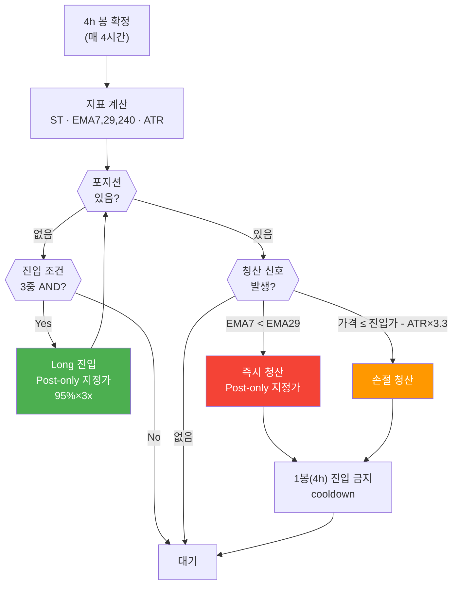

# Supertrend 전략 SSOT · 백테스트 방법론

## §1. 전략 개요

| 항목 | 값 |
|---|---|
| 전략명 | Supertrend 4h Long-Only 3x (combo #7908) |
| Strategy ID | supertrend-01 |
| 심볼 | BTCUSDT — 라이브 거래는 Bybit 네이티브 4h, 백테스트 정본 시세는 Binance 4h (§6 출처 정정 참조) |
| 타임프레임 | 4h |
| 방향 | Long-only (숏 없음) |
| 레버리지 | 3x 하드캡 (`SAFETY_LEVERAGE_LIMIT=3.0`) |
| 배분 | 보유자본 100% → 전략 내 95%×3x |
| 운영 상태 | Phase 5 메인넷 실전 중 (2026-05-18~) |
| 자본 (역사) | Phase 5 개시 $185.31 (2026-05-18). 중간 스냅샷 $181.99. **2026-08-29 청산 후 지갑 ≈ $238.88** |
| 채택 설정 | combo #7908 (매개변수 스윕 최적값) |

---

## §1.1 4h 종가에서만 평가 (운영 SSOT)

라이브 Supertrend는 **확정 4h 봉의 close**로만 진입/청산을 판단한다. ST 선이 빨개져도 EMA 데드크로스가 아니면 청산하지 않는다.

| 항목 | 규칙 |
|---|---|
| 종가 시각 | UTC 00/04/08/12/16/20 (= KST 09/13/17/21/01/05) |
| DB `ohlcv_history.timestamp` | 봉 **open**. UTC 08:00에 마감된 봉 = **04:00 UTC** 행 |
| 형성 중 봉 | Redis `cache:ohlcv:bybit:BTCUSDT:4h`, API `/candles/in-progress` |
| 평가 지연 | 마감 후 market-data가 confirm kline을 pub → ST 구독. Redis 재시작 후 ST/EE를 recreate하지 않으면 pub/sub이 죽어 **종가 청산이 빠질 수 있음** (2026-08-29 17:00 KST 사례) |

`tick_interval: 60`은 봉 사이 대기·커맨드 drain용이지 1분봉 매매가 아니다.

---

## §2. 파라미터 (combo #7908 SSOT)

| 파라미터 | 값 | 설명 |
|---|---|---|
| st_period | 9 | Supertrend ATR 기간 |
| st_factor | 2.6 | Supertrend ATR 배수 |
| fast_ema | 7 | 빠른 EMA (단기 모멘텀) |
| slow_ema | 29 | 느린 EMA (중기 방향) |
| dir_ema | 240 | 방향 필터 EMA (장기 추세) |
| atr_mult | 3.3 | ATR 손절 배수 (익절 없음, 2026-08-20~) |
| CANDLE_LOOKBACK | 1000 | 지표 계산 봉 수 (dir_ema 240 시드 정합) |
| min_notional | $65 | 최소 주문 금액 (Bybit 기준) |

**정본 파일**: `cryptoengine/config/strategies/supertrend.yaml`

**지표 구현 정합 (2026-06-14)**:
- 라이브 EMA·ATR·Supertrend는 백테스트 엔진(Jesse 2.1.2 combo #7908)과 수치 일치
- EMA: `close[0]` 시드 재귀 (≡ `jesse_rust.ema`)
- ATR: Wilder `_atr_jesse` (≡ `jesse_rust.atr`, period-1 시드)
- Supertrend: 정본 포팅 (밴드 리셋 절 + gated flip)
- **TA-Lib 미사용** (SMA 시드 차이 제거, 2026-06-14)
- 검증: `tests/unit/test_supertrend_parity.py` (5/5 통과)

---

## §3. 진입 조건 (3중 AND)

**모든 3가지 조건이 동시에 만족해야 진입**:

1. `Close > ST선` — Supertrend 상승 국면
   - Supertrend의 상승선(ST_lower) 위에 가격이 있음
   - 상승 추세 진행 중

2. `EMA(7) > EMA(29)` — 골든크로스 (단기 > 중기)
   - 단기 모멘텀이 중기 방향보다 강함
   - 최근 가격 상승 확인

3. `Close > EMA(240)` — 장기 방향 확인
   - 장기 추세(240 EMA)보다 위에 있음
   - 큰 틀의 상승 추세 확인

---

## §4. 진입/청산 Flowchart

<!-- last-verified: 2026-08-29 -->
<!-- code-ref: cryptoengine/services/strategies/supertrend/strategy.py, cryptoengine/config/strategies/supertrend.yaml -->



---

## §5. 청산 조건

| 조건 | 트리거 | 우선순위 | 비고 |
|---|---|---|---|
| EMA 데드크로스 | EMA(7) < EMA(29) | **최우선** | 즉시 청산 (추세 반전) |
| ATR 손절 | 가격 ≤ 진입가 - ATR(14)×3.3 | 높음 | 자동 청산 + 1봉 cooldown |
| ATR 익절 | — | **없음** | 2026-08-20 제거. 상승 추세는 EMA 데드크로스까지 보유 |
| 진입 후 쿨다운 | ATR 손절 후 1봉(4h) | 제약 | 신규 진입 차단 |
| 안전 스탑 | 진입가 - 70%/3x | 안전 | 거래소 스탑로스 (STOP_LOSS_PCT=0.2333) |

---

## §6. 백테스트 성과 (Binance 4h·00계열 격자 정본)

> ⚠️ **데이터 출처 정정 (2026-08-31)**: 이 절은 오랫동안 "Bybit 네이티브 4h 정본"으로 기재돼 있었으나, 조사 결과 **정본 백테스트의 시세는 Binance 데이터**다(백테스트 픽스처 `btc_4h*.csv` ← `jesse_db.ohlcv_4h` ← Binance Vision, `exchange` 컬럼의 `'Bybit Perpetual'`은 다운로드 스크립트가 하드코딩한 라벨). 라이브가 거래하는 Bybit 시세와는 종가 기준 **평균 +0.05%** 차이가 있다. 2026-06-14 정합 작업이 실제로 고친 것은 **격자 어긋남(02계열→00계열)**이며 그 수정은 유효하다 — 잘못된 것은 거래소 라벨뿐이다. 아래 지표는 그대로 유효하되 **"Binance 시세 기준"으로 읽어야 한다.** 동일 구간을 라이브 Bybit 데이터로 재실행하면 net +3.1%p·MDD +3.2%p 차이가 나며 34거래 중 32건은 동일하다. 상세·선택지: `backtest/results/2026-08-31/csv_ohlcv_drift.md`.

**Backtest Period**: 2017-08-17 ~ 2026-04-30 (9년)  
**청산 규칙**: EMA 데드크로스 + ATR 손절만 (익절 없음, 2026-08-20 SSOT)

| 지표 | 값 | 평가 |
|---|---|---|
| **CAGR** | +219.06% | ✅ 매우 우수 |
| **Sharpe Ratio** | 1.667 | ✅ 양호 |
| **Maximum Drawdown** | **-66.70%** | 🚨 **고위험** |
| **총 거래 수** | 198회 | ✅ 충분한 샘플 (EMA 청산 197 / ATR 손절 1) |
| **승률** | 42.42% | ✅ 양수 기대값 (PF 1.507) |

이전 규칙(ATR 대칭 손절·익절) 참고: CAGR +137.64% / Sharpe 1.349 / MDD −73.29% / 360 trades.

Jesse 스윕 window-mean(익절 없음, combo #7908): CAGR_new **281.36%** (8 windows 산술평균). 전기간 CAGR(+219.06%)과 정의가 다름.

### ⚠️ 위험 평가

**MDD −66.70%는 고위험입니다**:

- **극단 시나리오**: 2022년 BTC 약세장 중 연쇄 손실
- **복구 기간**: 수개월 이상 소요 가능
- **자본 영향**: $185 → 약 $62 (약 67% 손실)
- **심리적 압박**: 60%대 낙폭 시 정신적 스트레스 큼

**그럼에도 채택된 이유**:
1. CAGR +219.06% — 파워풀한 장기 수익성 (익절 제거 후 추세 보유)
2. 추세 추종 특성 — BTC 상승장에서 극대 이익 창출
3. 사용자 승인 — 위험 인지 후 명시적 동의 (2026-08-20 ATR 익절 제거)

---

## §7. 주문 실행 방식

| 구분 | 방식 | 비고 |
|---|---|---|
| **진입** | Post-only 지정가 → best-bid re-peg | 10s 주기, 최대 20회 |
| **청산** | Post-only 지정가 → best-ask re-peg | 10s 주기, 최대 20회 |
| **긴급 청산** | 시장가 | on_stop 조건 (shutdow) |
| **폴백** | 20회 미체결 시 시장가 | 잔량만 발주 |
| **수수료** | Maker 0.020% | Bybit 기준 |
| **Re-peg 정책** | 부분체결 누적 추적 → 잔량만 재발주 | 2026-06-13 수정 (과체결 방지) |

---

## §8. 상태 동기화 (2026-06-13~)

미체결 사고 재발 방지를 위해 전략의 상태 관리를 "낙관적 갱신"에서 "확정 기반"으로 전환 (2026-05-27 사고 이후).

| 구분 | 동작 |
|---|---|
| **진실 동기화** | 매 봉 신호 판단 **전** `get_position()`으로 거래소 실포지션 확인. 발산 감지 시 `position_state_divergence` ERROR |
| **주문 확정** | 제출 시 낙관적 상태 변경 없이 pending으로 추적. 주문 결과 수신 또는 포지션 폴링(20s)으로만 확정 |
| **확정 시한** | 450초 초과 시 `pending_order_unresolved` ERROR + 재동기화 |
| **exit 거부** | ERROR + 재동기화 + **60초 후 1회 자동 재시도** (일시적 차단 자동 회복) |
| **entry 거부** | ERROR + 재동기화만 (진입 스킵이 안전한 방향) |
| **쿨다운** | `_last_liquidation_ts` / `_atr_cooldown_until` 은 청산 **확정** 시에만 설정 |
| **봉 누락 복구** | 확정 봉 메시지 미수신 시 워치독이 마감+10분 후 REST 백필 |
| **실체결가 채택** | 진입 확정 시 entry_price를 주문가가 아닌 실체결가로 기록 (ATR exit 정확도) |

---

## §9. 백테스트 방법론 (backtest/ R&D 트리)

### 엔진 및 인프라

```
백테스트 디렉토리: /home/justant/Data/Bit-Mania/backtest/
엔진: Jesse 2.1.2 (combo #7908 정본)
DB: jesse_db (backtest-postgres :5433, 별도 compose)
데이터: 운영 OHLCV read-only 마운트 (../../data:/data:ro)
```

### Walk-Forward (WF) 스케줄 — 폐지됨 (2026-08-29)

`wf-scheduler` 서비스(월간 자동 IS/OOS 재최적화, `backtest/docker/docker-compose.yml`)는 FA 시대 잔재(`WF_FA_RATIO`/`WF_REINVEST`/`WF_LEVERAGE` env)로 2026-08-29 전량 삭제되었다. 아래는 **과거(아카이브) 사양**이며 현재 실행되지 않는다:

- ~~**일시**: 매월 1일 02:00 KST~~
- ~~**데이터**: 최근 6개월 (IS 3개월 + OOS 3개월)~~
- ~~**최적화**: IS에서 파라미터 재최적화~~
- ~~**검증**: OOS에서 독립적 성과 검증~~
- ~~**결과**: Telegram 자동 전송~~

현재 파라미터 재검증은 수동 그리드 재스윕(아래)으로만 수행된다.

### 그리드 재스윕 (v10_notp, ATR 손절만) — 중단됨 (2026-08-29)

대시보드에 있던 유일 파라미터 공간은 v7_st 15,000 combo이다 (v6_st 1,296는 부분집합). 2026-08-20부터 `v10_notp`에 combo만 복사한 뒤 8윈도우를 재실행하는 재스윕이 계획되었으나, **2026-08-29 Q13 결정으로 중단이 확정**되었다 — `backtester` 컨테이너가 3개월간 미가동 상태이며, 15,000개 combo는 이미 Postgres에 적재된 채 재개 대기 중이다(데이터는 보존, 삭제하지 않음). 기존 v6_st/v7_st window 결과도 보존된다. 재개할 경우 스케줄러는 KST 00–06에 워커 6 (cpuset 3–7), 그 외 워커 2 (cpuset 6–7), `nice 19`로 운영 스택과 CPU를 분리하는 설계였다. 상세: `backtest/README.md`, `docs/90-adr/0009-legacy-strategy-retirement.md`.

### 현재 채택 설정

**combo #7908** (2026-08-20 정본, ATR 손절만):
- 4h 00계열 격자 1:1 정본 (시세 출처는 Binance — §6 출처 정정 참조)
- 2017-08-17 ~ 2026-04-30 (9년 데이터)
- CAGR +219.06% / Sharpe 1.667 / MDD -66.70% / 198 trades

### v11 로버스트 최적탐색 재스윕 (2026-08-30) — 결론: `#7908` 유지

Jesse Stage A 8윈도우(2,493 combo × 8 = 19,944 jobs)에서 채택 후보 5개(`#799 #895 #847 #871 #1034`)가 나왔으나, 정본 Bybit 네이티브 4h hold-out 리플레이(`cryptoengine/tests/fixtures/_replay_supertrend.py`)에서 **전원 탈락** — `#7908`이 전기간 CAGR·MDD·W9 모든 게이트를 유지 통과(198 trades / CAGR 219.06% / MDD −66.70%). Stage B(교차 격자)는 같은 8윈도우 선별 지표라 교체 근거가 되지 않아 진행하지 않음. 라이브 yaml·Kill Switch·레버리지·`BYBIT_TESTNET`는 불변. 상세: `.temp/improve_strategy/RESULT.md`.

### v12 사전등록 반-과적합 스윕 (2026-08-31) — 결론: NO_PLATEAU, `#7908` 유지

설계구간(bar[420]~2025-01-01) 1,536-combo 격자에서 하드 제약(MDD·양수블록·거래수) 통과 56개 combo 중 **격자-이웃 plateau를 형성하는 것은 0개**(최대 인접 통과비율 0.625 < 사전등록 임계값 0.7) → 사전등록 규칙(`backtest/results/v12/PREREGISTRATION.md` §9)에 따라 G1–G9 검증 배터리·최종 홀드아웃은 실행하지 않음(검증할 후보 자체가 없는 정상 조기종료). 결론 신뢰도 확인을 위한 적대적 코드감사(엔진 + 통계 파이프라인, 2 병렬 에이전트)에서 버그 2건 발견·수정(둘 다 v12 결론에는 영향 없음, 독립 재구현으로 재확인). 라이브 yaml·Kill Switch·레버리지·`BYBIT_TESTNET`는 불변. 상세: `backtest/results/v12/VERDICT.md`.

### 최종 판정 — 파라미터 탐색 종료 권고 (2026-08-31, 세 번째 독립 재검증)

v11(Jesse 선별) → v12(사전등록 plateau 판정) → 원본 parquet/CSV에서 처음부터 다시 계산한 독립 재검증(이 세션)까지 **세 경로가 같은 결론에 수렴**: `#7908` 유지. 재검증 과정에서 v12 산출물의 모든 핵심 수치(정본 회귀·설계구간 기준선·hard_pass/plateau·홀드아웃 실적)가 완전히 일치함을 확인했고, 추가로 3가지를 새로 측정했다:

- **전이검정**(격자 1,536개 전체를 홀드아웃 2025-01~2026-08에 재실행): 설계구간 점수함수(`s_raw`) → 홀드아웃 순손익 Spearman **ρ = −0.508**(p≈10⁻¹⁰¹) — 설계구간에서의 우열이 미래 성과와 음의 상관. `#7908`의 실제 ±1-step 이웃 20개도 홀드아웃 net이 +21%~+65%로 광범위 산포, 순위관계가 설계구간과 무관 — **`#7908`은 "검증된 최적점"이 아니라 우열을 가릴 수 없는 능선 위의 현직**이다.
- **레짐 분해**: 홀드아웃 구간 BTC 자체가 −10.5%/yr(하락장)였음에도 `#7908`은 +22.2%/yr — 시장 대비 상대 엣지(+33%p/yr)는 설계구간보다 오히려 두드러짐. "홀드아웃 저성과"의 상당 부분은 전략 결함이 아니라 레짐 효과.
- **체결 가정 민감도**: 홀드아웃 net이 taker+슬리피지15bps 가정에서 −1.6%로 부호가 뒤집힘(maker+무슬리피지는 +51.0%) — 현재 순손익 여부는 파라미터가 아니라 **실제 체결 슬리피지**에 좌우되며 아직 실측되지 않음.

**결론**: 파라미터 탐색은 여기서 종료 권고(v13 미세격자 등 추가 탐색 비권장 — 세 번째 독립 경로가 같은 함정을 재확인). 남은 우선순위는 파라미터가 아닌 두 가지: **(A, 최우선)** 라이브 실 체결 슬리피지 측정, **(B)** 엣지 소멸 트립와이어 사전등록(Kill Switch는 손실 회로차단기이지 엣지 검정이 아님). §6의 정본 성과(CAGR 219%·Sharpe 1.67)는 설계구간 수치이며, 전방(forward) 기대치는 홀드아웃 기준(CAGR ~20%대·Sharpe ~0.6·MDD −50%+, 체결 나쁘면 순손익 0 근처)으로 이해해야 한다. 상세: `backtest/results/2026-08-31/holdout_reverification.md`.

### Part A — 실 체결 슬리피지 실측 (2026-08-31) — 결론: 홀드아웃 비관 시나리오 기각, 별도 라이브 이상 발견

`.temp/2026-08-31_slippage_tripwire_plan.md` §1 실행. `orders`(체결 SSOT — `trades`는 0행, 미사용) 기준 `strategy_id='supertrend-01'` limit 체결 12건(6 라운드트립, 2026-07-14~08-29)을 신호봉 종가와 대조한 실측 라운드트립 체결비용은 **중앙값 4.61bps**(백테스트 taker 가정 11.0bps보다 낮음, maker 0.020% 수수료가 12건 전부 정확히 적용됨을 확인). 이 비용으로 홀드아웃(2025-01~2026-08-28)을 재실행하면 net **+34.29%**(중앙값 케이스), 최악 관측 슬리피지(10.04bps) 적용해도 **+19.67%** — 위 §"최종 판정"이 열어둔 "체결이 나쁘면 순손실(taker+15bps→−1.6%)" 비관 시나리오는 **지금까지의 실측으로는 기각된다.**

**정합감사 — 2026-08-19 청산 (조사 완료, 버그 아님)**: 리플레이가 재현하지 못한 이 `atr_distance` 청산은 한때 라이브 버그(진입가 괴리)로 의심됐으나, 후속 조사에서 **당시 배포돼 있던 구(舊) ATR 규칙의 정상 동작**으로 확정됐다. 2026-08-20 이전 라이브 코드의 ATR 청산은 **상하 대칭**(`abs(price − entry) ≥ ATR×3.3` = 익절 겸 손절)이었고, 검산하면 `|68,523.3 − 64,153.5| = 4,369.8 ≥ 2,506.5` → 정상 발동이다. 진입가는 전 구간 정확했다(64,153.5). **정본 리플레이 도구는 현재 규칙(하방 전용)만 구현하므로, 2026-08-20 이전 라이브 거래와의 불일치는 구조적으로 정상**이며 향후 라이브-리플레이 대조 시 반드시 감안해야 한다. 배포 시점은 3중 독립 증거(신호 대수 검산 · 신호 계산 지연의 드리프트 위상 변화 · 구 규칙 리플레이 전수 재현)로 **2026-08-19 20:00~08-20 00:00 UTC**로 특정했다. 실제 시사점은 코드가 아니라 **배포-커밋 간극**이다 — 익절 제거는 08-20경 배포됐으나 커밋(`2ee11756`)은 9일 뒤인 08-29였고, 그 간극 때문에 git 히스토리만으로 "당시 실행 코드"를 재구성하면 오진에 이른다. 전략 로직 변경은 배포와 커밋을 같은 작업 단위로 묶을 것. 상세: `backtest/results/2026-08-31/live_slippage_report.md` §5.1.

### Part B — 엣지 소멸 트립와이어 (2026-08-31) — 사전등록 완료, 첫 실행은 데이터 이슈로 보류

`backtest/results/tripwire/PREREGISTRATION_TRIPWIRE.md` 커밋 완료(참조분포 P25=−0.016·최솟값−0.578, T1 월간워닝/T2 블록게이트 규칙 확정 — 상세 및 CLAUDE.md 불변규칙 #7과의 관계는 그 문서 참조). 체크 스크립트(`backtest/scripts/analysis/tripwire_check.py`)도 구현·검증 완료. 그러나 첫 실제 실행에서 `extend-csv`가 **리플레이 CSV와 라이브 `ohlcv_history`의 가격 불일치(계통적 $15~53 오프셋)를 감지해 정상적으로 중단**됐다 — 설계대로 동작한 것이며 버그가 아니다.

**그 불일치의 원인도 규명 완료(2026-08-31)**: 두 소스는 **서로 다른 거래소**다 — 백테스트 픽스처는 Binance 시세(라벨만 `'Bybit Perpetual'`로 잘못 기록), 라이브 테이블은 진짜 Bybit(§6 출처 정정 참조). 따라서 **`extend-csv`의 수정 방향은 라이브 Bybit 데이터를 이어붙이는 것이 아니다** — 트립와이어의 참조 분포가 Binance 소스로 계산됐으므로 연장도 같은 Binance Vision 경로(`backtest/scripts/data/fetch_binance_vision_1m_to_pg.py`)로 해야 시리즈 일관성이 유지된다. 현재 구현이 라이브 테이블을 소스로 삼는 것 자체가 설계 오류이며, 교정 전까지 `log.md`(T1/T2 실제 판정)는 계속 보류한다. 상세·영향 실측·선택지: `backtest/results/2026-08-31/csv_ohlcv_drift.md`.

---

## §10. 극단 시나리오 분석 (채택 당시 자본 $185.31 가정)

숫자는 **2026-05~06 스냅샷**이다. 라이브 지갑은 2026-08-29 이후 ≈ $238.88. 공식(95%×3x)은 동일하다.

### Scenario 1: BTC +30% 급등

```
초기:
  자본: $185.31 USDT
  포지션: ~0.0088 BTC @ $60,000 (3x)
  명목가: $527

상승: BTC → $78,000 (+30%)
  이익: 0.0088 × (78,000 - 60,000) × 3 = $4,752
  수수료: -$35
  순 P&L: +$4,717
  최종 equity: $4,902 (+2,545%)
```

### Scenario 2: BTC -50% 극단 하락

```
초기:
  자본: $185.31 USDT
  포지션: ~0.0088 BTC @ $60,000 (3x)

하락: BTC → $30,000 (-50%)
  손실: 0.0088 × (30,000 - 60,000) × 3 = -$792
  수수료: -$20
  순 P&L: -$812
  최종 equity: -$626.69 (마진 콜)
  → Kill Switch L2 자동 발동 (절대값 AND 조건)
```

### Scenario 3: 극도의 분할 손실 (2022년 시나리오)

```
연속된 약세:
  1월: -10% (100회 소규모 손실)
  2월: -15% (100회)
  3월: -20% (100회)
  MDD 누적: -73.29% (극단점)

결과:
  자본: $185.31 → $49.36 (마진 콜)
  → Kill Switch 자동 발동
```

---

## §11. Kill Switch 연동

포트폴리오 레벨 Kill Switch 발동 시:

| Level | 조건 | 동작 |
|-------|------|------|
| **L1** | 전략 손실 > 3% | 포지션 청산 |
| **L2** | 일일 손실 > 5% AND $10 | **포지션 청산** |
| **L3** | 시스템 장애 | 시장가 청산 |
| **L4** | 수동 비상 정지 | 즉시 청산 |

**Phase 5 절대값 AND 조건**:
```
if (drawdown_pct <= -5.0) AND (drawdown_usd >= $10):
    trigger_kill_switch_l2()
```

---

## §12. 자본 배분 (단일 전략 고정)

Strategy Orchestrator는 단일 전략 모델로, **Supertrend에 항상 보유 자본의 100%를 배분**한다.
전략 내부에서 배분 자본의 95% × 3배 레버리지로 포지션을 구성한다.

```python
# WeightManager.FIXED_WEIGHTS
{"supertrend": 1.0, "cash": 0.0}
```

- 배분: 전체 잔고의 100% → 전략이 95% × 3x 사용
- 현금 예비 없음 (항상 완전 배분)
- 진입/청산은 Supertrend 4h 신호로만 결정 (시장 레짐 무관)

---

## 관련 정책 및 문서

- `docs/70-policy/operations.md` — 운영 Runbook
- `docs/70-policy/safety.md` — Kill Switch 정책
- `docs/README.md` — Map of Content (시작점)
