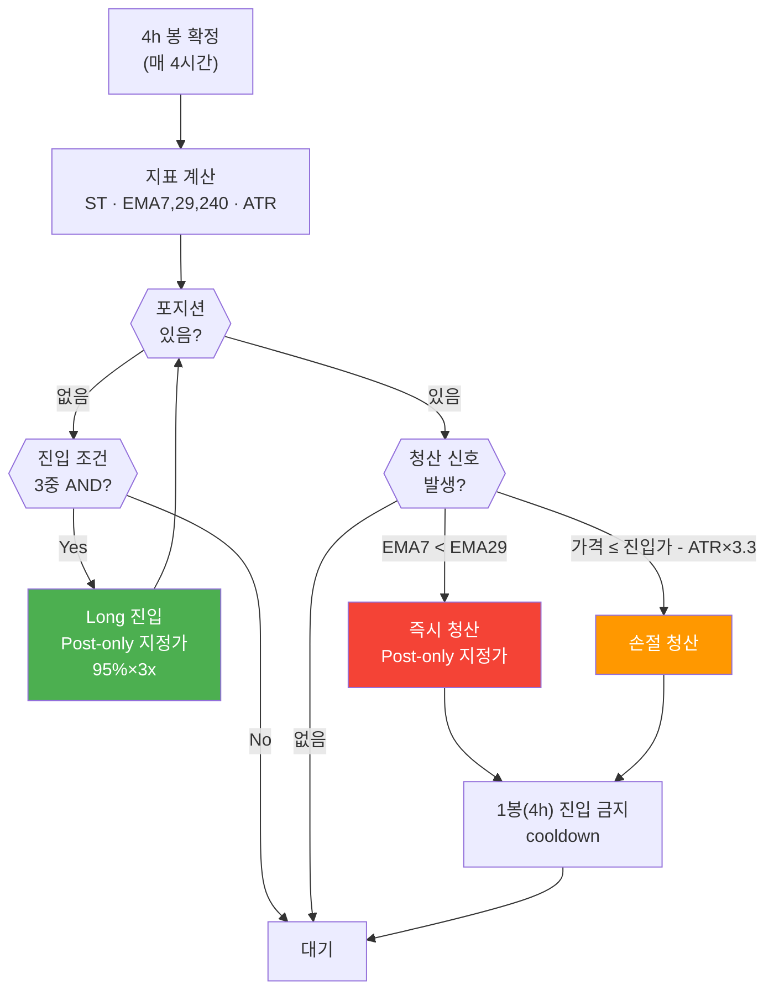

# Supertrend 전략 SSOT · 백테스트 방법론

## §1. 전략 개요

| 항목 | 값 |
|---|---|
| 전략명 | Supertrend 4h Long-Only 3x (combo #7908) |
| Strategy ID | supertrend-01 |
| 심볼 | BTCUSDT (Bybit 네이티브 4h) |
| 타임프레임 | 4h |
| 방향 | Long-only (숏 없음) |
| 레버리지 | 3x 하드캡 (`SAFETY_LEVERAGE_LIMIT=3.0`) |
| 배분 | 보유자본 100% → 전략 내 95%×3x |
| 운영 상태 | Phase 5 메인넷 실전 중 (2026-05-18~) |
| 초기 잔고 | $185.31 USDT (2026-06-14 기준) |
| 채택 설정 | combo #7908 (매개변수 스윕 최적값) |

---

## §2. 파라미터 (combo #7908 SSOT)

| 파라미터 | 값 | 설명 |
|---|---|---|
| st_period | 9 | Supertrend ATR 기간 |
| st_factor | 2.6 | Supertrend ATR 배수 |
| fast_ema | 7 | 빠른 EMA (단기 모멘텀) |
| slow_ema | 29 | 느린 EMA (중기 방향) |
| dir_ema | 240 | 방향 필터 EMA (장기 추세) |
| atr_mult | 3.3 | ATR 손절 배수 (익절 없음, 2026-08-20~) |
| CANDLE_LOOKBACK | 1000 | 지표 계산 봉 수 (dir_ema 240 시드 정합) |
| min_notional | $65 | 최소 주문 금액 (Bybit 기준) |

**정본 파일**: `cryptoengine/config/strategies/supertrend.yaml`

**지표 구현 정합 (2026-06-14)**:
- 라이브 EMA·ATR·Supertrend는 백테스트 엔진(Jesse 2.1.2 combo #7908)과 수치 일치
- EMA: `close[0]` 시드 재귀 (≡ `jesse_rust.ema`)
- ATR: Wilder `_atr_jesse` (≡ `jesse_rust.atr`, period-1 시드)
- Supertrend: 정본 포팅 (밴드 리셋 절 + gated flip)
- **TA-Lib 미사용** (SMA 시드 차이 제거, 2026-06-14)
- 검증: `tests/unit/test_supertrend_parity.py` (5/5 통과)

---

## §3. 진입 조건 (3중 AND)

**모든 3가지 조건이 동시에 만족해야 진입**:

1. `Close > ST선` — Supertrend 상승 국면
   - Supertrend의 상승선(ST_lower) 위에 가격이 있음
   - 상승 추세 진행 중

2. `EMA(7) > EMA(29)` — 골든크로스 (단기 > 중기)
   - 단기 모멘텀이 중기 방향보다 강함
   - 최근 가격 상승 확인

3. `Close > EMA(240)` — 장기 방향 확인
   - 장기 추세(240 EMA)보다 위에 있음
   - 큰 틀의 상승 추세 확인

---

## §4. 진입/청산 Flowchart

<!-- last-verified: 2026-08-20 -->
<!-- code-ref: cryptoengine/services/strategies/supertrend/strategy.py, cryptoengine/config/strategies/supertrend.yaml -->



---

## §5. 청산 조건

| 조건 | 트리거 | 우선순위 | 비고 |
|---|---|---|---|
| EMA 데드크로스 | EMA(7) < EMA(29) | **최우선** | 즉시 청산 (추세 반전) |
| ATR 손절 | 가격 ≤ 진입가 - ATR(14)×3.3 | 높음 | 자동 청산 + 1봉 cooldown |
| ATR 익절 | — | **없음** | 2026-08-20 제거. 상승 추세는 EMA 데드크로스까지 보유 |
| 진입 후 쿨다운 | ATR 손절 후 1봉(4h) | 제약 | 신규 진입 차단 |
| 안전 스탑 | 진입가 - 70%/3x | 안전 | 거래소 스탑로스 (STOP_LOSS_PCT=0.2333) |

---

## §6. 백테스트 성과 (Bybit 네이티브 4h 정본)

**Backtest Period**: 2017-08-17 ~ 2026-04-30 (9년)  
**청산 규칙**: EMA 데드크로스 + ATR 손절만 (익절 없음, 2026-08-20 SSOT)

| 지표 | 값 | 평가 |
|---|---|---|
| **CAGR** | +219.06% | ✅ 매우 우수 |
| **Sharpe Ratio** | 1.667 | ✅ 양호 |
| **Maximum Drawdown** | **-66.70%** | 🚨 **고위험** |
| **총 거래 수** | 198회 | ✅ 충분한 샘플 (EMA 청산 197 / ATR 손절 1) |
| **승률** | 42.42% | ✅ 양수 기대값 (PF 1.507) |

이전 규칙(ATR 대칭 손절·익절) 참고: CAGR +137.64% / Sharpe 1.349 / MDD −73.29% / 360 trades.

Jesse 스윕 window-mean(익절 없음, combo #7908): CAGR_new **281.36%** (8 windows 산술평균). 전기간 CAGR(+219.06%)과 정의가 다름.

### ⚠️ 위험 평가

**MDD −66.70%는 고위험입니다**:

- **극단 시나리오**: 2022년 BTC 약세장 중 연쇄 손실
- **복구 기간**: 수개월 이상 소요 가능
- **자본 영향**: $185 → 약 $62 (약 67% 손실)
- **심리적 압박**: 60%대 낙폭 시 정신적 스트레스 큼

**그럼에도 채택된 이유**:
1. CAGR +219.06% — 파워풀한 장기 수익성 (익절 제거 후 추세 보유)
2. 추세 추종 특성 — BTC 상승장에서 극대 이익 창출
3. 사용자 승인 — 위험 인지 후 명시적 동의 (2026-08-20 ATR 익절 제거)

---

## §7. 주문 실행 방식

| 구분 | 방식 | 비고 |
|---|---|---|
| **진입** | Post-only 지정가 → best-bid re-peg | 10s 주기, 최대 20회 |
| **청산** | Post-only 지정가 → best-ask re-peg | 10s 주기, 최대 20회 |
| **긴급 청산** | 시장가 | on_stop 조건 (shutdow) |
| **폴백** | 20회 미체결 시 시장가 | 잔량만 발주 |
| **수수료** | Maker 0.020% | Bybit 기준 |
| **Re-peg 정책** | 부분체결 누적 추적 → 잔량만 재발주 | 2026-06-13 수정 (과체결 방지) |

---

## §8. 상태 동기화 (2026-06-13~)

미체결 사고 재발 방지를 위해 전략의 상태 관리를 "낙관적 갱신"에서 "확정 기반"으로 전환 (2026-05-27 사고 이후).

| 구분 | 동작 |
|---|---|
| **진실 동기화** | 매 봉 신호 판단 **전** `get_position()`으로 거래소 실포지션 확인. 발산 감지 시 `position_state_divergence` ERROR |
| **주문 확정** | 제출 시 낙관적 상태 변경 없이 pending으로 추적. 주문 결과 수신 또는 포지션 폴링(20s)으로만 확정 |
| **확정 시한** | 450초 초과 시 `pending_order_unresolved` ERROR + 재동기화 |
| **exit 거부** | ERROR + 재동기화 + **60초 후 1회 자동 재시도** (일시적 차단 자동 회복) |
| **entry 거부** | ERROR + 재동기화만 (진입 스킵이 안전한 방향) |
| **쿨다운** | `_last_liquidation_ts` / `_atr_cooldown_until` 은 청산 **확정** 시에만 설정 |
| **봉 누락 복구** | 확정 봉 메시지 미수신 시 워치독이 마감+10분 후 REST 백필 |
| **실체결가 채택** | 진입 확정 시 entry_price를 주문가가 아닌 실체결가로 기록 (ATR exit 정확도) |

---

## §9. 백테스트 방법론 (backtest/ R&D 트리)

### 엔진 및 인프라

```
백테스트 디렉토리: /home/justant/Data/Bit-Mania/backtest/
엔진: Jesse 2.1.2 (combo #7908 정본)
DB: jesse_db (backtest-postgres :5433, 별도 compose)
데이터: 운영 OHLCV read-only 마운트 (../../data:/data:ro)
```

### Walk-Forward (WF) 스케줄

- **일시**: 매월 1일 02:00 KST
- **데이터**: 최근 6개월 (IS 3개월 + OOS 3개월)
- **최적화**: IS에서 파라미터 재최적화
- **검증**: OOS에서 독립적 성과 검증
- **결과**: Telegram 자동 전송

### 그리드 재스윕 (v10_notp, ATR 손절만)

대시보드에 있던 유일 파라미터 공간은 v7_st 15,000 combo이다 (v6_st 1,296는 부분집합). 2026-08-20부터 `v10_notp`에 combo만 복사한 뒤 8윈도우를 재실행한다. 기존 v6_st/v7_st window 결과는 보존한다. 스케줄러는 KST 00–06에 워커 6 (cpuset 3–7), 그 외 워커 2 (cpuset 6–7), `nice 19`로 운영 스택과 CPU를 분리한다.

### 현재 채택 설정

**combo #7908** (2026-08-20 Bybit 네이티브 4h 정본, ATR 손절만):
- Bybit 네이티브 4h 1:1 정본
- 2017-08-17 ~ 2026-04-30 (9년 데이터)
- CAGR +219.06% / Sharpe 1.667 / MDD -66.70% / 198 trades

---

## §10. 극단 시나리오 분석

### Scenario 1: BTC +30% 급등

```
초기:
  자본: $185.31 USDT
  포지션: ~0.0088 BTC @ $60,000 (3x)
  명목가: $527

상승: BTC → $78,000 (+30%)
  이익: 0.0088 × (78,000 - 60,000) × 3 = $4,752
  수수료: -$35
  순 P&L: +$4,717
  최종 equity: $4,902 (+2,545%)
```

### Scenario 2: BTC -50% 극단 하락

```
초기:
  자본: $185.31 USDT
  포지션: ~0.0088 BTC @ $60,000 (3x)

하락: BTC → $30,000 (-50%)
  손실: 0.0088 × (30,000 - 60,000) × 3 = -$792
  수수료: -$20
  순 P&L: -$812
  최종 equity: -$626.69 (마진 콜)
  → Kill Switch L2 자동 발동 (절대값 AND 조건)
```

### Scenario 3: 극도의 분할 손실 (2022년 시나리오)

```
연속된 약세:
  1월: -10% (100회 소규모 손실)
  2월: -15% (100회)
  3월: -20% (100회)
  MDD 누적: -73.29% (극단점)

결과:
  자본: $185.31 → $49.36 (마진 콜)
  → Kill Switch 자동 발동
```

---

## §11. Kill Switch 연동

포트폴리오 레벨 Kill Switch 발동 시:

| Level | 조건 | 동작 |
|-------|------|------|
| **L1** | 전략 손실 > 3% | 포지션 청산 |
| **L2** | 일일 손실 > 5% AND $10 | **포지션 청산** |
| **L3** | 시스템 장애 | 시장가 청산 |
| **L4** | 수동 비상 정지 | 즉시 청산 |

**Phase 5 절대값 AND 조건**:
```
if (drawdown_pct <= -5.0) AND (drawdown_usd >= $10):
    trigger_kill_switch_l2()
```

---

## §12. 자본 배분 (단일 전략 고정)

Strategy Orchestrator는 단일 전략 모델로, **Supertrend에 항상 보유 자본의 100%를 배분**한다.
전략 내부에서 배분 자본의 95% × 3배 레버리지로 포지션을 구성한다.

```python
# WeightManager.FIXED_WEIGHTS
{"supertrend": 1.0, "cash": 0.0}
```

- 배분: 전체 잔고의 100% → 전략이 95% × 3x 사용
- 현금 예비 없음 (항상 완전 배분)
- 진입/청산은 Supertrend 4h 신호로만 결정 (시장 레짐 무관)

---

## 관련 정책 및 문서

- `docs/70-policy/operations.md` — 운영 Runbook
- `docs/70-policy/safety.md` — Kill Switch 정책
- `docs/README.md` — Map of Content (시작점)
