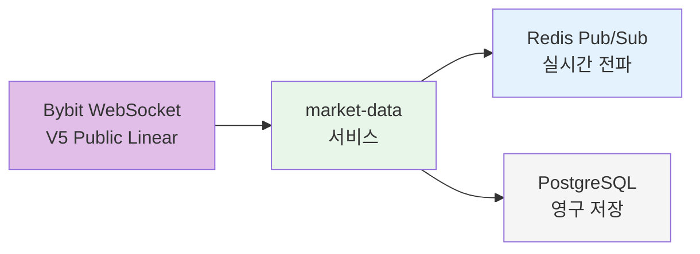
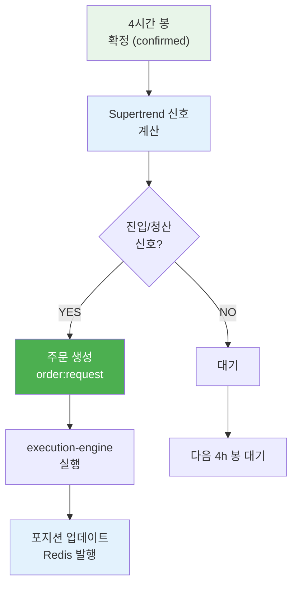
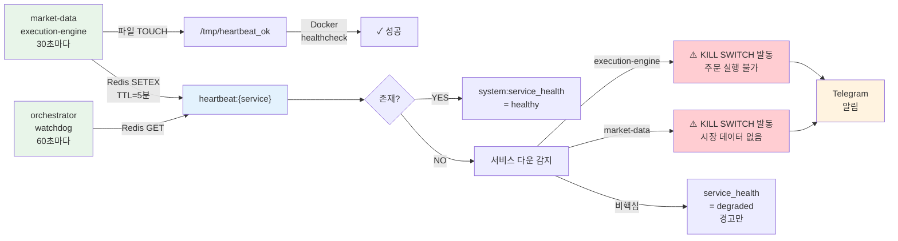
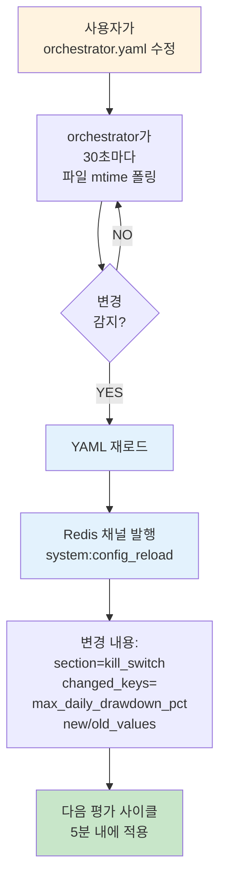
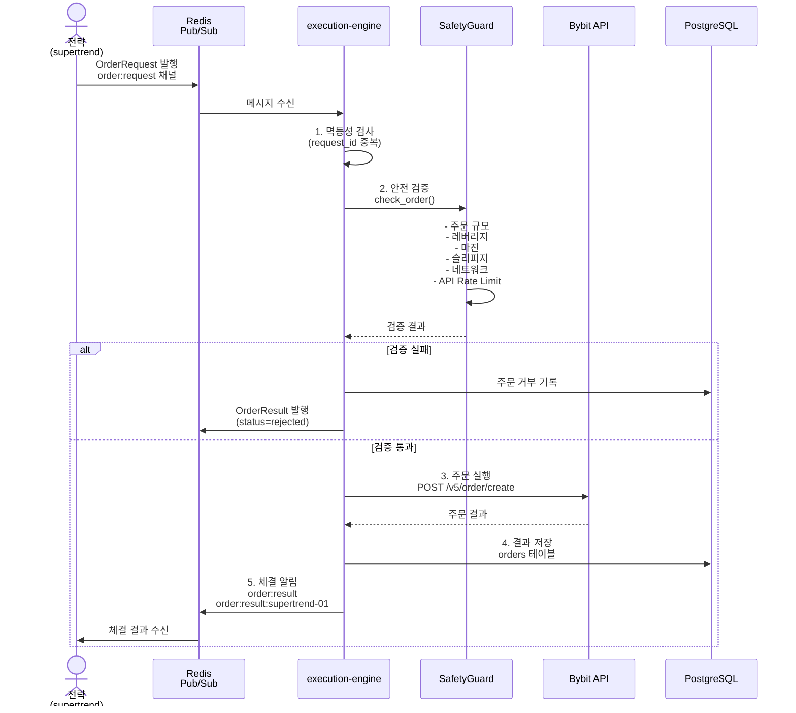
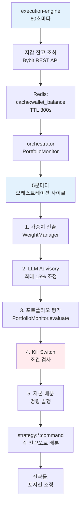
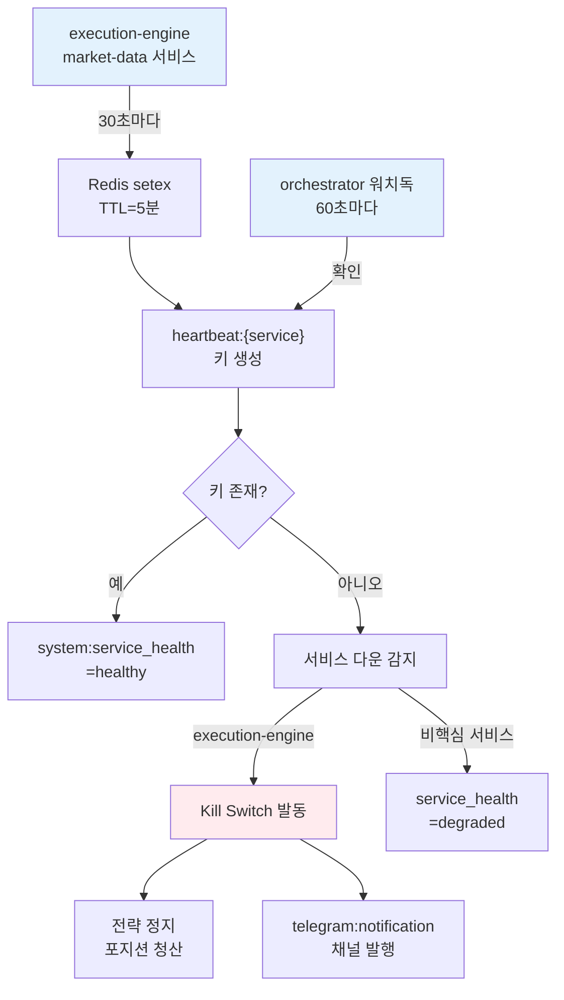
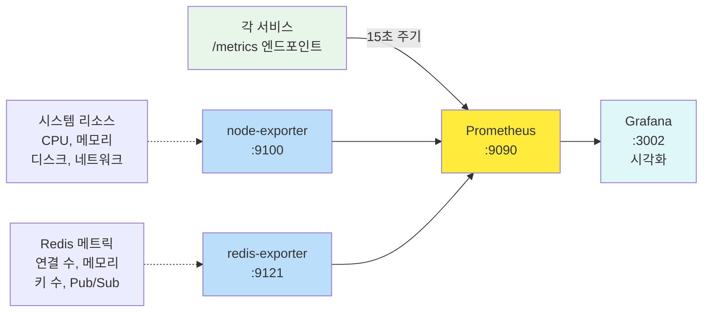
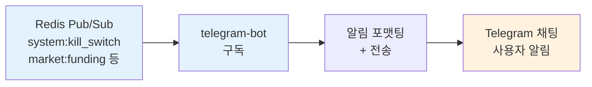

# CryptoEngine 데이터 흐름 아키텍처

> 비트코인 선물 자동매매 시스템의 전체 데이터 파이프라인 명세.
> Bybit 메인넷 기반, Docker Compose 환경에서 24/7 무중단 운영.

---

## 1. 시장 데이터 파이프라인 (Market Data Pipeline)

### 1.1 개요

`market-data` 서비스가 Bybit WebSocket V5 Public API로부터 실시간 데이터를 수집하고,
Redis Pub/Sub로 즉시 브로드캐스트하며 PostgreSQL에 영구 저장한다.



### 1.2 WebSocket 스트림

| 스트림 | Bybit 토픽 | 갱신 주기 | 설명 |
|--------|-----------|-----------|------|
| Orderbook L1 | `orderbook.1.BTCUSDT` | ~100ms | 호가창 최우선 1호가 (bid/ask) |
| 공개 체결 | `publicTrade.BTCUSDT` | 실시간 | 개별 체결 틱 데이터 |
| Kline 1분봉 | `kline.1.BTCUSDT` | 실시간 | 1분 OHLCV 캔들 |
| Kline 5분봉 | `kline.5.BTCUSDT` | 실시간 | 5분 OHLCV 캔들 |
| Kline 15분봉 | `kline.15.BTCUSDT` | 실시간 | 15분 OHLCV 캔들 |
| Kline 1시간봉 | `kline.60.BTCUSDT` | 실시간 | 1시간 OHLCV 캔들 |
| Kline 4시간봉 | `kline.240.BTCUSDT` | 실시간 | 4시간 OHLCV 캔들 |
| 티커 | `tickers.BTCUSDT` | 실시간 | 마크가, 인덱스가, 펀딩비, OI |

**자동 재접속**: 연결 끊김 시 지수 백오프(1s ~ 120s)로 자동 재접속.

### 1.3 REST 폴링

| 데이터 | 엔드포인트 | 주기 | 설명 |
|--------|-----------|------|------|
| 미결제약정 (OI) | `/v5/market/open-interest` | 60초 | 5분 단위 OI 데이터 |
| 롱/숏 비율 | `/v5/market/account-ratio` | 300초 | 글로벌 매수/매도 비율 |
| 청산 데이터 | `/v5/market/recent-trade` | 120초 | 블록 트레이드(청산) 필터링 |

### 1.4 OHLCV 저장 (ohlcv 테이블)

확정(confirmed)된 캔들만 PostgreSQL `ohlcv` 테이블에 UPSERT 한다.

```sql
CREATE TABLE ohlcv (
    id        BIGSERIAL PRIMARY KEY,
    exchange  TEXT NOT NULL,          -- 'bybit'
    symbol    TEXT NOT NULL,          -- 'BTCUSDT'
    timeframe TEXT NOT NULL,          -- '1m', '5m', '15m', '1h', '4h'
    ts        TIMESTAMPTZ NOT NULL,   -- 캔들 시작 시각 (UTC)
    open      DOUBLE PRECISION NOT NULL,
    high      DOUBLE PRECISION NOT NULL,
    low       DOUBLE PRECISION NOT NULL,
    close     DOUBLE PRECISION NOT NULL,
    volume    DOUBLE PRECISION NOT NULL,
    UNIQUE (exchange, symbol, timeframe, ts)
);
```

- **미확정 캔들**: Redis에만 발행 (실시간 화면 갱신용)
- **확정 캔들**: Redis 발행 + PostgreSQL UPSERT + Redis Hash 캐시 갱신
- **타임프레임**: 1m / 5m / 15m / 1h / 4h (WS 구독), 1d (미포함 -- 백테스트 스크립트에서 별도 수집)

### 1.5 펀딩비 데이터 (funding_rates 테이블) — 아카이브됨

**주의**: 펀딩비 수집은 여전히 작동하지만, Supertrend 전략은 펀딩비를 사용하지 않습니다.
이전 Funding Arb 전략은 2026-05-18 폐기되었습니다 ([ADR-004](../../../docs/ADR/004. Funding Arbitrage 전략 폐기_2026-05-18.md)).

```sql
CREATE TABLE funding_rates (
    id                BIGSERIAL PRIMARY KEY,
    exchange          TEXT NOT NULL,
    symbol            TEXT NOT NULL,
    rate              DOUBLE PRECISION NOT NULL,
    predicted_rate    DOUBLE PRECISION,
    next_funding_time TIMESTAMPTZ NOT NULL,
    collected_at      TIMESTAMPTZ NOT NULL DEFAULT NOW(),
    UNIQUE (exchange, symbol, next_funding_time)
);
```

### 1.6 Orderbook L2 스냅샷

`orderbook.1.BTCUSDT` 토픽으로 최우선 1호가 스냅샷/델타를 수신한다.
(테스트넷은 depth-25를 지원하지 않아 depth-1 사용)

- Redis 채널: `market:orderbook:bybit:BTCUSDT`
- 페이로드: `{ type: "snapshot"|"delta", bids: [[price, qty]], asks: [[price, qty]], ts }`
- DB 저장 없음 -- 실시간 전파 전용


## 1.8 Supertrend 신호 생성 (Signal Generation Cycle)

Supertrend 전략은 **4시간 봉 확정 시**에만 신호를 계산합니다:

| 봉 마감 시각 (KST) | 다음 신호 계산 | 설명 |
|-----------------|-----------------|------|
| 01:00 (UTC 16:00) | 01:00 | 4h 봉 0번 마감 |
| 05:00 (UTC 20:00) | 05:00 | 4h 봉 1번 마감 |
| 09:00 (UTC 00:00+1) | 09:00 | 4h 봉 2번 마감 |
| 13:00 (UTC 04:00) | 13:00 | 4h 봉 3번 마감 |
| 17:00 (UTC 08:00) | 17:00 | 4h 봉 0번 마감 (다시) |
| 21:00 (UTC 12:00) | 21:00 | 4h 봉 1번 마감 |

Supertrend 신호 판단:
- **시장 데이터**: `market:ohlcv:bybit:BTCUSDT:4h` 수신 (confirmed=true만)
- **신호 계산**: Supertrend(period=9, mult=2.6) + EMA(7,29,240) 조건
- **진입 조건**: ST 상승 + EMA(7) > EMA(29) + Price > EMA(240)
- **청산 조건**: EMA 하강 교차 또는 ATR×3.3 거리 초과
- **주문 발행**: 신호 확인 후 즉시 `order:request` 채널 발행

Supertrend 포지션 보유 시:



---

## 1.9 Dead Man's Switch 흐름

각 핵심 서비스는 30초마다 하트비트를 발행하고, orchestrator는 60초마다 상태를 체크:



---

## 1.10 설정 핫 리로드 (Config Hot Reload)

`config/orchestrator.yaml`의 Kill Switch 섹션은 **서비스 재시작 없이** 변경 가능:



**주의**: 마이그레이션 관련 설정(strategy_states 등)은 핫 리로드 불가

---

## 2. Redis Pub/Sub 채널 명세

### 2.1 시장 데이터 채널

| 채널 | 발행자 | 구독자 | 페이로드 |
|------|--------|--------|----------|
| `market:ohlcv:{exchange}:{symbol}:{tf}` | market-data | supertrend | `{ exchange, symbol, timeframe, open, high, low, close, volume, ts, confirmed }` |
| `market:orderbook:{exchange}:{symbol}` | market-data | (실시간 소비자) | `{ exchange, symbol, type, bids, asks, ts }` |
| `market:trades:{exchange}:{symbol}` | market-data | (실시간 소비자) | `{ exchange, symbol, price, quantity, side, ts }` |
| `market:ticker:{exchange}:{symbol}` | market-data | (실시간 소비자) | `{ exchange, symbol, last_price, mark_price, index_price, funding_rate, next_funding_time, open_interest, volume_24h }` |
| `market:funding:{exchange}:{symbol}` | market-data | orchestrator | `{ exchange, symbol, rate, predicted_rate, next_funding_time }` |
| `market:open_interest:{exchange}:{symbol}` | market-data | (분석용) | `{ exchange, symbol, open_interest, ts }` |
| `market:long_short_ratio:{exchange}:{symbol}` | market-data | (분석용) | `{ exchange, symbol, buy_ratio, sell_ratio, ts }` |
| `market:liquidations:{exchange}:{symbol}` | market-data | (분석용) | `{ exchange, symbol, price, qty, side, ts }` |

### 2.2 전략 조율 채널

| 채널 | 발행자 | 구독자 | 페이로드 |
|------|--------|--------|----------|
| `strategy:command:supertrend-01` | orchestrator | supertrend | `AllocationCommand { strategy_id, allocated_capital, weight, max_drawdown, timestamp }` |

### 2.3 주문 실행 채널

| 채널 | 발행자 | 구독자 | 페이로드 |
|------|--------|--------|----------|
| `order:request` | 각 전략 (BaseStrategy) | execution-engine | `OrderRequest { request_id, symbol, side, order_type, quantity, price, strategy_id, post_only, reduce_only, leverage }` |
| `order:result` | execution-engine | (감사용 — 수동 스크립트) | `OrderResult { request_id, order_id, status, filled_qty, filled_price, fee, fee_currency, reason, strategy_id, symbol, side }` |
| `order:result:supertrend-01` | execution-engine | **supertrend** | `OrderResult` — filled면 상태 확정, rejected/partially_filled면 재동기화 + exit 1회 재시도. 거부 결과에도 strategy_id 포함 (이전엔 누락되어 전략별 채널 미발행 → 전략이 거부를 모른 채 발산하던 사고 원인) |

### 2.4 시스템 채널

| 채널 | 발행자 | 구독자 | 페이로드 |
|------|--------|--------|----------|
| `system:kill_switch` | orchestrator | execution-engine, telegram-bot | `{ triggered, reason, timestamp, cooldown_minutes }` |
| `system:service_health` | orchestrator (watchdog) | (모니터링 대시보드) | `{ status: "healthy"/"degraded", dead_services: [...], timestamp }` |
| `system:config_reload` | orchestrator (config watcher) | (감사 로그) | `{ section: "kill_switch", changed_keys: [...], new_values: {...}, old_values: {...}, timestamp }` |
| `telegram:notification` | orchestrator (watchdog) | telegram-bot | `{ level: "critical", message: "...", timestamp }` — Dead man's switch 발동 알림 |

### 2.5 Redis 캐시 키 (Pub/Sub 외)

| 키 | 갱신 주기 | TTL | 설명 |
|-----|-----------|-----|------|
| `cache:ohlcv:{exchange}:{symbol}:{tf}` | 캔들마다 | 없음 (Hash) | 최신 OHLCV 값 |
| `cache:funding:{exchange}:{symbol}` | 티커마다 | 없음 (Hash) | 현재 펀딩비 |
| `cache:oi:{exchange}:{symbol}` | 60초 | 없음 (Hash) | 미결제약정 |
| `cache:wallet_balance` | 60초 | 300초 | 지갑 잔고 (JSON) |
| `orchestrator:state` | 5분 | 600초 | 오케스트레이터 상태 (고정 할당: supertrend 100%) |
| `orchestrator:kill_switch` | 이벤트 시 | 7200초 | Kill Switch 상태 |
| `heartbeat:execution-engine` | 30초 | 300초 | 실행 엔진 하트비트 (JSON) |
| `heartbeat:market-data` | 30초 | 300초 | 시장 데이터 서비스 하트비트 (JSON) |
| `strategy:status:{strategy_id}` | 매 틱 (5초) | 90초 | 전략 상태 스냅샷 (하트비트 겸용) |
| `system:service_health` | 60초 | 120초 | 전체 서비스 헬스 상태 |
| `strategy:command_last:{strategy_id}` | 명령 수신 시 | - | 마지막 orchestrator 명령 (재연결 시 상태 복구용) |

---

## 3. 주문 실행 흐름 (Order Execution Flow)

### 3.1 전체 흐름 (시퀀스 다이어그램)



### 3.2 멱등성 보장

- 모든 주문 요청에 고유한 `request_id` 포함 필수
- `ExecutionEngine`이 처리 완료된 `request_id`를 메모리 Set에 보관 (최대 10,000개, 초과 시 최근 5,000개만 유지)
- 중복 `request_id`는 무시하고 `order_duplicate_skipped` 로그 기록
- DB `orders` 테이블의 `request_id` 컬럼에 UNIQUE 제약조건

### 3.3 재시도 로직

| 항목 | 값 |
|------|-----|
| 최대 재시도 | 3회 |
| 백오프 방식 | 지수 백오프 (1s, 2s, 3s) |
| 주문 타임아웃 | 30초/주문 |
| 동시 주문 제한 | Semaphore(5) |

재시도 대상 오류:
- 네트워크 타임아웃 (`asyncio.TimeoutError`)
- 거래소 API 일시 오류 (일반 `Exception`)

### 3.4 안전 검증 (SafetyGuard)

주문 실행 전 7단계 순차 검증을 통과해야 한다:

| 순서 | 검증 항목 | 기본 임계값 | 설명 |
|------|----------|-------------|------|
| 0 | Redis 연결 상태 (fail-closed) | 3회 연속 실패 시 차단 | Redis 불건강 시 모든 주문 차단. 로컬 캐시(TTL 60s)로 임시 폴백 |
| 1 | 최대 주문 크기 | $100,000 명목가 | 단일 주문 명목가 제한 |
| 2 | 레버리지 제한 | **3배 (SAFETY_LEVERAGE_LIMIT=3.0)** | 명시적 + 암묵적 레버리지 검사 |
| 3 | 여유 마진 확인 | $50 이상 | 가용 마진 부족 시 차단 |
| 4 | 슬리피지 검증 | 0.1% 경고, 0.5% 차단 | post_only 주문은 검사 제외 |
| 5 | 네트워크 상태 | 30초 이내 응답 | 마지막 API 응답 이후 경과 시간 |
| 6 | API 속도 제한 | 분당 120회, 90%에서 차단 | 거래소 Rate Limit 보호 |

### 3.5 결과 발행 및 저장

- 체결 결과: `order:result` 채널 + `order:result:{strategy_id}` 채널 동시 발행
- DB 업데이트: `orders` 테이블의 `status`, `filled_qty`, `filled_price`, `fee` 갱신
- 거부된 주문: `status = 'rejected'`로 기록, 거부 사유 포함. **거부 결과도 strategy_id를 포함해 전략별 채널에 발행하고 ERROR 레벨로 기록** (→ `ce:alerts:anomaly` 경유 Telegram 알림, 2026-06-13~)
- 부분 체결 종결(시장가 폴백 실패): `status = 'partially_filled'`로 보고 + ERROR 알림 — 전략이 재동기화
- 타임아웃(420초): 엔진이 잔존 주문 취소 후 거부 발행 — 블라인드 재시도 제거 (idempotency에 막혀 무의미했음)
- 엔진 재시작: in-flight 주문의 거래소 실상태 확인 — 떠 있으면 취소(고아 방지), 체결됐으면 DB 갱신
- 포지션 갱신: 체결 시 `PositionTracker.on_order_fill()` 호출

---

## 4. 포트폴리오 상태 흐름 (Portfolio State Flow)



### 4.1 Kill Switch 4단계

| 레벨 | 조건 | 동작 |
|------|------|------|
| 일간 | 일일 낙폭 >= 5% AND $10 | 전 전략 정지, 100% 현금 |
| 주간 | 주간 낙폭 >= 10% AND $20 | 전 전략 정지, 100% 현금 |
| 월간 | 월간 낙폭 >= 15% AND $30 | 전 전략 정지, 100% 현금 |
| 쿨다운 | 발동 후 60분 | 모든 거래 중단, 자동 복구 대기 |

Kill Switch 발동 시:
1. 모든 전략에 `weight=0, allocated_capital=0` 전송
2. `system:kill_switch` 채널로 알림 발행
3. `orchestrator:kill_switch` Redis 키에 상태 저장 (TTL 2시간)
4. 쿨다운 타이머 시작

### 4.2 Dead Man's Switch 흐름



각 서비스는 하트비트 발행 시 `/tmp/heartbeat_ok` 파일도 touch하며,
Docker healthcheck가 이 파일 존재 여부로 컨테이너 상태를 판단한다.

---

## 5. 모니터링 흐름 (Monitoring Flow)

### 5.1 Prometheus 메트릭



- **node-exporter**: 시스템 리소스 (CPU, 메모리, 디스크, 네트워크)
- **redis-exporter**: Redis 메트릭 (연결 수, 메모리 사용량, 키 수, Pub/Sub 채널)

### 5.2 PostgreSQL 직접 연결

Grafana가 PostgreSQL에 직접 쿼리하여 다음 데이터를 시각화:

| 테이블 | 대시보드 용도 |
|--------|-------------|
| `ohlcv` | 가격 차트, 캔들스틱 |
| `funding_rates` | 펀딩비 히스토리 차트 |
| `orders` | 주문 실행 기록 |
| `positions` | 포지션 현황 |
| `portfolio_snapshots` | 자산 추이, 수익률 곡선 |
| `daily_reports` | 일별 PnL 리포트 |
| `kill_switch_events` | Kill Switch 발동 이력 |

### 5.3 알림 파이프라인



---

## 6. 데이터베이스 스키마 요약

### market-data 서비스 생성 테이블
- `ohlcv` -- OHLCV 캔들 (exchange, symbol, timeframe, ts 복합 유니크)
- `trades` -- 공개 체결 기록
- `funding_rates` -- 펀딩비 (exchange, symbol, next_funding_time 복합 유니크)

### execution-engine 서비스 생성 테이블
- `orders` -- 주문 기록 (request_id 유니크, 인덱스: request_id, status, strategy_id)
- `positions` -- 포지션 (exchange, symbol, side 복합 유니크)

---

## 7. 접속 정보 (개발/테스트)

| 항목 | 주소 |
|------|------|
| Bybit WebSocket (메인넷) | `wss://stream.bybit.com/v5/public/linear` |
| Bybit REST (메인넷) | `https://api.bybit.com` |
| PostgreSQL | `localhost:5432` (DB: cryptoengine) |
| Redis | `localhost:6379` |
| Grafana | `http://localhost:3002` |
