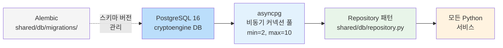
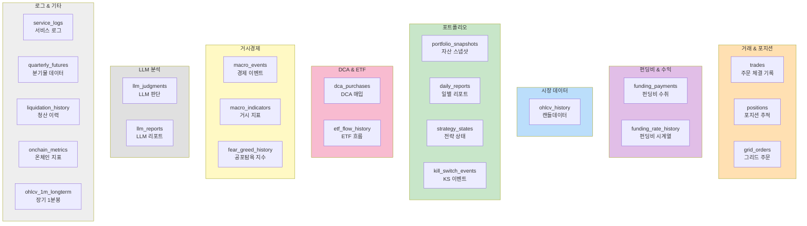
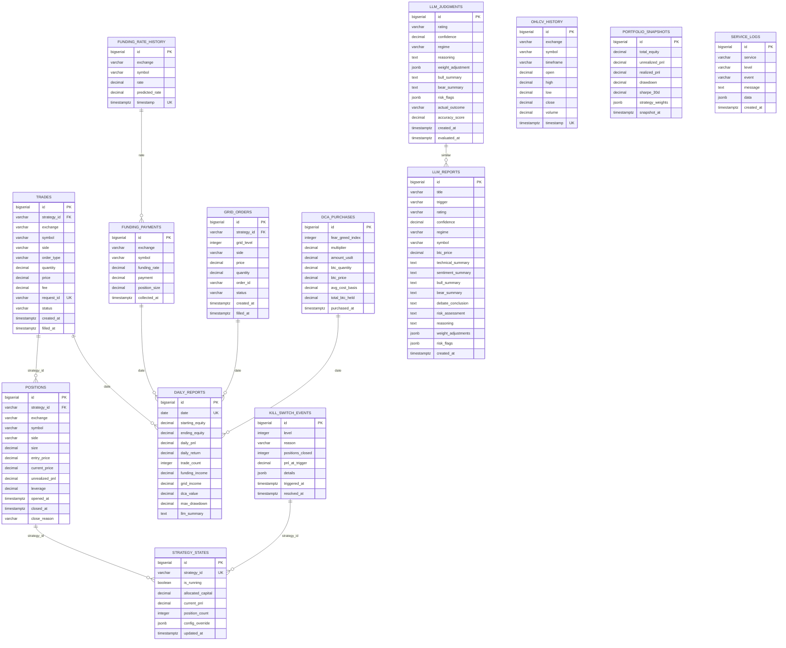
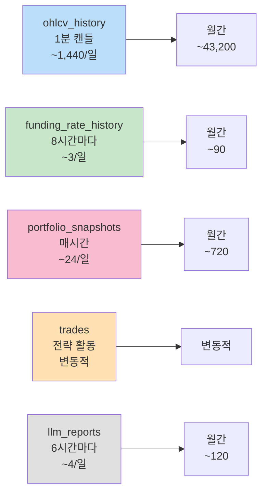

# CryptoEngine 데이터베이스 스키마 문서

## 1. 데이터베이스 개요



| 항목 | 내용 |
|------|------|
| DBMS | PostgreSQL 16 (Alpine 이미지) |
| 데이터베이스명 | `cryptoengine` |
| 사용자 | `cryptoengine` |
| 연결 방식 | asyncpg 비동기 커넥션 풀 |
| 풀 설정 | min_size=2, max_size=10, command_timeout=30s |
| 마이그레이션 | Alembic (`shared/db/migrations/`) |
| 저장소 패턴 | Repository 패턴 (`shared/db/repository.py`) |

### 아키텍처 구성

- **connection.py**: 싱글턴 asyncpg 풀 관리 (`create_pool()`, `get_pool()`, `close_pool()`)
- **repository.py**: `_BaseRepo` 기반 비동기 Repository 패턴 — `_fetchrow()`, `_fetch()`, `_execute()` 등 공통 메서드 제공
- **init_schema.sql**: DDL 스크립트 (Docker 초기화 시 실행)
- **migrations/**: Alembic 버전 관리 (001_initial_schema, 002_llm_reports, 003_service_logs)

### DSN 구성

```
postgresql://cryptoengine:<DB_PASSWORD>@postgres:5432/cryptoengine
```

환경 변수 `DATABASE_URL`이 설정되지 않으면 기본값 사용.

---

### 테이블 분류도



---

## 2. 테이블 상세

### 2.1 trades (체결 기록)

거래 전략이 생성한 모든 주문의 체결 기록.

| 컬럼 | 타입 | 제약 조건 | 설명 |
|------|------|-----------|------|
| `id` | BIGSERIAL | **PK** | 자동 증가 ID |
| `strategy_id` | VARCHAR(50) | NOT NULL | 전략 식별자 (예: supertrend-01) |
| `exchange` | VARCHAR(20) | NOT NULL | 거래소 (bybit) |
| `symbol` | VARCHAR(20) | NOT NULL | 심볼 (BTCUSDT) |
| `side` | VARCHAR(10) | NOT NULL | buy / sell |
| `order_type` | VARCHAR(10) | NOT NULL | limit / market |
| `quantity` | DECIMAL(20,8) | NOT NULL | 주문 수량 |
| `price` | DECIMAL(20,2) | NOT NULL | 체결 가격 |
| `fee` | DECIMAL(20,8) | | 수수료 |
| `fee_currency` | VARCHAR(10) | | 수수료 통화 |
| `pnl` | DECIMAL(20,8) | | 실현 손익 (청산 시) |
| `order_id` | VARCHAR(100) | | 거래소 주문 ID |
| `request_id` | VARCHAR(100) | **UNIQUE** | 내부 요청 ID (멱등성 보장) |
| `status` | VARCHAR(20) | NOT NULL | 주문 상태 |
| `created_at` | TIMESTAMPTZ | DEFAULT NOW() | 생성 시각 |
| `filled_at` | TIMESTAMPTZ | | 체결 시각 |

**인덱스:**
- `idx_trades_strategy` — (strategy_id, created_at)
- `idx_trades_filled` — (filled_at)
- `idx_trades_request_id` — (request_id)

---

### 2.2 positions (포지션)

현재 보유 중이거나 청산 완료된 포지션.

| 컬럼 | 타입 | 제약 조건 | 설명 |
|------|------|-----------|------|
| `id` | BIGSERIAL | **PK** | 자동 증가 ID |
| `strategy_id` | VARCHAR(50) | NOT NULL | 전략 식별자 |
| `exchange` | VARCHAR(20) | NOT NULL | 거래소 |
| `symbol` | VARCHAR(20) | NOT NULL | 심볼 |
| `side` | VARCHAR(10) | NOT NULL | long / short |
| `size` | DECIMAL(20,8) | NOT NULL | 포지션 크기 |
| `entry_price` | DECIMAL(20,2) | NOT NULL | 진입 가격 |
| `current_price` | DECIMAL(20,2) | | 현재 가격 |
| `unrealized_pnl` | DECIMAL(20,8) | | 미실현 손익 |
| `leverage` | DECIMAL(5,2) | DEFAULT 1.0 | 레버리지 배수 |
| `opened_at` | TIMESTAMPTZ | DEFAULT NOW() | 진입 시각 |
| `closed_at` | TIMESTAMPTZ | | 청산 시각 (NULL=보유중) |
| `close_reason` | VARCHAR(50) | | 청산 사유 (signal, stop_loss, kill_switch) |

**인덱스:**
- `idx_positions_strategy` — (strategy_id, opened_at)
- `idx_positions_open` — (strategy_id) WHERE closed_at IS NULL (부분 인덱스)

---

### 2.3 funding_payments (펀딩비 수취 기록)

펀딩비 차익거래 전략이 수취한 펀딩비 내역.

| 컬럼 | 타입 | 제약 조건 | 설명 |
|------|------|-----------|------|
| `id` | BIGSERIAL | **PK** | 자동 증가 ID |
| `exchange` | VARCHAR(20) | NOT NULL | 거래소 |
| `symbol` | VARCHAR(20) | NOT NULL | 심볼 |
| `funding_rate` | DECIMAL(10,6) | NOT NULL | 펀딩비율 |
| `payment` | DECIMAL(20,8) | NOT NULL | 수취 금액 (USDT) |
| `position_size` | DECIMAL(20,8) | NOT NULL | 포지션 크기 |
| `collected_at` | TIMESTAMPTZ | NOT NULL | 수취 시각 |

**인덱스:**
- `idx_funding_collected` — (collected_at)
- `idx_funding_exchange_symbol` — (exchange, symbol, collected_at)

---

### 2.4 funding_rate_history (펀딩비 시계열)

거래소에서 수집한 펀딩비율 히스토리.

| 컬럼 | 타입 | 제약 조건 | 설명 |
|------|------|-----------|------|
| `id` | BIGSERIAL | **PK** | 자동 증가 ID |
| `exchange` | VARCHAR(20) | NOT NULL | 거래소 |
| `symbol` | VARCHAR(20) | NOT NULL | 심볼 |
| `rate` | DECIMAL(10,6) | NOT NULL | 실제 펀딩비율 |
| `predicted_rate` | DECIMAL(10,6) | | 예측 펀딩비율 |
| `timestamp` | TIMESTAMPTZ | NOT NULL | 타임스탬프 |

**인덱스:**
- `idx_funding_rate_lookup` — (exchange, symbol, timestamp) **UNIQUE** — 중복 삽입 방지

---

### 2.5 ohlcv_history (OHLCV 캔들 데이터)

시장 데이터 서비스가 수집한 캔들스틱 데이터. 백테스트 및 기술적 분석에 사용.

| 컬럼 | 타입 | 제약 조건 | 설명 |
|------|------|-----------|------|
| `id` | BIGSERIAL | **PK** | 자동 증가 ID |
| `exchange` | VARCHAR(20) | NOT NULL | 거래소 |
| `symbol` | VARCHAR(20) | NOT NULL | 심볼 |
| `timeframe` | VARCHAR(5) | NOT NULL | 시간 프레임 (1m, 5m, 1h, 1d 등) |
| `open` | DECIMAL(20,2) | NOT NULL | 시가 |
| `high` | DECIMAL(20,2) | NOT NULL | 고가 |
| `low` | DECIMAL(20,2) | NOT NULL | 저가 |
| `close` | DECIMAL(20,2) | NOT NULL | 종가 |
| `volume` | DECIMAL(20,8) | NOT NULL | 거래량 |
| `timestamp` | TIMESTAMPTZ | NOT NULL | 캔들 시작 시각 |

**인덱스:**
- `idx_ohlcv_lookup` — (exchange, symbol, timeframe, timestamp) **UNIQUE** — 중복 캔들 방지

---

### 2.6 portfolio_snapshots (포트폴리오 스냅샷)

주기적으로 기록되는 포트폴리오 상태 스냅샷. Grafana 대시보드의 자산 추이 차트 소스.

| 컬럼 | 타입 | 제약 조건 | 설명 |
|------|------|-----------|------|
| `id` | BIGSERIAL | **PK** | 자동 증가 ID |
| `total_equity` | DECIMAL(20,2) | NOT NULL | 총 자산 (USDT) |
| `unrealized_pnl` | DECIMAL(20,8) | | 미실현 손익 |
| `realized_pnl` | DECIMAL(20,8) | | 실현 손익 |
| `drawdown` | DECIMAL(10,6) | | 현재 드로다운 비율 |
| `sharpe_30d` | DECIMAL(10,4) | | 30일 샤프 비율 |
| `strategy_weights` | JSONB | | 전략별 자본 배분 비율 (현재: supertrend 100%) |
| `snapshot_at` | TIMESTAMPTZ | DEFAULT NOW() | 스냅샷 시각 |

**인덱스:**
- `idx_snapshots_time` — (snapshot_at)

---


### 2.7a orders (실행 엔진 주문 테이블)

Execution Engine이 처리하는 모든 주문의 생애주기 기록. `trades` 레거시 테이블과 별개로 Phase 5 이후 운영.

| 컬럼 | 타입 | 제약 조건 | 설명 |
|------|------|-----------|------|
| `id` | BIGSERIAL | **PK** | 자동 증가 ID |
| `request_id` | TEXT | NOT NULL, **UNIQUE** | 내부 요청 ID (멱등성 보장) |
| `order_id` | TEXT | | 거래소 주문 ID |
| `exchange` | TEXT | NOT NULL | 거래소 (bybit) |
| `symbol` | TEXT | NOT NULL | 심볼 (BTC/USDT:USDT) |
| `side` | TEXT | NOT NULL | buy / sell |
| `order_type` | TEXT | NOT NULL | limit / market |
| `quantity` | DOUBLE PRECISION | NOT NULL | 주문 수량 (BTC) |
| `price` | DOUBLE PRECISION | | 주문 가격 (지정가 시) |
| `status` | TEXT | NOT NULL, DEFAULT 'pending' | pending / filled / rejected / **filled_delayed** |
| `filled_qty` | DOUBLE PRECISION | DEFAULT 0 | 체결 수량 |
| `filled_price` | DOUBLE PRECISION | | 체결 가격 |
| `fee` | DOUBLE PRECISION | DEFAULT 0 | 수수료 |
| `fee_currency` | TEXT | DEFAULT 'USDT' | 수수료 통화 |
| `strategy_id` | TEXT | | 전략 식별자 |
| `post_only` | BOOLEAN | DEFAULT true | Post-only 여부 |
| `reduce_only` | BOOLEAN | DEFAULT false | 청산 전용 여부 |
| `created_at` | TIMESTAMPTZ | NOT NULL, DEFAULT now() | 주문 생성 시각 |
| `updated_at` | TIMESTAMPTZ | NOT NULL, DEFAULT now() | 마지막 갱신 시각 |
| `delay_reason` | TEXT | | 지연 실행 사유 (버그·수동 복구 시 기록) |
| `original_signal_ts` | TIMESTAMPTZ | | 원래 신호가 발생한 bar_ts (지연 체결 추적용) |
| `original_request_id` | TEXT | | 지연 체결 시 원본 rejected 주문의 request_id |

**인덱스:**
- `idx_orders_request_id` — (request_id)
- `idx_orders_status` — (status)
- `idx_orders_strategy` — (strategy_id)

**status 값 설명:**
- `pending` — 처리 대기
- `filled` — 거래소 체결 완료
- `rejected` — safety 검사 또는 거래소 거부
- `filled_delayed` — 원본이 rejected 됐으나 수동으로 지연 체결된 것으로 확인된 건 (delay_reason 참조)

---

### 2.7b supertrend_signals (Supertrend 신호 기록)

Strategy tick마다 bar 단위로 기록하는 신호 계산 결과. 대시보드 `/compare` 및 `/equity` 의 데이터 소스.

| 컬럼 | 타입 | 제약 조건 | 설명 |
|------|------|-----------|------|
| `id` | BIGSERIAL | **PK** | 자동 증가 ID |
| `bar_ts` | TIMESTAMPTZ | NOT NULL, **UNIQUE** | 4h 봉 시작 시각 (bar open time) |
| `computed_at` | TIMESTAMPTZ | NOT NULL, DEFAULT now() | 신호 계산 시각 (≈ bar close time) |
| `st_dir` | SMALLINT | NOT NULL | Supertrend 방향 (+1 = 상승, -1 = 하락) |
| `st_line` | DOUBLE PRECISION | | Supertrend 밴드 값 |
| `fast_ema` | DOUBLE PRECISION | NOT NULL | Fast EMA 값 |
| `slow_ema` | DOUBLE PRECISION | NOT NULL | Slow EMA 값 |
| `dir_ema` | DOUBLE PRECISION | NOT NULL | Direction filter EMA 값 |
| `price` | DOUBLE PRECISION | NOT NULL | bar 종가 (= 예상 체결가) |
| `atr_14` | DOUBLE PRECISION | NOT NULL | 14기간 ATR |
| `allocated_capital` | DOUBLE PRECISION | NOT NULL | 전략 배분 자본 (USDT) |
| `had_position` | BOOLEAN | NOT NULL | 해당 bar 처리 시점의 포지션 보유 여부 |
| `entry_ok` | BOOLEAN | NOT NULL | 진입 조건 충족 여부 |
| `exit_signal` | BOOLEAN | NOT NULL | 청산 신호 여부 |
| `exit_reason` | VARCHAR(20) | | 청산 사유 (ema_cross / atr_distance) |
| `expected_action` | VARCHAR(10) | NOT NULL | enter / exit / hold |
| `expected_qty` | DOUBLE PRECISION | | 예상 주문 수량 (BTC) |
| `expected_stop_loss` | DOUBLE PRECISION | | 예상 손절 가격 |
| `actual_exit_price` | DOUBLE PRECISION | | **실제 체결가** (예상과 다른 경우 기록) |
| `actual_exit_at` | TIMESTAMPTZ | | **실제 체결 시각** (지연 실행 시 bar 이후 시각) |
| `delay_note` | TEXT | | 지연 원인 설명 (버그·수동 복구 내용) |

**인덱스:**
- `idx_supertrend_signals_bar_ts` — (bar_ts) **UNIQUE**
- `idx_supertrend_signals_action` — (expected_action, bar_ts DESC)
- `idx_supertrend_signals_computed_at` — (computed_at DESC)

**compare 엔드포인트 매칭 규칙:**
- `actual_exit_at IS NOT NULL` → 지연 직접 매칭: `actual_exit_price`·`actual_exit_at` 사용, status="matched"
- `actual_exit_at IS NULL` → 타이밍 윈도우: orders 테이블에서 `[barClose, barClose+4h]` 내 fill 검색

---

### 2.8 daily_reports (일별 리포트)

일별 수익/지표 집계. 텔레그램 일일 리포트 및 Grafana 일별 차트 소스.

| 컬럼 | 타입 | 제약 조건 | 설명 |
|------|------|-----------|------|
| `id` | BIGSERIAL | **PK** | 자동 증가 ID |
| `date` | DATE | NOT NULL, **UNIQUE** | 리포트 날짜 |
| `starting_equity` | DECIMAL(20,2) | | 시작 자산 |
| `ending_equity` | DECIMAL(20,2) | | 종료 자산 |
| `daily_pnl` | DECIMAL(20,8) | | 일일 손익 |
| `daily_return` | DECIMAL(10,6) | | 일일 수익률 (%) |
| `trade_count` | INTEGER | | 거래 건수 |
| `funding_income` | DECIMAL(20,8) | | 펀딩비 수입 |
| `grid_income` | DECIMAL(20,8) | | 그리드 수입 |
| `dca_value` | DECIMAL(20,8) | | DCA 매입 가치 |
| `max_drawdown` | DECIMAL(10,6) | | 최대 드로다운 |
| `llm_summary` | TEXT | | LLM 일일 요약 |

**인덱스:**
- `idx_daily_reports_date` — (date)

---

### 2.9 strategy_states (전략 상태)

각 전략의 현재 실행 상태 및 자본 배분.

| 컬럼 | 타입 | 제약 조건 | 설명 |
|------|------|-----------|------|
| `id` | BIGSERIAL | **PK** | 자동 증가 ID |
| `strategy_id` | VARCHAR(50) | NOT NULL, **UNIQUE** | 전략 식별자 |
| `is_running` | BOOLEAN | DEFAULT FALSE | 실행 중 여부 |
| `allocated_capital` | DECIMAL(20,2) | | 배분 자본 (USDT) |
| `current_pnl` | DECIMAL(20,8) | | 현재 누적 손익 |
| `position_count` | INTEGER | DEFAULT 0 | 보유 포지션 수 |
| `config_override` | JSONB | | 설정 오버라이드 |
| `updated_at` | TIMESTAMPTZ | DEFAULT NOW() | 마지막 갱신 |

**인덱스:**
- strategy_id UNIQUE 제약 조건이 자동 인덱스 생성

---

### 2.10 kill_switch_events (킬 스위치 이벤트)

Kill Switch 발동 이력. 4단계 계층 (strategy / portfolio / system / manual) 기록.

| 컬럼 | 타입 | 제약 조건 | 설명 |
|------|------|-----------|------|
| `id` | BIGSERIAL | **PK** | 자동 증가 ID |
| `level` | INTEGER | NOT NULL | 레벨 (1: strategy, 2: portfolio, 3: system, 4: manual) |
| `reason` | VARCHAR(200) | NOT NULL | 발동 사유 |
| `positions_closed` | INTEGER | | 청산된 포지션 수 |
| `pnl_at_trigger` | DECIMAL(20,8) | | 발동 시점 손익 |
| `details` | JSONB | | 상세 정보 |
| `triggered_at` | TIMESTAMPTZ | DEFAULT NOW() | 발동 시각 |
| `resolved_at` | TIMESTAMPTZ | | 해제 시각 |

**인덱스:**
- `idx_kill_switch_triggered` — (triggered_at)

---

### 2.11 llm_judgments (LLM 판단 기록)

LLM Advisor가 생성한 시장 판단 기록. 정확도 추적용.

| 컬럼 | 타입 | 제약 조건 | 설명 |
|------|------|-----------|------|
| `id` | BIGSERIAL | **PK** | 자동 증가 ID |
| `rating` | VARCHAR(20) | NOT NULL | strong_buy / buy / hold / sell / strong_sell |
| `confidence` | DECIMAL(5,3) | | 신뢰도 (0~1) |
| `regime` | VARCHAR(20) | | 시장 레짐 |
| `reasoning` | TEXT | | 판단 근거 |
| `weight_adjustment` | JSONB | | 전략 가중치 조정 |
| `bull_summary` | TEXT | | 강세 논거 요약 |
| `bear_summary` | TEXT | | 약세 논거 요약 |
| `risk_flags` | JSONB | | 리스크 플래그 |
| `actual_outcome` | VARCHAR(20) | | 실제 결과 (회고용) |
| `accuracy_score` | DECIMAL(5,3) | | 정확도 점수 |
| `created_at` | TIMESTAMPTZ | DEFAULT NOW() | 생성 시각 |
| `evaluated_at` | TIMESTAMPTZ | | 평가 시각 |

**인덱스:**
- `idx_llm_judgments_created` — (created_at)

---

### 2.12 llm_reports (LLM 분석 리포트)

LLM Advisor의 전체 분석 리포트. 대시보드에서 리스트 및 상세 조회에 사용.

| 컬럼 | 타입 | 제약 조건 | 설명 |
|------|------|-----------|------|
| `id` | BIGSERIAL | **PK** | 자동 증가 ID |
| `title` | VARCHAR(200) | NOT NULL | 리포트 제목 |
| `trigger` | VARCHAR(30) | NOT NULL, DEFAULT 'scheduled' | 트리거 유형 (scheduled / on_demand) |
| `rating` | VARCHAR(20) | NOT NULL | 시장 판단 |
| `confidence` | DECIMAL(5,3) | | 신뢰도 |
| `regime` | VARCHAR(20) | | 시장 레짐 |
| `symbol` | VARCHAR(20) | DEFAULT 'BTCUSDT' | 심볼 |
| `btc_price` | DECIMAL(20,2) | | 분석 시점 BTC 가격 |
| `technical_summary` | TEXT | | 기술적 분석 요약 |
| `sentiment_summary` | TEXT | | 시장 심리 요약 |
| `bull_summary` | TEXT | | 강세 논거 |
| `bear_summary` | TEXT | | 약세 논거 |
| `debate_conclusion` | TEXT | | 토론 결론 |
| `risk_assessment` | TEXT | | 리스크 평가 |
| `reasoning` | TEXT | | 종합 판단 근거 |
| `weight_adjustments` | JSONB | | 전략 가중치 조정 추천 |
| `risk_flags` | JSONB | | 리스크 플래그 |
| `created_at` | TIMESTAMPTZ | DEFAULT NOW() | 생성 시각 |

**인덱스:**
- `idx_llm_reports_created` — (created_at DESC)
- `idx_llm_reports_symbol` — (symbol, created_at DESC)

---

### 2.13 grid_orders (그리드 전략 주문)

그리드 트레이딩 전략이 생성한 개별 그리드 레벨 주문.

| 컬럼 | 타입 | 제약 조건 | 설명 |
|------|------|-----------|------|
| `id` | BIGSERIAL | **PK** | 자동 증가 ID |
| `strategy_id` | VARCHAR(50) | NOT NULL | 전략 식별자 |
| `grid_level` | INTEGER | NOT NULL | 그리드 레벨 번호 |
| `side` | VARCHAR(10) | NOT NULL | buy / sell |
| `price` | DECIMAL(20,2) | NOT NULL | 주문 가격 |
| `quantity` | DECIMAL(20,8) | NOT NULL | 주문 수량 |
| `order_id` | VARCHAR(100) | | 거래소 주문 ID |
| `status` | VARCHAR(20) | NOT NULL, DEFAULT 'pending' | 주문 상태 |
| `created_at` | TIMESTAMPTZ | DEFAULT NOW() | 생성 시각 |
| `filled_at` | TIMESTAMPTZ | | 체결 시각 |

**인덱스:**
- `idx_grid_orders_strategy` — (strategy_id, status)

---

### 2.13b service_logs (서비스 구조화 로그) — migration 003

모든 서비스의 구조화 이벤트 로그. Grafana Service Logs 대시보드 소스.

```sql
CREATE TABLE IF NOT EXISTS service_logs (
    id          BIGSERIAL PRIMARY KEY,
    timestamp   TIMESTAMPTZ NOT NULL DEFAULT NOW(),
    service     VARCHAR(50) NOT NULL,
    level       VARCHAR(10) NOT NULL,
    level_no    SMALLINT NOT NULL,          -- 10=DEBUG, 20=INFO, 30=WARNING, 40=ERROR, 50=CRITICAL
    event       VARCHAR(500) NOT NULL,      -- 이벤트 코드 (SERVICE_STARTED, ORDER_RECEIVED 등)
    message     TEXT,                       -- 사람이 읽을 수 있는 메시지
    context     JSONB,                      -- 추가 컨텍스트 데이터
    trace_id    VARCHAR(36),                -- 분산 추적 ID
    error_type  VARCHAR(200),               -- 예외 타입
    error_stack TEXT                        -- 스택 트레이스
);

CREATE INDEX IF NOT EXISTS idx_logs_timestamp ON service_logs (timestamp DESC);
CREATE INDEX IF NOT EXISTS idx_logs_service_level ON service_logs (service, level_no, timestamp DESC);
CREATE INDEX IF NOT EXISTS idx_logs_event ON service_logs (event, timestamp DESC);
CREATE INDEX IF NOT EXISTS idx_logs_trace ON service_logs (trace_id) WHERE trace_id IS NOT NULL;
CREATE INDEX IF NOT EXISTS idx_logs_errors ON service_logs (service, timestamp DESC) WHERE level_no >= 40;
```

**데이터 보존 정책** (log_retention 서비스가 매일 03:00 KST 실행):
- DEBUG (level_no=10): 7일
- INFO (level_no=20): 30일
- WARNING (level_no=30): 90일
- ERROR/CRITICAL (level_no>=40): 365일

---


### 2.14 dca_purchases (DCA 매입 기록)

Fear & Greed 지수 기반 적응형 DCA 전략의 매입 기록.

| 컬럼 | 타입 | 제약 조건 | 설명 |
|------|------|-----------|------|
| `id` | BIGSERIAL | **PK** | 자동 증가 ID |
| `fear_greed_index` | INTEGER | NOT NULL | Fear & Greed 지수 (0~100) |
| `multiplier` | DECIMAL(5,2) | NOT NULL | 매입 배수 |
| `amount_usdt` | DECIMAL(20,2) | NOT NULL | 매입 금액 (USDT) |
| `btc_quantity` | DECIMAL(20,8) | NOT NULL | 매입 BTC 수량 |
| `btc_price` | DECIMAL(20,2) | NOT NULL | 매입 시 BTC 가격 |
| `avg_cost_basis` | DECIMAL(20,2) | | 평균 매입 단가 |
| `total_btc_held` | DECIMAL(20,8) | | 누적 BTC 보유량 |
| `purchased_at` | TIMESTAMPTZ | DEFAULT NOW() | 매입 시각 |

**인덱스:**
- `idx_dca_purchased` — (purchased_at)

---

### 2.15 etf_flow_history (BTC ETF 흐름) — migration 005

BTC 현물 ETF의 일일 유입/유출 데이터. 모멘텀 전략용 매크로 지표.

```sql
CREATE TABLE IF NOT EXISTS etf_flow_history (
    id                  BIGSERIAL PRIMARY KEY,
    date                DATE NOT NULL UNIQUE,         -- 유입 날짜
    total_flow_usd      DECIMAL(20,2) NOT NULL,       -- 총 유입 (USDT)
    ibit_flow_usd       DECIMAL(20,2),                -- iShares Bitcoin Trust 유입
    fbtc_flow_usd       DECIMAL(20,2),                -- Fidelity Bitcoin Trust 유입
    other_flow_usd      DECIMAL(20,2),                -- 기타 ETF 유입
    cumulative_flow_usd DECIMAL(20,2),                -- 누적 유입
    source              VARCHAR(20) NOT NULL,         -- 데이터 출처 (coinglass, glassnode 등)
    collected_at        TIMESTAMPTZ DEFAULT NOW()     -- 수집 시각
);

CREATE INDEX IF NOT EXISTS idx_etf_flow_date ON etf_flow_history(date DESC);
CREATE INDEX IF NOT EXISTS idx_etf_flow_source ON etf_flow_history(source);
```

---

### 2.16 macro_events (거시 경제 이벤트) — migration 005

FOMC, CPI, 고용지표 등 주요 경제 지표 발표 일정.

```sql
CREATE TABLE IF NOT EXISTS macro_events (
    id          BIGSERIAL PRIMARY KEY,
    event_date  DATE NOT NULL,
    event_type  VARCHAR(20) NOT NULL,                 -- FOMC, CPI, NFP, PPI 등
    impact_level INTEGER DEFAULT 3,                   -- 1: low, 2: medium, 3: high
    UNIQUE(event_date, event_type)
);

CREATE INDEX IF NOT EXISTS idx_macro_events_date ON macro_events(event_date DESC);
CREATE INDEX IF NOT EXISTS idx_macro_events_type ON macro_events(event_type);
```

---

### 2.17 quarterly_futures_history (분기물 선물 데이터) — migration 007

BTC 분기물 선물(BTCQUART, BTC_USDTPerp 등) OHLCV 데이터.
선물 스프레드 전략(캘린더 스프레드) 개발용.

```sql
CREATE TABLE IF NOT EXISTS quarterly_futures_history (
    id              BIGSERIAL PRIMARY KEY,
    exchange        VARCHAR(20) NOT NULL,             -- bybit
    symbol          VARCHAR(30) NOT NULL,             -- BTCQUART, BTCDEC25 등
    underlying      VARCHAR(20) NOT NULL,             -- BTC
    expiry_date     DATE NOT NULL,                    -- 만기일
    timestamp       TIMESTAMPTZ NOT NULL,             -- 데이터 시점
    open            DECIMAL(20,2),
    high            DECIMAL(20,2),
    low             DECIMAL(20,2),
    close           DECIMAL(20,2) NOT NULL,
    volume          DECIMAL(20,8),                    -- 거래량 (계약 수)
    open_interest   DECIMAL(20,2),                    -- 미결제약정 (USDT)
    UNIQUE(exchange, symbol, timestamp)
);

CREATE INDEX IF NOT EXISTS idx_qf_symbol_time ON quarterly_futures_history(symbol, timestamp DESC);
CREATE INDEX IF NOT EXISTS idx_qf_expiry ON quarterly_futures_history(expiry_date);
CREATE INDEX IF NOT EXISTS idx_qf_underlying ON quarterly_futures_history(underlying, expiry_date);
```

---

### 2.18 liquidation_history (청산 캐스케이드 데이터) — migration 008

시장 청산 데이터. 청산 캐스케이드 전략 및 시장 공포 지표용.

```sql
CREATE TABLE IF NOT EXISTS liquidation_history (
    id                      BIGSERIAL PRIMARY KEY,
    exchange                VARCHAR(20) NOT NULL,     -- bybit
    symbol                  VARCHAR(20) NOT NULL,     -- BTCUSDT
    timestamp               TIMESTAMPTZ NOT NULL,     -- 청산 발생 시각
    long_liquidations_usd   DECIMAL(20,2),            -- 롱 청산액 (USDT)
    short_liquidations_usd  DECIMAL(20,2),            -- 숏 청산액 (USDT)
    total_liquidations_usd  DECIMAL(20,2),            -- 총 청산액
    oi_change_pct           DECIMAL(10,4),            -- OI 변화율 (%)
    source                  VARCHAR(20) NOT NULL,     -- 데이터 출처
    UNIQUE(exchange, symbol, timestamp, source)
);

CREATE INDEX IF NOT EXISTS idx_liquidation_time ON liquidation_history(timestamp DESC);
CREATE INDEX IF NOT EXISTS idx_liquidation_total ON liquidation_history(total_liquidations_usd DESC);
CREATE INDEX IF NOT EXISTS idx_liquidation_symbol ON liquidation_history(symbol, timestamp DESC);
```

---

### 2.19 onchain_metrics (온체인 메트릭) — migration 009

온체인 지표 (MVRV, ASOPR, 거래소 순유입 등) 및 공포탐욕 지수.

```sql
CREATE TABLE IF NOT EXISTS onchain_metrics (
    id                    BIGSERIAL PRIMARY KEY,
    asset                 VARCHAR(10) NOT NULL DEFAULT 'BTC',
    date                  DATE NOT NULL,
    price_usd             DECIMAL(20,2),                -- BTC 가격
    market_cap_usd        DECIMAL(30,2),                -- 시가총액
    realized_cap_usd      DECIMAL(30,2),                -- 실현 시가총액
    mvrv                  DECIMAL(10,4),                -- Market Value / Realized Value
    mvrv_zscore           DECIMAL(10,4),                -- MVRV Z-Score (-2 ~ +2 범위)
    asopr                 DECIMAL(10,4),                -- ASPR (Average Spent Output Price Ratio)
    exchange_netflow_usd  DECIMAL(20,2),                -- 거래소 순유입 (USDT)
    exchange_balance_btc  DECIMAL(20,8),                -- 거래소 총 BTC 보유량
    active_supply_180d    DECIMAL(20,8),                -- 180일 활동 공급량 (BTC)
    source                VARCHAR(20) NOT NULL DEFAULT 'coinmetrics',
    collected_at          TIMESTAMPTZ DEFAULT NOW(),
    UNIQUE(asset, date)
);

CREATE INDEX IF NOT EXISTS idx_onchain_date ON onchain_metrics(date DESC);
CREATE INDEX IF NOT EXISTS idx_onchain_asset_date ON onchain_metrics(asset, date DESC);
```

---

### 2.20 fear_greed_history (공포탐욕 지수) — migration 009

Alternative.me / CryptoQuant 등 출처의 일일 Fear & Greed Index.
DCA 전략의 매입 신호 및 분석용.

```sql
CREATE TABLE IF NOT EXISTS fear_greed_history (
    id              BIGSERIAL PRIMARY KEY,
    date            DATE NOT NULL UNIQUE,
    value           INTEGER NOT NULL,                 -- 0~100 점수
    classification  VARCHAR(30),                      -- Extreme Fear, Fear, Neutral, Greed, Extreme Greed
    collected_at    TIMESTAMPTZ DEFAULT NOW()
);

CREATE INDEX IF NOT EXISTS idx_fg_date ON fear_greed_history(date DESC);
```

---

### 2.21 macro_indicators (거시경제 지표) — migration 010

FRED API로 수집한 일일 거시경제 지표 (DXY, VIX, US10Y 금리 등).

```sql
CREATE TABLE IF NOT EXISTS macro_indicators (
    id          BIGSERIAL PRIMARY KEY,
    date        DATE NOT NULL,
    indicator   VARCHAR(30) NOT NULL,                 -- DXY, VIX, US10Y, TNX 등
    value       DECIMAL(20,6),                        -- 지표 값
    source      VARCHAR(20) DEFAULT 'fred',
    collected_at TIMESTAMPTZ DEFAULT now(),
    UNIQUE(date, indicator)
);

CREATE INDEX IF NOT EXISTS idx_macro_date ON macro_indicators(date DESC, indicator);
CREATE INDEX IF NOT EXISTS idx_macro_indicator ON macro_indicators(indicator, date DESC);
```

---

### 2.22 ohlcv_1m_longterm (장기 1분봉) — migration 011

1분봉의 장기 보존 테이블. 일반 ohlcv_history는 30일 보존이므로,
장기 피쳐 엔지니어링(3년 이상 데이터)을 위해 별도 테이블 운영.

```sql
CREATE TABLE IF NOT EXISTS ohlcv_1m_longterm (
    id          BIGSERIAL PRIMARY KEY,
    exchange    VARCHAR(20) NOT NULL DEFAULT 'bybit',
    symbol      VARCHAR(20) NOT NULL,
    timestamp   TIMESTAMPTZ NOT NULL,                 -- 1분 캔들 시작 시각
    open        DECIMAL(20,2),
    high        DECIMAL(20,2),
    low         DECIMAL(20,2),
    close       DECIMAL(20,2) NOT NULL,
    volume      DECIMAL(20,8),                        -- 거래량 (BTC)
    UNIQUE(exchange, symbol, timestamp)
);

CREATE INDEX IF NOT EXISTS idx_1m_lt_symbol_time ON ohlcv_1m_longterm(symbol, timestamp DESC);
CREATE INDEX IF NOT EXISTS idx_1m_lt_time ON ohlcv_1m_longterm(timestamp DESC);
```

**보존 정책**: 제한 없음 (3년 이상 축적)

---

## 3. 테이블 관계도 (논리적)

스키마에 명시적 FK는 정의되어 있지 않으나, `strategy_id`를 통한 논리적 관계가 존재:

```
strategy_states.strategy_id
    ├── trades.strategy_id
    ├── positions.strategy_id
    └── grid_orders.strategy_id

llm_judgments ←→ llm_reports (동일 분석의 요약/상세 버전)

daily_reports.funding_income ← funding_payments 집계
daily_reports.grid_income ← grid_orders 집계
daily_reports.dca_value ← dca_purchases 집계
```

---

## 4. ER 다이어그램



---

## 5. 데이터 보존 및 유지보수

### 현재 상태

- 데이터 보존 정책: `scripts/ohlcv_retention.py` — 타임프레임별 자동 삭제 (1m→30일, 5m→90일, 15m→180일, 1h→365일, 4h→730일)
- 파티셔닝: 미적용
- 아카이빙: 미적용
- 백업: `pg-backup` 서비스 — 일일 `pg_dump` (02:00 KST), 7일 보존, `pg-backups` Docker 볼륨

### 테이블별 데이터 증가 예상



| 테이블 | 주기 | 일일 예상 레코드 | 월간 누적 |
|--------|------|-----------------|-----------|
| ohlcv_history | 1분 캔들 기준 | ~1,440 | ~43,200 |
| funding_rate_history | 8시간마다 | ~3 | ~90 |
| portfolio_snapshots | 매시간 | ~24 | ~720 |
| trades | 전략 활동 시 | 변동적 | 변동적 |
| llm_reports | 6시간마다 | ~4 | ~120 |

---

## 6. 개선 제안

### 6.1 시계열 테이블 파티셔닝

`ohlcv_history`와 `funding_rate_history`는 시간이 지남에 따라 대량 데이터가 누적됨.
PostgreSQL 네이티브 파티셔닝 적용 권장:

```sql
-- 예시: ohlcv_history 월별 파티셔닝
CREATE TABLE ohlcv_history (
    ...
) PARTITION BY RANGE (timestamp);

CREATE TABLE ohlcv_history_2026_01 PARTITION OF ohlcv_history
    FOR VALUES FROM ('2026-01-01') TO ('2026-02-01');
```

### 6.2 TimescaleDB 확장 검토

시계열 데이터(ohlcv_history, funding_rate_history, portfolio_snapshots)에 대해
TimescaleDB 하이퍼테이블 전환 시 이점:

- 자동 청크 관리 (파티션 수동 생성 불필요)
- 연속 집계 (continuous aggregates) — 실시간 OHLCV 리샘플링
- 데이터 보존 정책 자동화 (`add_retention_policy`)
- 압축 정책으로 스토리지 절감 (10배 이상)

```sql
-- TimescaleDB 적용 예시
SELECT create_hypertable('ohlcv_history', 'timestamp');
SELECT add_retention_policy('ohlcv_history', INTERVAL '1 year');
SELECT add_compression_policy('ohlcv_history', INTERVAL '7 days');
```

### 6.3 아카이빙 전략

| 테이블 | 보존 기간 | 아카이빙 방법 |
|--------|-----------|---------------|
| ohlcv_history | 6개월 (실시간) | 오래된 데이터 → Parquet/CSV 내보내기 |
| funding_rate_history | 1년 | 동일 |
| trades | 영구 | 청산 완료된 오래된 거래 → 아카이브 테이블 |
| portfolio_snapshots | 3개월 (원본) | 오래된 데이터 → 일별 집계로 압축 |
| llm_judgments | 6개월 | 정확도 분석 후 요약만 보존 |

### 6.4 커넥션 풀 사이징 권장

현재 설정: min=2, max=10

서비스별 풀 사용 현황을 고려한 조정:

| 서비스 | 동시 쿼리 | 권장 max_size |
|--------|-----------|---------------|
| market-data | 높음 (OHLCV 삽입) | 8~10 |
| execution-engine | 중간 (체결 기록) | 5~8 |
| supertrend | 낮음 | 3~5 |
| strategy-orchestrator | 낮음 | 3~5 |
| dashboard | 중간 (읽기 전용) | 5~8 |

총 커넥션 수 상한: PostgreSQL `max_connections` 기본값(100)으로 충분하나,
서비스 수 증가 시 PgBouncer 도입 검토.

### 6.5 FK 제약 조건 추가 검토

현재 스키마에 외래 키가 없어 데이터 정합성을 애플리케이션 레벨에서 관리 중.
`strategy_id` 기반 FK 추가 시 참조 무결성 보장 가능하나,
고빈도 INSERT 성능에 영향을 줄 수 있으므로 트레이드오프 고려 필요.

### 6.6 추가 인덱스 권장

```sql
-- 미청산 포지션의 빠른 전략별 조회 (이미 부분 인덱스 있음 — 양호)
-- trades 테이블 심볼별 조회 (백테스트/분석)
CREATE INDEX idx_trades_symbol ON trades(symbol, filled_at);
```
