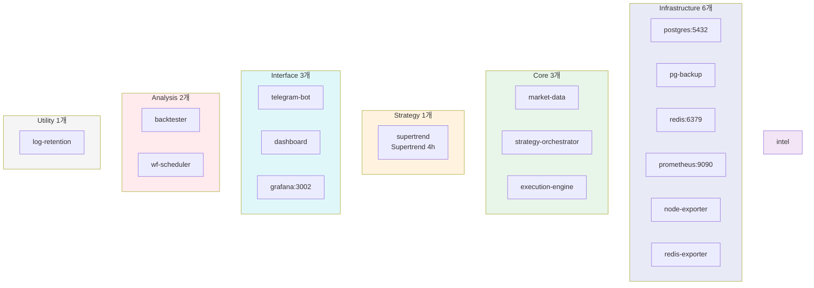
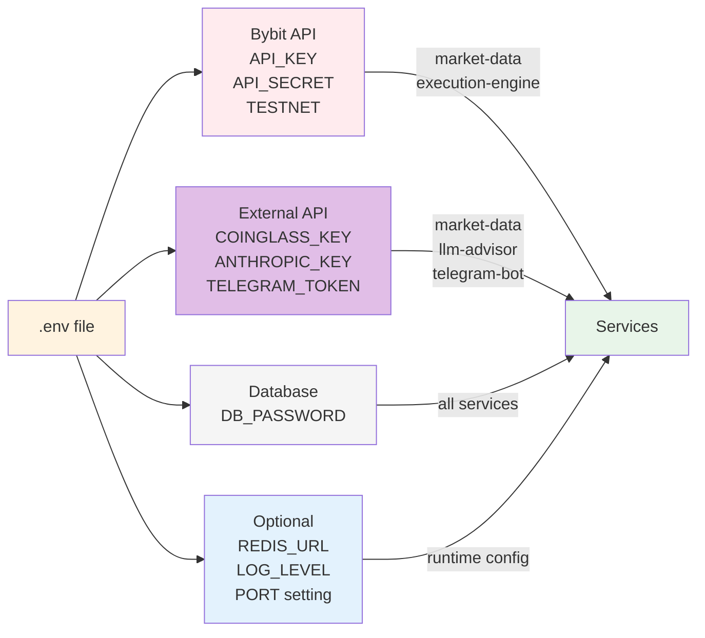
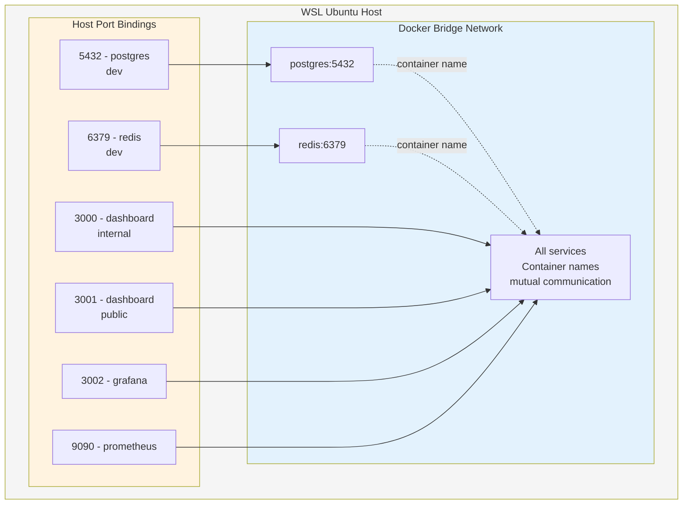
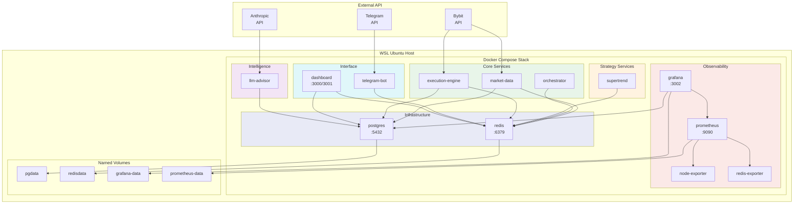

# CryptoEngine 배포 아키텍처

비트코인 선물 자동매매 시스템의 Docker Compose 기반 배포 구성을 정리한 문서.

---

## 1. Docker Compose 스택 개요

모든 서비스는 단일 `docker-compose.yml`로 관리되며, 총 **19개 서비스**가 7개 그룹으로 구성된다.
전체 할당 리소스: CPU ~6.6 코어, 메모리 ~4.3GB.



### 서비스 그룹 및 상세 정보

| 서비스 | 이미지 | 역할 | 헬스체크 | CPU/메모리 |
|--------|--------|------|---------|----------|
| **postgres** | `postgres:16-alpine` | 영구 저장소 | `pg_isready` | 1.0 / 512M |
| **pg-backup** | `postgres:16-alpine` | 매일 02:00 KST pg_dump | 없음 | 0.5 / 128M |
| **log-retention** | `postgres:16-alpine` | 매일 03:00 KST service_logs 보존 정책 | 없음 | 0.2 / 64M |
| **redis** | `redis:7-alpine` | Pub/Sub 브로커 + AOF 캐시 | `redis-cli ping` | 0.5 / 320M |
| **market-data** | 커스텀 빌드 | WebSocket 데이터 수집 | `/tmp/heartbeat_ok` | 0.5 / 256M |
| **strategy-orchestrator** | 커스텀 빌드 | 전략 조율, 자본 배분 | 없음 | 0.5 / 256M |
| **execution-engine** | 커스텀 빌드 | 주문 실행, 포지션 추적, 안전 검증 | `/tmp/heartbeat_ok` | 0.5 / 256M |
| **supertrend** | 커스텀 빌드 | 메인 전략: Supertrend 4h 3x long-only | `/tmp/heartbeat_ok` | 0.5 / 256M |
| **telegram-bot** | 커스텀 빌드 | ✅ 복구: 알림 전송 + 비상 명령 수신 | 없음 | 0.2 / 128M |
| **dashboard** | 커스텀 빌드 | 내부(3000) + 공개(3001) 웹 대시보드 | 없음 | 0.5 / 256M |
| **grafana** | `grafana/grafana:10.4.14` | 시각화 대시보드, 알림 | 없음 | 0.5 / 512M |
| **node-exporter** | `prom/node-exporter:v1.8.0` | 호스트 시스템 메트릭 | 없음 | 0.1 / 64M |
| **redis-exporter** | `oliver006/redis_exporter:latest` | Redis 메트릭 | 없음 | 0.1 / 64M |
| **prometheus** | `prom/prometheus:v2.51.0` | 메트릭 수집, 30일 보존 | 없음 | 0.5 / 512M |
| **backtester** | 커스텀 빌드 | 온디맨드 백테스트 (profile: backtest) | 없음 | 2.0 / 1G |
| **wf-scheduler** | 커스텀 빌드 | 매월 1일 02:00 KST Walk-Forward 자동 실행 | 없음 | 1.0 / 512M |

### 리소스 제한 정책 (deploy.resources)

모든 서비스에 CPU 및 메모리 limits과 reservations이 적용됨:
- **limits**: 최대 사용 가능 리소스 (초과 시 컨테이너 종료)
- **reservations**: 할당 보장 리소스 (Docker가 호스트에 미리 예약)

| 서비스군 | CPU limit | Memory limit | Memory reservation |
|---------|-----------|--------------|-------------------|
| 데이터 레이어 (postgres, redis) | 1.0 / 0.5 | 512M / 320M | 256M / 128M |
| 코어 서비스 | 0.5 | 256M | 64M |
| 전략 서비스 | 0.5 / 0.3 | 256M / 128M | 64M / 32M |
| 지능형 서비스 (llm-advisor) | 1.0 | 512M | 128M |
| 모니터링 | 0.5 / 0.1 | 512M / 64M | 128M / - |
| 백테스트 | 2.0 / 1.0 | 1G / 512M | - / 128M |

**총 예산**: CPU ~6.6, 메모리 ~4.3GB

### 빌드 컨텍스트

모든 커스텀 서비스의 빌드 컨텍스트는 **프로젝트 루트(`.`)**로 설정된다.

```yaml
build:
  context: .
  dockerfile: services/<서비스명>/Dockerfile
```

### Dockerfile 패턴

모든 서비스 Dockerfile은 동일한 패턴을 따른다:

```dockerfile
FROM python:3.12-slim

WORKDIR /app

# 시스템 의존성 설치 (서비스별 상이, 예: TA-Lib)
RUN apt-get update && ...

# Python 의존성
COPY services/<서비스>/requirements.txt .
RUN pip install --no-cache-dir -r requirements.txt

# 공유 라이브러리 + 서비스 코드
COPY shared /app/shared
COPY services/<서비스> /app/

ENV PYTHONPATH=/app
ENV PYTHONUNBUFFERED=1

CMD ["python", "main.py"]
```

핵심 규칙:
- `COPY shared /app/shared` -- 모든 서비스에서 공유 라이브러리 접근
- `ENV PYTHONPATH=/app` -- `from shared.xxx import yyy` 임포트 가능하게 설정
- 전략 서비스는 `base_strategy.py`를 명시적으로 복사해야 함

### 재시작 정책

| 서비스 | 재시작 정책 |
|--------|------------|
| `backtester` | 없음 (온디맨드 실행) |
| 그 외 모든 서비스 | `restart: always` |

### 의존성 및 시작 조건

```
postgres (healthy) ─┬─ pg-backup, log-retention
                    ├─ market-data ─┬─ strategy-orchestrator
                    │               └─ supertrend
                    ├─ execution-engine
                    ├─ dashboard
                    ├─ telegram-bot
                    ├─ llm-advisor (redis only)
                    ├─ grafana, prometheus
                    └─ backtester

redis (healthy) ──── market-data, strategy-orchestrator
                     execution-engine, supertrend
                     llm-advisor, telegram-bot, dashboard
```

| 서비스 | depends_on 조건 | 의미 |
|--------|-----------------|------|
| pg-backup, log-retention | postgres: service_healthy | DB 완전 준비 후 시작 |
| market-data, execution-engine, supertrend | postgres/redis: healthy | 데이터 계층 완전 준비 |
| strategy-orchestrator | market-data: service_started | 시장 데이터 수집 시작만 확인 |
| grafana | prometheus: service_started | Prometheus 스크래핑 시작 확인 |
| backtester | postgres: service_healthy | 온디맨드 실행 (항상 off) |

---

## 2. 환경 설정

### .env 파일 구조

프로젝트 루트의 `.env` 파일에서 모든 비밀 값과 환경 변수를 관리한다.



```bash
# Bybit API (테스트넷)
BYBIT_API_KEY=<api-key>
BYBIT_API_SECRET=<api-secret>
BYBIT_TESTNET=true              # Phase 5 전까지 절대 false 금지

# 외부 API
COINGLASS_API_KEY=<key>         # market-data에서 사용
ANTHROPIC_API_KEY=<key>         # llm-advisor에서 사용
TELEGRAM_BOT_TOKEN=<token>      # telegram-bot, grafana 알림
TELEGRAM_CHAT_ID=<chat-id>

# 데이터베이스
DB_PASSWORD=<password>

# 선택적 (기본값 있음)
REDIS_URL=redis://redis:6379    # 기본값: redis://redis:6379
LOG_LEVEL=INFO                  # 기본값: INFO
ENVIRONMENT=testnet             # 기본값: testnet
DASHBOARD_INTERNAL_PORT=3000    # 기본값: 3000
DASHBOARD_PUBLIC_PORT=3001      # 기본값: 3001
GRAFANA_ADMIN_PASSWORD=<pw>     # 기본값: admin
```

### 공통 환경 변수 (x-common-env)

YAML 앵커 `&common-env`로 모든 커스텀 서비스에 주입:

```yaml
x-common-env: &common-env
  DB_HOST: postgres
  DB_PORT: 5432
  DB_NAME: cryptoengine
  DB_USER: cryptoengine
  DB_PASSWORD: ${DB_PASSWORD}
  REDIS_URL: ${REDIS_URL:-redis://redis:6379}
  LOG_LEVEL: ${LOG_LEVEL:-INFO}
  ENVIRONMENT: ${ENVIRONMENT:-testnet}
```

### Config YAML 파일

`config/` 디렉토리 아래 전략 파라미터와 오케스트레이터 설정:

| 파일 | 용도 |
|------|------|
| `config/strategies/supertrend.yaml` | Supertrend 4h 전략 파라미터 |
| `config/orchestrator.yaml` | Kill Switch 임계값 |

설정 로딩 시 환경 변수 치환을 지원한다:
- `${VAR}` -- 환경 변수 값으로 치환
- `${VAR:-fallback}` -- 환경 변수가 없으면 fallback 값 사용

#### 핫 리로드 지원

`config/orchestrator.yaml`의 `kill_switch` 섹션은 서비스 재시작 없이 변경 가능하다.
오케스트레이터가 30초마다 파일 수정 시각을 폴링하여 변경 감지 시 자동 반영한다.
변경 이력은 Redis `system:config_reload` 채널에 발행된다.

```bash
# kill_switch 임계값 변경 예시 (재시작 불필요)
vim config/orchestrator.yaml  # max_daily_drawdown_pct 값 수정
# → 최대 30초 내 자동 반영
```

---

## 3. 네트워크 아키텍처

### Docker 기본 브리지 네트워크

별도의 네트워크 정의 없이 Docker Compose 기본 브리지 네트워크를 사용한다.
모든 서비스는 **컨테이너 이름**으로 상호 통신한다.



예시:
- DB 접속: `postgres:5432`
- Redis 접속: `redis:6379`
- Prometheus 타겟: `node-exporter:9100`, `redis-exporter:9121`

### 외부 노출 포트

| 포트 | 서비스 | 용도 |
|------|--------|------|
| `3000` | dashboard | 내부 대시보드 |
| `3001` | dashboard | 공개 대시보드 |
| `3002` | grafana | Grafana 모니터링 (컨테이너 내부 3000 -> 호스트 3002) |
| `5432` | postgres | PostgreSQL (개발용 직접 접속) |
| `6379` | redis | Redis (개발용 직접 접속) |
| `9090` | prometheus | Prometheus Web UI |

### 내부 전용 포트 (expose)

| 포트 | 서비스 | 용도 |
|------|--------|------|
| `9100` | node-exporter | Prometheus 스크래핑 전용 |
| `9121` | redis-exporter | Prometheus 스크래핑 전용 |

---

## 4. 볼륨 마운트

### 영구 볼륨 (Named Volumes)

| 볼륨 | 서비스 | 경로 | 용도 |
|------|--------|------|------|
| `pgdata` | postgres | `/var/lib/postgresql/data` | DB 데이터 영구 저장 |
| `redisdata` | redis | `/data` | Redis AOF 영구 저장 |
| `grafana-data` | grafana | `/var/lib/grafana` | Grafana 설정, 대시보드 상태 |
| `prometheus-data` | prometheus | `/prometheus` | 메트릭 데이터 (30일 보존) |

### 바인드 마운트

| 호스트 경로 | 컨테이너 경로 | 서비스 | 모드 |
|------------|--------------|--------|------|
| `./config` | `/app/config` | 대부분의 커스텀 서비스 | `ro` (읽기 전용) |
| `./config/grafana/datasources` | `/etc/grafana/provisioning/datasources` | grafana | `ro` |
| `./config/grafana/dashboards` | `/etc/grafana/provisioning/dashboards` | grafana | `ro` |
| `./config/grafana/alerting` | `/etc/grafana/provisioning/alerting` | grafana | `ro` |
| `./config/prometheus/prometheus.yml` | `/etc/prometheus/prometheus.yml` | prometheus | `ro` |
| `../backtest/results` | `/app/results` | backtester | `rw` |
| `/proc` | `/host/proc` | node-exporter | `ro` |
| `/sys` | `/host/sys` | node-exporter | `ro` |
| `/tmp/claude-code` | `/tmp/claude-code` | llm-advisor | `rw` |

---

## 5. 배포 다이어그램



---

## 6. 운영 명령어 (Makefile)

### 라이프사이클

| 명령어 | 설명 |
|--------|------|
| `make up` | 전체 서비스 프로덕션 모드 기동 (`--build --remove-orphans`) |
| `make up-dev` | 개발 모드 기동 (핫 리로드, 디버그 포트 포함) |
| `make down` | 전체 서비스 중지, 컨테이너 제거 |
| `make down-clean` | 전체 중지 + **볼륨 삭제** (데이터 파괴 주의) |
| `make restart` | 전체 서비스 재시작 |

### 로그

| 명령어 | 설명 |
|--------|------|
| `make logs` | 전체 서비스 로그 tail (최근 100줄) |
| `make logs-<서비스>` | 특정 서비스 로그 (예: `make logs-market-data`) |

### 테스트

| 명령어 | 설명 |
|--------|------|
| `make test` | 전체 테스트 스위트 실행 (6개 서비스) |
| `make test-unit` | 유닛 테스트만 실행 (`-m unit` 마커) |
| `make backtest` | 백테스터 실행 (`--profile backtest`로 온디맨드 기동) |

### 운영

| 명령어 | 설명 |
|--------|------|
| `make status` | 컨테이너 상태 + 리소스 사용량 (CPU, 메모리, 네트워크) |
| `make migrate` | DB 마이그레이션 실행 (`alembic upgrade head`) |
| `make emergency` | **비상 정지**: 전 포지션 청산 후 전략 서비스 중지 |
| `make monthly-report` | 월간 성과 보고서 생성 |

### 비상 정지 (emergency) 상세

1. `execution-engine`에서 `emergency_close_all` 실행 (전 포지션 청산)
3. `execution-engine`은 포지션 모니터링을 위해 계속 실행
4. 대시보드(`http://localhost:3000`)에서 상태 확인

---

## 7. 개발 모드 vs 프로덕션 모드

### 프로덕션 모드

```bash
make up
# docker compose up -d --build --remove-orphans
```

### 개발 모드

```bash
make up-dev
# docker compose -f docker-compose.yml -f docker-compose.dev.yml up -d --build --remove-orphans
```

### docker-compose.dev.yml 오버라이드 내용

| 항목 | 프로덕션 | 개발 |
|------|---------|------|
| 빌드 타겟 | (기본) | `target: development` |
| LOG_LEVEL | INFO | DEBUG |
| 소스 마운트 | 없음 | `./services/<서비스>/src:/app/src:ro` (핫 리로드) |
| 디버그 포트 | 없음 | 각 서비스별 debugpy 포트 (5678~5687) |
| Grafana 인증 | 비밀번호 필요 | 익명 접속 허용 (Admin 권한) |

### 개발 모드 debugpy 포트 매핑

| 서비스 | 호스트 포트 |
|--------|-----------|
| market-data | 5678 |
| strategy-orchestrator | 5679 |
| execution-engine | 5680 |
| supertrend | 5681 |
| llm-advisor | 5684 |
| telegram-bot | 5685 |
| dashboard | 5686 |
| backtester | 5687 |

---

## 8. 모니터링 스택

### Prometheus (포트 9090)

- **스크래핑 주기**: 15초
- **평가 주기**: 15초
- **데이터 보존**: 30일 (`--storage.tsdb.retention.time=30d`)
- **스크래핑 대상**:

| job_name | 타겟 | 수집 메트릭 |
|----------|------|------------|
| `prometheus` | `localhost:9090` | Prometheus 자체 메트릭 |
| `node-exporter` | `node-exporter:9100` | CPU, 메모리, 디스크, 네트워크 등 호스트 메트릭 |
| `redis-exporter` | `redis-exporter:9121` | Redis 연결 수, 메모리, 명령 통계 등 |

### Grafana (포트 3002)

- **버전**: 10.4.14
- **플러그인**: `grafana-clock-panel`, `grafana-simple-json-datasource`, `redis-datasource`
- **기능 토글**: `publicDashboards` (공개 대시보드 지원)
- **통합 알림**: `GF_UNIFIED_ALERTING_ENABLED=true`

데이터소스:
- **PostgreSQL**: 거래 기록, 포지션, 펀딩비 등 비즈니스 데이터
- **Prometheus**: 시스템 메트릭, Redis 메트릭

프로비저닝 (바인드 마운트로 자동 설정):
- `config/grafana/datasources/` -- 데이터소스 정의
- `config/grafana/dashboards/` -- 대시보드 JSON 프로비저닝
- `config/grafana/alerting/` -- 알림 규칙 프로비저닝

알림 채널:
- Telegram 연동 (`TELEGRAM_BOT_TOKEN`, `TELEGRAM_CHAT_ID` 환경 변수)

### node-exporter

- **버전**: v1.8.0
- 호스트의 `/proc`, `/sys`를 읽기 전용으로 마운트
- 시스템 파일시스템 제외: `/sys`, `/proc`, `/dev`, `/host`, `/etc`
- 내부 포트 `9100`만 노출 (호스트 바인딩 없음)

### redis-exporter

- Redis 연결: `redis://redis:6379`
- 내부 포트 `9121`만 노출 (호스트 바인딩 없음)

---

## 9. 개선 제안

### 헬스체크 확대

`market-data`, `execution-engine`, `supertrend` 서비스에 healthcheck 적용 완료:

```yaml
healthcheck:
  test: ["CMD", "test", "-f", "/tmp/heartbeat_ok"]
  interval: 60s
  timeout: 10s
  retries: 3
  start_period: 30s
```

각 서비스는 30초마다 `/tmp/heartbeat_ok` 파일을 touch하여 하트비트를 증명한다.

### 컨테이너 리소스 제한

v1.4.0에서 전체 서비스 `deploy.resources.limits` 적용 완료 (~3.8GB 총 예산).

```yaml
deploy:
  resources:
    limits:
      memory: 512M
      cpus: '0.5'
    reservations:
      memory: 128M
```

### 로그 집계

현재 `docker compose logs`로만 로그를 확인한다. Loki + Promtail 스택을 추가하면 Grafana에서 로그를 통합 조회할 수 있다.

### 시크릿 관리

`.env` 파일에 API 키, DB 비밀번호가 평문으로 저장되어 있다. Docker Secrets 또는 외부 시크릿 매니저(HashiCorp Vault 등)를 도입하면 보안이 강화된다.

### PostgreSQL 백업

v1.4.0에서 `pg-backup` 서비스 추가. 매일 02:00 KST 자동 `pg_dump`, 7일 보존.

```bash
# 수동 백업 및 복원
make backup         # 즉시 백업 실행
make backup-list    # 백업 파일 목록
make backup-restore # 백업 복원
```
