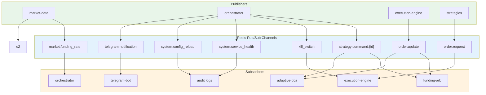
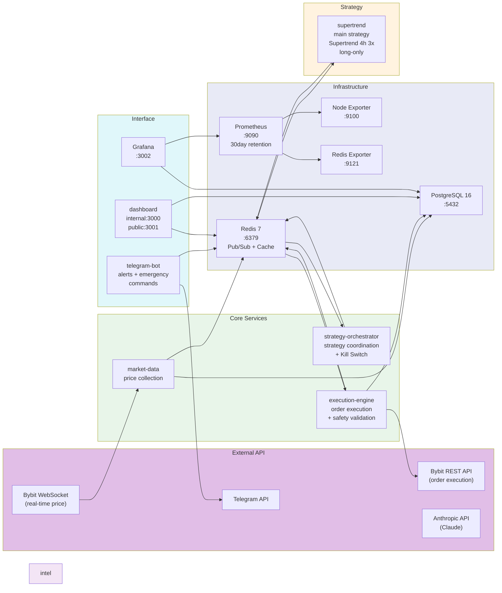
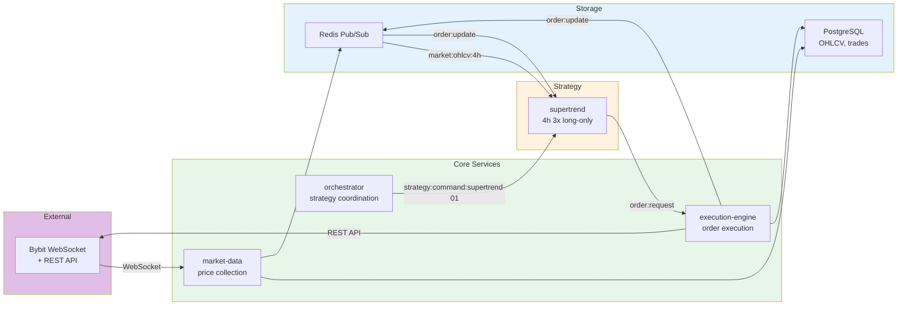

# CryptoEngine 시스템 아키텍처 개요

## 1. 시스템 소개

CryptoEngine은 Bybit 비트코인 선물 시장을 대상으로 하는 **자동매매 시스템**이다.
**핵심 전략은 Supertrend 4시간 추세추종 전략**이며, Long-only 3x 레버리지로 운영된다 (Phase 5 메인넷 실전 중).

전체 시스템은 **Docker Compose** 기반의 마이크로서비스 아키텍처로 구성되어 있으며,
WSL Ubuntu 환경에서 24/7 무중단 운영을 목표로 설계되었다.

---

## 2. 서비스 레이어 구성

총 **19개 Docker Compose 서비스**가 6개 레이어로 분류된다.

### 2.1 Infrastructure (인프라)

| 서비스 | 이미지 | 역할 | 포트 |
|--------|--------|------|------|
| **postgres** | `postgres:16-alpine` | 주 데이터 저장소. 거래 기록, 포지션, 펀딩비 히스토리, OHLCV 등 영구 데이터 보관 | 5432 |
| **pg-backup** | (custom) | 매일 02:00 KST `pg_dump` 자동 백업, 7일 보존 (`pg-backups` 볼륨) | - |
| **redis** | `redis:7-alpine` | 메시지 브로커(Pub/Sub) + 캐시. AOF 영속화, 256MB 메모리 제한 | 6379 |
| **prometheus** | `prom/prometheus:v2.51.0` | 메트릭 수집 및 시계열 저장. 30일 보존 | 9090 |
| **node-exporter** | `prom/node-exporter:v1.8.0` | 호스트 시스템 메트릭(CPU, 메모리, 디스크) 수집 | 9100 (내부) |
| **redis-exporter** | `oliver006/redis_exporter` | Redis 메트릭을 Prometheus 형식으로 노출 | 9121 (내부) |

### 2.2 Core (핵심 서비스)

| 서비스 | 역할 |
|--------|------|
| **market-data** | Bybit WebSocket으로 실시간 시세, 펀딩비, 오더북 수신. OHLCV 캔들 저장 |
| **strategy-orchestrator** | 고정 전략 할당 (Supertrend 100%). Kill Switch 4단계 계층 관리. 전략 시작/정지 명령 발행 |
| **execution-engine** | 주문 요청 수신 후 Bybit API로 실행. 포지션 추적, 안전 검증(레버리지 제한), 체결/취소 알림 발행. `stoploss_manager.py`로 거래소 스탑로스 주문 자동 배치/취소/복구 |

### 2.3 Strategy (전략)

| 서비스 | 유형 | 상태 | 역할 |
|--------|------|------|------|
| **supertrend** | 메인 전략 | ✅ **활성** (Phase 5) | Supertrend 4h 추세추종, Long-only 3x 레버리지. 4시간 봉 마감 시 신호 계산, EMA 교차 및 ATR 기반 청산 |
| **adaptive-dca** | 보조 전략 | ⚠️ 비활성 | Fear & Greed 지수 기반 적응형 분할매수. 재활성화 검토 중 |

### 2.4 Intelligence (지능)

| 서비스 | 상태 | 역할 |
|--------|------|------|
| **llm-advisor** | ❌ 삭제됨 | 이전: Anthropic SDK + LangGraph 기반 시장 분석. Phase 5 단순화로 제거됨 |

### 2.5 Interface (인터페이스)

| 서비스 | 상태 | 역할 | 포트 |
|--------|------|------|------|
| **telegram-bot** | ✅ **복구** (Phase 5) | 실시간 알림 전송 + 비상 명령 수신 (`/kill`, `/status`, `/positions`, `/resume`). Kill Switch 발동 시 즉시 알림. Phase 5: STRICT_MONITORING 모드 (24시간 강화, 1시간 강제 상태 리포트) | Telegram API |
| **dashboard** | ✅ 활성 | Express.js 웹 대시보드. 내부용(상세 지표)과 공개용(요약) 분리 | 3000 (내부), 3001 (공개) |
| **grafana** | ✅ 활성 | Grafana 기반 모니터링. PostgreSQL + Prometheus 데이터소스 | 3002 |

### 2.6 Analysis (분석)

| 서비스 | 역할 |
|--------|------|
| **backtester** | 백테스팅 엔진. `backtest` 프로필로 온디맨드 실행. Jesse 프레임워크 기반, Supertrend 전략 검증용 |
| **log-retention** | 매일 03:00 KST `service_logs` 보존 정책 자동 실행 (DEBUG 7일, INFO 30일, WARNING 90일, ERROR 365일) |
| **wf-scheduler** | ⚠️ 아카이브됨 | 이전: Walk-Forward 월간 분석. Phase 5 단순화로 수동 분석으로 변경 |

---

## 3. 공유 라이브러리 (shared/)

모든 Python 서비스가 공통으로 사용하는 라이브러리. Dockerfile에서 `/app/shared`로 복사하고 `PYTHONPATH=/app` 설정으로 접근한다.

| 모듈 | 역할 |
|------|------|
| `models/` | 도메인 모델 정의 (Order, Position, Strategy 등) |
| `exchange/` | Bybit CCXT 래퍼. 테스트넷/메인넷 전환, API 호출 추상화 |
| `db/` | asyncpg 커넥션 풀 관리, Repository 패턴 구현 |
| `redis_client.py` | Redis 싱글턴 연결 관리 (`get_redis()` / `close_redis()`), Pub/Sub 헬퍼. 자동 재연결 (`ensure_connected()`, 최대 3회, 지수 백오프), `get/set/publish`의 ConnectionError 시 1회 자동 재시도 |
| `config_loader.py` | YAML 설정 파일 로더. 절대경로 지원, 환경변수 치환 |
| `kill_switch.py` | Kill Switch 공통 로직. 4단계 계층 (경고 → 축소 → 청산 → 전면중지). Phase 5: 절대값 USD 임계값 AND 조건 지원 (`daily_loss_abs_usd` 등) |
| `log_events.py` | 이벤트 코드 정의 (95개) + `EVENT_LEVELS` dict (이벤트별 권장 로그 레벨) |
| `log_writer.py` | 비동기 DB 로그 라이터. 배치 처리, 큐 기반. dropped_count 카운터 |
| `logging_config.py` | structlog 기반 구조화 로깅 설정 (JSON + KST 타임스탬프) |
| `timezone_utils.py` | KST 타임존 유틸리티 (`to_kst()`, `now_kst()` 등) |
| `risk.py` | 리스크 관리 유틸리티 (레버리지 검증, 포지션 크기 계산 등) |

---

## 4. 통신 패턴 (Redis Pub/Sub)

서비스 간 통신은 Redis Pub/Sub 채널을 통해 이루어진다. 느슨한 결합(loose coupling)으로 서비스 독립성을 보장한다.



| 채널 | 발행자 | 구독자 | 메시지 내용 |
|------|--------|--------|------------|
| `market:ohlcv:bybit:BTCUSDT:4h` | market-data | supertrend, orchestrator | 4시간 확정 캔들 (OHLCV) |
| `strategy:command:supertrend-01` | orchestrator | supertrend | 자본 배분, 시작/정지/파라미터 명령 (고정: 100% supertrend) |
| `order:request` | supertrend | execution-engine | 주문 요청 (BTC/USDT, 방향, 수량, 가격) |
| `order:update` | execution-engine | supertrend | 체결/취소/거부 알림 |
| `strategy:status:supertrend-01` | supertrend | orchestrator | 포지션 상태, P&L, 하트비트 |
| `ce:kill_switch` | orchestrator | execution-engine, telegram-bot | 긴급 청산 명령 (레벨 1~4) |
| `system:service_health` | orchestrator (watchdog) | (모니터링) | 서비스 헬스 상태 |
| `telegram:notification` | orchestrator, execution-engine | telegram-bot | 알림 메시지 (Kill Switch, 주문, 에러) |

---

## 5. 시스템 아키텍처 다이어그램



---

## 6. 데이터 흐름



**상세 흐름:**

1. **시세 수집**: market-data가 Bybit WebSocket에서 실시간 가격(OHLCV)을 수신
2. **데이터 저장 및 발행**: 4시간 확정 캔들을 PostgreSQL에 저장하고, Redis로 발행
3. **전략 조율**: strategy-orchestrator가 supertrend에 자본 배분 명령 발행 (고정 100%)
4. **전략 실행**: supertrend가 4시간 캔들 확정 시 Supertrend 신호 + EMA 조건을 계산 → 주문 요청
5. **주문 처리**: execution-engine이 안전 검증(레버리지 3x, 포지션 크기) 후 Bybit API로 주문 실행
6. **결과 통보**: 체결 결과를 Redis로 발행하고 supertrend에 전달, PostgreSQL에 거래 기록 저장
7. **모니터링**: Kill Switch 4단계 모니터링, 이상 시 Telegram 즉시 알림

---

## 7. 설정 관리

### YAML 설정 파일 (`config/`)

```
config/
├── strategies/
│   └── supertrend.yaml       # Supertrend 전략 파라미터 (period, multiplier, EMA 기간, leverage 등)
├── orchestrator.yaml         # Kill Switch 임계값
├── prometheus/
│   └── prometheus.yml        # Prometheus 스크래핑 대상 설정
└── grafana/
    ├── datasources/          # PostgreSQL, Prometheus, Redis 데이터소스
    ├── dashboards/           # 프로비저닝 대시보드 JSON
    └── alerting/             # 알림 규칙
```

### 환경변수 (`.env`)

민감한 정보(API 키, DB 비밀번호)는 `.env` 파일로 관리하며 Git에서 제외된다.
`docker-compose.yml`의 `x-common-env` 앵커로 공통 환경변수를 모든 서비스에 주입한다.

---

## 8. 안전 장치

- **Kill Switch 4단계**: 경고 → 포지션 축소 → 전체 청산 → 시스템 전면 중지
- **Supertrend 3x 하드 리밋**: 레버리지 절대 3배 초과 금지 (`SafetyGuard` 이중 강제)
- **출금 불가**: API 키에 Withdraw 권한 미부여
- **헬스체크**: PostgreSQL, Redis에 Docker 헬스체크 설정. 의존 서비스 시작 순서 보장
- **Dead Man's Switch**: market-data/execution-engine이 30초마다 Redis에 하트비트 발행. 오케스트레이터 워치독이 60초마다 확인, 5분 이상 미수신 시 Kill Switch 자동 발동
- **Redis 보안**: `requirepass` 인증 활성화, 포트 127.0.0.1에만 바인딩 (외부 접근 차단)
- **주문 Rate Limiting**: supertrend 초당 2회 / 분당 30회 제한 (기본값, 설정 가능)
- **Redis Fail-Closed**: Redis 3회 연속 연결 실패 시 신규 주문 전면 차단. 로컬 메모리 캐시(TTL 60초)로 일시적 단절 완충
- **설정 핫 리로드**: `orchestrator.yaml`의 kill_switch 임계값을 서비스 재시작 없이 변경 가능 (최대 30초 반영)
- **Phase 5 모드**: `PHASE5_MODE=true` + `BYBIT_TESTNET=false` 시 메인넷 소액 운영 안전장치 자동 활성화 — fixed_notional $150 사이징, Kill Switch 절대값 AND 조건, STRICT_MONITORING 24h, 시작 시 잔고 검증
- **비상 SOP**: `docs/policies/emergency-manual-close.md` — 봇 응답 없을 때 Bybit 앱/웹으로 수동 청산하는 절차
