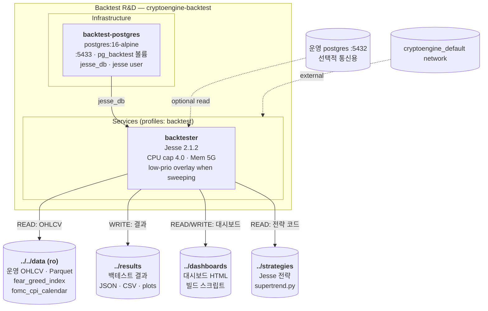

# L2 Containers — Backtest R&D 스택

## 3. Backtest R&D 스택

<!-- last-verified: 2026-08-29 -->
<!-- code-ref: /backtest/docker/docker-compose.yml -->



### 구조 설명

**별도 독립 스택**:
- Backtest는 `profile: backtest`로 격리 (기본 프로덕션과 분리)
- 실행: `docker compose --profile backtest up -d`

**Data Flow**:
- **Input**: `/data` (운영 OHLCV, read-only 마운트)
- **Output**: `results/`, `dashboards/` (백테스트 산출물)
- **jesse_db**: 백테스트 결과 저장 (메인 cryptoengine DB와 분리)

**서비스**:
- **backtester**: 기본 상한 4 CPU / 5GB. ATR-SL 재스윕은 `compose.sweep-day.yml`(주간 2워커, cpuset 6–7) / `compose.sweep-night.yml`(00–06 KST 6워커, cpuset 3–7) + `nice 19`로 운영 Docker보다 양보한다.

> **wf-scheduler 삭제 (2026-08-29)**: 월간 Walk-Forward 자동 실행 서비스(FA 시대 잔재, `WF_FA_RATIO`/`WF_REINVEST`/`WF_LEVERAGE` env)는 `backtest/docker/docker-compose.yml`에서 전량 제거되었다. Walk-Forward 자동화는 현재 폐지 상태 — `docs/cryptoengine/70-policy/strategy.md` §9 참조.

---

## 5. 포트 맵
| 포트 | 서비스 | 호스트 바인딩 | 용도 | 접근성 |
|------|--------|-------------|------|--------|
| **5433** | backtest-postgres | **127.0.0.1 only** (D8, 2026-08-29. 이전 0.0.0.0 노출) | jesse_db | 로컬 전용 |

## 6. Named Volumes
| 볼륨 | 마운트 경로 | 드라이버 | 용도 |
|------|-----------|---------|------|
| **pg_backtest** | /var/lib/postgresql/data | local | 백테스트 jesse_db 영구 저장 |
|-----------|-------------|--------|------|------|

### Backtest (profiles: backtest)

| 변수 | 서비스 | 기본값 | 설명 |
|------|--------|--------|------|
| `JESSE_DB_HOST` | backtester | backtest-postgres | 백테스트 DB 호스트 |
| `JESSE_DB_PORT` | backtester | 5432 | 백테스트 DB 포트 |
| `JESSE_DB_NAME` | backtester | jesse_db | 백테스트 DB 명 |
| `JESSE_DB_USER` | backtester | jesse | 백테스트 DB 사용자 |
| `JESSE_DB_PASSWORD` | backtester | (required, `.env`) | 백테스트 DB 암호. 호스트 포트는 `127.0.0.1:5433` |

> `wf-scheduler` 및 관련 `MONTHLY_WF_CRON`/`WF_CAPITAL`/`WF_LOOKBACK_DAYS`/`WF_TRAIN_DAYS`/`WF_TEST_DAYS`/`WF_LEVERAGE` 환경변수는 2026-08-29 서비스 삭제와 함께 제거되었다.

---


### 백테스트 실행

```bash
# 일회성 백테스트
docker compose --profile backtest run --rm backtester \
  python /app/scripts/runners/run_external_backtest.py

# 백테스트 스택 기동
docker compose --profile backtest up -d
```

> `wf-scheduler`(월간 Walk-Forward 자동 실행)는 2026-08-29 삭제되었다. 관련 명령 없음.

---


## 참고 문서

- `docs/shared/20-containers.md` — 네트워크 경계
- `docs/cryptoengine/70-policy/strategy.md` — Supertrend SSOT · 백테스트 방법론
