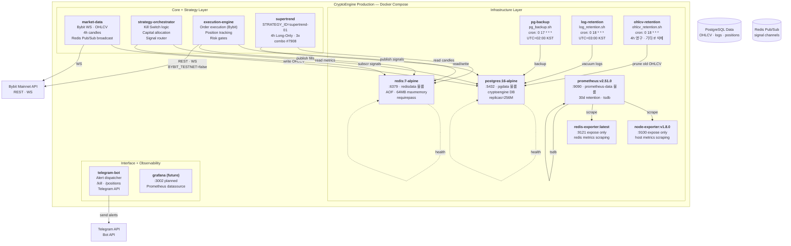

# L2 Containers — CryptoEngine 운영 스택

CryptoEngine 프로젝트의 모든 서비스는 **Docker Compose 기반 컨테이너 오케스트레이션**으로 배포됩니다.
이 문서는 C4 L2(Container) 계층에서 배포 단위, 네트워크, 볼륨, 환경변수를 정의합니다.

---

## 1. CryptoEngine 운영 스택 (Production)

<!-- last-verified: 2026-08-29 -->
<!-- code-ref: /cryptoengine/docker-compose.yml -->



### 구조 설명

**Infrastructure Layer** — 공유 기반 리소스:
- `postgres`: 모든 서비스의 중앙 상태 저장소 (OHLCV, 포지션, 로그, 메트릭)
- `redis`: Pub/Sub 신호 전파 채널 (시장 데이터 → 전략 → 실행)
- `prometheus`: 메트릭 수집 (node-exporter, redis-exporter)
- 유지보수 작업: 백업, 로그 정리. **Bybit 운영 OHLCV는 4h만 수집·영구 보존.** 잔여 단기봉(구 Binance/OKX 수집분)은 7일 후 삭제.

**Core + Strategy Layer** — 비즈니스 로직:
- `market-data`: Bybit 메인넷 **BTCUSDT perpetual 4h OHLCV만** 수집, Redis Pub/Sub으로 broadcast. `quarterly_lifecycle.py`와 분기물 구독·적재는 2026-08-29 D2에서 삭제됨. 수집 심볼은 `SYMBOL` env(기본 BTCUSDT) 단일.
- `strategy-orchestrator`: Kill Switch 4단계, 자본 배분, 신호 라우팅
- `execution-engine`: 주문 실행 (Bybit REST), 포지션 추적, 위험 게이트
- `supertrend`: Supertrend 4h 전략 (combo #7908, Long-only, 3x)

> **Track-C(멀티거래소) 폐지 (2026-08-29)**: `market-data-binance`/`market-data-okx` 서비스와 관련 소스(`binance_collector.py`, `okx_collector.py`, `shared/exchange/binance.py`, `config/exchanges/{binance,okx}.yaml`)는 전량 삭제되었다. 운영 전략이 읽지 않던 1m OHLCV 보조 수집기였다. Bybit 단독 운영. 복구 지점: git 태그 `legacy-archive-2026-08-29`. 상세: `docs/shared/90-adr/0009-legacy-strategy-retirement.md`

**Interface + Observability**:
- `telegram-bot`: Telegram 알림 (trade, alert, /kill, /positions)
- `grafana`: 미래 계획 (Prometheus 데이터소스)

> 대시보드는 `cryptoengine/docker-compose.yml`에 포함되지 않는다 — 독립 프로젝트 `bitmania-dashboard`(§9)로 분리 운영됨.

---

## 2. 서비스 상세 사양

| 서비스 | 이미지 | 호스트 포트 | 내부 포트 | Depends On | CPU Limit | Memory Limit | Restart |
|--------|--------|-----------|----------|-----------|-----------|-------------|---------|
| **postgres** | postgres:16-alpine | 127.0.0.1:5432 | 5432 | — | 1.0 | 512M | always |
| **redis** | redis:7-alpine | 127.0.0.1:6379 | 6379 | — | 0.25 | 96M | always |
| **prometheus** | prom/prometheus:v2.51.0 | 0.0.0.0:9090 | 9090 | redis-exp, node-exp | 0.5 | 512M | always |
| **node-exporter** | prom/node-exporter:v1.8.0 | expose | 9100 | — | 0.1 | 64M | always |
| **redis-exporter** | oliver006/redis_exporter:latest | expose | 9121 | redis | 0.1 | 64M | always |
| **pg-backup** | postgres:16-alpine | — | — | postgres | 0.5 | 128M | always |
| **log-retention** | postgres:16-alpine | — | — | postgres | 0.2 | 64M | always |
| **ohlcv-retention** | postgres:16-alpine | — | — | postgres | 0.1 | 32M | always |
| **market-data** | cryptoengine/market-data | — | — | redis, postgres | 0.25 | 128M | always |
| **strategy-orchestrator** | cryptoengine/orchestrator | — | — | redis, postgres, market-data | 0.5 | 256M | always |
| **execution-engine** | cryptoengine/execution | — | — | redis, postgres | 0.5 | 256M | always |
| **supertrend** | cryptoengine/supertrend | — | — | redis, postgres, market-data | 0.5 | 256M | always |
| **telegram-bot** | cryptoengine/telegram-bot | — | — | redis, postgres | 0.2 | 128M | always |

### 재시작 정책

- **always** — 전 서비스(13종) 모두 크리티컬 서비스. 종료 시 자동 재시작 (`unless-stopped`/Track-C profile 개념은 2026-08-29 Track-C 삭제로 폐지)

---

## 5. 포트 맵

| 포트 | 서비스 | 호스트 바인딩 | 용도 | 접근성 |
|------|--------|-------------|------|--------|
| **5432** | postgres | 127.0.0.1 | 운영 데이터베이스 | 로컬 (localhost) |
| **6379** | redis | 127.0.0.1 | Pub/Sub 브로커 | 로컬 (컨테이너 내부) |
| **9090** | prometheus | 0.0.0.0:9090 | 메트릭 쿼리 · UI | 호스트 접근 가능 |
| **9100** | node-exporter | expose only | Prometheus 스크래핑 | 컨테이너 네트워크만 |
| **9121** | redis-exporter | expose only | Prometheus 스크래핑 | 컨테이너 네트워크만 |
| **3002** | grafana (future) | 0.0.0.0:3002 | Grafana UI | 호스트 접근 가능 |

### 보안 주의

- **localhost only** (`127.0.0.1`): postgres, redis (내부 통신)
- **공개** (`0.0.0.0`): prometheus, dashboard (모니터링/인터페이스)
- **expose only**: node-exporter, redis-exporter (컨테이너 네트워크 내부 메트릭)

---

## 6. Named Volumes

| 볼륨 | 마운트 경로 | 드라이버 | 용도 |
|------|-----------|---------|------|
| **pgdata** | /var/lib/postgresql/data | local | 운영 데이터베이스 영구 저장 |
| **redisdata** | /data | local | Redis AOF 영구 저장 (64MB maxmemory) |
| **prometheus-data** | /prometheus | local | 메트릭 시계열 저장 (30d) |
| **pg-backups** | /backups | local | PostgreSQL 매일 백업 (02:00 KST) |

### 호스트 경로 바인드

| 호스트 경로 | 컨테이너 경로 | 서비스 | 권한 | 용도 |
|-----------|-------------|--------|------|------|
| `./config` | /app/config | market-data, orchestrator, execution, supertrend, telegram-bot | :ro | 설정 파일 (읽기 전용) |
| `./config/prometheus` | /etc/prometheus | prometheus | :ro | Prometheus 설정 |
| `./scripts/sh/` | /scripts | pg-backup, log-retention, ohlcv-retention | :ro | 유지보수 스크립트 |
| `../.request` | /app/request_dir | telegram-bot | rw | Telegram 요청 큐 |
| `../.result` | /app/result_dir | telegram-bot | rw | Telegram 결과 큐 |

---

## 7. 환경변수 (Critical)

### 공유 환경 (`x-common-env`)

| 변수 | 기본값 | 설명 |
|------|--------|------|
| `DB_HOST` | postgres | 데이터베이스 호스트 |
| `DB_PORT` | 5432 | 데이터베이스 포트 |
| `DB_NAME` | cryptoengine | 데이터베이스 명 |
| `DB_USER` | cryptoengine | 데이터베이스 사용자 |
| `DB_PASSWORD` | **필수** (`${DB_PASSWORD:?}`). 소스 기본값 없음. 미설정 시 compose 기동 거부 |
| `REDIS_URL` | redis://:${REDIS_PASSWORD}@redis:6379 | Redis 연결 URI. 미설정 시 기동 거부(fail-closed). 로그에는 비밀번호를 남기지 않는다 |
| `LOG_LEVEL` | INFO | 로깅 레벨 (DEBUG, INFO, WARN, ERROR) |
| `ENVIRONMENT` | testnet | 환경 구분 (testnet, mainnet) |

> **fail-closed (2026-08-29)**: `DB_PASSWORD`·`REDIS_PASSWORD` 미설정 시 compose는 기동하지 않는다. 애플리케이션은 `cryptoengine/shared/required_env.py`의 `require_env()`. 셸에서 `source .env` 하면 compose가 **파일보다 셸 export를 우선**한다 — 로테이션 직후 옛 값이 남을 수 있음. 상세 [ADR-0010](../shared/90-adr/0010-ops-cleanup-20260829.md).

### Phase 5 (운영 모드) — ⚠️ Critical

| 변수 | 서비스 | 값 | 설명 |
|------|--------|-----|------|
| **BYBIT_TESTNET** | market-data, execution-engine, supertrend | **false** | ⚠️ 메인넷 실전. 절대 true로 전환 금지 (포지션 손실) |
| **PHASE5_MODE** | strategy-orchestrator, execution-engine, supertrend | **true** | Phase 5 안전 모드 활성화 |
| **EXPECTED_INITIAL_BALANCE_USD** | strategy-orchestrator, execution-engine, supertrend | **238.88** (2026-08-29 청산 후; gitignore `.env`) | 잔고 게이트 폴백 (Redis `ce:phase5:equity_baseline` 우선, 허용 5%) |

### Bybit API

| 변수 | 서비스 | 기본값 | 설명 |
|------|--------|--------|------|
| `BYBIT_API_KEY` | market-data, execution-engine, supertrend | (required) | Bybit API Key |
| `BYBIT_API_SECRET` | market-data, execution-engine, supertrend | (required) | Bybit API Secret |

### Risk Management

| 변수 | 서비스 | 기본값 | 설명 |
|------|--------|--------|------|
| `SAFETY_LEVERAGE_LIMIT` | execution-engine | **3.0** | 레버리지 하드 상한 (절대 초과 금지) |
| `STOP_LOSS_PCT` | execution-engine | 0.2333 | 안전 스탑로스 퍼센트 (진입가 − 70%/lev) |
| `STRICT_MONITORING_HOURS` | strategy-orchestrator, execution-engine, supertrend | 0 | 엄격 모니터링 시간 (0 = 24h) |

### 유지보수 크론

| 변수 | 서비스 | 기본값 | 설명 |
|------|--------|--------|------|
| `BACKUP_CRON` | pg-backup | 0 17 * * * | 백업 스케줄 (02:00 KST) |
| `LOG_RETENTION_CRON` | log-retention | 0 18 * * * | 로그 정리 (03:00 KST) |
| `OHLCV_RETENTION_CRON` | ohlcv-retention | 0 18 * * * | 단기 봉 롤링 보존 (03:00 KST) |
| `OHLCV_RETENTION_DAYS` | ohlcv-retention | 7 | 4h가 아닌 잔여 timeframe 삭제 일수. 운영 수집은 4h만 |

### Telegram

| 변수 | 서비스 | 기본값 | 설명 |
|------|--------|--------|------|
| `TELEGRAM_BOT_TOKEN` | telegram-bot | (required) | Telegram Bot Token |
| `TELEGRAM_CHAT_ID` | telegram-bot | (required) | 운영자 Chat ID |

## 8. Dockerfile 패턴

### 표준 Application Dockerfile

```dockerfile
FROM python:3.12-slim

WORKDIR /app

# 공유 라이브러리 복사 (프로젝트 루트에서 COPY)
COPY cryptoengine/shared /app/shared

# 서비스별 코드 복사
COPY cryptoengine/services/<SERVICE_NAME> /app/

# Python 경로 설정
ENV PYTHONPATH=/app

# 진입점
CMD ["python", "main.py"]
```

### Build Context

**반드시 프로젝트 루트(`.`)에서 빌드**:

```bash
# ✓ 올바른 빌드 명령
docker compose build market-data

# ✗ 실패할 명령
cd cryptoengine && docker compose build market-data  # COPY 경로 해석 실패
```

### 빌드 컨텍스트 경로

```yaml
# docker-compose.yml
services:
  market-data:
    build:
      context: .                                    # 프로젝트 루트
      dockerfile: services/market-data/Dockerfile  # 상대 경로 (context 기준)

  backtester:
    build:
      context: ../..                                # backtest/docker에서 프로젝트 루트로
      dockerfile: backtest/docker/Dockerfile
```

---

## 10. 배포 명령

### 프로덕션 기동

```bash
# 모든 서비스 기동
docker compose up -d

# 인프라만 기동 (postgres, redis)
docker compose up -d postgres redis

# 특정 서비스 재빌드 후 기동
docker compose up -d --build --no-deps market-data

# shared/ 변경 시 전체 재빌드 (필수)
docker compose build \
  market-data \
  strategy-orchestrator execution-engine supertrend \
  telegram-bot
```

> `dashboard`는 별도 프로젝트(`/home/justant/Data/Bit-Mania/dashboard`)이므로 여기 재빌드 목록에 포함되지 않는다. §9 참조.

### 모니터링

```bash
# 실시간 로그 (tail 20줄)
docker compose logs --tail=20 -f supertrend

# 특정 시간대 로그
docker compose logs --since=2h -f execution-engine

# 서비스 상태 확인
docker compose ps
```

## 11. 상태 게이트 (Health Checks)

모든 데이터 레이어 서비스는 startup 검사 포함:

| 서비스 | 검사 방식 | 시작 대기 | Retries |
|--------|---------|---------|---------|
| postgres | pg_isready -U cryptoengine | 30s | 5 |
| redis | redis-cli PING | 10s | 5 |
| market-data | /tmp/heartbeat_ok | 30s | 3 |
| execution-engine | /tmp/heartbeat_ok | 30s | 3 |
| supertrend | /tmp/heartbeat_ok | 30s | 3 |

**종속 시작 순서** (depends_on):
1. postgres, redis (기반)
2. market-data (데이터 수집)
3. strategy-orchestrator, execution-engine (코어)
4. supertrend (전략)

---


## 참고 문서

- `docs/shared/20-containers.md` — 세 서브시스템 네트워크 경계
- `docs/shared/70-policy.md` — 운영 Runbook
- `docs/cryptoengine/70-policy/strategy.md` — 전략 파라미터
- `docs/cryptoengine/50-api.md` — Redis Pub/Sub
