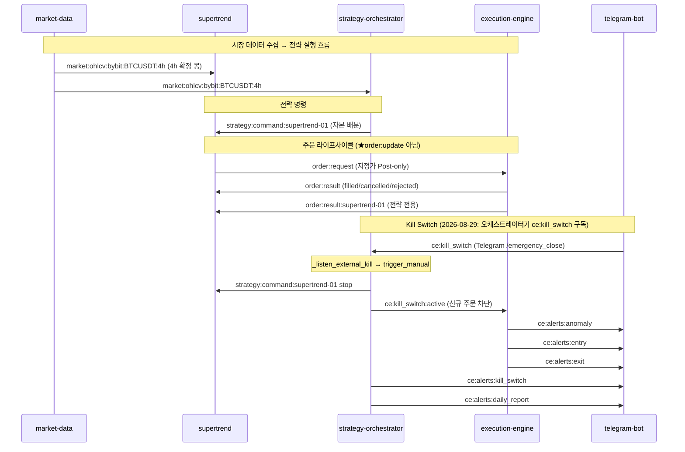

# L5 API — Redis Pub/Sub 채널 카탈로그

> CryptoEngine 마이크로서비스 간 비동기 통신 규약 .

---

## §1. 채널 카탈로그 (Diagram J)

★ **중요**: 기존 문서의 `order:update`는 **코드 드리프트**입니다.
코드 실제 채널: `order:result` + `order:result:{strategy_id}` (execution/engine.py:257,262,312,314)

<!-- last-verified: 2026-08-29 -->
<!-- code-ref: cryptoengine/shared/kill_switch.py:32-35, cryptoengine/services/execution/engine.py, cryptoengine/services/strategies/supertrend/strategy.py, cryptoengine/services/telegram-bot/main.py:72-80 -->

---

## §2. 채널 상수 정의 위치

| 채널 | 상수 정의 | 파일 |
|---|---|---|
| `ce:kill_switch` | orchestrator `_listen_external_kill` (구독자 ≥1), 발행: telegram / emergency 스크립트 / KS 콜백 | `cryptoengine/shared/kill_switch.py:32` |
| `ce:kill_switch:ack` | `KILL_SWITCH_ACK_CHANNEL` | `cryptoengine/shared/kill_switch.py:34` |
| `ce:alerts:anomaly` | `_ERROR_ALERT_CHANNEL` | `cryptoengine/shared/logging_config.py:154` |
| `position:reconcile_event` | `RECONCILE_CHANNEL` | `cryptoengine/services/execution/position_tracker.py:37` |
| `market:ohlcv:bybit:BTCUSDT:4h` | 하드코딩 | `cryptoengine/services/strategies/supertrend/strategy.py:926` |

---

## §3. f-string 채널 패턴

| 패턴 | 발행자 | 구독자 |
|---|---|---|
| `market:ohlcv:{exchange}:{symbol}:{tf}` | market-data | supertrend, orchestrator |
| `market:funding:{exchange}:{symbol}` | market-data, funding_monitor | orchestrator |
| `market:open_interest:...` | market-data | orchestrator |
| `market:liquidations:...` | market-data | orchestrator |
| `order:request` | supertrend | execution-engine |
| `order:result` | execution-engine | supertrend |
| `order:result:{strategy_id}` | execution-engine | supertrend (전략 전용) |
| `strategy:command:{strategy_id}` | orchestrator | supertrend (`tick_interval` 60s drain) |
| `ce:strategy:command` | telegram-bot | orchestrator |
| `ce:alerts:{type}` | 전 서비스 | telegram-bot |
| `llm:advisory` | ⚠️ **DEAD** — 발행자 없음 | — |

> `llm:advisory`: `llm-advisor` 서비스와 orchestrator의 `_subscribe_llm_advisory()` 구독 로직이 2026-08-29 전량 삭제되었다. 채널 상수만 코드에 잔존할 수 있으나 발행자가 없어 죽은 채널이다.

> 분기물 Redis 채널(`market:ohlcv:{exchange}:{quarterly}:{tf}`, `market:ticker:{exchange}:{quarterly}`)과 `quarterly_lifecycle.py`는 2026-08-29 D2에서 제거됨. 라이브 구독은 Bybit **BTCUSDT 4h**만. Track-C(Binance/OKX)도 2026-08-29 전량 삭제.

---

## §3.1 Redis KV 키 (잔고 · 하트비트)

| 키 | TTL | Writer | 용도 |
|---|---|---|---|
| `ce:phase5:equity_baseline` | 없음 | execution-engine | Phase 5 잔고 게이트 기준선 (전원 장애 복구). JSON: `equity`, `updated_at`, `source` |
| `cache:wallet_balance` | 300s | execution-engine | orchestrator 포트폴리오 equity 조회 |
| `cache:balance:{exchange}` | 300s | execution-engine | 거래소별 잔고 캐시 |
| `heartbeat:execution-engine` | 300s | execution-engine | Dead Man's Switch 감시 |

---

