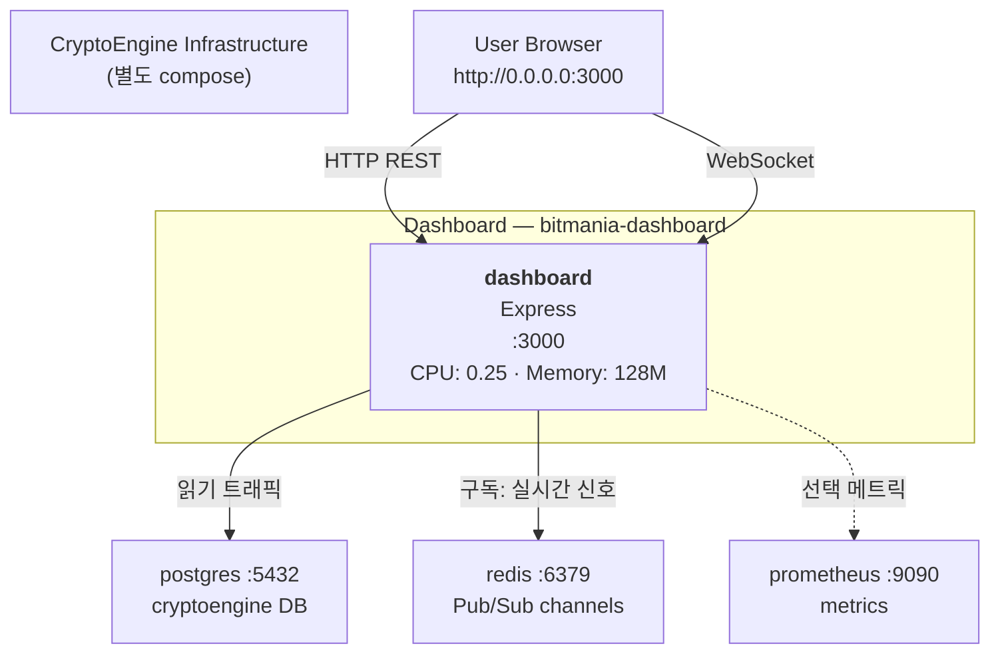

# L2 Containers — Dashboard 스택

## 4. Dashboard 스택

<!-- last-verified: 2026-08-29 -->
<!-- code-ref: /dashboard/docker-compose.yml -->

### 구조 설명

**네트워크**:
- `cryptoengine_default` (external)에 연결
- 운영 postgres, redis, prometheus 접근 가능

**역할**:
- 실시간 포지션, 자산, 신호 시각화
- Telegram 이외 웹 기반 모니터링 인터페이스

**포트**:
- 호스트 바인딩: `0.0.0.0:3000:3000` (운영 네트워크에서 접근)

---

## 5. 포트 맵
| 포트 | 서비스 | 호스트 바인딩 | 용도 | 접근성 |
|------|--------|-------------|------|--------|
| **3000** | dashboard (bitmania-dashboard, §9) | 0.0.0.0:3000 | 실시간 매매 대시보드 | 호스트 접근 가능 |

## 11. 상태 게이트 (Health Checks)
| 서비스 | 검사 방식 | 시작 대기 | Retries |
|--------|---------|---------|---------|
| dashboard | wget /health | 15s | 3 |
5. telegram-bot, dashboard (인터페이스)

## 참고 문서

- `docs/shared/20-containers.md` — 네트워크 경계
- `docs/dashboard/50-api.md` — Dashboard REST
