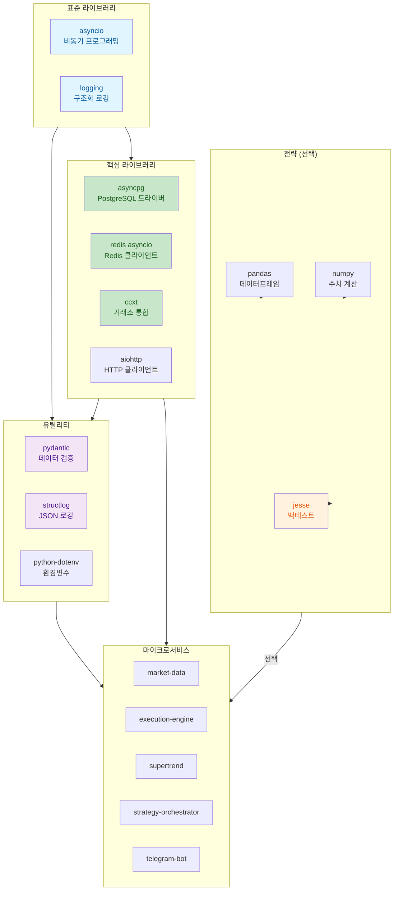

# Python 의존성

CryptoEngine이 사용하는 핵심 Python 라이브러리 및 버전 정보.

---

## 의존성 계층 구조



---

## 공통 의존성 (모든 서비스)

### asyncpg
```
asyncpg>=0.28.0
```
- **용도**: PostgreSQL 비동기 드라이버
- **선택 이유**: 
  - 진정한 비동기 (asyncio 기반)
  - 높은 성능 (C 확장)
  - 연결 풀 지원
- **사용**: `from shared.db import get_db_pool`
- **예**:
  ```python
  async def fetch_trades():
      pool = await get_db_pool()
      trades = await pool.fetch('SELECT * FROM trades')
  ```

### ccxt
```
ccxt>=4.0.0
```
- **용도**: 거래소 API 통합 (CCXT 라이브러리)
- **선택 이유**: 
  - 다중 거래소 지원 (Bybit, Binance, Kraken 등)
  - 비동기 지원 (v4+)
  - 표준화된 API
- **사용**: `from shared.exchange import BybitExchange`
- **특징**:
  - CCXT v4 = 완전 비동기
  - Testnet/Mainnet 자동 전환
  - 선물, 현물, 마진 거래 지원
- **예**:
  ```python
  exchange = BybitExchange()
  rate = await exchange.fetch_funding_rate('BTCUSDT')
  ```

### structlog
```
structlog>=24.1.0
```
- **용도**: 구조화된 로깅 (JSON 포맷)
- **선택 이유**:
  - JSON 로그로 분석 및 검색 용이
  - 컨텍스트 자동 추적
  - asyncio 호환
- **사용**: `import structlog; logger = structlog.get_logger()`
- **설정**: `from shared.logging_config import configure_logging`
- **주의**: `structlog.INFO` 없음 → `logging.INFO` 사용
- **로그 예**:
  ```json
  {
    "timestamp": "2026-05-01T14:30:45+09:00",
    "level": "INFO",
    "event": "trade_entry",
    "strategy": "supertrend",
    "size": 10.5
  }
  ```

### aiohttp
```
aiohttp>=3.9.0
```
- **용도**: 비동기 HTTP 클라이언트
- **선택 이유**:
  - asyncio 기반
  - WebSocket 지원
  - 커넥션 풀링
- **사용 예**:
  ```python
  async with aiohttp.ClientSession() as session:
      async with session.get('https://api.example.com') as resp:
          data = await resp.json()
  ```

### aioredis / redis
```
redis[asyncio]>=5.0.0
```
- **용도**: Redis 클라이언트 (Pub/Sub, 캐시)
- **선택 이유**:
  - asyncio 지원 (redis[asyncio])
  - Pub/Sub 메시징
  - 캐시 및 세션 저장
- **사용**: `from shared.redis_client import get_redis`
- **예**:
  ```python
  redis = await get_redis()
  await redis.publish('market:funding_rate', json.dumps(data))
  ```

### pydantic
```
pydantic>=2.0.0
```
- **용도**: 데이터 검증 및 직렬화
- **선택 이유**:
  - 타입 힌트 기반
  - 자동 검증
  - JSON 스키마 생성
- **사용 예**:
  ```python
  from pydantic import BaseModel
  
  class Trade(BaseModel):
      entry_price: float
      exit_price: float
      size: float
  ```

### python-dotenv
```
python-dotenv>=1.0.0
```
- **용도**: .env 파일에서 환경 변수 로드
- **사용**: `from dotenv import load_dotenv; load_dotenv()`

---

## 전략 서비스 의존성

### supertrend
```
pandas>=2.0.0
numpy>=1.24.0
ta-lib (또는 jesse_rust)
```
- **pandas**: 데이터프레임 기반 분석 (가격, OHLCV 처리)
- **numpy**: 수치 계산 (Supertrend, EMA 등 기술적 지표)
- **ta-lib/jesse_rust**: 기술 지표 계산

### backtester (백테스트)
```
jesse>=0.39.0
```
- **용도**: Jesse 프레임워크 (주식/선물 백테스트)
- **인프라**: `backtest/docker/docker-compose.yml` (별도 `backtest-postgres`, port 5433)
- **특징**:
  - 완전한 백테스트 환경
  - Walk-Forward 분석
  - Monte Carlo 시뮬레이션
  - Parquet 결과 저장 (`backtest/results/`)
- **설치**:
  ```bash
  pip install jesse
  jesse install-pkg jesse-exchange-bybit
  ```
- **사용**: `docker compose -f backtest/docker/docker-compose.yml --profile backtest run --rm backtester python scripts/<script>.py`

---

## 선택 의존성 (프로덕션 미사용)

### pytest
```
pytest>=7.0.0
pytest-asyncio>=0.21.0
pytest-cov>=4.0.0
```
- **용도**: 유닛 테스트
- **사용**: `pytest tests/`

### mypy
```
mypy>=1.0.0
```
- **용도**: 정적 타입 검사
- **사용**: `mypy --strict cryptoengine/`

---

## 버전 제약 (주의)

### asyncpg와 PostgreSQL 호환성
```
asyncpg>=0.28.0
PostgreSQL 12+
```
- asyncpg 0.28+는 PostgreSQL 12+ 필수

### structlog와 logging 호환성
```
structlog>=24.1.0
logging (표준 라이브러리)
```
- `import logging` 후 `logging.INFO` 사용 (structlog.INFO 없음)

### ccxt와 거래소 API
```
ccxt>=4.0.0 (비동기 필수)
```
- v3 이하는 동기 방식만 지원 (성능 저하)
- v4 = 완전 비동기

---

## 설치 및 관리

### 전체 설치
```bash
cd cryptoengine
pip install -r requirements.txt
```

### 서비스별 설치 (Docker)
각 서비스 Dockerfile에서 자동 설치:
```dockerfile
COPY cryptoengine/services/strategies/supertrend/requirements.txt .
RUN pip install --no-cache-dir -r requirements.txt
```

### 의존성 업그레이드
```bash
# 모든 패키지 업그레이드 확인
pip list --outdated

# 특정 패키지 업그레이드
pip install --upgrade asyncpg ccxt

# 호환성 확인
pip check
```

---

## 성능 최적화

### asyncpg 연결 풀 크기
```python
# shared/db/pool.py
pool = await asyncpg.create_pool(
    dsn=DB_URL,
    min_size=10,      # 최소 연결
    max_size=50,      # 최대 연결
    timeout=30,       # 연결 획득 타임아웃
)
```

### redis 연결
```python
# shared/redis_client.py
redis = await aioredis.from_url(
    'redis://redis:6379',
    decode_responses=True,
    max_connections=50
)
```

### structlog 배치 처리
```python
# shared/log_writer.py
# 100개 또는 5초마다 일괄 DB 쓰기
```

---

## 문제 해결

### 호환성 문제: asyncpg와 PostgreSQL
```bash
# asyncpg 버전 확인
pip show asyncpg
# Requires: python>=3.8

# PostgreSQL 버전 확인
docker compose exec postgres psql --version
# PostgreSQL 15.x

# 호환성 검증
docker compose exec execution-engine python -c \
  "import asyncpg; print('OK')"
```

### ccxt 선물 거래 오류
```bash
# CCXT 업그레이드
pip install --upgrade ccxt>=4.0.0

# Bybit exchange 플러그인 확인
docker compose exec supertrend python -c \
  "from ccxt.async_support import bybit; print('OK')"
```

### structlog 로그 레벨 오류
```bash
# 오류: NameError: name 'structlog' has no attribute 'INFO'
# 해결:
import logging
logger.bind(level=logging.INFO)  # logging.INFO 사용
```

### 메모리 누수 (연결 풀)
```bash
# asyncpg 연결 풀 상태 확인
docker compose exec execution-engine python -c \
  "pool = await get_db_pool(); print(pool.get_size())"

# 연결 정리 (graceful shutdown)
await pool.close()
await redis.close()
```

---

## 프로덕션 체크리스트

- [ ] 모든 의존성 버전 명시 (requirements.txt)
- [ ] 순환 의존성 없음 (`pip check`)
- [ ] 보안 업데이트 확인 (`pip audit` 또는 safety)
- [ ] 라이선스 확인 (프로덕션 배포 전)
- [ ] 성능 테스트 (부하 테스트)
- [ ] 메모리 누수 테스트 (장시간 운영)

---

**최종 수정**: 2026-06-14
