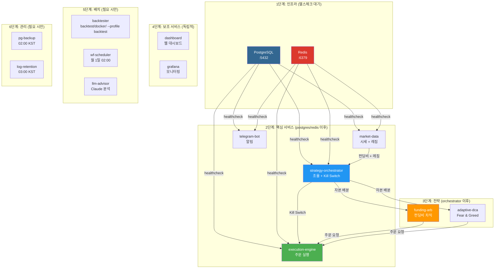

# Docker 설정 및 사용 가이드

Docker Compose를 이용한 CryptoEngine 스택 관리.

---

## 빌드 컨텍스트 규칙

### 핵심 원칙
모든 서비스의 build context는 **프로젝트 루트** (`.`) 으로 설정되어 있습니다.

**docker-compose.yml 예**:
```yaml
services:
  funding-arb:
    build:
      context: .
      dockerfile: cryptoengine/services/strategies/funding-arb/Dockerfile
```

### Dockerfile 작성 규칙

Dockerfile 내 COPY 경로는 **반드시 프로젝트 루트 기준**으로 작성:

```dockerfile
# 올바른 예
FROM python:3.12
WORKDIR /app

COPY cryptoengine/shared /app/shared
COPY cryptoengine/services/strategies/funding-arb /app/strategy
COPY cryptoengine/services/strategies/base_strategy.py /app/

ENV PYTHONPATH=/app

CMD ["python", "-m", "uvicorn", "strategy.main:app"]
```

```dockerfile
# 잘못된 예 (빌드 실패)
COPY ../../shared /app/shared        # 상대경로 금지
COPY shared /app/shared              # context=. 기준이 아님
COPY /shared /app/shared             # 절대경로 금지
```

---

## 자주 쓰는 Docker 명령

### 1. 스택 기동

#### 전체 스택 기동
```bash
cd cryptoengine
docker compose up -d
```
- 모든 19개 서비스 시작
- 데이터베이스 자동 초기화
- 로그는 백그라운드로 실행

#### 인프라만 기동 (DB, Redis, Grafana)
```bash
docker compose up -d postgres redis grafana
```
- 개발/테스트 시 유용
- 핵심 서비스 없이 데이터 계층만 준비

#### 핵심 서비스만 기동
```bash
docker compose up -d market-data execution-engine funding-arb strategy-orchestrator
```
- 시장 데이터부터 실행 순서 중요
- execution-engine, funding-arb는 market-data 이후 시작

---

### 2. 빌드 및 재시작

#### 특정 서비스 재빌드 (코드 변경 후)
```bash
docker compose up -d --build --no-deps funding-arb
```
- `--build`: 이미지 재빌드
- `--no-deps`: 의존 서비스 재시작 안 함
- `--no-cache`: 캐시 무시 (강제 재빌드)

예시:
```bash
# funding-arb 전략 로직 수정 후
docker compose up -d --build --no-deps funding-arb

# 로그 확인하며 정상 시작 확인
docker compose logs --tail=20 funding-arb
```

#### 전체 스택 재빌드
```bash
docker compose build
```
- 모든 이미지 재빌드 (캐시 사용)
- 캐시 무시: `docker compose build --no-cache`

#### shared/ 수정 시 (모든 서비스 재빌드)

`shared/` 라이브러리 변경 시 모든 의존 서비스를 **순서대로** 재빌드:

```bash
# 1단계: 각 서비스 재빌드 (순서 중요)
docker compose build market-data execution-engine funding-arb strategy-orchestrator telegram-bot

# 2단계: 서비스 재시작 (의존성 유지)
docker compose up -d --no-deps market-data execution-engine funding-arb strategy-orchestrator telegram-bot

# 3단계: 로그 확인
docker compose logs --follow funding-arb
```

**재빌드 순서**:
1. market-data (다른 서비스의 데이터 소비)
2. execution-engine (주문 처리)
3. funding-arb (핵심 전략)
4. strategy-orchestrator (조율)
5. telegram-bot (알림)

#### 기동 순서 및 의존성 시각화



---

### 3. 프리플라이트 & Phase 5 준비

#### Phase 5 전환 전 검증

```bash
# 현재 디렉토리: cryptoengine/

# 8개 항목 점검 (Pass 필수)
python scripts/phase5_preflight.py

# JSON 출력 (자동화용)
python scripts/phase5_preflight.py --json

# 특정 항목 스킵
python scripts/phase5_preflight.py --skip fees --skip leverage
```

**점검 항목**:
1. Bybit 계정 (메인넷 키 테스트)
2. 예상 초기 잔고 (±10% 범위)
3. 수수료 구조 (maker/taker)
4. 레버리지 설정 (5배 이하)
5. 포지션 가능 여부
6. 데이터베이스 연결
7. Redis 연결
8. API 레이트 리밋

---

### 4. 로그 확인

#### 실시간 로그 보기
```bash
# 특정 서비스
docker compose logs -f funding-arb

# 마지막 50줄만
docker compose logs --tail=50 funding-arb

# 여러 서비스 동시
docker compose logs -f market-data execution-engine funding-arb
```

#### 로그 필터링
```bash
# ERROR 레벨만
docker compose logs funding-arb | grep ERROR

# 특정 문자열 검색
docker compose logs funding-arb | grep "포지션\|Error"

# 최근 1시간 로그
docker compose logs --since 1h funding-arb
```

#### 전체 로그 출력
```bash
# 모든 서비스
docker compose logs | head -1000

# 파일로 저장
docker compose logs > logs_backup.txt
```

---

### 4. 상태 확인

#### 전체 서비스 상태
```bash
docker compose ps
```

예상 출력:
```
NAME                   IMAGE                  STATUS
postgres               postgres:15            Up 2 hours
redis                  redis:7                Up 2 hours
market-data           cryptoengine:latest   Up 1 hour
execution-engine      cryptoengine:latest   Up 1 hour
funding-arb           cryptoengine:latest   Up 45 minutes
strategy-orchestrator cryptoengine:latest   Up 40 minutes
...
```

#### 특정 서비스 상태
```bash
docker compose exec funding-arb ps aux
docker compose exec postgres pg_isready
```

---

### 5. 컨테이너 관리 (시작/정지/제거)

#### 서비스 정지
```bash
# 특정 서비스
docker compose stop funding-arb

# 모든 서비스 (데이터 유지)
docker compose stop
```

#### 서비스 재시작
```bash
# 특정 서비스
docker compose restart funding-arb

# 모든 서비스
docker compose restart
```

#### 서비스 제거
```bash
# 컨테이너만 제거 (이미지 유지)
docker compose rm -f funding-arb

# 컨테이너 + 볼륨 (데이터 삭제!)
docker compose down -v
```

---

### 6. 데이터베이스 접속

#### PostgreSQL 직접 접속
```bash
docker compose exec postgres psql -U cryptoengine -d cryptoengine

# SQL 쿼리 실행
docker compose exec postgres psql -U cryptoengine -d cryptoengine \
  -c "SELECT * FROM positions WHERE size > 0;"

# CSV 내보내기
docker compose exec postgres psql -U cryptoengine -d cryptoengine \
  -c "COPY (SELECT * FROM trades ORDER BY entry_ts) TO STDOUT WITH CSV HEADER" \
  > trades.csv
```

#### 마이그레이션 상태 확인
```bash
docker compose exec postgres psql -U cryptoengine -d cryptoengine \
  -c "SELECT * FROM schema_migrations ORDER BY version;"
```

#### 테이블 목록 조회
```bash
docker compose exec postgres psql -U cryptoengine -d cryptoengine \
  -c "\dt"
```

---

### 7. Redis 접속

#### Redis CLI 접근
```bash
docker compose exec redis redis-cli

# 또는 단일 명령
docker compose exec redis redis-cli PING
# 예상 응답: PONG
```

#### 채널 모니터링
```bash
docker compose exec redis redis-cli SUBSCRIBE "market:funding_rate"
docker compose exec redis redis-cli SUBSCRIBE "strategy:command:*"
```

---

### 8. 비상 정지 (Kill Switch 발동)

#### Kill Switch 강제 발동
```bash
# Makefile에 정의됨
make emergency

# 또는 직접 호출
docker compose down
```

**주의**:
- `make emergency`는 Kill Switch 사유로 정지 → 포지션 청산됨
- `docker compose stop`는 graceful shutdown → 포지션 Redis 저장 (복구 가능)

#### Graceful Shutdown (포지션 보호)
```bash
# 1. funding-arb 정지 (상태 저장)
docker compose stop funding-arb

# 2. 상태 저장 확인
docker compose logs --tail=5 funding-arb | grep -i "저장\|saved"

# 3. 재시작 시 복구
docker compose up -d --no-deps funding-arb
docker compose logs --tail=10 funding-arb | grep -i "복구\|recovered"
```

---

## 프로파일 (Profile) 관리

### Backtest 프로필
```bash
# Jesse 백테스트만 실행
docker compose -f backtest/docker/docker-compose.yml --profile backtest run --rm backtester \
  python scripts/shell/run_full_validation.sh IntradaySeasonality

# 이미지 재빌드 후 실행
docker compose -f backtest/docker/docker-compose.yml --profile backtest build --no-cache backtester && \
docker compose -f backtest/docker/docker-compose.yml --profile backtest run --rm backtester \
  python scripts/<script>.py
```

---

## Docker 성능 최적화

### 메모리 제한 설정
`docker-compose.yml`에서 각 서비스에 메모리 제한:
```yaml
services:
  funding-arb:
    deploy:
      resources:
        limits:
          memory: 512M
        reservations:
          memory: 256M
```

### CPU 제한 설정
```yaml
services:
  market-data:
    deploy:
      resources:
        limits:
          cpus: '1'
```

### 볼륨 정리
```bash
# 사용하지 않는 볼륨 제거
docker volume prune

# 특정 볼륨 확인
docker volume ls | grep cryptoengine
```

---

## 문제 해결

### 포트 충돌 (이미 사용 중)
```bash
# 사용 중인 포트 확인
lsof -i :3002  # Grafana
lsof -i :5432  # PostgreSQL
lsof -i :6379  # Redis

# 기존 컨테이너 종료
docker compose down
docker system prune -a
```

### 빌드 실패 (Dockerfile 경로)
```bash
# Dockerfile 위치 확인
ls -la cryptoengine/services/strategies/funding-arb/Dockerfile

# Docker 빌드 디버그 모드
docker compose build --no-cache --progress=plain funding-arb 2>&1 | tail -50
```

### 컨테이너 메모리 부족
```bash
# 현재 메모리 사용량
docker stats

# 불필요한 이미지/컨테이너 정리
docker system prune -a --volumes

# 특정 서비스 메모리 확인
docker compose exec funding-arb free -h
```

### 데이터베이스 연결 실패
```bash
# PostgreSQL 상태 확인
docker compose ps postgres

# 연결 테스트
docker compose exec execution-engine python -c \
  "import asyncpg; print('Connection OK')"

# 포트 확인
docker port postgres
```

### 로그가 너무 많음
```bash
# 로그 볼륨 확인
docker volume inspect cryptoengine_postgres_data

# 로그 회전 설정 (daemon.json)
# /etc/docker/daemon.json
# "log-driver": "json-file"
# "log-opts": {
#   "max-size": "10m",
#   "max-file": "3"
# }
```

---

## 백업 및 복원

### PostgreSQL 백업
```bash
# 전체 데이터베이스 백업
docker compose exec postgres pg_dump -U cryptoengine cryptoengine > backup.sql

# 특정 테이블만 백업
docker compose exec postgres pg_dump -U cryptoengine -t trades cryptoengine > trades_backup.sql
```

### PostgreSQL 복원
```bash
# 백업에서 복원
docker compose exec -T postgres psql -U cryptoengine cryptoengine < backup.sql
```

### Redis 백업
```bash
# RDB 스냅샷 생성
docker compose exec redis redis-cli BGSAVE

# 스냅샷 파일 복사
docker compose cp redis:/data/dump.rdb ./redis_backup.rdb
```

---

**최종 수정**: 2026-05-01
