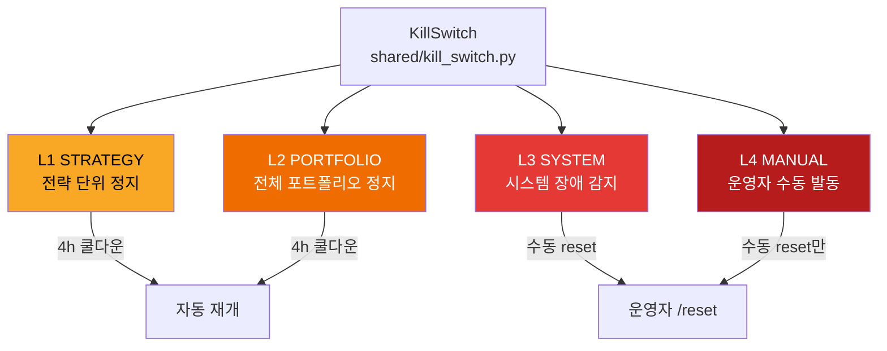

# 프로젝트 용어집

95개 이상의 거래, 기술, 운영 용어를 정의합니다. 용어는 카테고리별로 정렬되어 있습니다.

## 거래 & 전략 용어

### Supertrend (슈퍼트렌드)

**메인 전략** (Phase 5 실전 중). ATR(Average True Range) 기반 추세추종 지표를 활용한 BTC 4시간 장기 추세 추종 전략.

**작동 원리**:
- 상승 추세: Supertrend 상승선 + EMA(7) > EMA(27)에서 롱 진입 (3x 레버리지)
- 하락 추세: 추세선 붕괴 또는 EMA 하강 교차 시 청산
- 장기 필터: EMA(230) > Price (상승 구간만 거래)
- 손절/익절: ATR 기반 거리 초과 또는 신호 전환

**백테스트 성과** (2017-2026, 9년 전체):
- CAGR: +151.56% (연환산)
- Sharpe: 1.37 (위험 조정 효율)
- MDD: -84.28% (⚠️ 극한 위험, 사용자 승인)
- 거래 수: 354회 (충분한 샘플)

**파라미터**: `supertrend_4h_x3_7908` (combo #7908)
- 기간: 4시간 봉
- 방향: Long-only (롱 포지션만, 숏 없음)
- 레버리지: 3x (하드 리밋)
- Supertrend: period=9, multiplier=2.6
- EMA: 빠른=7, 느린=29, 추세=240

### ATR (Average True Range)

변동성 지표로, 일정 기간 내 실제 변동폭의 평균. Supertrend 계산의 핵심 요소로 사용되어 추세선의 높이를 동적으로 조정.

- **높은 ATR**: 변동성 커짐 → 추세선 거리 증가 (손절 여유)
- **낮은 ATR**: 변동성 작음 → 추세선 거리 감소 (신호 민감)

### combo #7908

Supertrend 4h 3x long-only 전략의 파라미터 조합 번호. 매개변수 스윕(sweep) 분석에서 최종 선정된 최적 조합.
- Supertrend period=9, multiplier=2.6
- EMA 기간들 (7, 29, 240)
- ATR 배수 3.3

### sweet_spot_score (스윗스팟 스코어)

매개변수 스윕 분석에서 여러 후보 조합을 평가하는 복합 점수. CAGR, Sharpe, MDD, 거래 수 등을 종합하여 최적 균형을 찾는 메트릭.

- 점수 계산: 수익성(CAGR) + 효율성(Sharpe) + 안정성(MDD 페널티) 조합
- combo #7908이 최고 점수 획득 (따라서 실전 채택)

### long-only (롱 전용)

롱 포지션(매수)만 거래하고, 숏 포지션(매도)은 전혀 거래하지 않는 운영 모드.
- Supertrend: 상승 추세에서만 진입, 하락 추세는 회피 (포지션 0)
- 장점: 구조적 상승 편향, 청산 비용 낮음 (1회 진입/청산)
- 단점: 약세장에서 수익 불가 (현금 대기)

### FA (Funding Arb / 펀딩비 차익거래) — 폐기됨

**이전 핵심 전략** (2024-05-17 폐기). Bybit 선물 시장에서 델타 뉴트럴 포지션으로 펀딩비를 수취하는 전략. 
- 6년 백테스트: CAGR +34.87%, Sharpe 3.583, MDD -4.52% (매우 안정적)
- 폐기 사유: 장기 실전 운영 결과 수익성 하락 + Supertrend 채택 (더 높은 CAGR)
- 히스토리 참조: [ADR-004](../docs/ADR/004. Funding Arbitrage 전략 폐기_2026-05-18.md)

### DCA (Dollar Cost Averaging / 적응형 적립식) — 비활성

**보조 전략** (현재 운영 중단). Fear & Greed Index 기반 적응형 분할 매수 전략. 시장 공포 시 적극 매수, 탐욕 시 위축.
- 비활성 사유: Walk-Forward 일관성 낮음 (consistency 0.409)
- 재활성화: 검토 중
- 히스토리 참조: [ADR-005](../docs/ADR/005. Adaptive DCA 일시중단_2026-05-18.md)

## 설정 / 파라미터 (Configuration)

### supertrend_4h_x3_7908

현재 채택된 메인 전략 설정의 약자:
- **Supertrend**: ATR 기반 추세추종 지표
- **4h**: 4시간 봉 기반 거래
- **3x**: 3배 레버리지 (하드 리밋)
- **7908**: 매개변수 스윕 분석 combo #7908 선정

**백테스트 성과** (Phase 5 채택 기준):
- CAGR +151.56%, Sharpe 1.37, MDD -84.28%
- 사용자 승인: MDD -84.28% 극한 위험 수용

### PHASE5_MODE

Phase 5 실전 모드 활성화 플래그. `true`일 때:
- fixed_notional 사이징 활성화 ($150)
- 절대값 AND Kill Switch 활성화
- STRICT_MONITORING_HOURS 강제 모니터링

### EXPECTED_INITIAL_BALANCE_USD

Phase 5 초기 자본 잔고. 메인넷 진입 시 실제 잔고와 대비하여 검증.

기본값: $200 USDT

### fixed_notional vs pct_equity

**Phase 4 (테스트넷)**: `pct_equity` — 전체 자본의 일정 비율로 포지션 사이징

**Phase 5 (메인넷)**: `fixed_notional` — 고정 명목가($150)로 사이징
- 자본 규모 변화에 불감
- 매 거래 크기 예측 용이
- 소액($200) 운영에 최적화

### BYBIT_TESTNET (환경 변수)

Bybit 거래소 모드 플래그:
- `true`: 테스트넷 모드 (모의 거래, 실전 자금 무관, Phase 4)
- `false`: 메인넷 모드 (실전 거래, Phase 5+)

**절대 규칙**: Phase 4 완료 전까지는 반드시 `true`

**변경 절차**: [policies/operations/mainnet-switch.md](policies/operations/mainnet-switch.md) 참조

### PHASE5_MODE

Phase 5 실전 모드 활성화 플래그. `true`일 때:
- fixed_notional 사이징 활성화
- 절대값 AND Kill Switch 활성화
- STRICT_MONITORING_HOURS 강제 모니터링

### EXPECTED_INITIAL_BALANCE_USD

Phase 5 초기 자본 잔고. 메인넷 진입 시 실제 잔고와 대비하여 검증.

기본값: $200 USDT

### STRICT_MONITORING_HOURS

Phase 5 강화 모니터링 시간. 설정값만큼 매시간 상태 리포트 강제 발송.

기본값: 24시간

### consecutive_intervals

FA 진입 조건: 연속으로 펀딩비 임계값을 초과한 횟수.

- **Phase 4**: 3회 (기본)
- **Phase 5**: 4회 (더 보수적)

## 시장 & 데이터 (Market & Data)


### ADX (Average Directional Index)

추세의 강도를 측정하는 기술 지표 (0-100).

- **> 25**: 강한 추세 (Trending)
- **20-25**: 중간 추세
- **< 20**: 약한 추세 (Ranging)

### OHLCV

시장 캔들 데이터의 기본 단위:
- **O**pen: 개시가
- **H**igh: 최고가
- **L**ow: 최저가
- **C**lose: 종가
- **V**olume: 거래량

**저장 위치**: PostgreSQL `ohlcv_history` 테이블
**보존 정책**: 타임프레임별 자동 삭제 (90일 이상 자동 정리)

### TWAP (Time-Weighted Average Price)

시간 가중 평균 가격. 대형 주문($5,000 이상)을 여러 소주문으로 분할하여 평균 체결가 계산.

**목적**: 시장 임팩트 최소화 (슬리피지 방지)

### 펀딩레이트 (Funding Rate)

선물 시장에서 8시간마다 지급/수취되는 이자. 롱과 숏 사이의 자금 이전으로, 시장 수급을 조절.

**예**: 0.01% per 8h = 연 27% (기준)
- 양수: 롱이 숏에게 지급 (매수 압력 높음)
- 음수: 숏이 롱에게 지급 (매도 압력 높음)

**주의**: Supertrend는 펀딩레이트 무관, 추세 신호 기반 거래

## 안전 & 리스크 (Safety & Risk)

### Kill Switch (킬스위치)

4단계 계층 손실 방어 시스템. 손실이 임계값을 초과하면 자동으로 포지션을 강제 청산.

**4단계 구조**:

| 레벨 | 이름 | 트리거 | 동작 | 복구 |
|------|------|--------|------|------|
| 1 | STRATEGY | 개별 전략 손절 (일 -3%, 주 -7%, 월 -12%) | 해당 전략만 중지 + 포지션 청산 | 4시간 쿨다운 후 자동 재개 |
| 2 | PORTFOLIO | 포트폴리오 손실 (일 -5%, 주 -10%, 월 -15%) | **모든 전략 중지** + **전체 포지션 청산** | 1시간 쿨다운 후 재개 |
| 3 | SYSTEM | API 연결 실패, DB/Redis 다운 | 시장가 청산 시도 → 실패 시 수동 개입 대기 | 자동 불가 (수동) |
| 4 | MANUAL | Telegram 명령 또는 SSH | 즉시 **모든 포지션 청산** | 수동 `/resume` |

**Phase 5 특수**: Level 2는 퍼센트 AND 절대값 USD 둘 다 조건 (예: -5% AND $50 손실)

**임계값 확인**: `redis-cli GET ce:kill_switch:active`



### KillLevel (IntEnum)

Kill Switch 레벨을 나타내는 정수형 열거형:
- NONE = 0
- STRATEGY = 1
- PORTFOLIO = 2
- SYSTEM = 3
- MANUAL = 4

### 포지션 보호 (Position Protection)

배포·재시작 시 `supertrend` 전략의 포지션 보호 메커니즘:

1. **service_shutdown 사유**: 포지션 청산 안 함
2. **Redis 저장**: 포지션 상태, 진입가, P&L 저장 (TTL 1시간)
3. **자동 복구**: 재시작 후 1시간 내 자동으로 포지션 복구

**효과**: 불필요한 청산 수수료 절감 (매회 0.05% × 2), 거래 연속성 유지

**TTL 초과 시**: 1시간 초과 중단 후 재시작하면 Redis 데이터 만료 → 신규 시작 (거래소 포지션은 수동 청산 필요)

### Dead Man's Switch (데드맨 스위치)

하트비트 기반 자동 장애 감지:
- **하트비트 간격**: 30초 (Redis 키 갱신)
- **Watchdog 체크**: 60초마다 마지막 하트비트 확인
- **미수신 판정**: 5분(300초) 미수신 → KillSwitch L3 자동 발동
- **목표**: 서비스 다운 시에도 자동으로 포지션 보호

### ACK (Acknowledge)

Kill Switch Level 2 발동 후 실행 확인 응답. Telegram에서 `/acknowledge` 또는 `/ack` 입력.

**타임아웃**: 5초
**재시도**: 최대 3회
**필요 이유**: 사용자가 상황을 인지했는지 확인하고, 추가 조치 방향 결정

## 운영 & Phase (Operations & Phases)

### Phase 4 (테스트넷 포워드 테스트) — 완료

**목표**: 실전과 동일한 환경에서 7일 이상 무중단 운영 검증

**특징** (과거):
- Bybit 테스트넷 (`BYBIT_TESTNET=true`)
- Funding Arb 운영 (이제 폐기됨)
- 현금 50% 버퍼 (포지션 축소 용이)
- pct_equity 포지션 사이징
- 상대값 Kill Switch (절대값 무관)

**완료**: 2026-05-18 (Supertrend 채택 후 Phase 5로 즉시 전환)

### Phase 5 (소액 실전 운영 중) — 활성

**목표**: $200 USDT로 메인넷 소액 실전 운영 (Supertrend 4h 3x)

**현황**:
- Bybit 메인넷 (`BYBIT_TESTNET=false`)
- `PHASE5_MODE=true` (고급 설정 활성)
- fixed_notional 포지션 사이징 ($150 = $200 × 75%)
- 절대값 AND Kill Switch (상대값 + USD 둘 다)
- STRICT_MONITORING_HOURS=24 (첫 24시간 강화)
- 레버리지 3x (Supertrend 전략 기본값)
- 시작: 2026-05-18

**진입 조건**: Phase 4 완료 + phase5_preflight.py 8개 항목 PASS + 사용자 승인

**변환 절차**: [policies/operations/mainnet-switch.md](policies/operations/mainnet-switch.md)

### Walk-Forward (WF / 월간 포워드 테스트)

월간 자동 파라미터 재최적화 및 검증 프로세스 (아카이브됨, 수동 검토로 변경).

**이전 동작** (Phase 4):
- **일시**: 매월 1일 02:00 KST
- **데이터**: 최근 6개월 (IS 3개월 + OOS 3개월)
- **최적화**: IS에서 파라미터 재최적화
- **검증**: OOS에서 성과 검증
- **결과**: Telegram 자동 전송

**목표**: 과최적화 방지, 파라미터 드리프트 감지 (현재는 수동 분석)

### OOS / IS (Out-of-Sample / In-Sample)

**WF 분석에서의 학습/검증 구간**:
- **IS (In-Sample, 학습 구간)**: 처음 3개월 데이터로 파라미터 최적화
- **OOS (Out-of-Sample, 검증 구간)**: 다음 3개월 데이터로 독립적 성과 검증

**과최적화 방지**: OOS 성과가 IS보다 30% 이상 악화되면 경고

## 거래소 & API (Exchange & API)

### CCXT (Cryptocurrency eXchange Trading Library)

크립토 거래소 통일 API 라이브러리. Bybit, Binance, OKX 등 150+ 거래소를 단일 인터페이스로 제공.

**사용**: `shared/exchange/bybit.py` (Bybit 래퍼)

### WebSocket (WS)

실시간 양방향 통신 프로토콜. Bybit에서 다음 데이터를 실시간 푸시:
- OHLCV (캔들 데이터)
- 호가 (Order Book)
- 펀딩레이트 (Funding Rate)
- 거래 (Trade)

**이점**: HTTP 폴링(지연)보다 저레이턴시 (< 100ms)

### API Rate Limit

거래소 API 호출 제한. Bybit 기본:
- **일반 엔드포인트**: 분당 최대 600회
- **주문 엔드포인트**: 분당 최대 100회

**대응**: 요청 배치, 재시도 로직 (`retry_backoff`)

## 데이터베이스 & 로깅 (Database & Logging)

### PostgreSQL

영구 데이터 저장소. 거래, 포지션, 펀딩비, 이벤트 로그 등 모든 이력 기록.

**핵심 테이블**:
- `trades` — 체결 거래 이력
- `positions` — 포지션 상태 스냅샷
- `funding_payments` — 펀딩비 수령 기록
- `funding_rate_history` — 펀딩레이트 히스토리
- `ohlcv_history` — OHLCV 캔들 (90일 보존)
- `kill_switch_events` — Kill Switch 발동 이력
- `service_logs` — 구조화 이벤트 로그 (모든 서비스)

### Redis

인메모리 고속 캐시 및 메시지 브로커.

**역할**:
- **Pub/Sub**: 서비스 간 실시간 통신 (시장 데이터, 주문, 명령)
- **캐시**: 포지션 상태, 포트폴리오 스냅샷
- **포지션 복구**: service_shutdown 시 상태 저장 (TTL 1시간)

**중요 키**:
- `strategy:saved_state:supertrend-01` — Supertrend 포지션 상태 복구용
- `ce:kill_switch:active` — Kill Switch 활성 상태

### structlog

구조화 로깅 라이브러리. 각 이벤트를 JSON 형식으로 기록하여 검색 및 분석 용이.

**이점**: 시간순 추적, 이벤트 필터링, Grafana 시각화 가능

## 인프라 (Infrastructure)

### Docker Compose

19개 마이크로서비스, DB, 모니터링 도구를 컨테이너로 정의 및 협주.

**핵심 명령**:
```bash
docker compose up -d               # 전체 시작
docker compose down                # 전체 정지
docker compose up -d --build <svc> # 특정 서비스 재빌드 + 재시작
docker compose logs -f <svc>       # 실시간 로그
```

### Grafana

시계열 데이터 시각화 및 실시간 모니터링 대시보드.

**데이터소스**:
- PostgreSQL: trades, positions, kill_switch_events
- Prometheus: CPU, 메모리, Redis, API 레이턴시
- Redis: 실시간 메트릭

**포트**: http://localhost:3002 (admin / ***REMOVED***)

### Prometheus

메트릭 수집 및 시계열 저장 시스템.

**수집 대상**:
- node_exporter: CPU, 메모리, 디스크, 네트워크
- redis_exporter: Redis 메모리, 키 수, 명령 수
- 애플리케이션: 주문 건수, 에러율, 레이턴시

**데이터 보존**: 30일

## 성과 지표 (Performance Metrics)

### CAGR (Compound Annual Growth Rate)

연평균 복합 수익률. 초기 자본이 매년 평균 몇 %씩 불어났는지 나타내는 지표.

**계산**: ((최종값 / 초기값) ^ (1/년수)) - 1

**Supertrend 4h 3x (Phase 5)**: +151.56% (9년 데이터, 2017-2026)
**이전 Funding Arb**: +34.87% (6년 데이터, 2019-2025)

**목표**: > 15% (연환산 기본 기준)

### Sharpe Ratio

위험 조정 수익률 지표. (평균 수익률 - 무위험 수익률) / 표준편차

**해석**:
- > 3.0: 우수 (위험 대비 매우 효율적)
- 2.0-3.0: 양호
- 1.0-2.0: 보통 (적절)
- < 1.0: 미흡

**Supertrend 4h 3x (Phase 5)**: 1.37 (보통, 극한 MDD로 인한 표준편차 증가)
**이전 Funding Arb**: 3.583 (매우 우수, 안정적 수익)

### MDD (Maximum Drawdown)

포트폴리오가 최고점에서 최저점까지 내려간 최대 낙폭.

**계산**: (최저점 - 최고점) / 최고점 × 100%

**Supertrend 4h 3x (Phase 5 실전)**: -84.28% (⚠️ **극한 위험**)
- 사용자 승인: 고수익성(+151.56% CAGR)과 극한 리스크(-84.28% MDD)의 트레이드오프 명시 수용
- 포지션 보호: Kill Switch 4단계 + 강화 모니터링으로 실제 손실 제한

**이전 Funding Arb 설정**: -4.52% (매우 안정적)

### Win Rate (승률)

수익 거래 / 전체 거래 × 100%

**현재 설정**: > 60% (예상)

**해석**: 거래 빈도 대비 수익률 안정성 지표

### Sortino Ratio

Sharpe과 유사하나, 하락 변동성만 고려 (상승 변동성 무시).

**특징**: 변동성 자체보다 손실 리스크에 중점

**현재 설정**: 더 높은 값 (MDD 작으므로)
