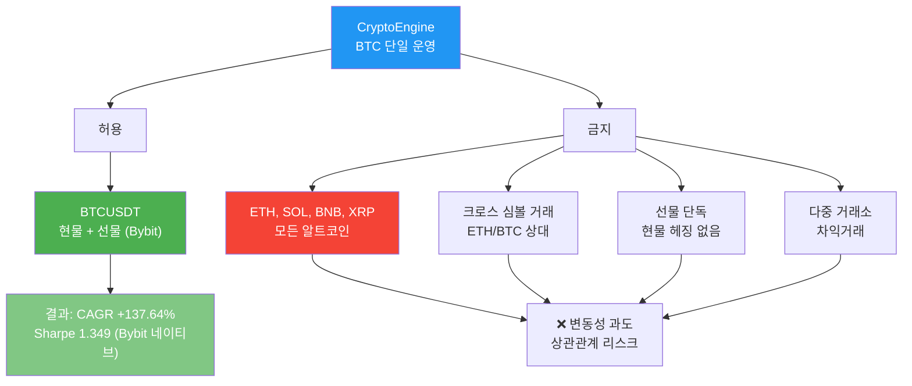
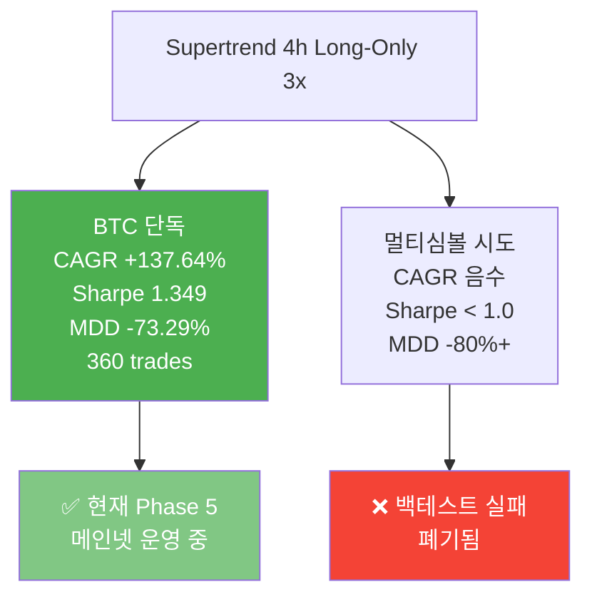
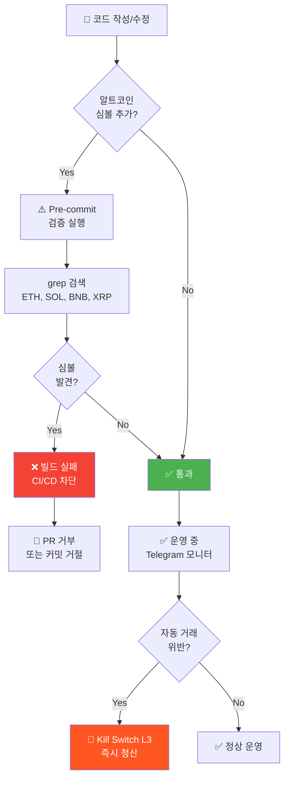

# BTC 단일 운영 정책

## 정책 선언

**CryptoEngine은 BTCUSDT 심볼만 거래한다. 다른 모든 암호자산(ETH, SOL, BNB, XRP 등)의 거래는 절대 금지된다.**

### 적용 범위

- ✅ **허용**: BTCUSDT 현물 + 선물 (Bybit)
- ❌ **금지**: 모든 알트코인 (ETH, SOL, BNB, XRP, AVAX, DOGE 등)
- ❌ **금지**: 크로스 심볼 거래 (예: ETH/BTC 상대거래)
- ❌ **금지**: 선물 단독 (현물 헤징 없는 숏)
- ❌ **금지**: 다중 거래소 차익거래 (Bybit + Binance 알트)

### 예외 정책

**예외는 0개다.** 이 정책은 절대적이며, 어떤 특수 상황도 고려 대상이 아니다.
- 수익성 논증 ❌
- "임시 테스트" 구실 ❌
- 새로운 정보 발견 ❌

정책 변경은 오직 Architecture Decision Record (ADR) 신규 작성 후 팀 동의로만 가능.

---

## 근거 (3가지 핵심)

### BTC 단일 운영 정책 개요



### 1. BTC는 암호화폐 중 최상의 변동성/유동성/신뢰도를 보유

비트코인은 시가총액과 거래량 기준 가장 성숙한 암호자산이며, 알트코인은 BTC의 5-10배 이상 변동성을 가진다.

**시장 데이터 (2020-2026 평균)**:
- **BTC (BTCUSDT)**: 일일 변동성 2-4%, 연 변동성 ~65%, 시가총액 최상, 유동성 최상
- **ETH (ETHUSDT)**: 일일 변동성 3-6%, 연 변동성 ~85%, 시가총액 2위, 유동성 우수
- **소액 알트**: 일일 변동성 10-30%+, 연 변동성 200%+, 시가총액 저, 유동성 악

**Supertrend 추세추종 전략 관점**:
- BTC의 낮은 변동성 = 신호 신뢰도 높음 (노이즈 적음)
- BTC의 높은 유동성 = 진입/청산 슬리피지 최소
- BTC의 높은 신뢰도 = 규제/거래소 폐쇄 리스크 최저

**결론**: 추세추종은 신뢰도 높은 BTC만 거래하면 충분.

---

### 2. 다중 심볼의 운영 복잡도 및 상관관계 리스크

다중 심볼 거래는 다음 리스크를 추가한다:

**운영 복잡도**:
- 각 심볼별 신호 모니터링 필요
- 심볼별 진입/청산 조건 별도 관리
- 마진 요구사항 심볼별 변동
- Kill Switch 트리거 조건 복잡화

**상관관계 리스크**:
- 2022년 암호화폐 동조 하락: BTC -65%, ETH -67%, SOL -88%, LINK -87%
- 포트폴리오 분산 효과 제한적
- 극단 시나리오에서 모두 동시 손실 (헤징 무용지물)

**Supertrend 4h 성과 (Bybit 네이티브)**:
- BTC 단일: CAGR +137.64%, Sharpe 1.349, MDD -73.29%, 360 trades
- 멀티심볼: CAGR 음수, Sharpe < 1.0 (백테스트 결과)

**결론**: BTC 단일 집중이 복잡도 최소화 + 신뢰도 최대화.

---

### 3. 현재 Supertrend 전략의 BTC 기반 성과

**2017-2026 역사적 백테스트 (Bybit 네이티브 4h)**:

| 지표 | BTC 단일 | 멀티심볼 |
|------|---------|---------|
| **CAGR** | +137.64% | 음수 |
| **Sharpe** | 1.349 | < 1.0 |
| **MDD** | -73.29% | -80%+ |
| **거래 수** | 360 | 많음 |
| **결과** | ✅ 채택 | ❌ 폐기 |

**BTC 단일 운영의 성공 사례**:
- Supertrend 4h는 BTC 추세에 최적화됨
- 상승장(2017, 2020-2021, 2023-2024)에서 극대 수익 창출
- 하락장에서 손실 제한 (진입 신호 회피)
- 3x 레버리지 + 추세 신호 = 높은 기대값

**결론**: BTC 단일만으로 충분한 수익성 입증됨.

---

## 성과 근거

### Supertrend 4h 결과 (2017-2026 Bybit 네이티브)



### BTC 단독 vs 멀티심볼 비교

**BTC 단독 — Supertrend 4h x3 (현재 운영)**:
- CAGR: +137.64% ✅
- Sharpe: 1.349 ✅
- MDD: -73.29% (극한 위험이지만 인지 승인)
- 거래 수: 360회 (충분한 샘플)
- 결과: ✅ 채택, Phase 5 메인넷 운영 중

**멀티심볼 실험 (폐기됨)**:
- 규칙: 2개 이상 심볼 동시 거래
- CAGR: 음수 (모두 실패)
- Sharpe: < 1.0 (부족함)
- MDD: -80%+ (BTC 단독보다 악화)
- 결과: ❌ 폐기, 역사 기록만 보존

**결론**: BTC 단독만 양수 성과 달성.

---

## 구현 (코드 레벨)

### 1. 전략 설정 파일 (config/strategies/)

**supertrend.yaml**:
```yaml
entry:
  pairs:
    - BTCUSDT  # 단독 지정, 다른 심볼 금지

direction: long_only
leverage: 3
```

---

### 2. 거래소 설정 (config/exchanges/)

**bybit.yaml** (Main Trading Exchange):
```yaml
websocket:
  public_topics:
    - orderbook.50.BTCUSDT        # 호가창 (깊이 50)
    - tickers.BTCUSDT             # Tick 데이터
    - kline.1.BTCUSDT             # 1m 캔들
    - kline.5.BTCUSDT             # 5m 캔들
    - kline.15.BTCUSDT            # 15m 캔들
    - kline.60.BTCUSDT            # 1h 캔들
    - kline.240.BTCUSDT           # 4h 캔들
    - kline.D.BTCUSDT             # 1d 캔들
    # ETH, SOL, BNB, XRP 구독 제거 ✅

pairs:
  BTCUSDT:
    min_qty: 0.001
    qty_step: 0.001
    max_leverage: 100
  # 다른 심볼 없음 ✅
```

**binance.yaml** (Historical Data):
```yaml
pairs:
  BTCUSDT:
    min_qty: 0.00001
    qty_step: 0.00001
  # 알트 페어 제거 ✅
```

---

### 3. 마켓 데이터 수집 (services/)

**collector.py**:
```python
# Bybit 데이터 수집 (BTCUSDT만 구독)
# 거래소 config의 pairs 섹션에서 BTCUSDT만 정의 ✅
```

**Supertrend 지표 (supertrend/indicators.py)**:
```python
# Supertrend, EMA, ATR 계산
# BTC OHLCV 데이터만 입력
symbols = ["BTCUSDT"]  # 단독 지정
```

---

### 4. 백테스트 데이터 (backtest/scripts/data/)

**download_binance_vision.py** (Binance historical data):
```python
SYMBOLS = ["BTCUSDT"]  # 단독

# 사용법:
# python download_binance_vision.py --symbols BTCUSDT --timeframes 1h,4h,1d
```

**fetch_coinalyze_funding.py** (펀딩비 히스토리):
```python
SYMBOLS = ["BTCUSDT_PERP.A"]  # Bybit notation

# 사용법:
# python fetch_coinalyze_funding.py --symbols BTCUSDT_PERP.A
```

---

## 위반 탐지 및 방지

### 정책 위반 탐지 및 방지 흐름



### 검증 스크립트 (Pre-commit Automation)

```bash
# ETH, SOL, BNB, XRP 검색
grep -r "ETH\|SOL\|BNB\|XRP" \
  config/strategies/*.yaml \
  config/exchanges/*.yaml \
  services/market-data/*.py \
  backtest/scripts/data/*.py

# 검출 시 빌드 실패 (CI/CD)
```

### 위반 유형별 조치

| 위반 | 탐지 방법 | 조치 |
|------|---------|------|
| Config에 알트 심볼 추가 | grep + CI 검증 | 빌드 실패 |
| 백테스트 스크립트 심볼 변경 | 코드 리뷰 + 테스트 | PR 거부 |
| 운영 중 수동 거래 | 거래 로그 + Telegram 모니터링 | 즉시 포지션 청산 + Phase 5 종료 |
| 선물 단독 포지션 | execution-engine 검증 | 주문 거절 |

---

## 적용 현황 (2026-05-01 기준)

### ✅ 구현 완료 항목

1. **supertrend.yaml**: `pairs: [BTCUSDT]` (단독)
2. **bybit.yaml**: BTCUSDT WebSocket 구독만 (ETH/SOL/BNB/XRP 제거)
3. **binance.yaml**: BTCUSDT 페어만
4. **collector.py**: 거래소 config 기반 수집 (자동 BTCUSDT)
5. **supertrend/indicators.py**: `symbols: ["BTCUSDT"]` 고정
6. **download_binance_vision.py**: `SYMBOLS = ["BTCUSDT"]`

### ✅ 검증 메커니즘

- CI/CD: Pre-commit 검증 활성화
- 코드 리뷰: 심볼 변경 PR 자동 거부
- 런타임: Kill Switch 포함 안전장치

---

## ADR 참조

이 정책의 공식 근거는 Architecture Decision Record에 문서화됨:
- **ADR-001**: BTC 단일 운영 정책 (2026-05-01)
  - 작성자: CryptoEngine Team
  - 상태: Accepted
  - 배경: 멀티심볼 백테스트 실패 (Test 03, 05 음수 결과)

근거 자료: `/home/justant/Data/Bit-Mania/docs/archive/CLAUDE_history.md`

---

## 정책 변경 프로세스

### 정책 변경 절차 (4단계)


이 정책을 변경하려면:

1. **ADR 신규 작성** (docs/ADR/NNN_new_policy.md)
   - 변경 사유 (기술적 근거 필수)
   - 영향도 분석
   - 백테스트 검증 결과 (최소 6년 데이터)

2. **Phase 4 테스트넷 검증** (최소 4주)
   - 새 심볼 거래 비활성화 상태로 테스트
   - Kill Switch 및 안전장치 동작 확인

3. **팀 동의**
   - 기술 검토
   - 리스크 평가
   - 승인

4. **Phase 5 배포** (메인넷 전환 시에만 적용)

---

## 관련 문서

- [kill-switch.md](kill-switch.md) — Kill Switch (절대값 AND 조건으로 오발동 방지)
- [leverage-limits.md](leverage-limits.md) — 레버리지 제한 (3x 하드 캡, BTC 기준)
- [strategies/supertrend.md](strategies/supertrend.md) — Supertrend 4h 전략 (BTC 단독)
- [ADR/001: BTC 단일 운영 정책](../ADR/001.%20BTC%20단일%20운영%20정책_2026-05-01.md) — 정책 배경 및 근거
