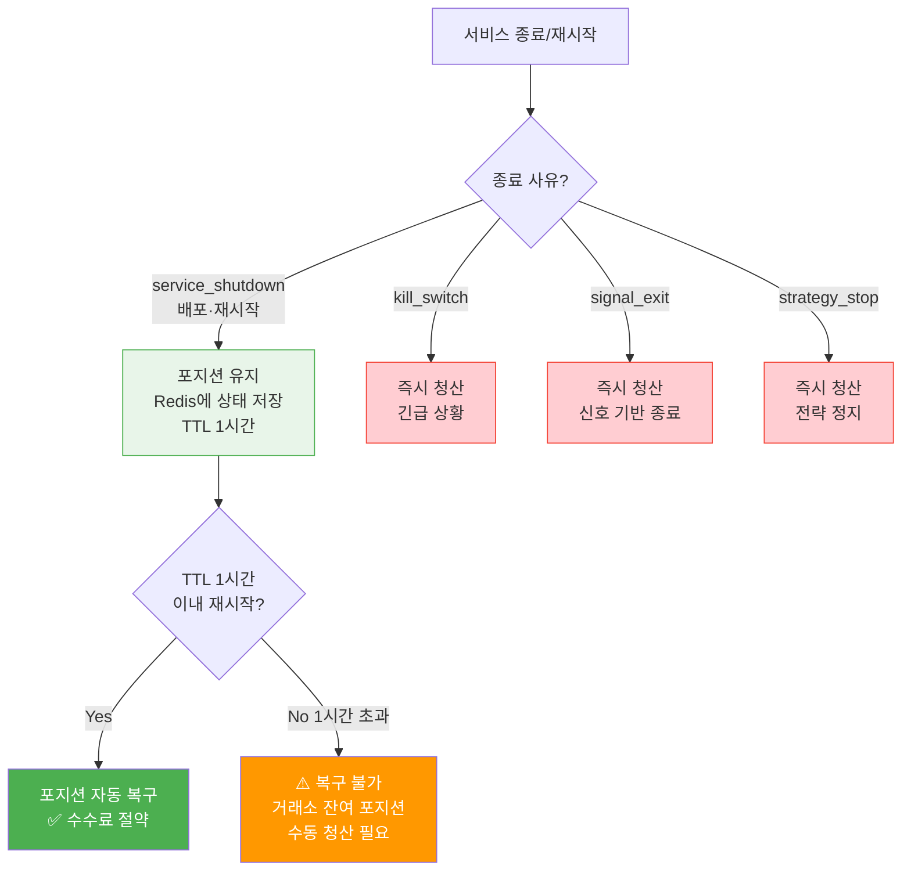
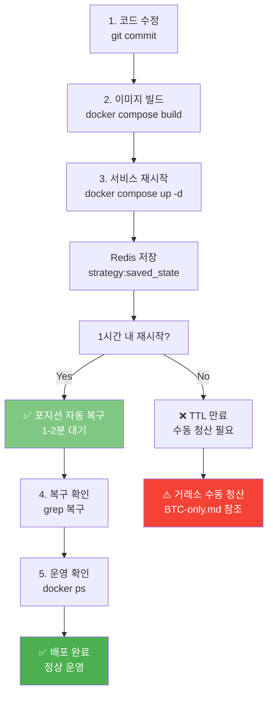
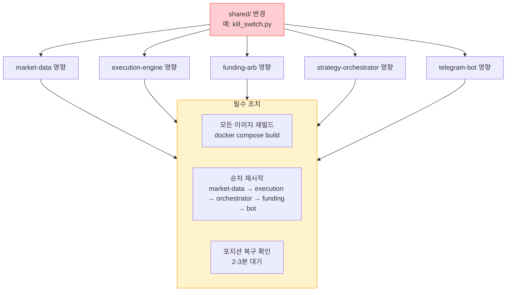
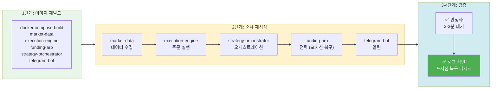

# 배포 시 포지션 보호 원칙

## 핵심 원칙

**배포(재시작)는 포지션을 청산하지 않는다.**

```
배포 = 서비스 재시작
포지션 유지 = Redis에 상태 저장 → 재시작 후 자동 복구
```

### 이유

CryptoEngine은 **Phase 5 메인넷에 직접 배포**한다 (테스트넷 단계 완료). 따라서:

- 배포할 때마다 포지션을 청산하면 거래 수수료 낭비 (매번 진입·청산 0.05% × 2)
- 배포 중 시장 변동에 노출 (특히 Supertrend 4시간 신호 미수신)
- 4시간 봉 확정 직후 배포 시 추세 신호 놓칠 수 있음

**해결책**: 포지션 상태를 Redis에 저장했다가, 1시간 내 재시작 시 자동 복구.

---

## 종료 사유별 동작

| 종료 사유 | 포지션 | 상태 저장 | 재시작 후 |
|---------|--------|----------|----------|
| `service_shutdown` (배포) | **유지** | Redis 저장 | 자동 복구 |
| `kill_switch` | **즉시 청산** | 이벤트만 저장 | 청산됨 (긴급 상황) |
| `signal_exit` | **즉시 청산** | 거래 기록만 저장 | 청산됨 (신호 기반) |
| `strategy_stop` | **즉시 청산** | 이벤트만 저장 | 청산됨 (전략 정지) |



### 상태 저장 데이터

배포 시 Redis `strategy:saved_state:supertrend-01` 에 저장되는 정보:

```json
{
  "strategy_id": "supertrend-01",
  "position": {
    "entry_price": 65000.0,
    "side": "buy",
    "qty": 0.15,
    "leverage": 3,
    "entry_time": "2026-05-18T12:00:00Z",
    "entry_fee": 53.625,
    "current_pnl": 1250.50
  },
  "timestamps": {
    "saved_at": "2026-05-18T14:30:00Z",
    "ttl_seconds": 3600
  },
  "mode": "long_only"
}
```

### Redis TTL (Time To Live)

```python
# 배포 시 저장된 상태의 유효 기간
TTL = 3600 초 = 1시간

# 재시작 시 확인
if current_time - saved_at <= TTL:
    restore_position()  # 자동 복구
else:
    clear_saved_state()  # TTL 만료 → 포지션 소실
```

---

## 안전한 배포 절차

### 배포 단계별 흐름도



### 1. 코드 변경 및 빌드

```bash
# 코드 수정
vi cryptoengine/services/strategies/funding-arb/strategy.py

# 이미지 빌드
docker compose build funding-arb
```

### 2. 포지션 확인 (선택사항)

배포 전 현재 포지션을 확인한다:

```bash
# DB에서 열린 포지션 확인
docker compose exec postgres psql -U cryptoengine -d cryptoengine \
  -c "SELECT * FROM positions WHERE size > 0 AND status='open';"

# 거래소에서 포지션 확인 (Bybit 웹 또는 모바일)
```

### 3. 서비스 재빌드 및 재시작

```bash
# 단일 서비스: 포지션 자동 유지됨
docker compose up -d --build --no-deps funding-arb

# shared/ 변경 시 (모든 서비스 영향): 
#   공유 라이브러리 먼저 업데이트
docker compose build market-data execution-engine funding-arb strategy-orchestrator telegram-bot
docker compose up -d --no-deps market-data execution-engine funding-arb strategy-orchestrator telegram-bot
```

### 4. 복구 확인

```bash
# 로그에서 포지션 복구 메시지 확인 (1-2분 소요)
docker compose logs --tail=50 funding-arb | grep -E "복구|recovered|Restored"

# 기대값:
# [INFO] Position state restored from Redis: entry_price=65000.0, qty=0.15
```

### 5. 포지션 정상 운영 확인

```bash
# 신규 포지션 진입 로그 확인 (또는 기존 포지션 모니터링)
docker compose logs -f funding-arb | head -20
```

---

## 공유 라이브러리 (shared/) 변경 시

`shared/` 디렉토리 변경은 모든 서비스에 영향을 주므로 특별 절차가 필요하다:

### shared/ 변경 영향도



### 영향 받는 서비스

```
shared/ 변경
├─ market-data (데이터 수집 영향)
├─ execution-engine (주문 실행 영향)
├─ funding-arb (전략 실행 영향)
├─ strategy-orchestrator (오케스트레이션 영향)
└─ telegram-bot (메시징 영향)
```

### shared/ 변경 배포 순서



```bash
# 1단계: 이미지 재빌드 (모든 서비스)
docker compose build \
  market-data \
  execution-engine \
  funding-arb \
  strategy-orchestrator \
  telegram-bot

# 2단계: 순차 재시작 (의존성 순서)
docker compose up -d --no-deps market-data                 # 데이터 수집 먼저
sleep 10
docker compose up -d --no-deps execution-engine            # 주문 엔진
sleep 5
docker compose up -d --no-deps strategy-orchestrator       # 오케스트레이터
sleep 5
docker compose up -d --no-deps funding-arb                 # 전략 (포지션 복구)
sleep 5
docker compose up -d --no-deps telegram-bot                # 봇

# 3단계: 안정화 대기 (2-3분)
sleep 120

# 4단계: 모든 서비스 정상 확인
docker compose ps
docker compose logs --tail=20 funding-arb | grep -E "복구|ready|starting"
```

### 주의

- **market-data 먼저**: 펀딩비, OHLCV 데이터가 필요하므로 가장 먼저 시작
- **execution-engine 다음**: 주문 실행 준비
- **strategy-orchestrator 다음**: 전략 조율
- **funding-arb 마지막**: 포지션 복구 시간 필요
- **telegram-bot 마지막**: 알림 전송 준비

---

## Redis TTL 주의사항

⚠️ **1시간 이상 중단 후 재시작 시 포지션 복구 불가**

```
배포 시간: 2026-05-01 14:30
saved_at:  2026-05-01 14:30
TTL:       1시간
만료시간:  2026-05-01 15:30

✅ 14:45에 재시작    → 복구 가능 (TTL 남음)
✅ 15:20에 재시작    → 복구 가능 (TTL 남음)
❌ 15:35에 재시작    → 복구 불가능 (TTL 초과)
```

### 1시간 초과 중단 시 조치

```bash
# 1. Bybit에 포지션이 남아있는지 확인
#    → 남아있으면 수동 청산 필요 (비상 청산 SOP 참조)

# 2. Redis에서 만료된 상태 삭제
docker compose exec redis redis-cli -a ${REDIS_PASSWORD} \
  DEL strategy:saved_state:funding_arb

# 3. DB 포지션 상태 정리
docker compose exec postgres psql -U cryptoengine -d cryptoengine -c \
  "UPDATE positions SET status='stale' WHERE status='open' AND updated_at < NOW() - INTERVAL '2 hours';"

# 4. 서비스 재시작 (신규 포지션부터 시작)
docker compose up -d funding-arb
```

---

## 배포 중 포지션 모니터링

### 현재 포지션 실시간 확인

```bash
# 터미널 1: 로그 실시간 모니터링
docker compose logs -f funding-arb | grep -E "position|entry|exit"

# 터미널 2: DB 실시간 확인
watch -n 5 'docker compose exec postgres psql -U cryptoengine -d cryptoengine -c \
  "SELECT id, entry_price, size, status, updated_at FROM positions ORDER BY updated_at DESC LIMIT 3;"'

# 터미널 3: Redis 상태 확인
docker compose exec redis redis-cli -a ${REDIS_PASSWORD} \
  GET strategy:saved_state:funding_arb | jq .
```

---

## 긴급 상황: 배포 중 Kill Switch 발동

배포 중(TTL 카운팅 중)에 Kill Switch가 발동되면:

```
시나리오:
  - 배포 시작: 14:30
  - 재시작 중: 14:35
  - Kill Switch L2 발동: 14:37 (포트폴리오 -5%)

동작:
  1. funding-arb 즉시 중지 + 포지션 청산
  2. saved_state 무시 (청산이 우선)
  3. 재시작 후 "청산됨" 상태로 시작
  4. 포지션 복구 불가 (이미 청산됨)
```

**결론**: 배포 중 극단 손실이 발생하면 Kill Switch가 우선적으로 동작한다. (의도적 설계)

---

## 배포 체크리스트

```markdown
배포 전:
- [ ] 로컬에서 테스트 완료
- [ ] docker compose ps 로 현재 상태 확인
- [ ] 필요 시 포지션 확인

배포 중:
- [ ] docker compose build --no-cache <service> (깨끗한 빌드)
- [ ] docker compose up -d --build --no-deps <service>
- [ ] 1-2분 대기 (포지션 복구 시간)

배포 후:
- [ ] docker compose logs --tail=50 <service> (에러 확인)
- [ ] 포지션 복구 메시지 확인
- [ ] docker compose ps (Running 상태 확인)
- [ ] 텔레그램 알림 수신 확인
```

---

## 관련 문서

- [operations/deployment-procedure.md](operations/deployment-procedure.md) — Docker 배포 상세 절차
- [operations/runbook.md](operations/runbook.md) — 일상 운영 및 문제 해결
- [emergency-manual-close.md](emergency-manual-close.md) — 비상 상황 대응
