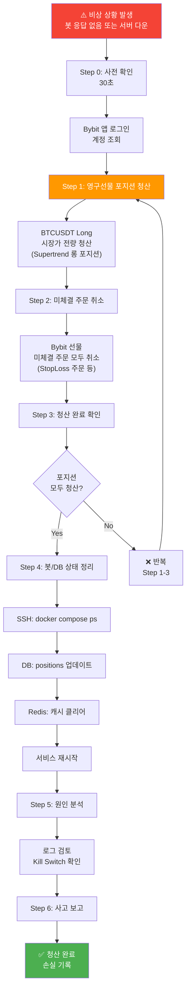

# 비상 수동 청산 절차 (SOP)

> [!danger] 이 문서를 즉시 접근 가능한 위치에 저장하라
> 봇이 완전히 다운되었을 때 사용한다. 휴대폰 메모앱 즐겨찾기 또는 Telegram Saved Messages에 이 문서를 보관하라.

**최종 업데이트**: 2026-06-14  
**적용 환경**: Phase 5 메인넷 Supertrend Long-Only 운영 중 봇 또는 서버 장애 발생 시

---

## 언제 이 절차를 사용하는가

다음 상황에서 이 절차를 사용한다:

| 상황 | 1차 시도 | 이 절차 사용 |
|------|---------|-----------|
| 봇 응답 없음 | Telegram `/emergency_close` 전송 | ACK 5초 내 미수신 |
| Docker 응답 없음 | `make emergency` 실행 | 명령어 실패 시 |
| 서버 완전 다운 | SSH 접속 후 `make emergency` | SSH 접속 불가 시 |
| Bybit 봇 API 장애 | 자동 retry → Kill Switch L3 | 거래소 장애 지속 시 |

---

## 비상 청산 전체 흐름



## 0. 사전 확인 (30초)

청산 전 현재 포지션을 파악한다.

1. Bybit 앱/웹 접속: https://www.bybit.com → 로그인
2. **[선물]** 탭 → **[포지션]** 확인
   - 종목, 방향(롱/숏), 수량, 진입가, 현재 손익 기록
3. **[현물]** 탭 → BTC 보유량 확인 (Spot Long 레그)

> [!note] Supertrend 포지션 구조
> Supertrend는 **영구선물 BTC 롱 (Perp Long, 3x 레버리지)** 만 보유한다.
> 포지션이 있으면 즉시 시장가 청산한다.

---

## 1. Bybit 앱에서 선물(Perp) 포지션 청산

### 청산 순서도 (Long 포지션만, 간단함)


### 1a. 모바일 앱

1. 하단 메뉴 **[거래]** 탭
2. **[선물]** 탭 → **[포지션]** 확인
3. `BTCUSDT Long` 포지션 찾기 (Supertrend 3x 롱 포지션)
4. 포지션 옆 **[청산]** 버튼 탭
5. **수량**: 전량 선택 (또는 수량 직접 입력)
6. **주문 유형**: **시장가(Market)** 선택 ← 반드시 시장가
7. **[확인]** → PIN/생체 인증 완료
8. 체결 확인: 포지션 목록에서 해당 포지션 사라짐 확인

### 1b. PC 웹 (bybit.com)

1. 상단 **[Derivatives]** → **[USDT Perpetual]**
2. 화면 하단 **[Positions]** 탭
3. `BTCUSDT` 행에서 **[Close]** 클릭
4. **Close By Market** 선택
5. Close Qty: `Max` 클릭
6. **[Confirm Close]** 클릭
7. 체결 확인: Balance 변화 확인

> [!warning] 포지션 청산 필수
> 레버리지가 걸린 Long 포지션을 **반드시 청산**한다. 시장가 주문으로 즉시 체결하라.

---

## 2. Bybit에서 미체결 주문 취소

Supertrend는 진입 시 거래소에 StopLoss 주문을 자동 배치한다. 포지션 청산 후 이 주문이 남아있으면 잔고에서 마진이 잡힌다.

### 2a. 모바일 앱

1. **[거래]** → **[미체결 주문]** (Open Orders) 탭
2. StopMarket 또는 StopLoss 유형 주문 확인
3. 있으면 주문 옆 **[취소(Cancel)]** 클릭
4. 모든 미체결 선물 주문 취소 확인

### 2b. PC 웹

1. **[Derivatives]** → **[USDT Perpetual]** → **[Open Orders]** 탭
2. 모든 열린 주문 확인 (특히 StopMarket, Limit 주문)
3. 선택 후 **[Cancel]** 클릭
4. 취소 확인

---

## 3. 청산 완료 확인

| 확인 항목 | 기대값 |
|---------|-------|
| 선물 포지션 | 0 (없음) — BTCUSDT Long 포지션 완전 청산 |
| 미체결 선물 주문 | 0 — StopLoss 주문 모두 취소 |
| USDT 잔고 | 초기 잔고 ± 손익 |

---

## 4. 봇/DB 상태 정리

봇이 복구되면 내부 상태와 거래소 상태가 불일치할 수 있다. 다음 절차로 정리한다.

### 4a. 서비스 정지 확인 (SSH 가능 시)

```bash
cd ~/Data/Bit-Mania/cryptoengine
docker compose ps  # 서비스 상태 확인
docker compose stop supertrend execution-engine strategy-orchestrator
```

### 4b. DB 포지션 상태 수동 갱신

```bash
docker compose exec postgres psql -U cryptoengine -d cryptoengine -c \
  "UPDATE positions SET status='closed', exit_price=<청산가>, 
   closed_at=NOW(), exit_reason='emergency_manual'
   WHERE status='open';"
```

> [!warning] 청산가는 Bybit 거래 내역에서 확인한 실제 체결가를 입력한다.

### 4c. Redis 캐시 클리어

```bash
docker compose exec redis redis-cli -a ${REDIS_PASSWORD} \
  --scan --pattern "cache:position:*" | xargs docker compose exec redis redis-cli -a ${REDIS_PASSWORD} DEL
docker compose exec redis redis-cli -a ${REDIS_PASSWORD} \
  --scan --pattern "strategy:saved_state:*" | xargs docker compose exec redis redis-cli -a ${REDIS_PASSWORD} DEL
docker compose exec redis redis-cli -a ${REDIS_PASSWORD} \
  --scan --pattern "cache:stoploss:*" | xargs docker compose exec redis redis-cli -a ${REDIS_PASSWORD} DEL
```

### 4d. 서비스 재시작

```bash
# 포지션 없음 확인 후 재시작
docker compose up -d execution-engine strategy-orchestrator
# supertrend는 5분 대기 후 (오케스트레이터 안정화 후)
docker compose up -d supertrend
# 로그 확인
docker compose logs -f supertrend | head -30
```

---

## 5. 비상 청산 후 원인 분석

청산 완료 후 반드시 원인을 파악한다.

```bash
# 서비스 로그 확인 (장애 발생 시간 전후)
docker compose logs --since=1h supertrend execution-engine market-data | grep -E "ERROR|CRITICAL|exception"

# Kill Switch 이벤트 확인
docker compose exec postgres psql -U cryptoengine -d cryptoengine -c \
  "SELECT * FROM kill_switch_events ORDER BY triggered_at DESC LIMIT 5;"

# 마지막 포지션 상태
docker compose exec postgres psql -U cryptoengine -d cryptoengine -c \
  "SELECT * FROM positions ORDER BY updated_at DESC LIMIT 5;"
```

---

## 6. 사고 보고 체크리스트

- [ ] 비상 청산 시각 기록
- [ ] 청산 당시 포지션 상세 (종목, 수량, 진입가, 청산가, 손익)
- [ ] 원인 파악 (서비스 로그, Kill Switch 이벤트)
- [ ] 재발 방지 조치 결정
- [ ] `docs/incident_log/YYYY-MM-DD.md` 에 사고 내용 기록
- [ ] Phase 5 계속 진행 여부 결정:
  - 손실 < $10 → 원인 분석 후 재개 가능
  - 손실 $10~$30 → Phase 4 복귀 검토
  - 손실 > $30 → **Phase 5 즉시 종료**, 전략 재검토

---

## 빠른 참조 (휴대폰 저장용)

```
=== CryptoEngine 비상 청산 요약 ===

1. Bybit 앱 → [거래] → [포지션]
2. BTCUSDT Long (Perp) → [청산] → 시장가 → 전량 → 확인
3. [미체결 주문] → StopMarket/StopLoss 주문 모두 [취소]
4. USDT 잔고 확인 (초기값 대비 손익 기록)

복구 후: docker compose up -d execution-engine strategy-orchestrator supertrend
문서: docs/policies/emergency-manual-close.md
```

---

## 관련 문서

- [kill-switch.md](kill-switch.md) — Kill Switch 자동 청산 로직
- [operations/runbook.md](operations/runbook.md) — 운영 매뉴얼 및 인시던트 대응
