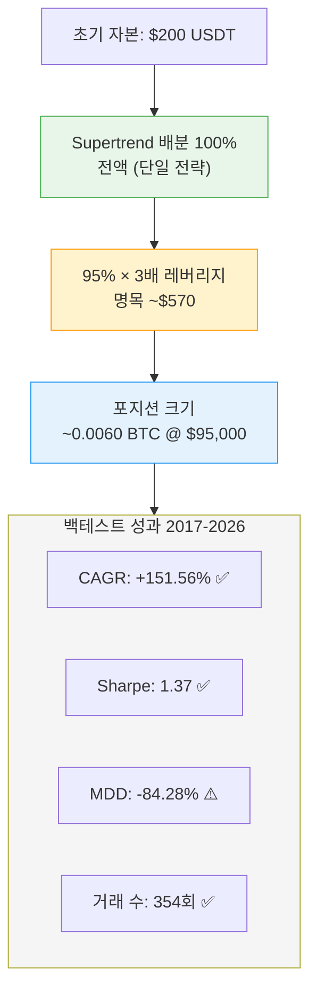
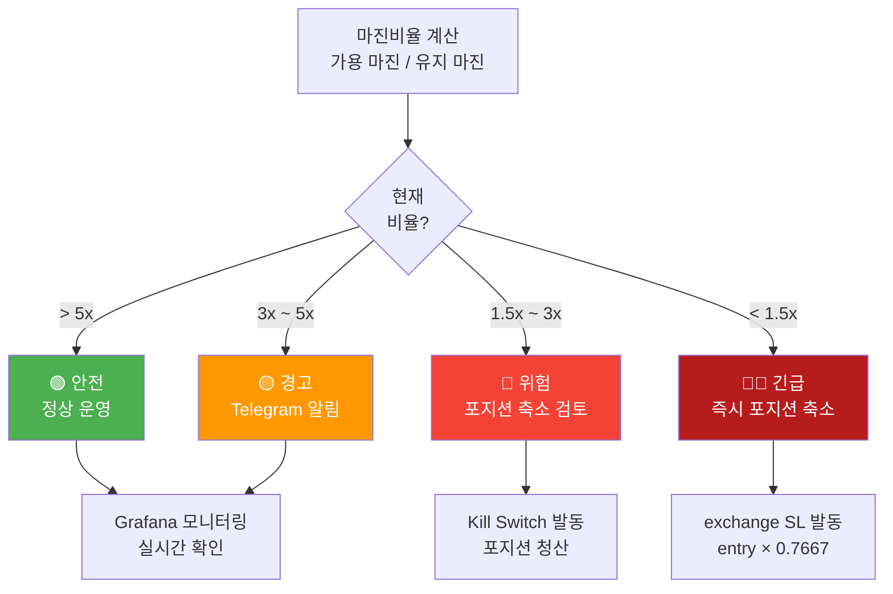

# 레버리지 제한 정책

## 원칙

**절대 5배 레버리지를 초과하지 않는다. 현재 전략은 3x 운영.**

```
하드 캡: 5x 레버리지 (변경 불가)
현재 설정: supertrend_4h_x3_7908 (Supertrend 4h Long-only, 3x 레버리지)
MAX_LEVERAGE 코드 상한: 3 (shared/exchange/bybit.py)
```

---

## 현재 설정: supertrend_4h_x3_7908 (Phase 5, 2026-05-18~)

### 레버리지 설정 시각화



### 파라미터

| 파라미터 | 값 | 설명 |
|---------|-----|------|
| **Leverage** | 3x | 선물 포지션에 3배 레버리지 적용 |
| **Position Sizing** | capital × 0.95 × 3 / price | 배분 자본의 95%를 레버리지 포함 포지션으로 |
| **Exchange SL** | entry × 0.7667 | catastrophic backstop (70% equity loss / 3x) |
| **Strategy** | Long-only | 매수 포지션만 (숏 없음) |

### 백테스트 성과 (9년: 2017-01 ~ 2026-05)

```
CAGR:           +151.56%    ✅ 매우 높음
Sharpe 비율:    1.37        ⚠️ 적절 (> 1.0)
최대낙폭(MDD):  -84.28%     ⚠️ 극한 위험 (사용자 승인)
거래 수:        354회       ✅ 충분한 샘플
```

### 포지션 사이징 공식

```python
# 예시: 오케스트레이터가 전액 배분 (단일 전략, 100%)
allocated_capital = 200.0    # orchestrator 배분 자본 (전체 잔고)
leverage = 3.0
btc_price = 95_000

qty = (allocated_capital * 0.95 * leverage) / btc_price  # ≈ 0.0060 BTC
notional = qty * btc_price                                # ≈ $570

# catastrophic SL
stop_loss = btc_price * (1 - 0.70 / leverage)            # entry × 0.7667
```

---

## 전략별 레버리지 이력

| 전략 | 기간 | 레버리지 | 상태 |
|------|------|---------|------|
| fa80_lev5_r30 (Funding Arb) | ~2026-05-18 | 5x | 🗂️ **폐기** |
| supertrend_4h_x3_7908 | 2026-05-18~ | **3x** | ✅ **현재 운영** |

> Funding Arb 전략 세부 분석은 git 히스토리 참조 (commit 이전 leverage-limits.md)

---

## 마진 안전성 모니터링

### 마진 안전성 위험 레벨



### 3x 레버리지 마진 구조

```
supertrend_4h_x3_7908 기준 ($95,000 BTC 가정):
  - 할당 자본: $60 (ranging 30%)
  - 포지션 명목: $60 × 0.95 × 3 = $171
  - 수량: ≈ 0.0018 BTC
  - exchange SL: $95,000 × 0.7667 = $72,837 (−23.3%)
  - 청산 전 자동 SL 발동 → 최대 손실 ≈ −$40
```

### 경고 레벨

| 마진비율 | 상태 | 조치 |
|---------|------|------|
| > 5x | 🟢 안전 | 정상 운영 |
| 3x ~ 5x | 🟡 경고 | Telegram 경고 |
| 1.5x ~ 3x | 🔴 위험 | Kill Switch 검토 |
| < 1.5x | 🔴🔴 긴급 | **즉시 포지션 청산** |

### Grafana 모니터링

http://localhost:3002 에서 다음을 실시간 확인:

```
[Supertrend 상태]
- 현재 포지션 PnL
- Kill Switch 이벤트 수 (7일)
- 자본 배분 (단일 전략 100%)
```

---

## 안전 검사

### 진입 전 검증 (supertrend strategy.py)

```python
# _enter_long() 내 체크
min_notional = 65.0  # Bybit 최소 주문 $65

qty = (allocated_capital * 0.95 * leverage) / price  # 3x 적용
if qty * price < min_notional:
    return  # 소액 주문 거부

stop_loss = price * (1 - 0.70 / leverage)  # entry × 0.7667

# exchange-native SL은 execution-engine에서 자동 부착
# stop_loss_pct=0.2333 (23.33% = 70%/3x)
```

### Kill Switch 조건 (Phase 5 절대값 AND)

```python
# orchestrator core.py (수정 불가 — CLAUDE.md "Kill Switch 약화 금지")
if (drawdown_pct <= -5.0) AND (drawdown_usd >= $10):
    trigger_kill_switch_l2()  # require_manual_reset=True
```

---

## 레버리지 변경 절차

### 변경 금지 (Phase 5 메인넷 실전)

Phase 5 실전 운영 중 레버리지 설정 변경은 **금지**된다.

### 변경 필요 시 (전략 교체 또는 Phase 이후)

변경 전 반드시:

1. **새 설정으로 백테스트 (최소 6개월 데이터)**
2. **Sharpe > 2.0, MDD < 5% 확인**
3. **마진비율 분석 (최악 시나리오 대비)**
4. **테스트넷 1주일 검증**
5. **심의 승인**
6. **CLAUDE.md 업데이트**

---

## 리스크 시나리오 분석 (Supertrend 3x)

### 시나리오 1: exchange SL 발동 (entry × 0.7667)

```
진입: BTC $95,000, 수량 0.0018 BTC, 명목 $171
exchange SL: $95,000 × 0.7667 = $72,837

SL 발동 시:
  손실 = (95,000 - 72,837) × 0.0018 × 3 = -$119.7
  배분 자본 $60 대비: -199.5% (마진 부족 → SL이 보호)
  
→ exchange-native SL이 강제 청산 전에 포지션을 닫음
```

### 시나리오 2: BTC 급등 +30%

```
진입: BTC $95,000 → $123,500 (+30%)
이익: (123,500 - 95,000) × 0.0018 × 3 = +$153.9
배분 자본 $60 대비: +256%
전체 포트폴리오 $200 대비: +76.9%
```

### 시나리오 3: Kill Switch 발동 (Phase 5 -5% / -$10)

```
포트폴리오 $200 기준:
  일일 손실 -$10 (-5%) 발생 시 Kill Switch L2 발동
  → 즉시 청산, require_manual_reset=True
  → Telegram 알림, 수동 재개 필요
```

**결론**: 3x 레버리지는 exchange SL과 Kill Switch의 이중 보호를 받지만, 
장기 누적 드로우다운(MDD -84.28%)은 시스템적 손실로 SL으로 막을 수 없음.

---

## 3x 레버리지 선택 근거

### 왜 3x인가?

1. **추세추종 전략 특성**: 
   - Long-only이므로 방향성 베팅
   - 높은 레버리지 = 높은 수익 + 높은 변동성

2. **백테스트 결과**:
   - 3x: CAGR +151.56%, MDD -84.28%
   - 2x: CAGR +73%, MDD -68% (미채택)
   - 1x: CAGR +25%, MDD -42% (미채택)

3. **하드 캡 준수**: 5x 이하 (코드 MAX_LEVERAGE=3 → 실질적으로 3x 초과 불가)

---

## 관련 문서

- [btc-only.md](btc-only.md) — BTC 단일 운영 정책
- [kill-switch.md](kill-switch.md) — Kill Switch (마진 안전성 마지막 방어)
- [operations/monitoring.md](operations/monitoring.md) — 마진 모니터링 상세
- [strategies/supertrend.md](strategies/supertrend.md) — Supertrend 전략 (레버리지 적용)
