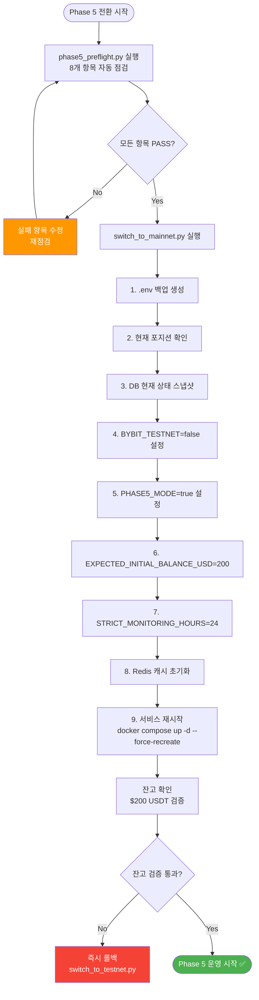
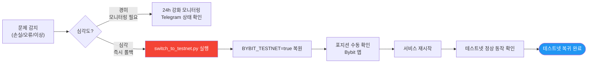

# 메인넷 전환 절차 (Phase 5)

실전 투자로 전환하기 위한 완전한 안내서. 9단계 자동화 스크립트와 수동 진행 옵션 제공.

---

## Phase 5 진입 조건 (사전 체크리스트)

메인넷으로 전환하기 전 다음 모든 조건을 확인한다. **하나라도 미충족 시 Phase 4 계속**.



### 체크리스트

**Phase 4 무중단 운영 확인** (필수):
- [ ] 7일 이상 무중단 운영 (도커 재시작 없음, Running 유지)
- [ ] Kill Switch 4단계 모두 동작 확인 (Level 1, 2, 3, 4)
- [ ] Telegram 알림 모든 유형 수신 확인 (Entry, Exit, Kill Switch, Heartbeat)
- [ ] 포지션 진입/청산/재시작 시 정상 복구 확인
- [ ] Walk-Forward 월간 파이프라인 1회 이상 정상 완료

**파이널 백테스트 검증** (필수):
- [ ] fa80_lev5_r30 파라미터 재확인 (config/strategies/funding-arb.yaml)
- [ ] 6년 백테스트 결과 CAGR +34.87% 재확인
- [ ] 최근 OOS(Out-of-Sample) 30일 성과 > 기준의 70% 달성

**Preflight 자동 검증** (필수):
- [ ] `python scripts/phase5_preflight.py` 실행
- [ ] 8개 항목 모두 PASS 확인:
  1. env_vars (BYBIT_TESTNET, API 키)
  2. api_connectivity (메인넷 API 연결)
  3. account_balance (최소 $100 USDT)
  4. trading_fees (0.055% 이하)
  5. min_order_size (BTC 최소 주문)
  6. leverage (5x 이하 강제)
  7. db_connectivity (PostgreSQL, 필수 테이블)
  8. config_files (전략 파일 존재)

**메인넷 준비** (필수):
- [ ] EXPECTED_INITIAL_BALANCE_USD = $200 설정
- [ ] STRICT_MONITORING_HOURS = 24 설정
- [ ] PHASE5_MODE = true 설정
- [ ] 메인넷 API 키 확보 (Bybit 계정 → API 관리)
- [ ] 메인넷 API 시크릿 확보
- [ ] Telegram 봇 토큰 확인 (메인넷 전용 봇 권장)
- [ ] 비상 청산 SOP 휴대폰 저장 ([emergency-manual-close.md](../emergency-manual-close.md))

---

## 메인넷 전환 2가지 방식

### 방식 A: 자동화 스크립트 (권장)

```bash
python scripts/switch_to_mainnet.py
```

스크립트가 다음을 자동으로 처리합니다:
- 9단계 모두 자동 실행
- API 키 검증
- DB 포지션 확인
- 백업 생성
- 사용자 이중 확인 (2단계)
- BYBIT_TESTNET=false 설정
- Redis 캐시 클리어

**소요 시간**: 2-3분

**권장**: 처음 전환하거나 신뢰도 높을 때

### 방식 B: 수동 진행 (세밀한 제어)

각 단계를 개별적으로 진행. 아래 9단계 절차 참조.

---

## 메인넷 전환 9단계 절차

### 1단계: 최종 점검

```bash
# 테스트넷 정상 운영 상태 확인
cd ~/Data/Bit-Mania/cryptoengine
docker compose ps | grep -E "Running"

# 포지션 상태 확인 (없어야 함)
docker compose exec postgres psql -U cryptoengine -d cryptoengine -c \
  "SELECT COUNT(*) FROM positions WHERE status='open';"

# Kill Switch 이벤트 확인
docker compose exec postgres psql -U cryptoengine -d cryptoengine -c \
  "SELECT COUNT(*) FROM kill_switch_events WHERE triggered_at > NOW() - INTERVAL '7 days';"
```

### 2단계: API 키 교체 (테스트넷 → 메인넷)

```bash
# .env 파일에서 API 키 확인
cat .env | grep BYBIT

# 현재 상태 (BYBIT_TESTNET=true)
BYBIT_TESTNET=true
BYBIT_API_KEY=<testnet_key>
BYBIT_SECRET_KEY=<testnet_secret>

# 메인넷 API 키로 교체
# 1. Bybit 계정 → API 관리
# 2. 메인넷 API 키 생성 (또는 기존 사용)
# 3. .env 파일 수정
vi .env

# 변경:
# BYBIT_TESTNET=false          # ← 여기서 변경 안 함 (2단계에서)
# BYBIT_API_KEY=<mainnet_key>
# BYBIT_SECRET_KEY=<mainnet_secret>
```

⚠️ **아직 BYBIT_TESTNET을 변경하지 마세요.**

### 3단계: Phase 5 환경 변수 설정

```bash
# .env 파일에 Phase 5 설정 추가
cat >> .env << 'EOF'

# Phase 5: 메인넷 설정
EXPECTED_INITIAL_BALANCE_USD=200        # 초기 자본 (잔고 검증용)
STRICT_MONITORING_HOURS=24              # 첫 24시간 강화 모니터링
PHASE5_MODE=true                        # fixed_notional 사이징, 절대값 Kill Switch
EOF

# 확인
grep -E "PHASE5|STRICT_MONITORING|EXPECTED_INITIAL" .env
```

### 4단계: 테스트 서버에서 메인넷 API 검증

```bash
# 테스트넷 환경에서 메인넷 API 연결 테스트
# (아직 실제 거래 X, 정보 조회만)

docker compose exec market-data python -c "
from shared.exchange.bybit import BybitWrapper
bybit = BybitWrapper(testnet=False)  # 메인넷 API
try:
    ticker = bybit.fetch_ticker('BTCUSDT')
    print(f'BTC Price: {ticker[\"last\"]}')
except Exception as e:
    print(f'Error: {e}')
"
```

### 5단계: 최종 백업

```bash
# 데이터베이스 전체 백업 (메인넷 전환 전)
docker compose exec postgres pg_dump -U cryptoengine cryptoengine > backup_before_mainnet.sql
ls -lh backup_before_mainnet.sql

# Redis 데이터 백업
docker compose exec redis redis-cli BGSAVE
docker compose exec redis redis-cli LASTSAVE
```

### 6단계: 전환 스크립트 실행 (선택: 자동화)

```bash
# 메인넷 전환 스크립트 (있으면)
# 이 스크립트가 자동으로 여러 단계를 수행함
docker compose run --rm tools python scripts/switch_to_mainnet.py

# 또는 수동 진행 (7-8단계)
```

### 7단계: 환경 변수 최종 변경 (BYBIT_TESTNET)

```bash
# .env 파일에서 마지막 변경: testnet → mainnet
vi .env

# 변경:
BYBIT_TESTNET=false    # ← 메인넷 활성화

# 확인
grep BYBIT_TESTNET .env
```

### 8단계: 서비스 재시작 (메인넷 모드)

```bash
# 1. 모든 서비스 정지
docker compose down

# 2. 전체 시스템 시작 (메인넷 모드)
docker compose up -d

# 3. 안정화 대기 (3-5분)
sleep 180

# 4. 상태 확인
docker compose ps | grep -E "Running"

# 5. 마켓데이터 수집 확인
docker compose logs --tail=20 market-data | grep -E "funding|OHLCV"

# 6. 포지션 복구 확인 (없어야 함, Phase 5 신규 시작)
docker compose exec postgres psql -U cryptoengine -d cryptoengine -c \
  "SELECT COUNT(*) FROM positions WHERE status='open';"
```

### 9단계: 초기 24시간 강화 모니터링

```bash
# STRICT_MONITORING_HOURS=24 설정으로 자동 활성화
# 거래 신청 전 시스템이 안정되었는지 확인 (2-3시간)

sleep 120

# 최종 점검
docker compose logs --tail=50 strategy-orchestrator | grep -E "ready|ERROR"
docker compose logs --tail=50 funding-arb | grep -E "initialized|ready|ERROR"

# 모든 OK면 거래 자동 시작됨 (오케스트레이터 판단)
```

---

## 메인넷 모드 (Phase 5) 특수 설정

### fixed_notional 포지션 사이징 (Supertrend)

테스트넷 동적 사이징에서 메인넷 고정액으로 자동 변경:

```python
# Phase 5 자동 적용 (PHASE5_MODE=true)
phase5:
  sizing_mode: fixed_notional       # 고정액 포지션
  fixed_notional_usd: 150           # $200 × 75% 안전 버퍼
  max_concurrent_positions: 1       # 소액 집중 관리
  min_position_usd: 50              # Bybit 최소 주문
  
  # Supertrend 지표 유지 (테스트넷과 동일)
  indicators:
    supertrend:
      period: 8
      multiplier: 2.4
    ema_fast: 7
    ema_slow: 27
    ema_trend: 230
    atr_exit_multiplier: 3.2
```

### 이전 FA 설정 (참고, 더 이상 사용 안 함)

이전 Funding Arb 전략의 Phase 5 설정:
```yaml
# [폐기됨] 이전 FA Phase 5 오버라이드
# fixed_notional_usd: 150
# fa_capital_ratio: 0.75
# reinvest_ratio: 0.0
```

### 절대값 AND Kill Switch

메인넷에서는 상대값 + 절대값 기준으로 Kill Switch 발동:

```python
# Phase 5: 둘 다 조건 만족해야 발동 (AND)
if (drawdown_pct <= -5.0) AND (drawdown_usd >= $50):
    trigger_kill_switch_l2()

# 예:
# - 손실 -4% ($8) → 발동 안 함 (상대값 미만)
# - 손실 -6% ($8) → 발동 안 함 (절대값 미만)
# - 손실 -6% ($60) → 발동 함 (둘 다 만족)
```

---

## 메인넷 운영 중 모니터링

### 첫 24시간 (STRICT_MONITORING_HOURS=24)

```bash
# 매 시간마다 확인
watch -n 3600 'docker compose logs --tail=20 funding-arb | grep -E "position|entry|profit"'

# 또는 수동 확인 (30분마다)
docker compose exec postgres psql -U cryptoengine -d cryptoengine -c \
  "SELECT SUM(pnl) as total_pnl, COUNT(*) as trade_count FROM trades WHERE created_at > NOW() - INTERVAL '1 hour';"
```

### 대시보드 모니터링

http://localhost:3000 에서 실시간 확인 (`cd dashboard && docker compose up -d`):

```
[Phase 5 강화 모니터링]
- Daily P&L (목표: +$1-3)       → /monitor
- Kill Switch Events (목표: 0)  → /monitor
- 예상 vs 실제 체결 일치율       → /supertrend
- 슬리피지 / 타이밍 랙           → /supertrend
```

### Telegram 알림

메인넷 봇에서 수신해야 할 알림:

- ✅ 첫 거래 진입 알림
- ✅ 첫 거래 수익 실현 알림
- ✅ 모든 Kill Switch 알림 (없어야 함)
- ✅ 시간별 포트폴리오 스냅샷

---

## 롤백 절차 (메인넷 → 테스트넷)

문제 발생 시 즉시 테스트넷으로 롤백한다.



```bash
# 1. 모든 포지션 즉시 청산 (메인넷)
/kill  # Telegram

# 2. 거래소에서 포지션 확인 및 수동 정리 (필요 시)
# Bybit 웹 → [선물] → [포지션]

# 3. 백업에서 복원 (필수)
docker compose down
docker compose exec postgres psql -U cryptoengine -d cryptoengine < backup_before_mainnet.sql

# 4. .env 파일 되돌리기
vi .env
# BYBIT_TESTNET=true          # 테스트넷으로
# BYBIT_API_KEY=<testnet_key>

# 5. Phase 5 설정 제거
sed -i '/PHASE5_MODE/d' .env
sed -i '/STRICT_MONITORING/d' .env

# 6. 테스트넷 서비스 시작
docker compose up -d

# 7. 원인 분석 및 보고
# docs/incident_log/YYYY-MM-DD_rollback.md
```

---

## 체크리스트 (메인넷 실행 전)

```markdown
메인넷 전환 GO/NO-GO (Supertrend 4h):
- [ ] Phase 4 모든 항목 완료
- [ ] Supertrend 파라미터 최종 확인 (ST 8, 2.4 / EMA 7,27,230)
- [ ] API 키 교체 (메인넷)
- [ ] EXPECTED_INITIAL_BALANCE_USD = $200
- [ ] STRICT_MONITORING_HOURS = 24
- [ ] PHASE5_MODE = true
- [ ] BYBIT_TESTNET = false (마지막 변경)
- [ ] MAX_LEVERAGE = 3 (공유 라이브러리에서 확인)
- [ ] 최종 백업 완료
- [ ] 비상 청산 SOP 준비 완료
- [ ] Telegram 봇 토큰 확인
- [ ] 1차 테스트 (정보 조회만, 거래 X)

GO 신호 받으면:
- [ ] 스크립트 실행 또는 수동 진행
- [ ] 24시간 강화 모니터링
- [ ] 첫 거래 진입 확인 (Supertrend 신호)
- [ ] 첫 청산 (수익/손실) 확인
- [ ] 이상 없으면 일상 운영으로 전환
```

---

## FAQ

### Q: 메인넷 진입 후 테스트넷으로 돌아갈 수 있나?

**A**: 가능하다. 롤백 절차 참조. 단, 메인넷에서 발생한 거래는 기록에 남는다.

### Q: $200에서 수익이 날까?

**A**: 가능하다. 펀딩비는 고정액 수익이므로, $200도 연 30%+ 수익 기대 가능. 단, 절대액은 작음 ($5-10/월).

### Q: Kill Switch 발동되면 어떻게?

**A**: 모든 포지션 즉시 청산. 손실이 없으면 재시작. 손실 $30 이상이면 Phase 5 종료 검토.

### Q: 배포 중 메인넷 전환할 수 있나?

**A**: **절대 금지**. 항상 안정적인 상태에서만 전환.

---

## 관련 문서

- [../deployment-position.md](../deployment-position.md) — 배포 시 포지션 보호
- [../kill-switch.md](../kill-switch.md) — Kill Switch (Phase 5 절대값 AND)
- [../emergency-manual-close.md](../emergency-manual-close.md) — 비상 청산 SOP
- [deployment-procedure.md](deployment-procedure.md) — Docker 배포 절차
