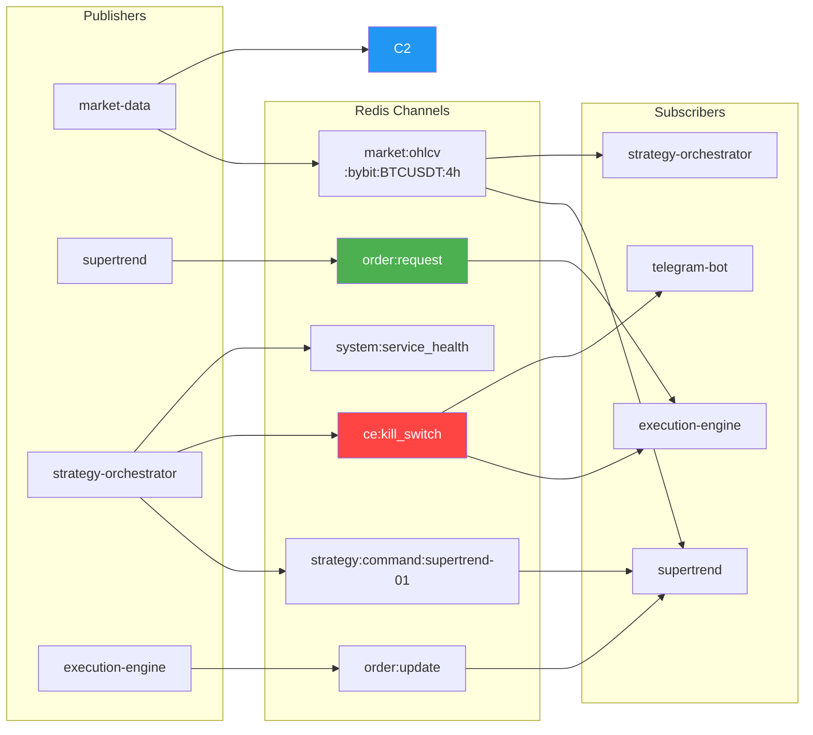

# Redis Pub/Sub 채널 카탈로그

---

## Redis Pub/Sub 채널



### 시장 데이터 채널

#### `market:ohlcv:{exchange}:{symbol}:{timeframe}`

OHLCV 캔들 데이터 배포. Market Data Collector → 전략 서비스

**메시지 예시**:

```json
{
  "exchange": "bybit",
  "symbol": "BTCUSDT",
  "timeframe": "5m",
  "open": 65000.0,
  "high": 65100.0,
  "low": 64950.0,
  "close": 65050.0,
  "volume": 1234.56,
  "ts": 1712100000000,
  "confirmed": true
}
```

**수신자**:
- supertrend 전략 (4h 캔들만, confirmed=true)
- orchestrator

---

### 주문 채널

#### `order:request`

전략 → Execution Engine 주문 요청

**메시지 예시**:

```json
{
  "request_id": "abc123def456",
  "strategy_id": "supertrend-01",
  "exchange": "bybit",
  "symbol": "BTC/USDT:USDT",
  "side": "buy",
  "order_type": "limit",
  "quantity": 0.003,
  "price": 65000.0,
  "post_only": true,
  "reduce_only": false,
  "stop_loss": null,
  "take_profit": null
}
```

**발행자**: 
- supertrend (4시간 신호 기반 주문)

---

#### `order:result`

Execution Engine → 전략 주문 결과

**메시지 예시**:

```json
{
  "request_id": "abc123def456",
  "order_id": "bybit-ord-789",
  "status": "filled",
  "filled_qty": 0.1,
  "filled_price": 65000.0,
  "fee": 0.039,
  "fee_currency": "USDT",
  "timestamp": "2026-04-03T12:00:00Z"
}
```

**status 값**:
- `new` — 주문 접수
- `partially_filled` — 부분 체결
- `filled` — 완전 체결
- `cancelled` — 취소됨
- `rejected` — 거부됨
- `expired` — 만료됨

**수신자**: 주문을 낸 전략

---

#### `order:result:{strategy_id}`

특정 전략 전용 결과 채널.

---

### 전략 명령 채널

#### `strategy:{strategy_id}:command`

Strategy Orchestrator → 전략 자본 배분 명령

**메시지 예시**:

```json
{
  "strategy_id": "supertrend-01",
  "allocated_capital": 185.31,
  "weight": 1.0,
  "max_drawdown": 5.0,
  "timestamp": "2026-04-03T12:00:00Z"
}
```

**수신자**:
- supertrend (자본 배분 조정)

---

### 시스템 채널

#### `system:kill_switch`

Kill Switch 발동 이벤트 → 모든 서비스 수신 (즉시 청산)

**메시지 예시**:

```json
{
  "triggered": true,
  "level": 2,
  "reason": "Daily drawdown -5.2% >= -5.0%",
  "timestamp": "2026-04-03T12:00:00Z",
  "cooldown_minutes": 60
}
```

**수신자**:
- execution-engine (포지션 청산)
- supertrend (포지션 상태 저장 후 종료)
- telegram-bot (알림 전송)

**대응 절차**: [../kill-switch.md](../kill-switch.md) 참조

---

## Redis 캐시 키

| 키 | 타입 | TTL | 설명 |
|----|------|-----|------|
| 키 | 타입 | TTL | 설명 |
|----|------|-----|------|
| `cache:portfolio_state` | String(JSON) | 300s | 포트폴리오 상태 |
| `market:ticker:{symbol}` | String(JSON) | 60s | 최신 시세 |
| `orchestrator:state` | String(JSON) | 600s | 오케스트레이터 상태 |
| `orchestrator:kill_switch` | String(JSON) | 7200s | Kill Switch 상태 |
| `strategy:saved_state:supertrend-01` | String(JSON) | 3600s | Supertrend 포지션 복구용 |

---

## Dashboard REST API

### 내부 API (포트 3000)

#### `GET /api/internal/portfolio`

현재 포트폴리오 상태 조회

```bash
curl http://localhost:3000/api/internal/portfolio
```

**응답**:

```json
{
  "total_equity": 187.50,
  "unrealized_pnl": 0.0,
  "realized_pnl_today": 2.50,
  "daily_drawdown": 0.0,
  "strategies": [
    {
      "strategy_id": "supertrend-01",
      "allocated_capital": 187.50,
      "current_pnl": 2.50,
      "position_count": 0
    }
  ]
}
```

---

#### `GET /api/internal/positions`

열린 포지션 목록

```bash
curl http://localhost:3000/api/internal/positions
```

---

#### `GET /api/internal/trades?limit=50&strategy=supertrend`

거래 이력 조회

```bash
curl http://localhost:3000/api/internal/trades?limit=50&strategy=supertrend-01
```

---


#### `POST /api/internal/kill-switch`

Kill Switch 수동 발동

```bash
curl -X POST http://localhost:3000/api/internal/kill-switch \
  -H "Content-Type: application/json" \
  -d '{"reason": "Manual trigger from dashboard"}'
```

**대응 절차**: [../kill-switch.md](../kill-switch.md) 참조

---

#### `POST /api/internal/resume`

Kill Switch 해제 (수동 재개)

```bash
curl -X POST http://localhost:3000/api/internal/resume
```

---

### 외부 API (포트 3001)

#### `GET /api/public/status`

시스템 상태 (인증 불필요, 제한된 정보)

```bash
curl http://localhost:3001/api/public/status
```

**응답**:

```json
{
  "status": "running",
  "uptime_hours": 72.5
}
```

---

#### `GET /api/public/performance`

성과 요약 (제한된 정보)

```bash
curl http://localhost:3001/api/public/performance
```

---

## 도메인 모델 (Pydantic v2)

모든 모델은 `shared/models/` 에 정의됨.

### OrderRequest

```python
class OrderRequest(BaseModel):
    strategy_id: str
    exchange: str
    symbol: str
    side: Literal["buy", "sell"]
    order_type: Literal["limit", "market", "stop_limit", "stop_market"]
    quantity: float  # > 0
    price: float | None = None
    post_only: bool = True
    reduce_only: bool = False
    stop_loss: float | None = None
    take_profit: float | None = None
    request_id: str  # 자동 생성 UUID
```

---

### OrderResult

```python
class OrderResult(BaseModel):
    request_id: str
    order_id: str
    status: Literal["new", "partially_filled", "filled", "cancelled", "rejected", "expired"]
    filled_qty: float = 0.0
    filled_price: float | None = None
    fee: float = 0.0
    fee_currency: str = "USDT"
    timestamp: datetime
```

---

### PortfolioState

```python
class PortfolioState(BaseModel):
    total_equity: float
    unrealized_pnl: float = 0.0
    realized_pnl_today: float = 0.0
    daily_drawdown: float = 0.0
    weekly_drawdown: float = 0.0
    strategies: list[StrategySnapshot]
    kill_switch_triggered: bool = False
```

---


## 에러 코드

| 코드 | 설명 | 대응 |
|------|------|------|
| `safety_check_internal_error` | 안전성 검사 내부 오류 | 로그 확인 |
| `execution_failed_after_3_retries` | 3회 재시도 후 실행 실패 | 거래소 상태 확인 |
| `order_timeout` | 주문 타임아웃 (30초) | 네트워크 확인 |
| `order_rejected` | 거래소에서 주문 거부 | 잔고/마진 확인 |

---

## 관련 문서

- [runbook.md](runbook.md) — 운영 매뉴얼
- [../kill-switch.md](../kill-switch.md) — Kill Switch 정책
- [../strategies/supertrend.md](../strategies/supertrend.md) — Supertrend 전략
