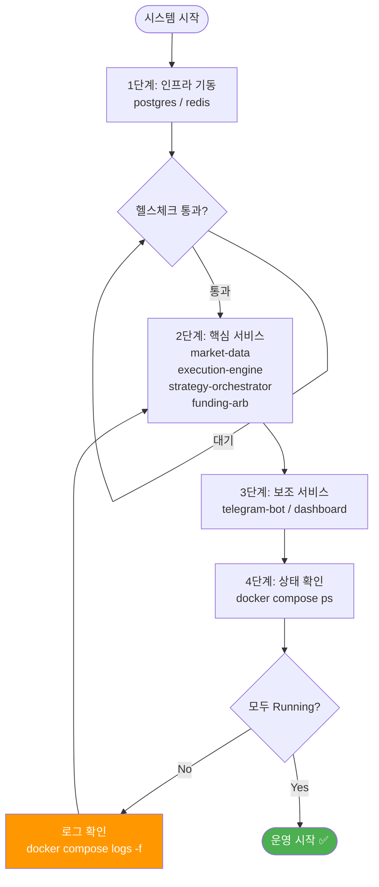
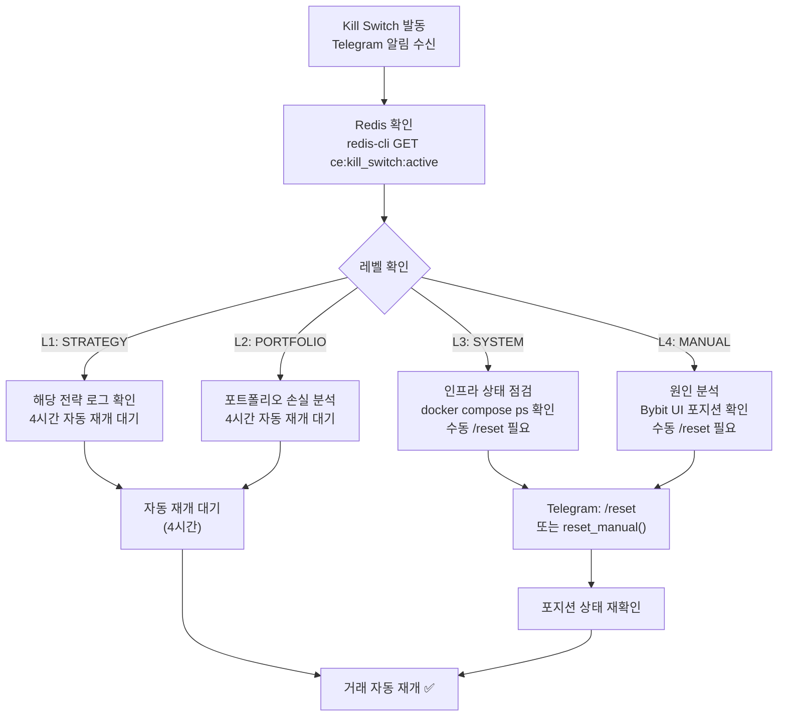

# CryptoEngine 운영 매뉴얼 (Runbook)

---

## 시스템 시작/중지



### 전체 시스템 시작

```bash
# 1. 환경변수 확인
cd ~/Data/Bit-Mania/cryptoengine
cat .env | grep -E "BYBIT_|DB_"

# 2. 인프라 시작 (PostgreSQL, Redis)
docker compose up -d postgres redis

# 3. 핵심 서비스 시작
docker compose up -d market-data execution-engine strategy-orchestrator funding-arb

# 4. 보조 서비스 시작
docker compose up -d telegram-bot dashboard

# 5. 상태 확인
docker compose ps
```

### 전체 시스템 중지

```bash
# 그레이스풀 종료 (포지션 유지)
docker compose down

# 긴급 종료 (데이터 손실 가능)
docker compose kill
```

### 개별 서비스 재시작

```bash
# 단일 서비스 재시작 (포지션 자동 복구)
docker compose restart funding-arb
docker compose restart execution-engine
docker compose restart market-data

# 서비스 로그 확인
docker compose logs -f funding-arb --tail=50
```

---

## 일상 운영

### 매일 확인 사항

```bash
# 1. 시스템 상태
docker compose ps

# 2. 주요 서비스 로그 (에러 확인)
docker compose logs --tail=100 strategy-orchestrator | grep -E "ERROR|CRITICAL"
docker compose logs --tail=100 execution-engine | grep -E "ERROR|CRITICAL"
docker compose logs --tail=100 funding-arb | grep -E "ERROR|CRITICAL"

# 3. 포트폴리오 상태
# Telegram: /status
# 또는 HTTP: curl http://localhost:3000/api/internal/portfolio

# 4. 열린 포지션
docker compose exec postgres psql -U cryptoengine -d cryptoengine -c \
  "SELECT id, symbol, size, entry_price, updated_at FROM positions WHERE status='open' ORDER BY updated_at DESC;"

# 5. 대시보드 확인
#    http://localhost:3000/supertrend  — Supertrend 예상 vs 실제 비교
#    http://localhost:3000/monitor     — 자산/Kill Switch/서비스 상태
```

### 주간 확인 사항

```bash
# 1. 거래 내역 내보내기
docker compose exec postgres psql -U cryptoengine -d cryptoengine -c \
  "SELECT * FROM trades WHERE created_at > NOW() - INTERVAL '7 days' ORDER BY created_at DESC;" \
  > weekly_trades.csv

# 2. 펀딩비 수익 집계
docker compose exec postgres psql -U cryptoengine -d cryptoengine -c \
  "SELECT DATE(settlement_time), SUM(funding_payment) as total
   FROM funding_payments WHERE settlement_time > NOW() - INTERVAL '7 days'
   GROUP BY DATE(settlement_time) ORDER BY DATE DESC;"

# 3. 마진 비율 확인 (최저값이 안전 수준 이상인지)
#    Grafana: "Margin Ratio (Min 7d)"

# 4. 디스크/메모리 사용량
docker compose exec postgres pg_database_size cryptoengine
docker system df
```

### 월간 확인 사항

```bash
# 1. 월간 P&L 리포트
docker compose exec postgres psql -U cryptoengine -d cryptoengine -c \
  "SELECT SUM(pnl) as total_pnl, COUNT(*) as trade_count, AVG(pnl) as avg_pnl
   FROM trades WHERE DATE_TRUNC('month', created_at) = DATE_TRUNC('month', NOW());"

# 2. 데이터베이스 정리
docker compose exec postgres psql -U cryptoengine -d cryptoengine -c \
  "DELETE FROM ohlcv_history WHERE timestamp < NOW() - INTERVAL '90 days';
   VACUUM ANALYZE;"

# 3. Kill Switch 이벤트 리뷰
docker compose exec postgres psql -U cryptoengine -d cryptoengine -c \
  "SELECT * FROM kill_switch_events WHERE triggered_at > NOW() - INTERVAL '1 month';"

# 4. Sharpe 비율 / MDD 계산 (월간 성과)
docker compose exec postgres psql -U cryptoengine -d cryptoengine -c \
  "SELECT DATE_TRUNC('month', created_at), 
          COUNT(*) as trades,
          SUM(pnl) as monthly_pnl,
          MIN(equity) as min_equity,
          MAX(equity) as max_equity
   FROM daily_reports
   GROUP BY DATE_TRUNC('month', created_at)
   ORDER BY DATE_TRUNC DESC;"
```

---

## 인시던트 대응

### 인시던트 레벨 정의

| 레벨 | 정의 | 대응 시간 | 예시 |
|------|------|-----------|------|
| P1 | 자금 손실 위험 | 즉시 | 거래소 API 장애 중 포지션 존재 |
| P2 | 기능 장애 | 1시간 | 전략 서비스 다운 |
| P3 | 성능 저하 | 4시간 | 레이턴시 증가 |
| P4 | 정보성 | 24시간 | 로그 경고 |

### P1 대응 절차 (자금 손실 위험)

```bash
# 1. Kill Switch 발동 (자동 또는 수동)
# 수동: /kill (Telegram) 또는 POST /api/internal/kill-switch

# 2. 상황 파악
docker compose logs --since=30m strategy-orchestrator execution-engine | grep -E "ERROR|kill|switch"

# 3. 거래소 API 상태 확인
curl https://api.bybit.com/v5/market/time

# 4. 포지션 수동 확인 (Bybit 웹)
#    https://www.bybit.com → [선물] → [포지션]

# 5. 원인 분석
#    - API 타임아웃 다발?
#    - 거래소 공지 확인?
#    - 네트워크 문제?

# 6. 복구 조치
docker compose restart execution-engine strategy-orchestrator
sleep 10
docker compose logs -f strategy-orchestrator | grep -E "running|ready"

# 7. 거래 재개 (포지션 청산된 경우)
# Telegram: /resume

# 8. 인시던트 보고
# docs/incident_log/YYYY-MM-DD_HH-MM.md 에 기록
```

### P2 대응 절차 (기능 장애)

```bash
# 1. 영향 받는 서비스 확인
docker compose ps | grep -E "Exit|Exited"

# 2. 서비스 로그 확인
docker compose logs --tail=200 <서비스명> | tail -50

# 3. 의존성 서비스 확인 (PostgreSQL, Redis)
docker compose exec postgres pg_isready
docker compose exec redis redis-cli ping

# 4. 서비스 재시작
docker compose restart <서비스명>

# 5. 포지션 영향 확인
# Telegram: /positions
docker compose exec postgres psql -U cryptoengine -d cryptoengine -c \
  "SELECT * FROM positions WHERE status='open';"

# 6. 정상화 확인
docker compose logs --tail=20 <서비스명> | grep -E "ready|running|started"
```

---

## Kill Switch 대응



자세한 내용은 [../kill-switch.md](../kill-switch.md) 참조.

### Level 1 — 전략 레벨

- **증상**: 개별 전략 최대 낙폭 초과 (-3% 일일, -7% 주간, -12% 월간)
- **동작**: 해당 전략만 중지 + 포지션 청산
- **복구**: 4시간 쿨다운 후 자동 재개

```bash
# 확인
docker compose logs strategy-orchestrator | grep "level.*1"
```

### Level 2 — 포트폴리오 레벨

- **증상**: 포트폴리오 심각한 손실 (-5% 일일, -10% 주간, -15% 월간)
- **동작**: 모든 전략 중지 + 모든 포지션 청산
- **복구**: 1시간 쿨다운 후 자동 재개

```bash
# Telegram 알림에 ACK 필요
/acknowledge (또는 /ack)

# 1시간 후 자동 재개, 또는 즉시 재개
/resume
```

### Level 3 — 시스템 레벨

- **증상**: API 연결 실패, DB/Redis 다운, 인프라 장애
- **동작**: 시장가 청산 시도 → 실패 시 수동 개입 대기
- **복구**: 자동 불가 (수동)

```bash
# 긴급 알림 수신
# Telegram: [긴급] 거래소 API 연결 실패...

# 1. 인프라 확인
docker compose exec postgres pg_isready
docker compose exec redis redis-cli ping
curl https://api.bybit.com/v5/market/time

# 2. 네트워크 확인
ping 8.8.8.8
traceroute api.bybit.com

# 3. 조치
docker compose restart execution-engine  # 재시도
# 또는
/kill  # 수동으로 모든 포지션 청산
```

### Level 4 — 수동 긴급

```bash
# 긴급 정지
/kill  # Telegram

# 상황 파악
docker compose logs --tail=100 funding-arb | grep -E "position|exit"

# 재개 (문제 해결 후)
/resume  # Telegram
```

---

## 데이터베이스 관리

### 백업

```bash
# 자동 백업 (매일 02:00 KST)
# pg-backup 서비스가 자동으로 실행

# 수동 백업
docker compose exec pg-backup pg_dump -U cryptoengine cryptoengine > backup_manual.sql

# 백업 파일 목록
docker compose exec pg-backup ls -lh /backups/
```

### 마이그레이션

```bash
# 알렘빅 마이그레이션 확인
cd ~/Data/Bit-Mania/cryptoengine/shared/db
alembic history

# 최신 마이그레이션 적용
alembic upgrade head
```

### 성능 최적화

```bash
# 인덱스 상태 확인
docker compose exec postgres psql -U cryptoengine -d cryptoengine -c \
  "SELECT relname, indexrelname, idx_scan FROM pg_stat_user_indexes
   ORDER BY idx_scan DESC LIMIT 10;"

# 테이블 크기 확인
docker compose exec postgres psql -U cryptoengine -d cryptoengine -c \
  "SELECT relname, pg_size_pretty(pg_total_relation_size(relid)) as size
   FROM pg_statio_user_tables
   ORDER BY pg_total_relation_size(relid) DESC;"

# VACUUM 실행
docker compose exec postgres psql -U cryptoengine -d cryptoengine -c \
  "VACUUM ANALYZE;"
```

---

## 모니터링

### 대시보드 (Grafana 대체)

http://localhost:3000/supertrend — Supertrend 예상 vs 실제 비교  
http://localhost:3000/monitor   — 자산/Kill Switch/서비스 상태/인프라

**주요 패널**:
- **Supertrend 비교**: 매 4h 봉 예상 진입·청산 vs 실제 체결 (가격, 수량, 지연)
- **자산 곡선**: 예상(백테스트) vs 실제(메인넷) 30일
- **Kill Switch**: 현재 상태 + 발동 이력
- **서비스 상태**: 서비스별 마지막 응답 시간 + 오류 건수
- **인프라**: CPU / 메모리 / 디스크 / Redis (Prometheus 연동)

### 핵심 메트릭

| 메트릭 | 정상 범위 | 경고 임계값 |
|--------|-----------|------------|
| Daily Return | -2% ~ +5% | < -3% |
| Sharpe 30일 | > 1.0 | < 0.5 |
| **Margin Ratio** | **> 10x** | **< 10x** |
| API Latency | < 200ms | > 1000ms |
| 미체결 주문 | < 10개 | > 30개 |
| 메모리 사용 | < 70% | > 85% |

### 로그 레벨

```
DEBUG: 개발 환경만
INFO: 기본 운영 로그 (거래, 진입/청산)
WARNING: 주의 필요 (자동 복구 가능)
ERROR: 오류 발생 (수동 개입 가능)
CRITICAL: Kill Switch 발동 (즉시 대응 필요)
```

---

## 문제 해결

### 서비스가 시작되지 않는 경우

```bash
# 1. 컨테이너 상태 확인
docker compose ps

# 2. 로그 확인
docker compose logs <서비스명> --tail=100

# 3. 의존성 서비스 확인
docker compose logs postgres
docker compose logs redis

# 4. 환경변수 확인
docker compose config | grep -A 10 <서비스명>

# 5. 이미지 재빌드
docker compose build --no-cache <서비스명>
docker compose up -d <서비스명>
```

### Limit 지정가 Re-peg 모니터링

Post-only 지정가 주문은 10초마다 최대 20회 재발행 후 시장가로 폴백됩니다.

**주요 로그 이벤트:**

| 로그 msg | 의미 | 대응 |
|----------|------|------|
| `limit_repeg_attempt` | attempt N에서 best-bid/ask로 새 주문 발행 | 정상 (체결 대기 중) |
| `postonly_rejected` | Bybit이 taker 체결 방지로 즉시 거부 → 바로 다음 attempt | 정상 (빠른 시장) |
| `limit_fallback_to_market` | 20회 미체결 → 시장가로 폴백 | ⚠️ taker 수수료 발생. 빈도 높으면 repeg 간격 검토 |

```bash
# Limit repeg 현황 확인
docker compose logs --tail=200 execution-engine | grep -E "limit_repeg|postonly_rejected|limit_fallback"

# 폴백 빈도 집계
docker compose logs execution-engine | grep "limit_fallback_to_market" | wc -l
```

**폴백이 자주 발생하는 경우**: 시장 유동성이 낮거나 BTC 급변동 구간. 단발적이면 정상. 연속 3회 이상이면 시장 상황 확인.

### 주문이 체결되지 않는 경우

```bash
# 1. Execution Engine 로그 확인
docker compose logs execution-engine --tail=50 | grep -E "order|error|timeout"

# 2. Bybit API 상태
curl https://api.bybit.com/v5/market/time

# 3. API 키 잔여 한도 확인
#    Bybit 웹 → 계정 → API 관리 → Rate Limit

# 4. 현재 잔고 확인
# Telegram: /balance

# 5. 거래소에서 직접 주문 테스트 (Bybit UI)
```


### 데이터베이스 연결 실패

```bash
# 1. PostgreSQL 상태 확인
docker compose exec postgres pg_isready

# 2. 연결 테스트
docker compose exec postgres psql -U cryptoengine -d cryptoengine -c "SELECT 1"

# 3. 연결 풀 상태
docker compose exec postgres psql -U cryptoengine -d cryptoengine -c \
  "SELECT count(*) FROM pg_stat_activity WHERE datname='cryptoengine';"

# 4. 재시작
docker compose restart postgres
```

---

## 비상 연락처 및 신고

| 상황 | 조치 |
|------|------|
| 포지션 빠져나감 | [../emergency-manual-close.md](../emergency-manual-close.md) 참조 |
| Kill Switch 반복 | 시스템 점검 후 원인 분석 |
| 거래소 API 장애 | Bybit 공식 상태 페이지 확인 + 기다리기 |

---

---

## 메인넷 매수/매도 파이프라인 검증 (수동 트리거 테스트)

> **목적**: 4h Supertrend 신호를 기다리지 않고 entry → hold → exit 한 사이클을 즉시 실행해
> execution-engine 파이프라인 전체 (SafetyGuard → ccxt → Bybit → PositionTracker) 를 검증한다.
> 수수료는 발생하지만 코드 변경 없이 `order:request` 채널 직접 publish 방식으로 동작한다.

### 사전 조건

- Redis 가 `127.0.0.1:6379` 로 접근 가능해야 함 (`docker-compose.yml` 기본 설정)
- 실행 환경에 `redis` 패키지 설치: `pip install redis`
- 현재 포지션이 없어야 함 (flat)
- Kill Switch 비활성 상태

### 실행

```bash
# 1. dry-run 으로 payload 미리 확인
cd cryptoengine/
BYBIT_TESTNET=false EXPECTED_INITIAL_BALANCE_USD=200 \
    python scripts/manual_mainnet_test.py --dry-run

# 2. 실제 실행 (YES 프롬프트 있음)
BYBIT_TESTNET=false EXPECTED_INITIAL_BALANCE_USD=200 \
    python scripts/manual_mainnet_test.py

# 3. 자동 실행 (CI / 자동화 사용 시)
BYBIT_TESTNET=false EXPECTED_INITIAL_BALANCE_USD=200 \
    python scripts/manual_mainnet_test.py --yes
```

### 주요 인자

| 인자 | 기본값 | 설명 |
|------|--------|------|
| `--dry-run` | — | payload 만 출력, 실제 거래 없음 |
| `--yes` | — | 확인 프롬프트 없이 자동 실행 |
| `--hold-seconds N` | 30 | entry 후 exit 까지 대기 시간 |
| `--capital USD` | 200 | 배분 자본 (수량 계산에 사용) |

### 결과 cross-check

```bash
# Telegram
/positions   # 포지션 0 확인
/status      # equity 잔고 확인

# Redis
redis-cli -a $REDIS_PASSWORD GET cache:position:bybit:BTC/USDT:USDT

# Execution engine 로그
docker compose logs --tail=100 execution-engine | grep manual-test-01
```

### 안전 규칙

- exit 실패 시: Bybit UI 에서 수동 Market Close, 또는 redis-cli 로 reduce_only sell publish
- **절대 금지**: `make emergency` / `/kill` / `/emergency_close` → L4 Kill Switch 발동 시
  supertrend-01 영구 정지 (수동 reset 필요)
- 스크립트가 직접 수동 청산 명령어를 화면에 출력함 (복사-붙여넣기 가능)

---

## 관련 문서

- [../kill-switch.md](../kill-switch.md) — Kill Switch 정책 및 임계값
- [../emergency-manual-close.md](../emergency-manual-close.md) — 비상 청산 SOP
- [deployment-procedure.md](deployment-procedure.md) — Docker 배포 절차
- [monitoring.md](monitoring.md) — 대시보드/Telegram 모니터링
