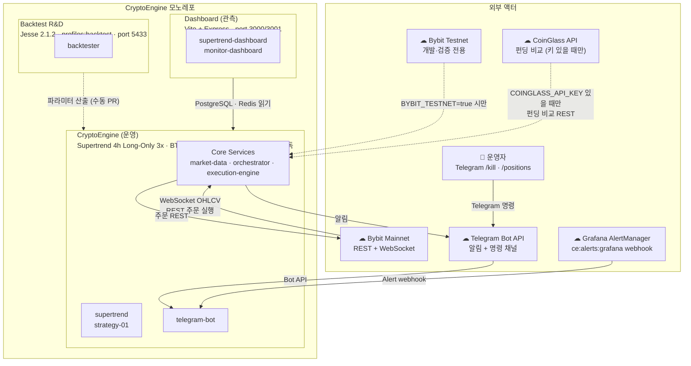

# L1 System Context

<!-- last-verified: 2026-08-29 -->
<!-- code-ref: cryptoengine/services/market-data/collector.py:37-38, cryptoengine/services/telegram-bot/main.py:20, backtest/docker/docker-compose.yml, dashboard/docker-compose.yml -->

> **Track-C 폐지 · 2026-08-29 운영 창**: Binance·OKX 수집기는 삭제. 같은 날 분기물 파이프라인·레거시 테이블 DROP·자격증명 fail-closed·git 히스토리 재작성은 [ADR-0010](90-adr/0010-ops-cleanup-20260829.md). Bybit 단독 + Supertrend 4h.

---

## 외부 시스템 요약

| 시스템 | 방향 | 프로토콜 | 비고 |
|---|---|---|---|
| Bybit Mainnet | 양방향 | WebSocket + REST | `BYBIT_TESTNET=false` (Phase 5) |
| Bybit Testnet | 양방향 | WebSocket + REST | `BYBIT_TESTNET=true` 시만 사용 |
| Telegram Bot API | 양방향 | HTTPS Long-poll | 알림 발송 + /kill · /positions 수신 |
| CoinGlass API | 인바운드 (선택) | REST | `COINGLASS_API_KEY` 없으면 비교 폴링 비활성. Track-C 삭제와 별개 |
| Grafana AlertManager | 인바운드 | HTTP webhook | `ce:alerts:grafana` 채널 경유 |

---

## 서브시스템 경계

| 서브시스템 | 역할 | 격리 수준 | 정보 흐름 |
|---|---|---|---|
| **CryptoEngine** (운영) | Phase 5 메인넷 BTC 선물 자동매매 | 운영 PG(5432) + Redis(6379) | Bybit ↔ 전략 ↔ Telegram |
| **Backtest** (R&D) | 전략 파라미터 검증 · Walk-Forward | 별도 PG(5433, jesse_db) · 별도 compose | 운영 data read-only 마운트(../../data:/data:ro) → 파라미터 수동 PR |
| **Dashboard** (관측) | 실시간 차트 · 모니터링 UI | 별도 compose · Node/Express | 운영 PG + Redis 읽기 전용 |

> Backtest → CryptoEngine 인터페이스는 `cryptoengine/config/strategies/supertrend.yaml` 파라미터 업데이트 PR (자동화 없음).
