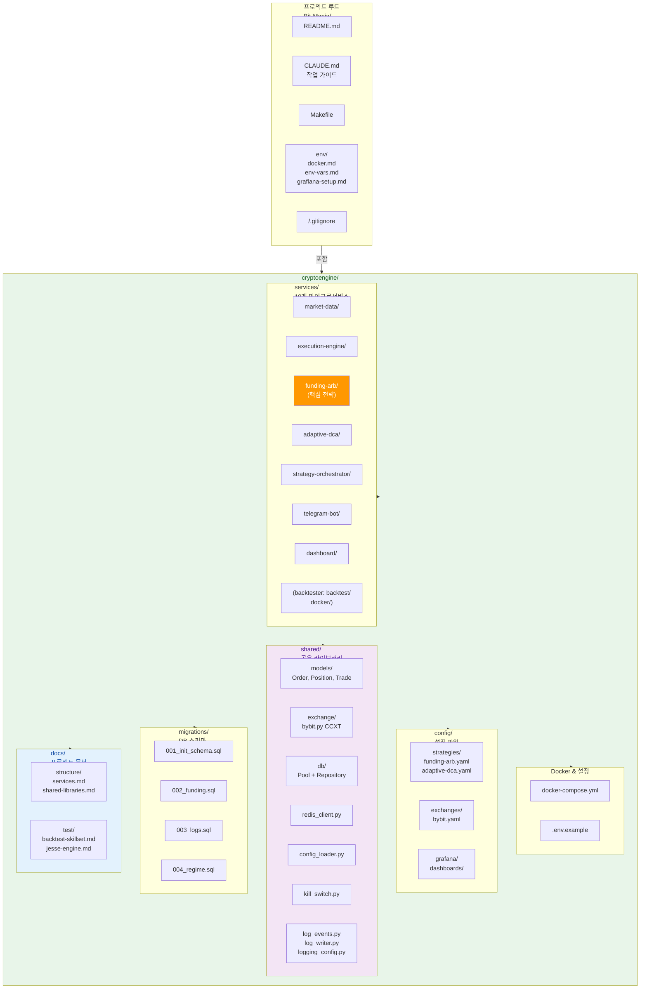

# 디렉토리 구조

CryptoEngine 전체 파일 레이아웃 및 설명.

## 전체 구조 개요



---

## 디렉토리 상세 구조

```
Bit-Mania/
├── README.md                           # 프로젝트 개요
├── CLAUDE.md                           # Claude Code 작업 가이드 (핵심 문서)
├── Makefile                            # 자주 쓰는 명령 (make emergency, make rebuild 등)
├── .env                                # 환경 변수 (git 제외, 로컬 설정)
├── .gitignore                          # git 무시 규칙
│
└── cryptoengine/                       # 메인 프로젝트
    ├── docker-compose.yml              # 19개 서비스 정의 (전체 스택)
    ├── .env.example                    # 환경 변수 템플릿
    │
    ├── config/                         # 설정 파일 (YAML)
    │   ├── strategies/
    │   │   ├── funding-arb.yaml        # 펀딩비 차익거래 전략 파라미터
    │   │   ├── funding_arb.yaml        # (복사본, 언더스코어 버전)
    │   │   ├── adaptive-dca.yaml       # DCA 전략 파라미터
    │   │   └── adaptive_dca.yaml       # (복사본)
    │   ├── orchestrator.yaml           # 자본 배분, 레짐 가중치, Kill Switch 임계값
    │   ├── exchanges/
    │   │   └── bybit.yaml              # Bybit 거래소 설정 (페어 정의)
    │   └── grafana/
    │       ├── PUBLIC_DASHBOARD_SETUP.md  # 공개 대시보드 설정 가이드
    │       └── dashboards/             # Grafana JSON 대시보드
    │
    ├── shared/                         # 모든 서비스 공유 라이브러리
    │   ├── __init__.py
    │   ├── models/                     # 도메인 모델
    │   │   ├── __init__.py
    │   │   ├── order.py                # Order 클래스
    │   │   ├── position.py             # Position 클래스
    │   │   ├── strategy.py             # Strategy 메타데이터
    │   │   ├── trade.py                # Trade 기록
    │   │   ├── funding_payment.py      # 펀딩비 정산
    │   │   └── ...
    │   ├── exchange/
    │   │   ├── __init__.py
    │   │   └── bybit.py                # Bybit CCXT 래퍼
    │   ├── db/
    │   │   ├── __init__.py
    │   │   ├── pool.py                 # asyncpg 연결 풀
    │   │   ├── migrations.py           # DB 마이그레이션 실행
    │   │   └── repositories/           # Repository 패턴 (CRUD)
    │   │       ├── __init__.py
    │   │       ├── trade_repository.py
    │   │       ├── position_repository.py
    │   │       ├── funding_payment_repository.py
    │   │       └── ...
    │   ├── redis_client.py             # Redis Pub/Sub 헬퍼 (싱글톤)
    │   ├── config_loader.py            # YAML 설정 로더 (절대경로 지원)
    │   ├── kill_switch.py              # Kill Switch 4계층 로직
    │   ├── log_events.py               # 이벤트 코드 정의 (95개)
    │   ├── log_writer.py               # 비동기 DB 로그 라이터 (큐 기반)
    │   ├── logging_config.py           # structlog 표준 설정 (KST)
    │   └── timezone_utils.py           # KST 타임존 유틸리티
    │
    ├── migrations/                     # 데이터베이스 마이그레이션
    │   ├── 001_init_schema.sql         # 초기 스키마 (trades, positions 등)
    │   ├── 002_add_funding_tables.sql  # 펀딩비 테이블 추가
    │   ├── 003_add_service_logs.sql    # service_logs 테이블
    │   └── 004_add_regime_tables.sql   # 시장 레짐 테이블
    │
    ├── docs/                           # 프로젝트 문서
    │   ├── EMERGENCY_MANUAL_CLOSE.md   # 비상 수동 청산 SOP (휴대폰 저장용)
    │   │
    │   ├── structure/                  # 코드 구조 문서
    │   │   ├── README.md
    │   │   ├── services.md             # 19개 마이크로서비스 개요
    │   │   ├── shared-libraries.md     # shared/ 모듈 상세
    │   │   └── directory-layout.md     # 이 파일
    │   │
    │   ├── env/                        # 환경 설정 문서
    │   │   ├── README.md
    │   │   ├── env-vars.md             # 환경 변수 목록
    │   │   ├── docker.md               # Docker Compose 사용 가이드
    │   │   ├── dependencies.md         # Python 의존성 설명
    │   │   └── grafana-setup.md        # Grafana 설정 가이드
    │   │
    │   ├── test/                       # 테스트 및 백테스트 문서
    │   │   ├── README.md
    │   │   ├── backtest-skillset.md    # 백테스트 스킬셋 규칙
    │   │   ├── jesse-engine.md         # Jesse 프레임워크 가이드
    │   │   ├── jesse-strategies.md     # Jesse 전략 목록
    │   │   ├── jesse-vs-self-engine.md # Jesse vs 자체 엔진 비교
    │   │   ├── live-postmortem-template.md # 라이브 거래 RCA 템플릿
    │   │   └── phase4-checklist.md     # Phase 4 완료 체크리스트
    │   │
    │   ├── ADR/                        # Architecture Decision Records
    │   │   ├── README.md               # ADR 개요 및 인덱스
    │   │   └── 001. BTC 단일 운영 정책_2026-05-01.md
    │   │
    │   └── archive/                    # 개발 이력 아카이브
    │       ├── CLAUDE_history.md       # Phase 0~4 개발 로그
    │       └── ...
    │
    ├── scripts/                        # 운영 스크립트
    │   ├── phase5_preflight.py         # Phase 5 진입 전 8개 항목 점검
    │   ├── switch_to_mainnet.py        # 메인넷 전환 (9단계, 이중 확인)
    │   ├── switch_to_testnet.py        # 테스트넷 롤백 (6단계, 백업 복원)
    │   ├── check_data_gaps.py          # 데이터 갭 검사
    │   ├── export_trades.py            # 거래 데이터 CSV 내보내기
    │   └── ...
    │
    └── services/                       # 마이크로서비스 (19개)
        │
        ├── market-data/                # 시장 데이터 수집, 레짐 감지
        │   ├── Dockerfile
        │   ├── main.py                 # 메인 루프
        │   ├── collector.py            # WebSocket 데이터 수집
        │   ├── funding_monitor.py      # 펀딩비 모니터링
        │   ├── regime_detector.py      # 시장 레짐 감지 (trending/ranging/volatile)
        │   ├── feature_engine.py       # 기술적 지표 계산
        │   └── requirements.txt
        │
        ├── execution/                  # 주문 실행, 포지션 추적
        │   ├── Dockerfile
        │   ├── main.py                 # 주문 실행 루프
        │   ├── position_tracker.py     # 포지션 상태 추적
        │   ├── stoploss_manager.py     # 거래소 손절매 설정
        │   ├── margin_monitor.py       # 마진 모니터링
        │   └── requirements.txt
        │
        ├── strategies/                 # 전략 로직
        │   ├── base_strategy.py        # BaseStrategy ABC (모든 전략 상속)
        │   │
        │   ├── funding-arb/            # 펀딩비 차익거래 (핵심 전략)
        │   │   ├── Dockerfile
        │   │   ├── main.py             # 전략 로직
        │   │   ├── state_manager.py    # Redis 상태 저장/복구
        │   │   └── requirements.txt
        │   │
        │   └── adaptive-dca/           # Fear & Greed DCA (보조 전략)
        │       ├── Dockerfile
        │       ├── main.py
        │       └── requirements.txt
        │
        ├── orchestrator/               # 자본 배분, Kill Switch 조율
        │   ├── Dockerfile
        │   ├── main.py                 # 조율 루프
        │   ├── capital_allocator.py    # 레짐 기반 자본 배분
        │   └── requirements.txt
        │
        │   # jesse_engine/ → backtest/ 트리로 이전됨
        │   # backtest/docker/Dockerfile, backtest/strategies/, backtest/scripts/ 참조
        │   │   ├── download_binance_vision.py # OHLCV 데이터 다운로드
        │   │   ├── fetch_coinalyze_funding.py # 펀딩비 데이터 다운로드
        │   │   └── ...
        │   │
        │   └── requirements.txt
        │
        ├── strategy-orchestrator/      # 전략 조율
        │   ├── Dockerfile
        │   ├── main.py
        │   └── requirements.txt
        │
        ├── telegram-bot/               # Telegram 알림 + 비상 명령
        │   ├── Dockerfile
        │   ├── main.py                 # 봇 메인 루프
        │   ├── alert_dispatcher.py     # 8개 알림 유형 발송
        │   ├── command_handler.py      # 비상 명령 처리 (/emergency_close 등)
        │   └── requirements.txt
        │
        ├── dashboard/                  # 웹 대시보드
        │   ├── Dockerfile
        │   ├── app.py                  # Flask/FastAPI 메인
        │   ├── templates/              # HTML 템플릿
        │   └── requirements.txt
        │
        ├── log-retention/              # 로그 보존 정책 (매일 03:00 KST)
        │   ├── Dockerfile
        │   ├── main.py                 # 보존 정책 실행
        │   └── requirements.txt
        │
        ├── wf-scheduler/               # Walk-Forward 월간 자동 실행 (매월 1일 02:00 KST)
        │   ├── Dockerfile
        │   ├── main.py
        │   └── requirements.txt
        │
        ├── llm-advisor/                # Claude Code 시장 분석
        │   ├── Dockerfile
        │   ├── main.py
        │   └── requirements.txt
        │
        └── [DB 서비스]
            ├── postgres                # PostgreSQL 13 (포트 5432)
            ├── redis                   # Redis 7 (포트 6379)
            └── grafana                 # Grafana (포트 3002)
```

---

## 주요 파일 설명

### cryptoengine/docker-compose.yml
전체 19개 서비스 정의:
1. postgres — 데이터 저장소
2. redis — 메시지 큐 + 캐시
3. grafana — 모니터링 대시보드
4. market-data — 시장 데이터 수집
5. execution-engine — 주문 실행
6. funding-arb — 펀딩비 차익거래
7. adaptive-dca — DCA 전략
8. strategy-orchestrator — 자본 배분
9. telegram-bot — 알림
10. dashboard — 웹 대시보드
11-18. 기타 서비스 (log-retention, wf-scheduler 등)
(backtester는 backtest/docker/docker-compose.yml로 분리)

**빌드 컨텍스트**: 프로젝트 루트 (`.`)
- Dockerfile 내 COPY는 반드시 `cryptoengine/` 기준

### cryptoengine/.env
민감한 설정 (git 제외):
```bash
BYBIT_API_KEY=...
BYBIT_SECRET_KEY=...
BYBIT_TESTNET=true

DB_PASSWORD=***REMOVED***

TELEGRAM_BOT_TOKEN=...
TELEGRAM_CHAT_ID=...

GRAFANA_PASSWORD=***REMOVED***

# Phase 5 (메인넷 진입 시)
EXPECTED_INITIAL_BALANCE_USD=200
STRICT_MONITORING_HOURS=24
PHASE5_MODE=true
```

### cryptoengine/config/

#### strategies/funding-arb.yaml
펀딩비 차익거래 전략 파라미터:
```yaml
pairs: [BTCUSDT]           # BTC 단일 운영
leverage: 5                 # 5배 레버리지
max_position_hours: 168     # 최대 보유 7일
min_funding_rate: 0.0001    # 최소 진입 펀딩비
consecutive_intervals: 3    # 연속 3회 양수 펀딩비
basis_divergence_threshold: 0.005  # 기저 0.5% 이상 차이
```

#### strategies/adaptive-dca.yaml
DCA 전략 파라미터:
```yaml
pairs: [BTCUSDT]
fear_greed_threshold: 30    # 30 이하일 때만 매수
allocation: 0.2             # 자본의 20% 배분
```

#### orchestrator.yaml
자본 배분 및 Kill Switch:
```yaml
regimes:
  trending:
    funding_arb: 0.8
    adaptive_dca: 0.2
  ranging:
    funding_arb: 0.6
    adaptive_dca: 0.4
  volatile:
    funding_arb: 0.4
    adaptive_dca: 0.6

kill_switch:
  daily_loss_percent: -5
  max_drawdown_percent: -10
  margin_ratio_threshold: 1.5
```

### cryptoengine/shared/

모든 서비스가 `from shared.xxx import yyy` 방식으로 사용:
- **models/** — Order, Position, Trade, FundingPayment 클래스
- **exchange/** — Bybit CCXT 래퍼
- **db/** — 데이터베이스 연결 풀 + Repository 패턴
- **redis_client.py** — Pub/Sub 헬퍼
- **config_loader.py** — YAML 로더
- **kill_switch.py** — 4계층 안전장치
- **log_events.py** — 95개 이벤트 코드
- **log_writer.py** — 비동기 로깅
- **logging_config.py** — structlog 설정
- **timezone_utils.py** — KST 타임존

### cryptoengine/migrations/

DB 스키마:
| 파일 | 내용 | 테이블 |
|-----|------|--------|
| 001_init_schema.sql | 초기 구조 | trades, positions, funding_rate_history, ohlcv_history, portfolio_snapshots, daily_reports, kill_switch_events, strategy_states, llm_judgments |
| 002_add_funding_tables.sql | 펀딩비 확장 | funding_payments |
| 003_add_service_logs.sql | 로깅 | service_logs (95개 이벤트) |
| 004_add_regime_tables.sql | 레짐 분석 | regime_raw_log, regime_transitions |

---

## 데이터베이스 테이블 (PostgreSQL)

### 거래 & 포지션
- **trades** — 모든 체결 기록 (entry_ts, exit_ts, entry_price, exit_price, pnl, fee)
- **positions** — 현재/과거 포지션 (open_ts, close_ts, size, status, close_reason)
- **funding_payments** — 펀딩비 정산 (timestamp, amount_usd, direction)

### 시장 데이터
- **funding_rate_history** — 펀딩비 히스토리 (timestamp, rate, symbol)
- **ohlcv_history** — OHLCV 캔들 (timestamp, open, high, low, close, volume, timeframe)
- **regime_raw_log** — 5분마다 레짐 감지 결과 (timestamp, regime, confidence)
- **regime_transitions** — 확정 레짐 전환 (timestamp, from_regime, to_regime, reason)

### 포트폴리오 & 보고서
- **portfolio_snapshots** — 시간별 포트폴리오 스냅샷 (timestamp, total_equity, cash, position_value)
- **daily_reports** — 일별 수익 & 지표 (date, pnl_usd, pnl_percent, sharpe, max_dd)

### 안전 & 상태
- **kill_switch_events** — Kill Switch 발동 이력 (timestamp, reason, pnl_at_trigger, action)
- **strategy_states** — 전략 상태 스냅샷 (timestamp, strategy_id, allocated_capital, current_pnl, trades_count)
- **llm_judgments** — LLM 분석 결과 (timestamp, market_outlook, risk_level, recommendation)
- **service_logs** — 모든 서비스 구조화 로그 (timestamp, service, event_code, level, message, metadata)

---

## 자주 쓰는 명령

### Docker 명령
```bash
# 전체 스택 기동
docker compose up -d

# 인프라만 기동 (DB, Redis, Grafana)
docker compose up -d postgres redis grafana

# 특정 서비스 재빌드
docker compose up -d --build --no-deps funding-arb

# 로그 확인
docker compose logs -f funding-arb
docker compose logs --tail=100 market-data

# DB 접속
docker compose exec postgres psql -U cryptoengine -d cryptoengine

# 비상 정지 (Kill Switch 발동)
make emergency
```

### shared/ 수정 시
```bash
# 모든 서비스 재빌드 (순서 중요)
docker compose build market-data execution-engine funding-arb strategy-orchestrator telegram-bot
docker compose up -d --no-deps market-data execution-engine funding-arb strategy-orchestrator telegram-bot
```

### 백테스트
```bash
# Jesse 백테스트 실행
docker compose -f backtest/docker/docker-compose.yml --profile backtest run --rm backtester \
  python scripts/shell/run_full_validation.sh IntradaySeasonality

# 이미지 재빌드 후 실행
docker compose -f backtest/docker/docker-compose.yml --profile backtest build --no-cache backtester && \
docker compose -f backtest/docker/docker-compose.yml --profile backtest run --rm backtester \
  python scripts/<script>.py
```

---

**최종 수정**: 2026-05-01
