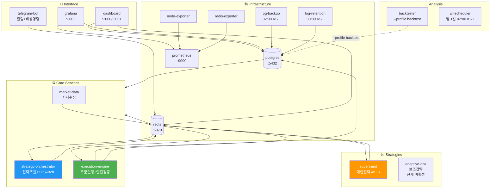
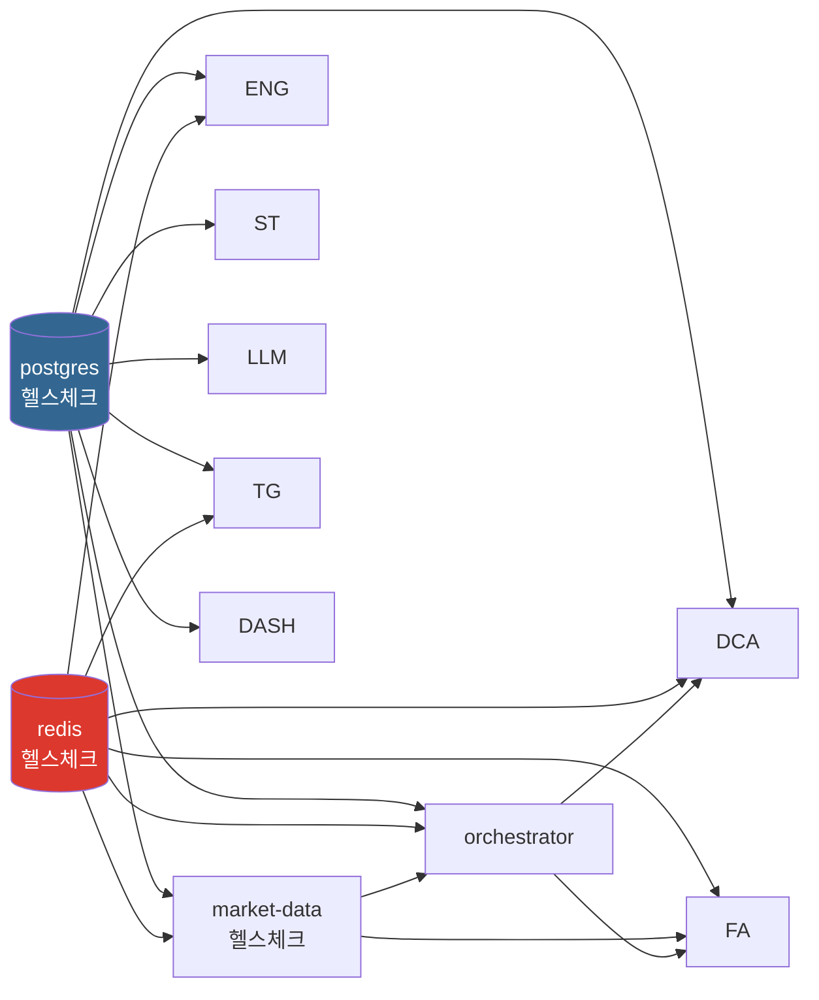
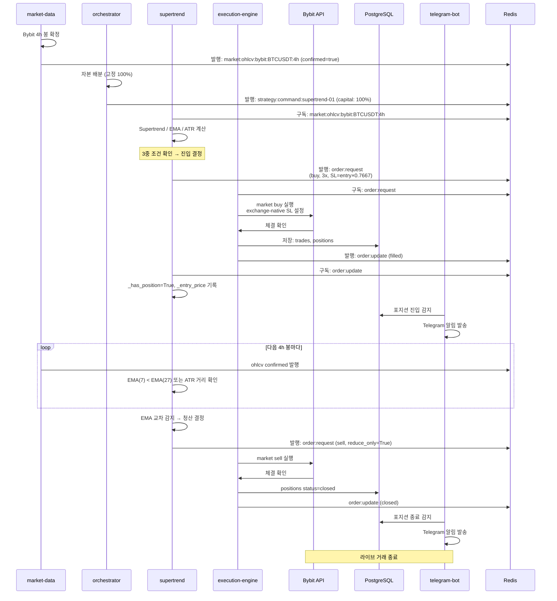

# 마이크로서비스 아키텍처

19개 마이크로서비스로 구성된 완전 분산 시스템.

## 서비스 목록



### 1. Infrastructure Services (인프라)

#### PostgreSQL Database
- **역할**: 모든 거래, 포지션, 로그, 대시보드 데이터 저장
- **이미지**: postgres:15
- **포트**: 5432
- **주요 테이블**: trades, positions, funding_payments, service_logs 등 (13개)
- **초기화**: migration 001~004 자동 실행

#### Redis
- **역할**: Pub/Sub 메시징, 전략 상태 캐시, 세션 저장
- **이미지**: redis:7
- **포트**: 6379
- **채널**: market:ohlcv:bybit:BTCUSDT:4h, strategy:command:{id}, order:request, order:update, kill_switch
- **TTL**: 전략 상태 1시간 (배포 중 포지션 유지)

#### ~~Grafana~~ (제거됨 2026-05-18)
Grafana 컨테이너가 제거되었습니다. 모니터링 기능은 dashboard 서비스(:3000)로 완전 흡수됩니다.

---

### 2. Market Data & Monitoring

#### market-data
- **역할**: Bybit WebSocket 실시간 펀딩비/OHLCV 수집
- **언어**: Python 3.12
- **입력**: Bybit WebSocket (BTCUSDT)
- **출력**: Redis channels
  - `market:ohlcv:bybit:BTCUSDT:4h` — 4h 봉 확정 시 발행 (confirmed=true)
- **핵심 파일**: collector.py, funding_monitor.py


---

### 3. Strategy Execution

#### supertrend (메인 전략, Phase 5 활성)
- **역할**: Supertrend 4h 추세추종, Long-only 3x 레버리지
- **언어**: Python 3.12
- **입력**:
  - Redis `market:ohlcv:bybit:BTCUSDT:4h` (4h 확정 봉, confirmed=true)
  - Redis `strategy:command:supertrend-01` (자본 배분)
- **출력**: Redis `order:request` (주문 요청)
- **파라미터**: `config/strategies/supertrend.yaml`
  - st_factor: 2.6, st_period: 9
  - fast_ema: 7, slow_ema: 29, dir_ema: 240, atr_mult: 3.3
  - leverage: 3, symbol: BTC/USDT:USDT
- **진입/청산**: 4h 봉 마감 시만 신호 계산; EMA 교차 또는 ATR 거리 초과 시 청산
- **안전장치**: 진입 시 exchange-native SL (entry × 0.7667), Kill Switch 4계층
- **STRATEGY_ID**: supertrend-01
- **배포**: service_shutdown 시 포지션 보존 (Redis 복구)

#### adaptive-dca (보조 전략, 비활성)
- **상태**: ⚠️ 현재 비활성 (orchestrator.yaml weight=0.0)
- **역할**: Fear & Greed 지수 기반 적응형 평균단가 하락 매수
- **언어**: Python 3.12
- **참고**: 재활성화 검토 중

#### strategy-orchestrator
- **역할**: 고정 전략 할당 (Supertrend 100%), Kill Switch 조율
- **언어**: Python 3.12
- **입력**:
  - PostgreSQL positions, portfolio_snapshots
- **출력**:
  - Redis `strategy:command:{id}`
  - Redis `kill_switch` (긴급 청산 신호)
- **할당**: 고정 비율 (Supertrend 100%, Cash 0%)

---

### 4. Order Execution & Risk Management

#### execution-engine
- **역할**: 주문 실행, 포지션 추적, 마진 관리, Kill Switch 집행
- **언어**: Python 3.12
- **입력**:
  - Redis `order:request` (전략에서 주문 요청)
  - Bybit REST API (체결 확인, 마진 조회)
- **출력**:
  - Redis `order:update` (체결 알림)
  - Redis `kill_switch` 수신 (긴급 청산)
  - PostgreSQL trades, positions 업데이트
- **핵심 파일**:
  - main.py — 주문 실행 루프
  - position_tracker.py — 포지션 상태 추적
  - stoploss_manager.py — 거래소 손절매 설정

---

### 5. Backtesting & Walk-Forward Analysis

#### backtester
- **역할**: Jesse 프레임워크 기반 백테스트, Walk-Forward 분석
- **언어**: Python 3.12
- **이미지**: 프로파일 기반 (`backtest` 프로파일), `backtest/docker/Dockerfile`
- **주요 스크립트**:
  - scripts/shell/run_full_validation.sh — 전체 검증 (WF + MC + Sanity)
  - strategies/sanity_check.py — BTC Buy-and-Hold 검증용
  - strategies/intraday_seasonality.py — 일중 시즈널리티
  - strategies/macro_event.py — FOMC/CPI 이벤트 트레이딩
  - strategies/contrarian_sentiment.py — Fear & Greed 기반
- **출력**: backtest/results/ (Parquet 결과), backtest/dashboards/ (HTML 대시보드)
- **실행**: `docker compose -f backtest/docker/docker-compose.yml --profile backtest run --rm backtester python scripts/<script>.py`

#### wf-scheduler
- **역할**: 월간 Walk-Forward 분석 자동 실행
- **언어**: Python 3.12
- **일정**: 매월 1일 02:00 KST
- **입력**: PostgreSQL OHLCV, funding_rates
- **출력**: PostgreSQL wf_results, 메일 알림

---

### 6. Monitoring & Alerts

#### telegram-bot
- **역할**: 실시간 알림 (Kill Switch, 포지션 진입/청산), 비상 명령
- **언어**: Python 3.12
- **입력**: 
  - PostgreSQL service_logs, trades, kill_switch_events
  - Redis 구독
- **출력**: Telegram 메시지
- **기능**:
  - AlertDispatcher — 8개 알림 유형
  - 비상 명령: `/emergency_close`, `/stop_all_strategies`
  - ACK 확인: Kill Switch 발동 시 사용자 확인 요청

#### dashboard
- **내부 대시보드** (포트 3000): 전략 예상/실제 비교, 시스템 모니터링 (Grafana 대체)
  - `/supertrend` — Supertrend 4h 예상(백테스트) vs 실제(메인넷) 거래 비교
  - `/monitor` — 자산 곡선, Kill Switch, 포지션, 서비스 상태, 인프라 메트릭
  - `GET /api/internal/supertrend/*` — 예상/실제/비교/자산/상태/캔들 API
  - `GET /api/internal/monitor/*` — 포트폴리오/킬스위치/포지션/서비스/인프라 API
  - `alertEvaluator` — Grafana 9개 알림 규칙 포팅, Redis `ce:alerts:grafana` 발행 (60s 주기)
- **공개 대시보드** (포트 3001): 공개 가능한 성과 지표만 노출
  - Cumulative PnL %, Win Rate, Total Trades, Avg Duration, Sharpe Ratio
  - Strategy Breakdown, Daily PnL, Funding Payments

---

### 7. Log & Data Management

#### log-retention
- **역할**: 데이터 보존 정책 자동 실행
- **언어**: Python 3.12
- **일정**: 매일 03:00 KST
- **작업**:
  - service_logs: 90일 이상 보존 (자동 삭제)
  - ohlcv_history: 타임프레임별 자동 삭제 (1d: 2년, 4h: 1년, 1h: 3개월)
  - 인덱스 정리, VACUUM 실행

#### ES (Elasticsearch, 선택)
- **역할**: 고성능 로그 인덱싱 (대규모 배포용)
- **상태**: docker-compose 기본 포함, 비활성

---

## Redis Pub/Sub 채널

```
market:ohlcv:bybit:BTCUSDT:4h
  ├─ Publisher: market-data
  ├─ Subscribers: supertrend (confirmed=true 봉만 처리)
  └─ Content: { "open": 95000, "high": 96000, "low": 94000, "close": 95500,
               "volume": 1234.5, "ts": 1716048000000, "confirmed": true }

strategy:command:supertrend-01
  ├─ Publisher: strategy-orchestrator
  ├─ Subscriber: supertrend
  └─ Content: { "action": "start|stop|rebalance", "capital": 60.0, "ts": "..." }

strategy:status:supertrend-01
  ├─ Publisher: supertrend (heartbeat, TTL 300s)
  ├─ Subscriber: strategy-orchestrator (watchdog)
  └─ Content: { "strategy_id": "supertrend-01", "is_running": true, ... }

order:request
  ├─ Publishers: supertrend, adaptive-dca
  ├─ Subscriber: execution-engine
  └─ Content: { "symbol": "BTC/USDT:USDT", "side": "buy|sell", "quantity": 0.003,
               "reduce_only": false, "stop_loss": 94000.0, ... }

order:update
  ├─ Publisher: execution-engine
  ├─ Subscribers: supertrend, adaptive-dca, strategy-orchestrator
  └─ Content: { "status": "filled|canceled", "trade_id": "...", "pnl": 50, ... }

kill_switch
  ├─ Publisher: strategy-orchestrator
  ├─ Subscribers: execution-engine, telegram-bot
  └─ Content: { "reason": "daily_loss|max_drawdown|volatility", ... }
```

---

## 서비스 시작 순서 및 의존성



---

## 리소스 제한 (docker-compose.yml deploy.resources)

| Service | CPU Limit | Memory Limit | Memory Reserve | 설명 |
|---------|-----------|--------------|----------------|------|
| **postgres** | 1.0 | 512M | 256M | 데이터 저장소 (최우선) |
| **redis** | 0.5 | 320M | 128M | 메시지 큐 + 캐시 |
| ~~grafana~~ | — | — | — | 제거됨 (dashboard로 흡수) |
| **market-data** | 0.5 | 256M | 64M | WebSocket 수집 |
| **execution-engine** | 0.5 | 256M | 64M | 주문 실행 |
| **supertrend** | 0.5 | 256M | 64M | 메인 전략 (4h 추세추종) |
| **strategy-orchestrator** | 0.5 | 256M | 64M | 자본 배분 |
| **adaptive-dca** | 0.3 | 128M | 32M | 보조 전략 |
| **telegram-bot** | 0.2 | 128M | 32M | 알림 (경량) |
| **dashboard** | 0.5 | 256M | 64M | 웹 대시보드 |
| **llm-advisor** | 1.0 | 512M | 128M | Claude API 호출 |
| **wf-scheduler** | 1.0 | 512M | 128M | 월간 Walk-Forward |
| **backtester** | 2.0 | 1G | N/A | 백테스트 (고집약) |
| **pg-backup** | 0.5 | 128M | N/A | DB 백업 |
| **log-retention** | 0.2 | 64M | N/A | 로그 정리 |
| **node-exporter** | 0.1 | 64M | N/A | 시스템 메트릭 |
| **prometheus** | 0.5 | 512M | 128M | 메트릭 저장 (선택) |
| **redis-exporter** | 0.1 | 64M | N/A | Redis 메트릭 |

**정책**:
- **Limits**: 최대 사용 가능 리소스 (초과 시 OOM Kill)
- **Reservations**: 보장된 최소 리소스 (스케줄링 기준)
- **Database/Cache 우선**: postgres (1.0 CPU), redis (0.5 CPU)
- **전략 서비스**: 각 0.5 CPU, 256M (동시 실행 가능)
- **Heavy Batch**: backtester (2.0 CPU, 1G) — `--profile backtest`로 선택적 실행

---

## 의존성 그래프 (docker-compose depends_on)

```
PostgreSQL (5432)
  ←─ (data persistence)
  ├─ execution-engine (trades, positions 저장)
  ├─ market-data (funding_rate_history)
  ├─ strategy-orchestrator (daily_reports, strategy_states)
  ├─ telegram-bot (service_logs 읽기)
  ├─ dashboard (모든 테이블 읽기)
  ├─ backtester (OHLCV 임포트, backtest-postgres 별도)
  └─ wf-scheduler (WF 결과 저장)

Redis (6379)
  ←─ (pub/sub messaging + state cache)
  ├─ market-data (ohlcv 발행)
  ├─ strategy-orchestrator (명령 발행, kill_switch 발행)
  ├─ execution-engine (order 구독)
  ├─ supertrend (ohlcv:4h confirmed 구독, order 발행)
  ├─ adaptive-dca (command 구독, order 발행)
  └─ telegram-bot (kill_switch 구독, alerts 발행)

Bybit API
  ←─ (market data + order execution)
  ├─ market-data (OHLCV 수집)
  ├─ execution-engine (주문 실행, 포지션 조회)
  └─ supertrend (초기화 시 레버리지 설정, 백필)

Dashboard (3000/3001)
  ←─ (visualization — Grafana 대체)
  ├─ PostgreSQL (supertrend_signals, orders, portfolio_snapshots 등 쿼리)
  ├─ Redis (strategy status, positions, ce:alerts:grafana 발행)
  ├─ prometheus (HTTP API — 인프라 메트릭 CPU/mem/disk/Redis)
```

### docker-compose depends_on 순서

```yaml
# 1단계: 인프라 (healthcheck 대기)
postgres (service_healthy)
redis (service_healthy)

# 2단계: 핵심 서비스 (postgres/redis 이후)
market-data (postgres, redis 필수)
execution-engine (postgres, redis 필수)
strategy-orchestrator (postgres, redis 필수)
telegram-bot (postgres 필수)

# 3단계: 전략 (orchestrator 이후)
supertrend (market-data, redis 필수)
adaptive-dca (market-data, redis 필수)

# 4단계: 보조 서비스 (독립적)
dashboard (postgres, redis 옵션)

# 5단계: 배치/스케줄 (필요 시만)
backtester (--profile backtest, backtest/docker/docker-compose.yml)
wf-scheduler (postgres 필수)
llm-advisor (postgres, redis, API)

# 6단계: 관리 (필요 시만)
pg-backup (postgres 필수)
log-retention (postgres 필수)
```

---

## 서비스 간 체결 흐름

### 진입 시나리오 (supertrend 예)

```
1. market-data
   → Bybit WebSocket에서 4h OHLCV 수집
   → 4h 봉 확정 시 Redis `market:ohlcv:bybit:BTCUSDT:4h` 발행 (confirmed=true)

2. strategy-orchestrator
   → 고정 자본 배분 결정 (supertrend 100%)
   → Redis `strategy:command:supertrend-01` 발행

3. supertrend
   → `market:ohlcv:bybit:BTCUSDT:4h` 구독 (confirmed=true 봉만 처리)
   → 300봉 버퍼에서 Supertrend / EMA(7/27/230) / ATR(14) 계산
   → 진입 조건 확인: ST 상승 AND fast EMA > slow EMA AND price > dir EMA
   → 진입 주문 생성 (LONG, 3x, stop_loss = entry × 0.7667)
   → Redis `order:request` 발행

4. execution-engine
   → `order:request` 구독
   → Bybit API로 market buy 실행
   → 체결 확인, exchange-native SL 설정 (entry × 0.7667)
   → PostgreSQL `trades` / `positions` 저장
   → Redis `order:update` 발행 (filled)

5. supertrend
   → `order:update` 구독
   → 포지션 상태 업데이트 (_has_position, _entry_price)
```

### 청산 시나리오 (EMA 교차 / ATR 거리)

```
1. supertrend
   → 다음 confirmed 4h 봉 수신
   → EMA(7) < EMA(27) 감지 (추세 반전)
   → 청산 주문 발행: sell, reduce_only=True
   → Redis `order:request` 발행

2. execution-engine
   → 청산 주문 실행
   → PostgreSQL `positions` status = closed
   → Redis `order:update` (closed)

3. telegram-bot
   → PostgreSQL positions 변경 구독
   → "포지션 청산: ema_cross (PnL +$50)" 메시지 발송
```

### Supertrend 4h 진입 ~ 청산 흐름



---

## Phase별 서비스 활성화

### Phase 5 (메인넷, 현재 운영 중 — 2026-05-18~)
- **활성**: postgres, redis, market-data, execution-engine, supertrend,
  strategy-orchestrator, telegram-bot, log-retention (cryptoengine 스택);
  dashboard (standalone: `cd dashboard && docker compose up -d`)
  (backtester: backtest/docker/docker-compose.yml --profile backtest 별도 실행)
- **비활성**: adaptive-dca (weight=0.0), wf-scheduler (제거됨)
- **메인넷**: `BYBIT_TESTNET=false`
- **Phase 5 설정**:
  - `PHASE5_MODE=true` (절대값 Kill Switch 활성화)
  - `EXPECTED_INITIAL_BALANCE_USD=200` (초기 잔고 검증)
  - `STOP_LOSS_PCT=0.2333` (entry × 0.7667 catastrophic backstop)
  - `STOP_LOSS_MODE=per_trade` (per-strategy SL)

---

**최종 수정**: 2026-05-18
