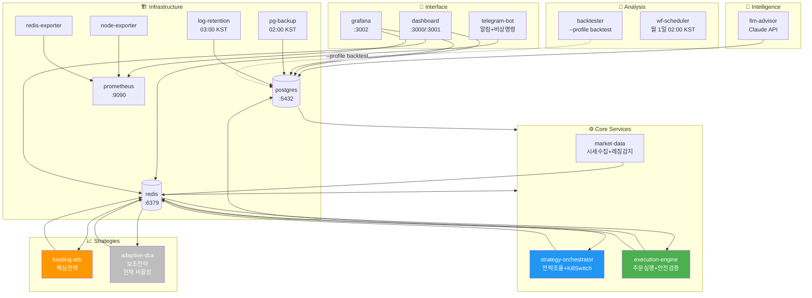
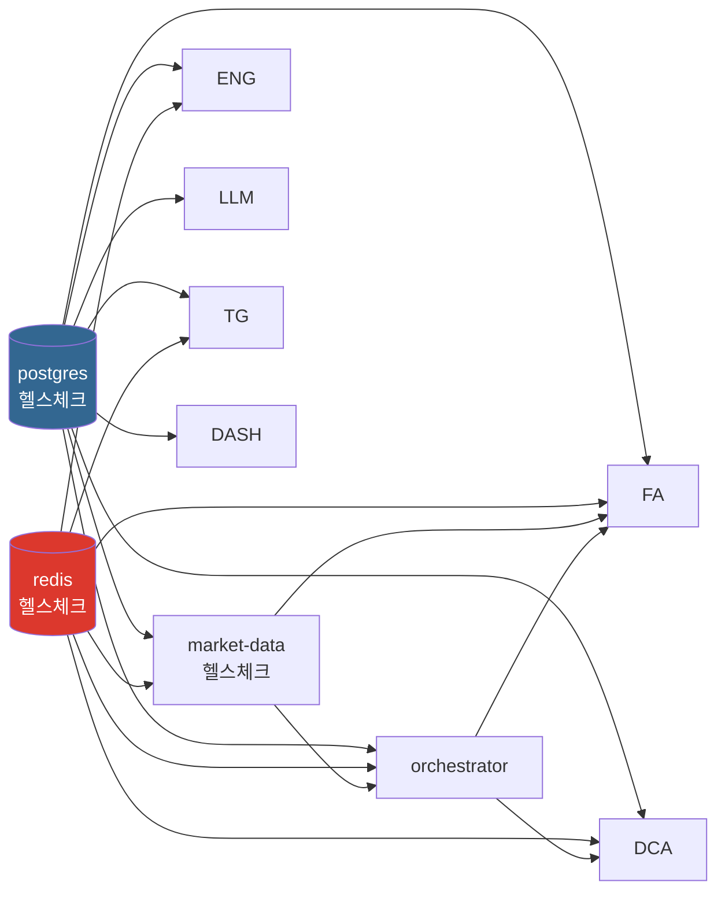
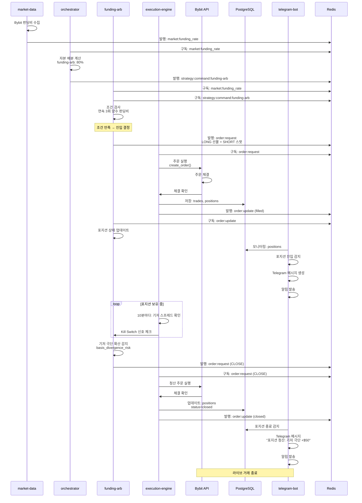

# 마이크로서비스 아키텍처

19개 마이크로서비스로 구성된 완전 분산 시스템.

## 서비스 목록



### 1. Infrastructure Services (인프라)

#### PostgreSQL Database
- **역할**: 모든 거래, 포지션, 로그, 대시보드 데이터 저장
- **이미지**: postgres:15
- **포트**: 5432
- **주요 테이블**: trades, positions, funding_payments, service_logs 등 (13개)
- **초기화**: migration 001~004 자동 실행

#### Redis
- **역할**: Pub/Sub 메시징, 전략 상태 캐시, 세션 저장
- **이미지**: redis:7
- **포트**: 6379
- **채널**: market:funding_rate, market:regime, strategy:command:{id}, order:request, order:update, kill_switch
- **TTL**: 전략 상태 1시간 (배포 중 포지션 유지)

#### Grafana
- **역할**: 실시간 모니터링 대시보드 (내부 3000, 공개 3001)
- **이미지**: grafana/grafana:latest
- **포트**: 3002
- **로그인**: admin / ***REMOVED***
- **기능**: Live Performance, Strategy Monitor, Market Regime, Public Performance Dashboard

---

### 2. Market Data & Monitoring

#### market-data
- **역할**: Bybit WebSocket 실시간 펀딩비/OHLCV 수집, 시장 레짐 감지
- **언어**: Python 3.12
- **입력**: Bybit WebSocket (BTCUSDT)
- **출력**: Redis channels
  - `market:funding_rate` — 8시간마다 펀딩비 업데이트
  - `market:regime` — trending/ranging/volatile 분류
- **핵심 파일**: collector.py, funding_monitor.py, regime_detector.py

#### llm-advisor
- **역할**: Claude Code 기반 시장 분석, AI 판단 저장
- **언어**: Python 3.12
- **입력**: 현재 시장 상태, 포지션 정보
- **출력**: PostgreSQL `llm_judgments` 테이블
- **빈도**: 설정 가능 (기본 4시간마다)

---

### 3. Strategy Execution

#### funding-arb (핵심 전략)
- **역할**: 펀딩비 차익거래, 델타 뉴트럴 포지션 관리
- **언어**: Python 3.12
- **입력**: 
  - Redis `market:funding_rate` (펀딩비)
  - Redis `strategy:command:{id}` (자본 배분)
- **출력**: Redis `order:request` (주문 요청)
- **파라미터**: config/strategies/funding-arb.yaml
  - pairs: [BTCUSDT] (BTC 단일 운영)
  - min_funding_rate: 0.0001
  - max_position_hours: 168
- **안전장치**: Kill Switch 4계층, 기저 스프레드 모니터링
- **배포**: service_shutdown 시 포지션 Redis에 저장 → 재시작 후 자동 복구 (TTL 1시간)

#### adaptive-dca (보조 전략)
- **역할**: Fear & Greed 지수 기반 적응형 평균단가 하락 매수
- **언어**: Python 3.12
- **입력**: 
  - Redis `market:regime`
  - Redis `strategy:command:{id}` (자본 배분)
- **출력**: Redis `order:request`
- **파라미터**: config/strategies/adaptive-dca.yaml
  - pairs: [BTCUSDT]
  - allocation: 20% of total capital

#### strategy-orchestrator
- **역할**: 두 전략 간 자본 배분, 레짐 기반 가중치 조정, Kill Switch 조율
- **언어**: Python 3.12
- **입력**:
  - Redis `market:regime`
  - PostgreSQL positions, portfolio_snapshots
- **출력**:
  - Redis `strategy:command:{id}`
  - Redis `kill_switch` (긴급 청산 신호)
- **파라미터**: config/orchestrator.yaml
  - trending: {funding-arb: 80%, adaptive-dca: 20%}
  - ranging: {funding-arb: 60%, adaptive-dca: 40%}
  - volatile: {funding-arb: 40%, adaptive-dca: 60%}

---

### 4. Order Execution & Risk Management

#### execution-engine
- **역할**: 주문 실행, 포지션 추적, 마진 관리, Kill Switch 집행
- **언어**: Python 3.12
- **입력**:
  - Redis `order:request` (전략에서 주문 요청)
  - Bybit REST API (체결 확인, 마진 조회)
- **출력**:
  - Redis `order:update` (체결 알림)
  - Redis `kill_switch` 수신 (긴급 청산)
  - PostgreSQL trades, positions 업데이트
- **핵심 파일**:
  - main.py — 주문 실행 루프
  - position_tracker.py — 포지션 상태 추적
  - stoploss_manager.py — 거래소 손절매 설정

---

### 5. Backtesting & Walk-Forward Analysis

#### backtester
- **역할**: Jesse 프레임워크 기반 백테스트, Walk-Forward 분석
- **언어**: Python 3.12
- **이미지**: 프로파일 기반 (`backtest` 프로파일), `backtest/docker/Dockerfile`
- **주요 스크립트**:
  - scripts/shell/run_full_validation.sh — 전체 검증 (WF + MC + Sanity)
  - strategies/sanity_check.py — BTC Buy-and-Hold 검증용
  - strategies/intraday_seasonality.py — 일중 시즈널리티
  - strategies/macro_event.py — FOMC/CPI 이벤트 트레이딩
  - strategies/contrarian_sentiment.py — Fear & Greed 기반
- **출력**: backtest/results/ (Parquet 결과), backtest/dashboards/ (HTML 대시보드)
- **실행**: `docker compose -f backtest/docker/docker-compose.yml --profile backtest run --rm backtester python scripts/<script>.py`

#### wf-scheduler
- **역할**: 월간 Walk-Forward 분석 자동 실행
- **언어**: Python 3.12
- **일정**: 매월 1일 02:00 KST
- **입력**: PostgreSQL OHLCV, funding_rates
- **출력**: PostgreSQL wf_results, 메일 알림

---

### 6. Monitoring & Alerts

#### telegram-bot
- **역할**: 실시간 알림 (Kill Switch, 포지션 진입/청산, 시장 레짐 변화), 비상 명령
- **언어**: Python 3.12
- **입력**: 
  - PostgreSQL service_logs, trades, kill_switch_events
  - Redis 구독
- **출력**: Telegram 메시지
- **기능**:
  - AlertDispatcher — 8개 알림 유형
  - 비상 명령: `/emergency_close`, `/stop_all_strategies`
  - ACK 확인: Kill Switch 발동 시 사용자 확인 요청

#### dashboard
- **내부 대시보드** (포트 3000): 모든 시스템 상태 (개발자용)
- **공개 대시보드** (포트 3001): 공개 가능한 성과 지표만 노출
  - Cumulative PnL %, Win Rate, Total Trades, Avg Duration, Sharpe Ratio
  - Strategy Breakdown, Daily PnL, Funding Payments

---

### 7. Log & Data Management

#### log-retention
- **역할**: 데이터 보존 정책 자동 실행
- **언어**: Python 3.12
- **일정**: 매일 03:00 KST
- **작업**:
  - service_logs: 90일 이상 보존 (자동 삭제)
  - ohlcv_history: 타임프레임별 자동 삭제 (1d: 2년, 4h: 1년, 1h: 3개월)
  - 인덱스 정리, VACUUM 실행

#### ES (Elasticsearch, 선택)
- **역할**: 고성능 로그 인덱싱 (대규모 배포용)
- **상태**: docker-compose 기본 포함, 비활성

---

## Redis Pub/Sub 채널

```
market:funding_rate
  ├─ Publisher: market-data
  ├─ Subscribers: funding-arb, strategy-orchestrator
  └─ Content: { "rate": 0.0001, "timestamp": "2026-05-01T..." }

market:regime
  ├─ Publisher: market-data
  ├─ Subscribers: strategy-orchestrator, adaptive-dca
  └─ Content: { "regime": "trending|ranging|volatile", "ts": "..." }

strategy:command:{strategy_id}
  ├─ Publisher: strategy-orchestrator
  ├─ Subscriber: funding-arb, adaptive-dca
  └─ Content: { "action": "start|stop", "allocation": 0.8, "ts": "..." }

order:request
  ├─ Publishers: funding-arb, adaptive-dca
  ├─ Subscriber: execution-engine
  └─ Content: { "symbol": "BTCUSDT", "side": "long|short", "size": 10, ... }

order:update
  ├─ Publisher: execution-engine
  ├─ Subscribers: funding-arb, adaptive-dca, strategy-orchestrator
  └─ Content: { "status": "filled|canceled", "trade_id": "...", "pnl": 50, ... }

kill_switch
  ├─ Publisher: strategy-orchestrator
  ├─ Subscribers: execution-engine, telegram-bot
  └─ Content: { "reason": "daily_loss|max_drawdown|volatility", ... }
```

---

## 서비스 시작 순서 및 의존성



---

## 리소스 제한 (docker-compose.yml deploy.resources)

| Service | CPU Limit | Memory Limit | Memory Reserve | 설명 |
|---------|-----------|--------------|----------------|------|
| **postgres** | 1.0 | 512M | 256M | 데이터 저장소 (최우선) |
| **redis** | 0.5 | 320M | 128M | 메시지 큐 + 캐시 |
| **grafana** | 0.5 | 512M | 128M | 모니터링 대시보드 |
| **market-data** | 0.5 | 256M | 64M | WebSocket 수집 |
| **execution-engine** | 0.5 | 256M | 64M | 주문 실행 |
| **funding-arb** | 0.5 | 256M | 64M | 핵심 전략 |
| **strategy-orchestrator** | 0.5 | 256M | 64M | 자본 배분 |
| **adaptive-dca** | 0.3 | 128M | 32M | 보조 전략 |
| **telegram-bot** | 0.2 | 128M | 32M | 알림 (경량) |
| **dashboard** | 0.5 | 256M | 64M | 웹 대시보드 |
| **llm-advisor** | 1.0 | 512M | 128M | Claude API 호출 |
| **wf-scheduler** | 1.0 | 512M | 128M | 월간 Walk-Forward |
| **backtester** | 2.0 | 1G | N/A | 백테스트 (고집약) |
| **pg-backup** | 0.5 | 128M | N/A | DB 백업 |
| **log-retention** | 0.2 | 64M | N/A | 로그 정리 |
| **node-exporter** | 0.1 | 64M | N/A | 시스템 메트릭 |
| **prometheus** | 0.5 | 512M | 128M | 메트릭 저장 (선택) |
| **redis-exporter** | 0.1 | 64M | N/A | Redis 메트릭 |

**정책**:
- **Limits**: 최대 사용 가능 리소스 (초과 시 OOM Kill)
- **Reservations**: 보장된 최소 리소스 (스케줄링 기준)
- **Database/Cache 우선**: postgres (1.0 CPU), redis (0.5 CPU), grafana (0.5 CPU)
- **전략 서비스**: 각 0.5 CPU, 256M (동시 실행 가능)
- **Heavy Batch**: backtester (2.0 CPU, 1G) — `--profile backtest`로 선택적 실행

---

## 의존성 그래프 (docker-compose depends_on)

```
PostgreSQL (5432)
  ←─ (data persistence)
  ├─ execution-engine (trades, positions 저장)
  ├─ market-data (funding_rate_history, regime_raw_log)
  ├─ strategy-orchestrator (daily_reports, strategy_states)
  ├─ telegram-bot (service_logs 읽기)
  ├─ dashboard (모든 테이블 읽기)
  ├─ backtester (OHLCV 임포트, backtest-postgres 별도)
  └─ wf-scheduler (WF 결과 저장)

Redis (6379)
  ←─ (pub/sub messaging + state cache)
  ├─ market-data (funding_rate, regime 발행)
  ├─ strategy-orchestrator (명령 발행, kill_switch 발행)
  ├─ execution-engine (order 구독)
  ├─ funding-arb (funding_rate, command 구독, order 발행)
  ├─ adaptive-dca (regime, command 구독, order 발행)
  └─ telegram-bot (kill_switch 구독, alerts 발행)

Bybit API
  ←─ (market data + order execution)
  ├─ market-data (펀딩비, OHLCV 수집)
  ├─ execution-engine (주문 실행, 포지션 조회)
  └─ funding-arb (현재 포지션 확인)

Grafana (3002)
  ←─ (visualization)
  ├─ PostgreSQL (쿼리 데이터)
  ├─ prometheus (시스템 메트릭, 선택)
  └─ redis-exporter (Redis 메트릭, 선택)
```

### docker-compose depends_on 순서

```yaml
# 1단계: 인프라 (healthcheck 대기)
postgres (service_healthy)
redis (service_healthy)

# 2단계: 핵심 서비스 (postgres/redis 이후)
market-data (postgres, redis 필수)
execution-engine (postgres, redis 필수)
strategy-orchestrator (postgres, redis 필수)
telegram-bot (postgres 필수)

# 3단계: 전략 (orchestrator 이후)
funding-arb (market-data, redis 필수)
adaptive-dca (market-data, redis 필수)

# 4단계: 보조 서비스 (독립적)
dashboard (postgres, redis 옵션)
grafana (독립, 데이터소스만)

# 5단계: 배치/스케줄 (필요 시만)
backtester (--profile backtest, backtest/docker/docker-compose.yml)
wf-scheduler (postgres 필수)
llm-advisor (postgres, redis, API)

# 6단계: 관리 (필요 시만)
pg-backup (postgres 필수)
log-retention (postgres 필수)
```

---

## 서비스 간 체결 흐름

### 진입 시나리오 (funding-arb 예)

```
1. market-data
   → Bybit WebSocket에서 펀딩비 수집
   → Redis `market:funding_rate` 발행

2. strategy-orchestrator
   → `market:funding_rate` 구독
   → 보유 자본 배분 결정 (80% funding-arb, 20% adaptive-dca)
   → Redis `strategy:command:funding-arb` 발행 (allocation: 0.8)

3. funding-arb
   → `strategy:command:funding-arb` 구독 (allocation 업데이트)
   → `market:funding_rate` 모니터링
   → 연속 3회 양수 펀딩비 감지
   → 진입 주문 생성 (LONG 선물 + SHORT 스팟)
   → Redis `order:request` 발행

4. execution-engine
   → `order:request` 구독
   → Bybit API로 주문 실행
   → 체결 확인
   → PostgreSQL `trades` / `positions` 저장
   → Redis `order:update` 발행 (filled)

5. funding-arb
   → `order:update` 구독
   → 포지션 상태 업데이트 (Redis)
```

### 청산 시나리오 (기저 극단 확산)

```
1. execution-engine
   → 10분마다 현재 위치 조회
   → 기저 스프레드 계산 (현물-선물 = spot_price - futures_price)
   → 스프레드 > 0.5% 감지

2. funding-arb
   → 자체 판정: 기저 극단 확산 (basis_divergence_risk)
   → 청산 주문 발행
   → Redis `order:request` (CLOSE 액션)

3. execution-engine
   → 청산 주문 실행
   → PostgreSQL `positions` status = closed, reason = basis_divergence_risk
   → Redis `order:update` (closed)

4. telegram-bot
   → PostgreSQL `positions` 변경 구독
   → "포지션 청산: 기저 극단 확산 (PnL +$50)" 메시지 발송
```

### 펀딩비 차익 진입 ~ 청산 흐름



---

## Phase별 서비스 활성화

### Phase 4 (테스트넷, 현재)
- **활성**: postgres, redis, grafana, market-data, execution-engine, funding-arb, 
  strategy-orchestrator, telegram-bot, dashboard, log-retention, wf-scheduler
  (backtester: backtest/docker/docker-compose.yml --profile backtest 별도 실행)
- **비활성**: -
- **테스트넷**: BYBIT_TESTNET=true

### Phase 5 (메인넷 진입 예정)
- **동일 서비스 유지**
- **메인넷 전환**: BYBIT_TESTNET=false (명시적 승인 후)
- **추가 설정**:
  - EXPECTED_INITIAL_BALANCE_USD=200 (초기 잔고 검증)
  - STRICT_MONITORING_HOURS=24 (첫 24시간 강화 모니터링)
  - PHASE5_MODE=true (절대값 Kill Switch 활성화)

---

**최종 수정**: 2026-05-01
