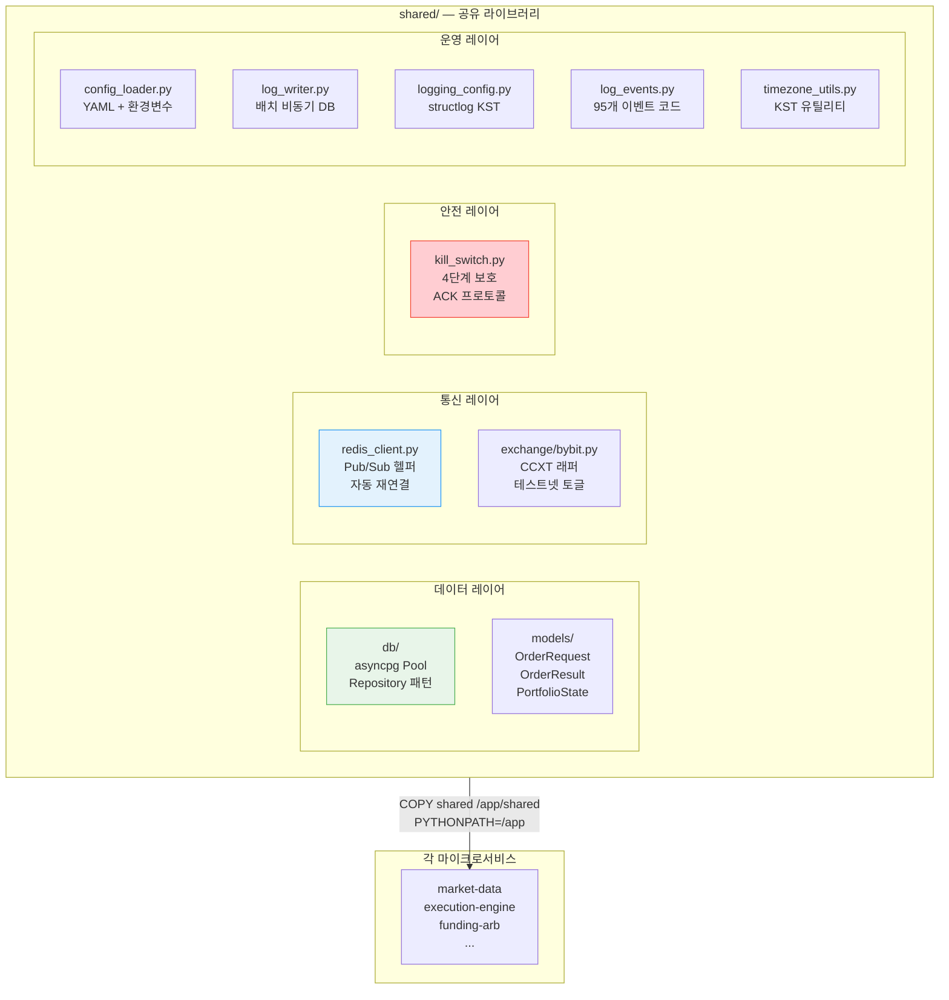
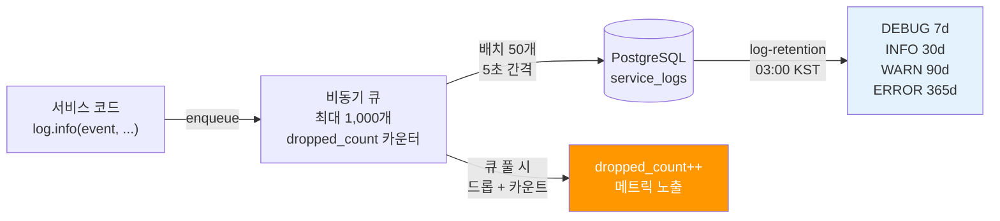
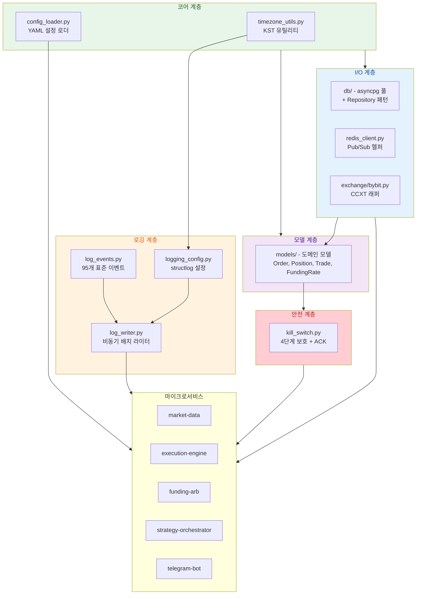

# 공유 라이브러리 (shared/)

모든 마이크로서비스가 의존하는 핵심 유틸리티 및 도메인 모델 모음.



## 구조 개요

```
cryptoengine/shared/
├── models/                      # 도메인 모델
│   ├── order.py                 # Order 클래스 (OrderStatus enum)
│   ├── position.py              # Position 클래스 (PositionStatus)
│   ├── strategy.py              # Strategy 메타데이터
│   └── ...
├── exchange/
│   └── bybit.py                 # Bybit CCXT 래퍼
├── db/
│   ├── pool.py                  # asyncpg 연결 풀
│   ├── repositories/            # Repository 패턴 (CRUD)
│   │   ├── trade_repository.py
│   │   ├── position_repository.py
│   │   ├── funding_payment_repository.py
│   │   └── ...
│   └── migrations.py            # 마이그레이션 실행
├── redis_client.py              # Redis Pub/Sub 헬퍼
├── config_loader.py             # YAML 설정 로더 (절대경로 지원)
├── kill_switch.py               # Kill Switch 공통 로직 (4계층)
├── log_events.py                # 이벤트 코드 정의 (95개)
├── log_writer.py                # 비동기 DB 로그 라이터 (큐 기반)
├── logging_config.py            # structlog 표준 설정 (KST)
└── timezone_utils.py            # KST 타임존 유틸리티
```

---

## 도메인 모델 (models/)

### OrderRequest (전략 → 실행 엔진)
```python
class OrderRequest(BaseModel):
    strategy_id: str              # 주문 생성 전략
    exchange: str                 # "bybit"
    symbol: str                   # "BTCUSDT"
    side: Literal["buy", "sell"]
    order_type: Literal["limit", "market", "stop_limit", "stop_market"]
    quantity: float > 0
    price: float | None           # 지정가 주문 시
    post_only: bool = True        # 메이커 주문만
    reduce_only: bool = False     # 포지션 축소만
    stop_loss: float | None
    take_profit: float | None
    request_id: str               # UUID (자동 생성)
```

**특징**: 불변 모델 (`model_config = {"frozen": True}`)

### OrderResult (실행 엔진 → 전략 피드백)
```python
class OrderResult(BaseModel):
    request_id: str               # OrderRequest.request_id와 매칭
    order_id: str                 # 거래소 주문 ID
    status: Literal[
        "new",                    # 방금 생성
        "partially_filled",
        "filled",
        "cancelled",
        "rejected",
        "expired"
    ]
    filled_qty: float = 0.0
    filled_price: float | None    # 체결 평균가
    fee: float = 0.0
    fee_currency: str = "USDT"
    timestamp: datetime           # 체결 시각 (UTC)
    
    @property
    def is_terminal(self) -> bool:
        return self.status in {"filled", "cancelled", "rejected", "expired"}
```

**특징**: 불변 모델, `is_terminal` 속성으로 종료 상태 판정

### Position (현재/과거 포지션)
```python
class Position(BaseModel):
    exchange: str                 # "bybit"
    symbol: str                   # "BTCUSDT"
    side: Literal["long", "short"]
    size: float >= 0              # 포지션 크기 (계약 수)
    entry_price: float > 0
    unrealized_pnl: float = 0.0
    leverage: float > 0, <= 125   # 레버리지 (Phase 5: 5배 제한)
    liquidation_price: float | None
    margin_used: float = 0.0
    
    @property
    def notional(self) -> float:
        """포지션 명목 가치 (계약가)"""
        return self.size * self.entry_price
    
    @property
    def margin_ratio(self) -> float:
        """마진 사용률"""
        if self.margin_used == 0:
            return 0.0
        return self.unrealized_pnl / self.margin_used
```

### PortfolioState (포트폴리오 스냅샷)
```python
class PortfolioState(BaseModel):
    total_equity: float           # 현재 자산 총액 (USDT)
    unrealized_pnl: float = 0.0   # 포지션 미실현 손익
    realized_pnl_today: float = 0.0  # 일일 실현 손익
    daily_drawdown: float = 0.0   # 일일 낙폭 (절대값)
    weekly_drawdown: float = 0.0  # 주간 낙폭
    monthly_drawdown: float = 0.0 # 월간 낙폭
    strategies: list[StrategySnapshot] = []  # 전략별 스냅샷
    kill_switch_triggered: bool = False
    snapshot_at: datetime = Field(default_factory=datetime.utcnow)
    
    @property
    def total_pnl(self) -> float:
        """총 손익 (미실현 + 실현)"""
        return self.unrealized_pnl + self.realized_pnl_today
```

### FundingRate (펀딩비)
```python
class FundingRate(BaseModel):
    exchange: str                 # "bybit"
    symbol: str                   # "BTCUSDT"
    rate: float                   # 예: 0.0001 (0.01%)
    predicted_rate: float | None  # 예측 다음 펀딩비
    next_funding_time: datetime   # 다음 펀딩 정산 시각
    collected_at: datetime        # 수집 시각 (UTC)
```

### OHLCV (캔들스틱)
```python
class OHLCV(BaseModel):
    exchange: str
    symbol: str
    timeframe: str                # "1m", "5m", "1h", "4h", "1d"
    open: float
    high: float
    low: float
    close: float
    volume: float
    timestamp: datetime           # 캔들 시작 시각 (UTC)
    
    @property
    def mid(self) -> float:
        return (self.high + self.low) / 2.0
    
    @property
    def body(self) -> float:
        return abs(self.close - self.open)
    
    @property
    def is_bullish(self) -> bool:
        return self.close >= self.open
```

### StrategyCommand & StrategyStatus
```python
class StrategyCommand(BaseModel):
    """오케스트레이터 → 전략에 전송"""
    strategy_id: str              # "funding-arb"
    action: Literal["start", "stop", "pause", "resume", "reconfigure"]
    allocated_capital: float | None  # 배분 자본 (USDT)
    max_drawdown: float | None    # 최대 손실 한도
    params: dict[str, Any] = {}   # 파라미터 재설정

class StrategyStatus(BaseModel):
    """전략 → 오케스트레이터 주기적 리포트"""
    strategy_id: str
    is_running: bool
    allocated_capital: float = 0.0
    current_pnl: float = 0.0
    position_count: int = 0
    last_tick: datetime           # 마지막 틱 시각
```

---

## 거래소 래퍼 (exchange/bybit.py)

### BybitConnector 클래스

```python
class BybitConnector(ExchangeConnector):
    """Bybit 선물(Linear Perpetual) CCXT 비동기 래퍼"""
    
    exchange_id: str = "bybit"
    
    # ── 초기화 ──
    def __init__(
        self,
        api_key: str = "",
        api_secret: str = "",
        testnet: bool = False,
        rate_limit: int = 50,  # ms 사이 지연
    ) -> None:
        """CCXT 초기화
        
        레버리지: MAX_LEVERAGE = 2 (프로젝트 정책)
        WSL 시계 드리프트: recvWindow = 20000ms (기본 5000ms)
        """
    
    # ── 라이프사이클 ──
    async def connect(self) -> None:
        """마켓 로드, 연결 확인"""
    
    async def disconnect(self) -> None:
        """aiohttp 세션 정리"""
    
    # ── 펀딩비 & 마켓 데이터 ──
    async def fetch_funding_rate(self, symbol: str) -> FundingRate:
        """현재 펀딩비 + 다음 펀딩 시각"""
    
    async def fetch_ohlcv(self, symbol: str, timeframe: str) -> list[OHLCV]:
        """OHLCV 캔들 조회"""
    
    async def fetch_order_book(self, symbol: str, limit: int = 10) -> OrderBook:
        """Order Book L2 스냅샷"""
    
    # ── 포지션 & 잔고 ──
    async def fetch_balance(self) -> dict:
        """현물(spot) + 선물(futures) 잔고 조회
        
        반환값:
        {
            "free": {...},      # 사용 가능
            "used": {...},      # 포지션에 사용 중
            "total": {...},     # 총액
        }
        """
    
    async def fetch_positions(self, symbol: str) -> list[Position]:
        """활성 포지션 목록 (long/short 별)"""
    
    async def fetch_position(self, symbol: str, side: str) -> Position | None:
        """특정 포지션 조회"""
    
    # ── 주문 실행 ──
    async def create_order(
        self,
        symbol: str,
        order_type: str,      # "limit", "market"
        side: str,            # "buy", "sell"
        amount: float,        # 계약 수
        price: float | None = None,
        params: dict = {},
    ) -> dict:
        """주문 생성
        
        params 예:
        {
            "postOnly": True,        # 메이커 주문만
            "reduceOnly": True,      # 포지션 축소만
            "triggerPrice": 50000,   # Stop 주문
        }
        """
    
    async def create_stop_loss(
        self,
        symbol: str,
        side: str,
        trigger_price: float,
    ) -> dict:
        """거래소 손절매 설정"""
    
    async def cancel_order(self, order_id: str, symbol: str) -> dict:
        """주문 취소"""
    
    async def fetch_order(self, order_id: str, symbol: str) -> dict:
        """주문 상태 조회"""
```

### 설정 상수

```python
_DEFAULT_RATE_LIMIT = 50      # REST 호출 간 대기 (ms)
MAX_LEVERAGE: int = 2          # 프로젝트 정책 (실제 사용: 5배, 선물만)

opts = {
    "apiKey": api_key,
    "secret": api_secret,
    "enableRateLimit": True,
    "rateLimit": 50,
    "options": {
        "defaultType": "swap",              # 선물
        "defaultSubType": "linear",         # 선형 계약
        "adjustForTimeDifference": True,    # 시계 드리프트 보정
        "recvWindow": 20000,  # WSL 클록 드리프트 대응 (기본 5000)
    },
}

if testnet:
    opts["sandbox"] = True              # Bybit 테스트넷 활성화
```

**특징**:
- CCXT.pro 기반 비동기 WebSocket + REST
- Rate limiting: 50ms 지연 (거래소 정책)
- Testnet/Mainnet: `BYBIT_TESTNET` 환경변수 기반
- 선형 선물 전용 (inverse 미지원)
- WSL 시계 드리프트: `recvWindow=20000ms` (기본 5초에서 확대)

---

## 데이터베이스 계층 (db/)

### 연결 풀 (pool.py)
```python
async def get_db_pool() -> asyncpg.Pool:
    """PostgreSQL 비동기 연결 풀 (싱글톤)"""

async def close_db_pool():
    """연결 풀 종료"""
```

**설정**:
- min_size: 10
- max_size: 50
- 타임아웃: 30초

### Repository 패턴

모든 데이터 접근은 Repository를 통함:

```python
class TradeRepository:
    async def create(self, trade: Trade) -> Trade:
        """새 거래 기록 생성"""
    
    async def find_by_id(self, trade_id: str) -> Trade:
        """거래 조회"""
    
    async def find_recent(self, limit: int = 100) -> List[Trade]:
        """최근 거래 조회"""
    
    async def update_status(self, trade_id: str, status: str) -> Trade:
        """거래 상태 업데이트"""

class PositionRepository:
    async def create(self, position: Position) -> Position:
        """포지션 생성"""
    
    async def find_open(self, strategy_id: str) -> List[Position]:
        """활성 포지션 조회"""
    
    async def close(self, position_id: str, reason: str, close_price: float) -> Position:
        """포지션 청산"""
    
    async def update_pnl(self, position_id: str, pnl: float) -> Position:
        """손익 업데이트"""

class FundingPaymentRepository:
    async def record(self, funding_payment: FundingPayment) -> FundingPayment:
        """펀딩비 정산 기록"""
    
    async def find_daily_total(self, date: date) -> float:
        """일일 펀딩비 합계"""
```

---

## Redis 헬퍼 (redis_client.py)

### RedisClient 클래스 (싱글톤)
```python
class RedisClient:
    """비동기 Redis 클라이언트 wrapper"""
    
    # ── 라이프사이클 ──
    async def connect(self) -> None:
        """Redis 연결 (자동 ping 확인)"""
    
    async def disconnect(self) -> None:
        """Redis 연결 정리 (graceful shutdown)"""
    
    @property
    def is_healthy(self) -> bool:
        """비차단 상태 확인"""
    
    async def ensure_connected(self) -> None:
        """최대 3회 재시도 (1s, 2s, 4s 지수 백오프)"""
        # ConnectionError 발생 시 3회 시도 후 예외 발생
    
    # ── Pub/Sub ──
    async def publish(self, channel: str, message: Any) -> int:
        """JSON 메시지 발행 (자동 JSON 직렬화)"""
        # 실패 시 자동 ensure_connected() 후 재시도
    
    async def subscribe(self, *channels: str) -> AsyncIterator[dict]:
        """채널 구독, 메시지 수신 (블로킹 반복자)"""
        # {"channel": "...", "data": {...}} 형태로 yield
    
    # ── Key/Value ──
    async def get(self, key: str) -> str | None:
        """문자열 값 조회 (자동 JSON 파싱)"""
    
    async def set(self, key: str, value: Any, ttl: int | None = None) -> None:
        """값 저장 (TTL 옵션)"""
    
    # ── 캐시 헬퍼 ──
    async def cache_get(self, key: str) -> Any | None:
        """캐시 조회 (JSON 자동 파싱)"""
    
    async def cache_set(self, key: str, value: Any, ttl: int = 60) -> None:
        """캐시 저장 (기본 TTL 60초)"""
    
    async def cache_delete(self, key: str) -> None:
        """캐시 삭제"""
    
    async def cache_exists(self, key: str) -> bool:
        """캐시 존재 여부"""
```

### 모듈 레벨 싱글톤
```python
def get_redis() -> RedisClient:
    """기본 RedisClient 인스턴스 반환 (초기화 자동)"""

async def close_redis() -> None:
    """싱글톤 인스턴스 종료"""
```

**환경 변수**:
- `REDIS_URL`: 기본값 `redis://localhost:6379/0`
- `REDIS_PASSWORD`: 옵션 (docker-compose에서 설정)

**재시도 정책**:
- `ConnectionError`, `TimeoutError` 발생 시 자동 `ensure_connected()` 호출
- 1초, 2초, 4초 지수 백오프로 최대 3회 시도
- 3회 실패 시 예외 발생

---

## 설정 로더 (config_loader.py)

### 함수 API

```python
def load_config(
    name: str = "default",
    config_dir: str | Path | None = None,
) -> dict[str, Any]:
    """YAML 설정 파일 로드 및 환경 변수 치환
    
    파일 해석:
    1. name이 절대경로 또는 `/` 포함 → 직접 파일 열기
    2. 그 외 → config_dir/<name>.yaml 또는 config_dir/<name>.yml
    
    환경 변수 치환:
    - ${VAR_NAME} → os.environ.get('VAR_NAME') 또는 오류
    - ${VAR_NAME:-default} → os.environ.get('VAR_NAME') 또는 'default'
    
    예:
    - load_config("funding-arb") → cryptoengine/config/funding-arb.yaml
    - load_config("/absolute/path/to/file.yaml") → 직접 열기
    """

def load_all_configs(
    config_dir: str | Path | None = None,
) -> dict[str, dict[str, Any]]:
    """config_dir의 모든 YAML 파일을 로드
    
    반환값:
    {
        "funding-arb": {...},  # funding-arb.yaml 내용
        "adaptive-dca": {...},
        "orchestrator": {...},
        ...
    }
    """
```

### 환경 변수 치환 패턴

```yaml
# config/strategies/funding-arb.yaml 예시
pairs: [BTCUSDT]
leverage: ${LEVERAGE:-5}              # env LEVERAGE 또는 기본값 5
min_funding_rate: 0.0001
max_position_hours: 168
alert_webhook: ${ALERT_WEBHOOK}      # 필수 (없으면 오류)
```

### 기본 설정 디렉토리

```python
# 코드 위치: shared/config_loader.py
_PROJECT_ROOT = Path(__file__).resolve().parent.parent  # cryptoengine/
_CONFIG_DIR = _PROJECT_ROOT / "config"  # cryptoengine/config/
```

**Docker 내**:
- Dockerfile: `COPY cryptoengine/shared /app/shared`
- config_loader는 relative to shared: `../../config/` → `/app/config/`

**주의**:
- 파일명 중복: `funding-arb.yaml` vs `funding_arb.yaml` (둘 다 지원, 하이픈 우선)
- YAML 파싱: `yaml.safe_load()` 사용 (안전성)

---

## Kill Switch (kill_switch.py)

### 4계층 다단계 안전장치

Kill Switch는 포트폴리오 손실을 제한하기 위한 자동 긴급 청산 시스템.

**Redis 키**:
```python
KILL_SWITCH_CHANNEL = "ce:kill_switch"          # 발동 신호 채널
KILL_SWITCH_ACTIVE_KEY = "ce:kill_switch:active"  # 활성 상태 플래그
KILL_SWITCH_ACK_CHANNEL = "ce:kill_switch:ack"    # ACK 채널
ACK_TIMEOUT_SECONDS = 5                        # ACK 대기 시간
ACK_MAX_RETRIES = 3                            # 최대 ACK 재시도
```

### 4가지 트리거 조건

| Layer | 조건 | Phase 4 | Phase 5 |
|-------|------|---------|---------|
| 1 | **일일 손실** (오후 기준) | -5% 상대값 | -$10 절대값 (24시간 모니터링) |
| 2 | **최대 낙폭** (주간) | -10% 상대값 | -$20 절대값 |
| 3 | **마진 비율** | 1.5x 초과 (유지마진 < 0.67%) | 동일 |
| 4 | **시장 변동성** | 15분 ATR > 기준값 × 3 | 동일 |

### Phase별 동작

**Phase 4 (테스트넷)**:
- 상대값 임계값 기반
- 단일 조건 만족 시 발동
- 4시간 쿨다운 후 자동 복구

**Phase 5 (메인넷)**:
- 절대값 임계값 (달러 기준)
- AND 조건: 여러 Layer 동시 만족 필요
- `STRICT_MONITORING_HOURS=24`: 첫 24시간만 강화 모니터링
- `PHASE5_MODE=true`: fixed_notional 포지션 사이징 + 절대값 검증

### ACK 메커니즘

Kill Switch 발동 시:
1. Redis `ce:kill_switch` 채널에 발동 신호 발행
2. Telegram bot이 사용자에게 확인 요청
3. 사용자가 ACK 버튼 클릭 → bot이 `ce:kill_switch:ack` 채널에 발행
4. execution-engine이 ACK 수신 → 포지션 즉시 청산
5. 5초 이내 ACK 미수신 → 재시도 (최대 3회)

---

## 이벤트 로그 시스템 (log_events.py)

### 95개 표준 이벤트 코드

모든 서비스에서 로그할 때 이 상수를 사용하여 일관성 유지.

**서비스 생명주기** (6개):
- `SERVICE_STARTED`, `SERVICE_STOPPING`, `SERVICE_STOPPED`
- `SERVICE_HEALTH_OK`, `SERVICE_HEALTH_FAIL`, `SERVICE_RECONNECTED`

**시장 데이터** (7개):
- `MARKET_WS_CONNECTED`, `MARKET_WS_DISCONNECTED`, `MARKET_WS_RECONNECTING`
- `MARKET_OHLCV_STORED`, `MARKET_FUNDING_RATE`, `MARKET_TICKER_RECEIVED`

**전략** (8개):
- `STRATEGY_STARTED`, `STRATEGY_STOPPED`, `STRATEGY_PAUSED`, `STRATEGY_RESUMED`
- `STRATEGY_TICK`, `STRATEGY_SIGNAL`, `STRATEGY_REBALANCE`, `STRATEGY_CIRCUIT_BREAKER`

**펀딩비 차익거래** (9개):
- `FA_ENTRY_CONDITION_MET`, `FA_POSITION_OPENED`, `FA_POSITION_CLOSED`
- `FA_FUNDING_COLLECTED`, `FA_HEDGE_DRIFT`, `FA_HEDGE_REBALANCED`
- `FA_ONE_SIDE_FILL`, `FA_ONE_SIDE_RECOVERY`, `FA_REINVEST`

**DCA** (3개):
- `DCA_PURCHASE`, `DCA_MULTIPLIER_CALC`, `DCA_TAKE_PROFIT`

**주문 실행** (13개):
- `ORDER_SUBMITTED`, `ORDER_RECEIVED`, `ORDER_SAFETY_PASSED`, `ORDER_SAFETY_FAILED`
- `ORDER_SENT`, `ORDER_FILLED`, `ORDER_PARTIALLY_FILLED`, `ORDER_CANCELLED`, `ORDER_REJECTED`
- `ORDER_RETRY`, `ORDER_TIMEOUT`, `ORDER_DUPLICATE_SKIPPED`

**Kill Switch** (6개):
- `KILL_SWITCH_TRIGGERED`, `KILL_SWITCH_RESUMED`, `KILL_SWITCH_COOLDOWN`
- `KILL_SWITCH_MANUAL_RESET`, `KILL_SWITCH_ACK_SENT`, `KILL_SWITCH_ACK_MISSING`

**오케스트레이터** (6개):
- `ORCH_CYCLE_START`, `ORCH_WEIGHT_CHANGED`, `ORCH_CAPITAL_ALLOCATED`
- `ORCH_DRAWDOWN_WARNING`, `ORCH_CONFIG_RELOADED`, `ORCH_DEAD_MAN_SWITCH`

**LLM 어드바이저** (4개):
- `LLM_ANALYSIS_START`, `LLM_ANALYSIS_COMPLETE`, `LLM_WEIGHT_SUGGESTION`, `LLM_API_ERROR`

**텔레그램** (3개):
- `TELEGRAM_COMMAND_RECEIVED`, `TELEGRAM_NOTIFICATION_SENT`, `TELEGRAM_HEARTBEAT`

**포지션 정합성** (3개):
- `POSITION_RECONCILE_OK`, `POSITION_RECONCILE_MISMATCH`, `POSITION_RECONCILE_FIXED`

**수수료** (2개):
- `FEE_TIER_UPDATED`, `FEE_TIER_MISMATCH`

**인프라** (7개):
- `DB_POOL_CREATED`, `DB_POOL_CLOSED`, `DB_QUERY_SLOW`
- `REDIS_CONNECTED`, `REDIS_DISCONNECTED`, `REDIS_RECONNECTING`, `REDIS_PUBLISH_FAILED`

### 이벤트-로그 레벨 매핑

```python
EVENT_LEVELS: dict[str, str] = {
    # CRITICAL (50): 시스템 존속 위협
    KILL_SWITCH_TRIGGERED: "CRITICAL",
    ORCH_DEAD_MAN_SWITCH: "CRITICAL",
    
    # ERROR (40): 즉각 조치 필요
    ORDER_SAFETY_FAILED: "ERROR",
    ORDER_REJECTED: "ERROR",
    ORDER_TIMEOUT: "ERROR",
    POSITION_RECONCILE_MISMATCH: "ERROR",
    KILL_SWITCH_ACK_MISSING: "ERROR",
    REDIS_PUBLISH_FAILED: "ERROR",
    LLM_API_ERROR: "ERROR",
    
    # WARNING (30): 모니터링 필요
    SERVICE_HEALTH_FAIL: "WARNING",
    STRATEGY_PAUSED: "WARNING",
    STRATEGY_CIRCUIT_BREAKER: "WARNING",
    FA_HEDGE_DRIFT: "WARNING",
    FA_ONE_SIDE_FILL: "WARNING",
    ORDER_CANCELLED: "WARNING",
    ORDER_RETRY: "WARNING",
    ORDER_DUPLICATE_SKIPPED: "WARNING",
    KILL_SWITCH_COOLDOWN: "WARNING",
    ORCH_DRAWDOWN_WARNING: "WARNING",
    POSITION_RECONCILE_FIXED: "WARNING",
    FEE_TIER_MISMATCH: "WARNING",
    MARKET_WS_DISCONNECTED: "WARNING",
    MARKET_WS_RECONNECTING: "WARNING",
    REDIS_DISCONNECTED: "WARNING",
    REDIS_RECONNECTING: "WARNING",
    DB_QUERY_SLOW: "WARNING",
    
    # INFO (20): 정상 상태 변화 (기본 수집 대상)
    # 나머지 모든 이벤트...
    
    # DEBUG (10): 매 tick 등 매우 빈번
    SERVICE_HEALTH_OK: "DEBUG",
    STRATEGY_TICK: "DEBUG",
    MARKET_OHLCV_STORED: "DEBUG",
    MARKET_FUNDING_RATE: "DEBUG",
    MARKET_TICKER_RECEIVED: "DEBUG",
    ORDER_SUBMITTED: "DEBUG",
    ORDER_RECEIVED: "DEBUG",
    ORDER_SAFETY_PASSED: "DEBUG",
    ORCH_CYCLE_START: "DEBUG",
    POSITION_RECONCILE_OK: "DEBUG",
    TELEGRAM_NOTIFICATION_SENT: "DEBUG",
    TELEGRAM_HEARTBEAT: "DEBUG",
    DCA_MULTIPLIER_CALC: "DEBUG",
}
```

---

## 로그 라이터 (log_writer.py)

### LogWriter 클래스 (비동기 배치 라이터)

```python
class LogWriter:
    """asyncio.Queue 기반 비동기 배치 로그 DB 라이터"""
    
    MAX_QUEUE_SIZE = 1000         # 초과 시 가장 오래된 항목 드롭
    BATCH_SIZE = 50               # 배치 INSERT 크기
    FLUSH_INTERVAL = 5.0          # 플러시 간격 (초)
    
    # ── 라이프사이클 ──
    async def start(self) -> None:
        """백그라운드 flush 태스크 시작"""
    
    async def write_log(
        self,
        level: str,                # "DEBUG", "INFO", "WARNING", "ERROR", "CRITICAL"
        level_no: int,             # 10, 20, 30, 40, 50
        event: str,                # log_events.py의 상수명
        message: Optional[str],
        context: Optional[dict],   # 추가 필드 (자동 JSON 직렬화)
        trace_id: Optional[str],   # 요청 추적 ID
        error_type: Optional[str], # 예외 타입
        error_stack: Optional[str],  # 스택 트레이스
    ) -> None:
        """로그를 큐에 추가 (비차단, 즉시 반환)"""
    
    async def close(self) -> None:
        """남은 큐 항목을 모두 flush하고 종료 (graceful shutdown)"""
```

### 동작 흐름

1. **큐 추가**: `write_log()` 호출 → 즉시 큐에 추가 후 반환 (메인 로직 블로킹 없음)
2. **큐 오버플로우**: 큐가 1000개 초과 → 가장 오래된 항목 드롭 (`dropped_count` 카운팅)
3. **배치 플러시**: 50개 또는 5초 중 먼저 도달하는 조건에서
   - `service_logs` 테이블에 `executemany()` 배치 INSERT
   - 실패 시 로그 드롭 + stderr에 오류 기록
4. **드롭 경고**: 10개 단위로 stderr 경고 출력 + DB 로그 기록
5. **종료 시**: 남은 큐 항목 모두 flush



### 데이터베이스 스키마

```sql
INSERT INTO service_logs (
    timestamp,              -- UTC datetime
    service,                -- 서비스명
    level,                  -- "DEBUG", "INFO", ...
    level_no,               -- 10, 20, 30, 40, 50
    event,                  -- 이벤트 상수
    message,                -- 메시지 텍스트
    context,                -- JSON 메타데이터
    trace_id,               -- 추적 ID
    error_type,             -- 예외 타입
    error_stack             -- 스택 트레이스
) VALUES (...)
```

**특징**:
- 비차단 아키텍처: 로깅이 거래 실행 지연 없음
- 배치 처리: 50개씩 일괄 쓰기로 DB 부하 최소화
- 큐 오버플로우 처리: 메모리 폭발 방지
- 구조화된 로깅: context JSON으로 쿼리 가능

---

## 로깅 설정 (logging_config.py)

### setup_logging() 함수

```python
def setup_logging(
    level: str = "INFO",              # "DEBUG", "INFO", "WARNING", ...
    json_output: bool = True,         # True = JSON, False = 컬러 콘솔
    service_name: str = "cryptoengine",  # 로그에 추가할 서비스명
    db_pool = None,                   # asyncpg 풀 (로그 DB 저장용)
    min_db_level: int = 20,           # DB에 저장할 최소 레벨 (20=INFO)
) -> None:
    """structlog + stdlib logging 설정"""
```

### 처리 흐름

1. **structlog 프로세서 파이프라인**:
   ```
   Event Dict
   ↓
   merge_contextvars (context vars 병합)
   ↓
   _add_correlation_id (trace_id 추가)
   ↓
   add_log_level (level 문자열 추가)
   ↓
   kst_timestamper (KST 타임스탬프 추가)
   ↓
   _make_db_log_processor (DB 저장, fire-and-forget)
   ↓
   _make_error_alert_processor (ERROR+ 레벨 → Redis → Telegram)
   ↓
   JSONRenderer 또는 ConsoleRenderer (출력)
   ```

2. **DB 로거** (`_make_db_log_processor`):
   - 로그를 `LogWriter` 큐에 추가 (비차단)
   - 배치로 `service_logs` 테이블에 INSERT
   - `min_db_level` 환경변수로 레벨 필터링 가능

3. **에러 알림** (`_make_error_alert_processor`):
   - ERROR (40) 이상만 처리
   - Redis `ce:alerts:anomaly` 채널 발행
   - Telegram bot이 구독 → 사용자에게 알림
   - 300초 이내 동일 알림 제거 (dedup)

### 환경 변수

| 변수 | 기본값 | 설명 |
|------|--------|------|
| `LOG_LEVEL` | INFO | 최소 로그 레벨 |
| `LOG_DB_MIN_LEVEL` | 20 (INFO) | DB에 저장할 최소 레벨 (10=DEBUG) |
| `ENVIRONMENT` | testnet | 배포 환경 (testnet/mainnet) |

### 출력 예

**JSON 모드** (json_output=True):
```json
{
  "timestamp": "2026-05-01T14:30:45+09:00",
  "level": "INFO",
  "event": "fa_position_opened",
  "service": "funding-arb",
  "strategy_id": "funding-arb",
  "symbol": "BTCUSDT",
  "size": 10.5,
  "entry_price": 67500,
  "funding_rate": 0.0001,
  "message": "펀딩비 진입 조건 만족",
  "correlation_id": "a1b2c3d4e5f6"
}
```

**콘솔 모드** (json_output=False):
```
2026-05-01T14:30:45+09:00 [INFO   ] funding-arb: fa_position_opened
    symbol='BTCUSDT' size=10.5 entry_price=67500 funding_rate=0.0001
    message='펀딩비 진입 조건 만족'
```

### Correlation ID (요청 추적)

```python
from shared.logging_config import get_correlation_id, new_correlation_id

# 새 요청 시
trace_id = new_correlation_id()  # 새로 생성 + ContextVar에 저장

# 로그 시
log.info("event", trace_id=trace_id)  # correlation_id 자동 추가
```

**용도**: 복잡한 요청 흐름을 추적하기 위해 모든 로그에 동일 ID 포함

### 조용한 서드파티 로거

다음 라이브러리의 로그는 WARNING 이상만 출력 (스팸 방지):
- ccxt, asyncio, websockets, aioredis
- asyncpg, telegram, httpx, hpack

---

## 타임존 유틸리티 (timezone_utils.py)

### 상수

```python
UTC = timezone.utc                      # UTC 타임존
KST = timezone(timedelta(hours=9))      # UTC+9 (Asia/Seoul)
```

### 변환 함수

```python
def now_utc() -> datetime:
    """현재 UTC 시각 (저장용)"""

def now_kst() -> datetime:
    """현재 KST 시각 (표시용)"""

def to_kst(dt: datetime) -> datetime:
    """UTC datetime → KST datetime 변환
    
    naive datetime은 UTC로 간주
    """

def to_utc(dt: datetime) -> datetime:
    """KST (또는 임의 tz) datetime → UTC 변환
    
    naive datetime은 KST로 간주
    """

def format_kst(dt: datetime, fmt: str = "%Y-%m-%dT%H:%M:%S+09:00") -> str:
    """datetime을 KST 문자열로 포맷"""
```

### structlog 통합

```python
def kst_timestamper(
    logger: Any,
    method_name: str,
    event_dict: dict[str, Any],
) -> dict[str, Any]:
    """structlog 프로세서: timestamp를 KST ISO 문자열로 추가
    
    DB 저장은 logging_config.py에서 UTC datetime으로 별도 처리
    로그 출력은 KST 문자열로 표시
    
    사용법:
    shared_processors = [
        ...,
        kst_timestamper,  # TimeStamper(fmt="iso") 대신
        ...,
    ]
    """
```

### 스크립트/백테스터용 경량 설정

```python
def configure_kst_structlog(
    log_level: int = logging.INFO,
    json_output: bool = False,
    *,
    extra_processors: list | None = None,
) -> None:
    """scripts/, backtester/ 공용 경량 structlog 설정
    
    shared 패키지 없이 독립 실행 가능
    """
```

### 저장 vs 표시 원칙

| 용도 | 포맷 | 타임존 | 예 |
|------|------|--------|-----|
| **DB 저장** | datetime 객체 | UTC | `2026-05-01T05:30:00+00:00` |
| **로그 표시** | ISO 문자열 | KST | `2026-05-01T14:30:00+09:00` |
| **Bybit API** | 타임스탐프 | UTC | `1714545000000` (ms) |
| **대시보드** | 로컬 문자열 | KST | `2026년 5월 1일 오후 2:30` |

---

## Dockerfile 통합 규칙

### 모든 서비스의 Dockerfile에서:

```dockerfile
# 1. shared/ 복사 (필수)
COPY cryptoengine/shared /app/shared

# 2. PYTHONPATH 설정 (필수)
ENV PYTHONPATH=/app

# 3. 임포트 (필수)
# Python 코드에서:
from shared.models import Order, Position
from shared.exchange import BybitExchange
from shared.db import get_db_pool
from shared.redis_client import get_redis
from shared.kill_switch import KillSwitch
```

### shared/ 수정 시 (모든 서비스 재빌드)

```bash
docker compose build market-data execution-engine funding-arb strategy-orchestrator telegram-bot
docker compose up -d --no-deps market-data execution-engine funding-arb strategy-orchestrator telegram-bot
```

---

## 계층별 의존성 구조



---

**최종 수정**: 2026-05-01
